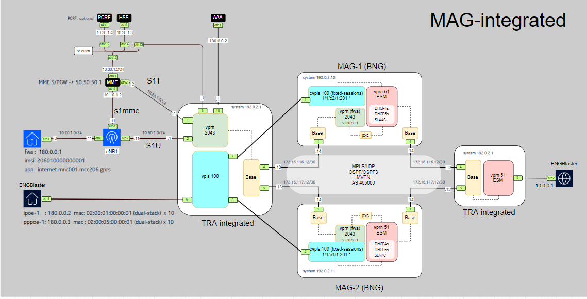
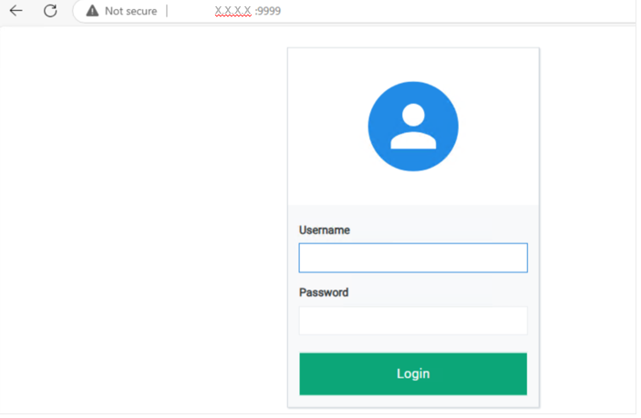
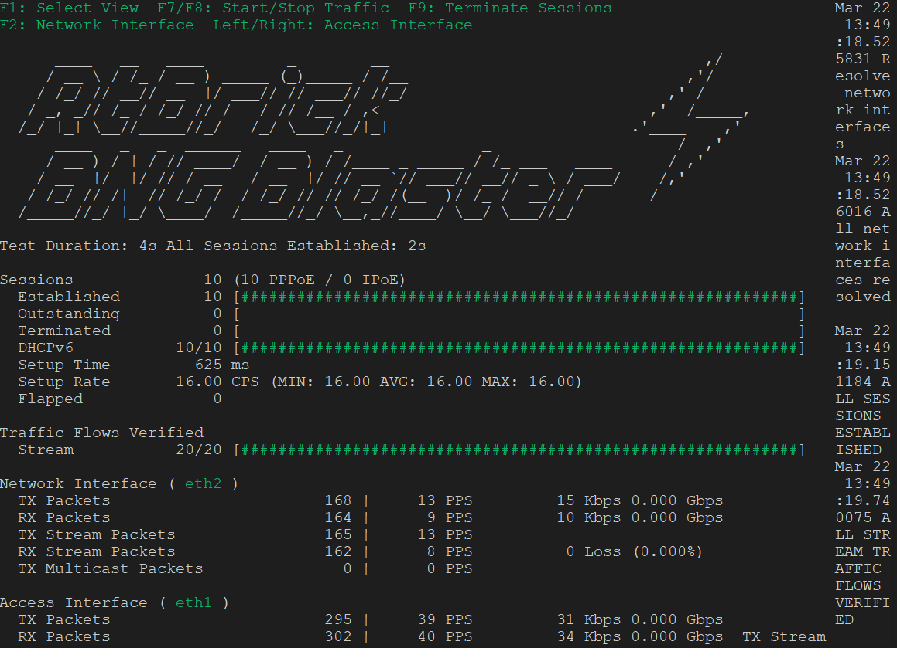
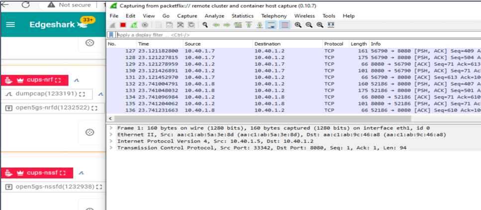

# **MAG-Integrated**: Nokia Multi-Access Gateway with Open-Source Tools**

## **Overview**

## **MAG-Integrated** is an open-source project designed around **Nokia Multi-Access Gateway (MAG)** architecture, formerly known as a Broadband Network Gateway (BNG). 
- It enables multi-access session handling by supporting both fixed (PPPoE & IPoE) and fixed-wireless (4G) sessions on a single gateway.
- This project integrates several key open-source components i.e. **Open5GS** ,**srsRANSim** ,**FreeRADIUS**  and **BNGBlaster** 


## **Key Features**
- ✅ Containerized Simulation – Uses ContainerLab for efficient deployment and network orchestration.
- ✅ Flexible Network Setup – Supports customizable topologies
- ✅ Open-Source – Ideal for research, testing, and education.

## **Components of containerLab**
- The project is deploted using **containerlab**,check this  [Visit contianerlab](https://containerlab.dev/ ) for more details.

- **ContainerLab** is a lightweight and efficient tool for simulating network components in isolated containers.
- It simplifies network orchestration by managing various network elements in an easily configurable environment.
- It integrates multiple network elements to create a comprehensive testbed. The main components include:

### **1. MAG-integrated **
-	**MAG-integrated** is a key network element that connects fixed or fixed wireless users to the network via technologies like DSL, Fiber or Wireless. It handles:
  -	IP Addressing: Assigns IPs to devices.
  -	AAA: Manages authentication, authorization, and accounting.
  -	Traffic Management: Ensures QoS and traffic prioritization.
  -	Session Management: Tracks user sessions.
-	The BNG supports IPoE and PPPoE for broadband access, offering scalability and reliability for service providers.

### **2. Open5GS**
-	Open5GS provides the Evolved Packet Core (EPC) components, such as **MME** (Mobility Management Entity), **HSS** (Home Subscriber Server), and **PCRF**(Policy & Charging Rules Function).

### **3. BNGBlaster**
-	Simulates fixed sessions, like PPPoE and IPoE  for broadband access testing.

### **4. srsRANSim** 
-	Provides an open-source **LTE/5G** software radio stack.
-	Simulates **UE** and **eNB/gNB**, facilitating mobile network emulation.

### **5. FreeRADIUS**
-	An open-source RADIUS server for Authentication, Authorization, and Accounting (AAA).
-	Supports EAP, PAP, CHAP and integrates with MySQL, PostgreSQL, and LDAP.
-	Used in ISPs and telecom networks for network access control.


## Installation

### Prerequisites
Ensure the following dependencies are installed:

- **Docker**: Required for running containerized components.
- **ContainerLab**: For managing container-based network simulations.
- **Git**: For cloning this repository.

### **Getting Started**

Follow the **[documentation](docs/installation_verification.md)** for detailed setup instructions.


#### **1. Clone the Repository**

   ```bash
   git clone https://github.com/htakkey/cups-integrated.git
   cd cups-integrated
   ```
#### **2. Create Required Network Bridges**

For **CentOS** (example):
```bash
[root@compute-1 scripts]# ./create_bridges-centos.sh
```
   
#### **3. Deploy the ContainerLab Environment**

Run the following command to deploy the simulated network:
```bash    
clab deploy -t mag-integrated.clab.yml
```

#### **4. cliscripts**
The delivered exec CLI scripts are a collection of standard CLI show commands designed to simplify session monitoring and management during lab upskilling. Instead of manually searching for the exact commands to run, these scripts provide a convenient way to execute them. You should best manually download, transfer and execute them from CF1 of the BNG and TRA.

```bash
[root@compute-1]# pwd
/root/MAG-integrated/cliscripts/

## **Testing starup**

### **Topology**

The topology of the setup is illustrated in the diagram below: 

	


### **1. Register a 5G Subscriber**

Use this script to register the **IMSI** with a specific apn,opc and key
```bash
 root@compute-1 scripts]# ./register_subscriber.sh 
 ```
	
### **1.1 GUI Access to the Database**
You can verify subscriber records via **Web GUI**:

📌 **URL**: `http://x.x.x.x:9999/' 
📌 **Username/Password**: `admin/1423'  

	

### **2. Start the Open5GS Core Network**
Run the following script to start the 4G Core( **HSS** and **MME**)
Follow the **[documentation](docs/open5gs_verification.md)** for detailed information/checking .

```bash
[root@compute-1 scripts]# ./start_open5gs.sh
```

### **3. Start the 4G Session**
Start the 4G session 
Follow the **[documentation](docs/4G_session_verification.md)** for detailed information/checking .


```bash
cd scripts
./start_4g_bng.sh
```
### **4. Start PPPoE/IPoE Session using BNGBlaster**
Start the broadband session using **BNGBlaster**:
Follow the **[documentation](docs/fixed-sessions_verification.md)** for detailed information/checking .


```bash
cd scripts
./start_dhcp_bng.sh
./start_pppoe_bng_traffic.sh   ## (Starts session with traffic)
```

    
---

### **5. Troubleshooting**

The logs are available for further checking, tcpdump can be used to capture the traffic for any bridge/port
also  there is another option can be integrated with this containerlab is EdgeShark https://containerlab.dev/manual/wireshark/ 
 



---


## **License**
- ContainerLab images for VSR are provided by Nokia and require a commercial license.
-	All other ContainerLab images like Open5GS, FreeRADIUS or UERANSIM are publicly available and don’t require a license.

------
## **Contributing**
Contributions are welcome! Please submit a **pull request** or open an **issue** if you find bugs or want to improve the project.

---

## **Contact**
For questions, reach out via GitHub issues or contact the **Nokia team** for commercial licensing.


