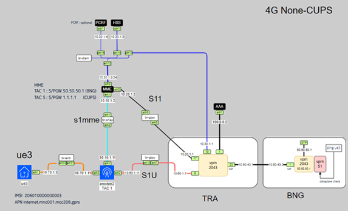

# CUPS-Integrated: 4G Non-CUPS Simulation using Open5GS, BNGBlaster, and ContainerLab

**CUPS-Integrated** is an open-source project that simulates a **4G Non-CUPS (Centralized User Plane Separation)** network architecture. This project utilizes **ContainerLab** for container-based network simulation, **Open5GS** for the core network, and **BNGBlaster** for simulating broadband access using **PPPoE** and **IPoE**.

## Overview

This project is designed to simulate a 4G mobile network without the need for traditional centralized user plane separation (CUPS). It integrates **Open5GS** as the core network solution and uses **BNGBlaster** to simulate broadband access for customers via PPPoE and IPoE. The entire network is simulated in a containerized environment using **ContainerLab**, allowing for rapid deployment and testing of network configurations.

The goal of this project is to provide an efficient, scalable, and flexible way to simulate a 4G Non-CUPS network using open-source tools.

## Features

- **Containerized Simulation**: Uses **ContainerLab** for easy deployment and orchestration of network components.
- **Open5GS**: Implements an open-source 4G core network with features such as MME(Mobility Management Entity), HSS(Home Subscriber Server), and PCRF(Policy and Charging Rules Function).
- **PPPoE/IPoE Simulation**: Provides simulation of broadband access using **BNGBlaster** for **PPPoE** and **IPoE** sessions.
- **Flexible Setup**: Easily customizable network topology and components.
- **Open Source**: The project uses open-source tools, making it suitable for research, testing, and educational purposes.

## Components

### 1. **ContainerLab**
   - **ContainerLab** is used to simulate the network components in isolated containers, making the environment lightweight and easy to manage.
   - Network components, including **Open5GS** (MME, HSS), and **BNGBlaster**, are all containerized.
   - **srsRANSim** is used to simulate the eNB and UE.

### 2. **Open5GS**
   - **Open5GS** is used to simulate the 4G core network. It implements the **Evolved Packet Core (EPC)** components like **MME** (Mobility Management Entity) and **HSS** (Home Subscriber Server).
   - Open5GS is configured for **Non-CUPS** mode, meaning the control plane and user plane are not separated.

### 3. **BNGBlaster**
   - **BNGBlaster** is a tool used to simulate Broadband Network Gateway (BNG) behavior with PPPoE and IPoE session management.
   - It helps simulate end-user access for testing, including IP address allocation, session management, and bandwidth management.

### 4. **PPPoE/IPoE Session Management**
   - The simulation provides **PPPoE** and **IPoE** session management capabilities, simulating real-world broadband access scenarios.

## Installation

### Prerequisites
Before you start, ensure that you have the following installed:

- **Docker**: Required to run containers in the lab environment.
- **ContainerLab**: A tool to create and manage container-based network simulations.
- **Git**: For cloning this repository.

### Steps

1. **Clone the Repository**:

   First, clone this repository to your local machine:
   ```bash
   git clone https://github.com/htakkey/cups-integrated.git
   cd cups-integrated
   
2.  ** deploy the containerlab **:
       deploy the clab 
       ```bash   
       clab dep -t mag-integrated.clab.yml
   
3.  ** register the 4G session **:
      register the IMSI 206010000000001 to the db
      ```bash
      cd scripts
      ./register_subscriber.sh

4.  ** start the open5Gs elements**:
    start the HSS and MME 
	```bash
    cd scripts
    ./start_open5gs.sh
5.  ** start 4G session**:



     ```bash
     cd scripts
     ./start_4g_bng.sh
	 
6.  **Start a IPoE/PPPoE session using BNGBlaster**:
     ```bash
     cd scripts
    ./start_dhcp_bng.sh
    ./start_pppoe_bng_traffic.sh   ##(to start session with traffic)


