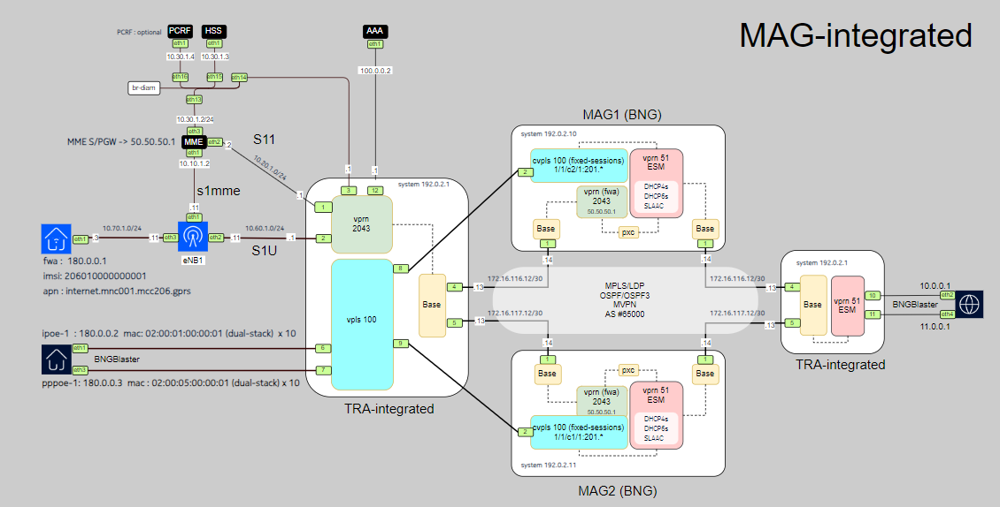

# **MAG-Integrated: Multi-Access Gateway with Open-Source Tools**

## **Objective**
- The goal of this Multi access gateway integrated lab (MAG-Integrated), build with **[ContainerLab](https://containerlab.dev/)**, is to provide an efficient, flexible environment for simulating **fixed** and **Fixed Wireless Access (FWA)** sessions using open-source test tools.It is primarily designed for functional testing and educational purposes.

## **Overview**
- **MAG-Integrated** is an open-source project built around an integrated Multi-Access Gateway architecture, previously known as a Broadband Network Gateway (BNG).It enables multi-access sessions by handling both fixed (PPPoE and IPoE) and fixed-wireless (4G) sessions on the same gateway.
- This project leverages **[Open5GS](https://open5gs.org/)** for the core network, **[srsRANSim](https://www.srslte.com/)** for radio components (eNB and 4G sessions), and **[FreeRADIUS](https://www.freeradius.org/)**, an open-source RADIUS server for **Authentication, Authorization, and Accounting (AAA)**. It also integrates **[BNG Blaster](https://rtbrick.github.io/bngblaster/index.html)** to simulate fixed PPPoE and IPoE sessions and is deployed in a containerized environment using **[ContainerLab](https://containerlab.dev/)**, enabling rapid setup and flexible network testing.

## **Topology setup**

The topology of the setup is illustrated in the diagram below: 

 
## **Components**
### **1. MAG-integrated**  
- **MAG-integrated** (also known as BNG) is a crucial network component that connects fixed (IPoE and/or PPPoE) or 4G fixed wireless users to the network through technologies such as DSL, Fiber, or Wireless. It is responsible for managing session authentication, authorization, and accounting (AAA), assigning IPv4 and/or IPv6 addresses, handling Quality of Service (QoS), and more. The MAG-integrated offers scalability and reliability, making it a vital solution for service providers.
  - This lab initiates 10 dual-stack PPPoE or 10 dual-stack stateful redundant IPoE sessions using predefined scripts that trigger the BNG Blaster application, including ./start_pppoe_bng_notraffic.sh, ./start_pppoe_bng_traffic.sh and ./start_dhcp_bng.sh.
  - This lab initiates a single ipv4 none-redundant 4G FWA session using predefined scripts that trigger the srsRANSim application, including ./start_4g_bng.sh and ./stop_4g_bng.sh

### **2. FreeRADIUS**
- **FreeRADIUS** is an open-source RADIUS server that provides Authentication, Authorization, and Accounting (AAA), supporting EAP, PAP, and CHAP while integrating with MySQL, PostgreSQL, and LDAP.
  - This LAB uses FreeRADIUS to authenticate PPPoE (chap), IPoE and FWA sessions and is used as offline accounting-server. 


### **3. BNGBlaster**
- **BNG Blaster** simulates fixed sessions, such as PPPoE and IPoE, for broadband access testing while also supporting data traffic generation
  - This lab offers predefined scripts to initiate fixed sessions with or without data traffic (see above).


### **4. Open5GS**
- **Open5GS** provides the Evolved Packet Core (EPC) components, such as **MME** (Mobility Management Entity), **HSS** (Home Subscriber Server), and **PCRF** (Policy & Charging Rules Function).
  - This lab initiates the above elements using the pre-defined script ./start_open5gs.sh and ./stop_open5gs.sh


### **5. srsRANSim** 

- **srsRANSim** provides an open-source LTE/5G software radio stack that simulates UE and eNB/gNB for mobile network emulation.
  - This LAB initiates a single ipv4 4G FWA session using pre-defined scripts: start_4g_bng.sh and stop_4g_bng.sh


### LAB Prerequisites

Ensure the following dependencies are installed:
- **Docker**: Required for running containerized components.
- **ContainerLab**: For managing container-based network simulations.
- **Git**: For cloning this repository.

## Installation Steps

Follow the **[documentation](docs/installation_verification.md)** for detailed setup instructions.

### **1. Clone the Repository**
```bash
git clone https://github.com/hatakkey/mag-integrated.git
cd cups-integrated
```

### **2. Create Network Bridges**
For **CentOS** (example):
```bash
[root@compute-1 scripts]# ./create_bridges-centos.sh
```
### **3. Deploy the ContainerLab**
Run the following command to deploy the simulated network:
```bash    
clab deploy -t mag-integrated.clab.yml
```

### **4. Download cliscripts**
The delivered exec CLI scripts are a set of standard show commands designed to simplify session monitoring and management during lab upskilling. Rather than manually searching for specific commands, these scripts provide a convenient way to execute them. 
```bash
[root@compute-1]# pwd
/root/MAG-integrated/cliscripts/
```
To use them, first run the below script 
```bash 
[root@compute-1 scripts]# ./upload-cliscripts.sh
```
To download and upload the predefined scripts from /root/MAG-integrated/cliscripts/ to cf1:\scripts-md on MAG-1, MAG-2, and TRA-integrated. 
## Start sessions

### **1. Register IMSI in database**

Register the IMSI’s with a specific apn, opc and key using the pre-defined script.
 ```bash
 root@compute-1 scripts]# ./register_subscriber.sh 
 ```
You can verify the registered subscriber records using the Web GUI:
📌 URL: http://x.x.x.x:9999/' 📌 **Username/Password**: admin/1423'

 

### **2. Start the Open5GS Core Network**

Start the 4G Core (HSS and MME) using the pre-defined script. 
```bash
[root@compute-1 scripts]# ./start_open5gs.sh
```
Follow the **[documentation](docs/open5gs_verification.md)** for detailed information/checking .

### **3. Start the 4G FWA session**
Start the 4G session using the pre-defined script
```bash
cd scripts
./start_4g_bng.sh
```

Follow the **[documentation](docs/4G_session_verification.md)** for detailed information/checking .

### **4. Start the PPPoE or IPoE fixed sessions**  
Start the broadband session the pre-defined script:

```bash 
cd scripts
./start_dhcp_bng.sh
./start_pppoe_bng_traffic.sh
./start_pppoe_bng_notraffic.sh
```


Follow the **[documentation](docs/fixed-sessions_verification.md)** for detailed information/checking .


### **5. Troubleshooting**
The logs available for analysis are enb1.log, hss.log, mme.log, pcrf.log, radiusd.log, and ue1.log. You can clear these logs using the ./clear_logs.sh script.
For further troubleshooting, you can use tcpdump to capture traffic on any bridge or port. 
Additionally, EdgeShark can be integrated with Containerlab for more advanced packet analysis. For more information, refer to the Containerlab manual for [Wireshark integration](https://containerlab.dev/manual/wireshark/) .


## **License**
- ContainerLab snaps for VSR are provided by Nokia and require a commercial license.
- All other ContainerLab snaps like Open5GS, FreeRADIUS or UERANSIM are publicly available and don’t require a license.
------
## **Contributing**
Contributions are welcome! Please submit a pull request or open an issue if you find bugs or want to improve the project.

## **Contact**
For questions, reach out via GitHub issues or contact the Nokia team for commercial licensing.


