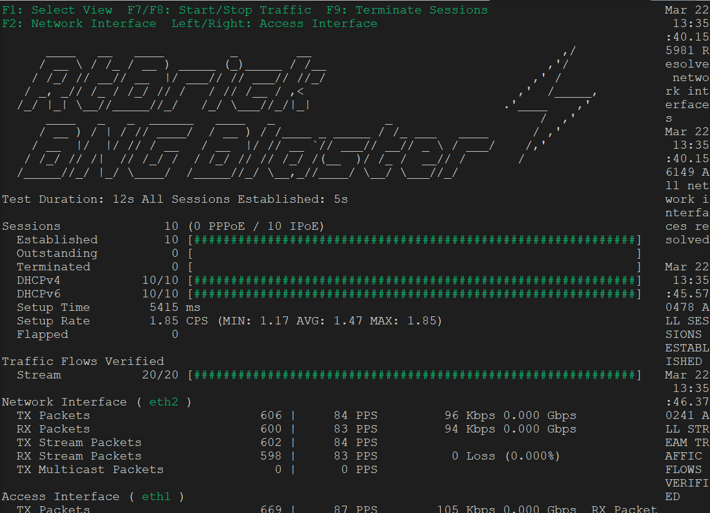

## 1. checking the MCS between the 2 MAGs

MAG-2 is the master

```bash
*A:MAG-2# show srrp

===============================================================================
SRRP Table
===============================================================================
ID        Service        Group Interface                 Admin     Oper
-------------------------------------------------------------------------------
1         51             grp-2                           Up        master
-------------------------------------------------------------------------------
```

```bash
A:MAG-1# show srrp
===============================================================================
SRRP Table
===============================================================================
ID        Service        Group Interface                 Admin     Oper
-------------------------------------------------------------------------------
1         51             grp-2                           Up        backupShunt
-------------------------------------------------------------------------------
No. of SRRP Entries: 1
===============================================================================
```

the 2 MAGs are syncronized SUBMGMT-IPOE,SUBMGMT-PPPOE,SRRP and DHCPServer  with each other
```bash
*A:MAG-2# show redundancy multi-chassis sync

===============================================================================
Multi-chassis Peer Table
===============================================================================
Peer
-------------------------------------------------------------------------------
Peer IP Address         : 192.0.2.10
Description             : (Not Specified)
Authentication          : Disabled
Source IP Address       : 192.0.2.11
Admin State             : Enabled
Warm standby            : No
Remote warm standby     : No
Sub-mgmt options        :
  DHCP lease threshold  : Inactive
    Local / Remote      : -- / --
-------------------------------------------------------------------------------
Sync-status
-------------------------------------------------------------------------------
Client Applications     : SUBMGMT-IPOE SUBMGMT-PPPOE SRRP DHCPServer
Sync Admin State        : Up
Sync Oper State         : Up
Sync Oper Flags         :
DB Sync State           : inSync
Num Entries             : 30
Lcl Deleted Entries     : 0
Alarm Entries           : 0
OMCR Standby Entries    : 0
OMCR Alarm Entries      : 0
Rem Num Entries         : 30
Rem Lcl Deleted Entries : 0
Rem Alarm Entries       : 0
Rem OMCR Standby Entries: 0
Rem OMCR Alarm Entries  : 0
```


## 2.   **Start PPPoE/IPoE Session using BNGBlaste**
----
Start the broadband session using BNGBlaster to simulate PPPoE or IPoE session management
### 1.1. **start dhcpv4v6 session**
10 dhcp sessions are established using the BNGBlaster
```bash
./start_dhcp_bng.sh
```



The 10 IPOEs sessions are established and can be verified using the below script

   
```bash
*A:MAG-2# exec s-ipoe
Pre-processing configuration file (V0v0)...
Completed processing 65 lines in 0.0 seconds


ipoe

show subscriber-mgmt statistics sla-profiles

===============================================================================
SLA Profile Statistics
===============================================================================
SLA-Profile Name                           Current     Peak      Peak Timestamp
-------------------------------------------------------------------------------
sla-default                                      0        0
sla-fwa                                          0        1 03/20/2025 13:03:16
sla-ipoe                                        10       10 03/20/2025 10:45:25
sla-pppoe                                        0       10 03/20/2025 08:34:44
-------------------------------------------------------------------------------
Total                                           10
===============================================================================

show subscriber-mgmt statistics sub-profiles

===============================================================================
Subscriber Profile Statistics
===============================================================================
Subscriber-Profile Name                    Current     Peak      Peak Timestamp
-------------------------------------------------------------------------------
sub-default                                      0        0
sub-fwa                                          0        1 03/20/2025 13:03:16
sub-ipoe                                        10       10 03/20/2025 10:45:25
sub-pppoe                                        0       10 03/20/2025 08:34:44
-------------------------------------------------------------------------------
Total                                           10
===============================================================================

show subscriber-mgmt statistics system summary

===============================================================================
SubMgmt Statistics
===============================================================================
                 |       Hosts       |       Sessions       |    Subscribers
                 |   IPv4      IPv6  |   PPP   IPOE   PFCP  |
-------------------------------------------------------------------------------
System           |       10       20 |      0     10      0 |       10   (Curr)
                 |       10       20 |      0     10      0 |       10   (Peak)
===============================================================================

show subscriber-mgmt statistics system non-zero-value-only

===============================================================================
Subscriber Management Statistics for System
===============================================================================
       Type                                Current     Peak      Peak Timestamp
-------------------------------------------------------------------------------

-------------------------------------------------------------------------------
Host & Protocol Statistics
-------------------------------------------------------------------------------
IPv4   IPOE Hosts       - DHCP                  10       10 03/22/2025 14:35:44
-------------------------------------------------------------------------------
IPv6   IPOE Hosts       - SLAAC                 10       10 03/22/2025 14:35:40
       IPOE Hosts       - DHCP6 (PD)            10       10 03/22/2025 14:35:40
-------------------------------------------------------------------------------
Total  IPOE Hosts                               30       30 03/22/2025 14:35:44
       IPv4 Hosts                               10       10 03/22/2025 14:35:44
       IPv6 Hosts                               20       20 03/22/2025 14:35:40
       DHCP Leases                              10       10 03/22/2025 14:35:44
       DHCPv6 Leases                            10       10 03/22/2025 14:35:40
       System Hosts Scale                       30       30 03/22/2025 14:35:44
-------------------------------------------------------------------------------

-------------------------------------------------------------------------------
IPOE Session Statistics
-------------------------------------------------------------------------------
Total  IPOE Sessions    - established           10       10 03/22/2025 14:35:39
       IPOE Sessions    - in setup               0       10 03/22/2025 14:35:39
-------------------------------------------------------------------------------

-------------------------------------------------------------------------------
Subscriber Statistics
-------------------------------------------------------------------------------
Total  Subscribers                              10       10 03/22/2025 14:35:39
-------------------------------------------------------------------------------
===============================================================================
Peak values last reset at : 03/20/2025 14:40:03

show subscriber-mgmt statistics group-interface all service vprn-51 non-zero-value-only

===============================================================================
Subscriber Management Statistics for Group-interface grp-2
===============================================================================
       Type                                Current     Peak      Peak Timestamp
-------------------------------------------------------------------------------

-------------------------------------------------------------------------------
Host & Protocol Statistics
-------------------------------------------------------------------------------
IPv4   IPOE Hosts       - DHCP                  10       10 03/22/2025 14:35:44
-------------------------------------------------------------------------------
IPv6   IPOE Hosts       - SLAAC                 10       10 03/22/2025 14:35:40
       IPOE Hosts       - DHCP6 (PD)            10       10 03/22/2025 14:35:40
-------------------------------------------------------------------------------
Total  IPOE Hosts                               30       30 03/22/2025 14:35:44
       IPv4 Hosts                               10       10 03/22/2025 14:35:44
       IPv6 Hosts                               20       20 03/22/2025 14:35:40
       DHCP Leases                              10       10 03/22/2025 14:35:44
       DHCPv6 Leases                            10       10 03/22/2025 14:35:40
       Subscriber Hosts                         30       30 03/22/2025 14:35:44
-------------------------------------------------------------------------------

-------------------------------------------------------------------------------
IPOE Session Statistics
-------------------------------------------------------------------------------
Total  IPOE Sessions    - established           10       10 03/22/2025 14:35:39
       IPOE Sessions    - in setup               0       10 03/22/2025 14:35:39
-------------------------------------------------------------------------------
===============================================================================
Peak values last reset at : 03/20/2025 14:40:03

show router 51 dhcp local-dhcp-server ldhcpv4-server leases

===============================================================================
Leases for DHCP server ldhcpv4-server router 51
===============================================================================
IP Address      Lease State       Mac Address       Remaining   Clnt  Fail
  PPP user name/Opt82 Circuit Id                    LifeTime    Type  Ctrl
  User-db/Sticky-lease Hostname
-------------------------------------------------------------------------------
180.0.0.2       stable            02:00:01:00:00:01 9d23h54m    dhcp  local
  0.0.0.0/0.0.0.0 eth 1:1
  ipoe-1 (fixed IP address)
180.0.0.21      stable            02:00:01:00:00:09 14d23h59m   dhcp  local
  0.0.0.0/0.0.0.0 eth 1:9
180.0.0.22      stable            02:00:01:00:00:0a 14d23h59m   dhcp  local
  0.0.0.0/0.0.0.0 eth 1:10
180.0.0.23      stable            02:00:01:00:00:02 14d23h59m   dhcp  local
  0.0.0.0/0.0.0.0 eth 1:2
180.0.0.24      stable            02:00:01:00:00:03 14d23h59m   dhcp  local
  0.0.0.0/0.0.0.0 eth 1:3
180.0.0.25      stable            02:00:01:00:00:04 14d23h59m   dhcp  local
  0.0.0.0/0.0.0.0 eth 1:4
180.0.0.26      stable            02:00:01:00:00:05 14d23h59m   dhcp  local
  0.0.0.0/0.0.0.0 eth 1:5
180.0.0.27      stable            02:00:01:00:00:06 14d23h59m   dhcp  local
  0.0.0.0/0.0.0.0 eth 1:6
180.0.0.28      stable            02:00:01:00:00:07 14d23h59m   dhcp  local
  0.0.0.0/0.0.0.0 eth 1:7
180.0.0.40      stable            02:00:01:00:00:08 14d23h59m   dhcp  local
  0.0.0.0/0.0.0.0 eth 1:8
-------------------------------------------------------------------------------
10 leases found
===============================================================================

show router 51 dhcp6 local-dhcp-server ldhcpv6-server leases

===============================================================================
Leases for DHCPv6 server ldhcpv6-server
===============================================================================
IP Address/Prefix                          Lease State       Remaining   Fail
  Link-local Address                                         LifeTime    Ctrl
-------------------------------------------------------------------------------
2004:2004:2004:8500::/56
  fe80::ffff:ffff:ff00:1                   stable            1d0h29m     local
2004:2004:2004:8600::/56
  fe80::ffff:ffff:ff00:2                   stable            1d0h29m     local
2004:2004:2004:8700::/56
  fe80::ffff:ffff:ff00:3                   stable            1d0h29m     local
2004:2004:2004:8800::/56
  fe80::ffff:ffff:ff00:4                   stable            1d0h29m     local
2004:2004:2004:8900::/56
  fe80::ffff:ffff:ff00:5                   stable            1d0h29m     local
2004:2004:2004:8a00::/56
  fe80::ffff:ffff:ff00:6                   stable            1d0h29m     local
2004:2004:2004:8b00::/56
  fe80::ffff:ffff:ff00:7                   stable            1d0h29m     local
2004:2004:2004:8c00::/56
  fe80::ffff:ffff:ff00:8                   stable            1d0h29m     local
2004:2004:2004:8d00::/56
  fe80::ffff:ffff:ff00:9                   stable            1d0h29m     local
2004:2004:2004:8e00::/56
  fe80::ffff:ffff:ff00:a                   stable            1d0h29m     local
2005:2005:2005:5e::/64
                                           internal          N/A         N/A
2005:2005:2005:5f::/64
                                           internal          N/A         N/A
2005:2005:2005:60::/64
                                           internal          N/A         N/A
2005:2005:2005:61::/64
                                           internal          N/A         N/A
2005:2005:2005:62::/64
                                           internal          N/A         N/A
2005:2005:2005:63::/64
                                           internal          N/A         N/A
2005:2005:2005:64::/64
                                           internal          N/A         N/A
2005:2005:2005:65::/64
                                           internal          N/A         N/A
2005:2005:2005:66::/64
                                           internal          N/A         N/A
2005:2005:2005:67::/64
                                           internal          N/A         N/A
-------------------------------------------------------------------------------
20 leases found
===============================================================================

show aaa radius-server-policy FreeRadius statistics

===============================================================================
RADIUS server policy "FreeRadius" statistics
===============================================================================
Tx transaction requests                         : 935
Rx transaction responses                        : 935
Transaction requests send failed                : 2
Accounting requests failed                      : 2
Transaction success ratio                       : 99%
Transaction failure ratio                       : 1%
Statistics last reset at                        : n/a

Server 1 "FreeRadius1" address 100.0.0.2 auth-port 1812 acct-port 1813
-------------------------------------------------------------------------------
Tx request packets                              : 935
Rx response packets                             : 935
Request packets send failed                     : 2
Avg auth response delay (10 100 1K 10K) in ms   :    136   44.1   42.5   42.5
Avg acct response delay (10 100 1K 10K) in ms   :   70.0   95.4    131    131
Statistics last reset at                        : n/a

===============================================================================
show srrp

===============================================================================
SRRP Table
===============================================================================
ID        Service        Group Interface                 Admin     Oper
-------------------------------------------------------------------------------
1         51             grp-2                           Up        master
-------------------------------------------------------------------------------
No. of SRRP Entries: 1
===============================================================================

show service active-subscribers hierarchy subscriber 02:00:01:00:00:01|1/1/c2/1:201.100

===============================================================================
Active Subscribers Hierarchy
===============================================================================
-- 02:00:01:00:00:01|1/1/c2/1:201.100
   (sub-ipoe)
   |
   +-- sap:[1/1/c2/1:201.100] - sla:sla-ipoe
       |
       +-- IPOE-session - mac:02:00:01:00:00:01 - svc:51
           |
           |-- 180.0.0.2 - DHCP
           |
           |-- 2004:2004:2004:8500::/56 - DHCP6-PD
           |
           +-- 2005:2005:2005:61::/64 - SLAAC

===============================================================================

show service active-subscribers subscriber 02:00:01:00:00:01|1/1/c2/1:201.100 detail

===============================================================================
Active Subscribers
===============================================================================
-------------------------------------------------------------------------------
Subscriber 02:00:01:00:00:01|1/1/c2/1:201.100
           (sub-ipoe)
-------------------------------------------------------------------------------
I. Sched. Policy : N/A
E. Sched. Policy : N/A                              E. Agg Rate Limit: 5000
Adaptation-rule  : closest                          E. Min Resv Bw   : 1
Burst-limit      : default
I. Policer Ctrl. : N/A
E. Policer Ctrl. : N/A
I. vport-hashing : Disabled
I. sec-sh-hashing: Disabled
Q Frame-Based Ac*: Disabled
Acct. Policy     : N/A                              Collect Stats    : Disabled
ANCP Pol.        : N/A
Accu-stats-pol   : (Not Specified)
HostTrk Pol.     : N/A
IGMP Policy      : N/A
MLD Policy       : N/A
PIM Policy       : N/A
Sub. MCAC Policy : N/A
NAT Policy       : N/A
Firewall Policy  : N/A
UPnP Policy      : N/A
NAT Prefix List  : N/A
Allow NAT bypass : No
NAT access mode  : auto
Def. Encap Offset: none                             Encap Offset Mode: none
Vol stats type   : full
Preference       : 5
LAG hash class   : 1
LAG hash weight  : 1
Sub. ANCP-String : "02:00:01:00:00:01|1/1/c2/1:201.100"
Sub. Int Dest Id : "201"
Igmp Rate Adj    : N/A
RADIUS Rate-Limit: N/A
Oper-Rate-Limit  : 5000
QoS-model        : fp
-------------------------------------------------------------------------------
Radius Accounting
-------------------------------------------------------------------------------
Policy           : acct-1
Session Opti.Stop: False
Oversubscribed   : False
* indicates that the corresponding row element may have been truncated.
-------------------------------------------------------------------------------
(1) SLA Profile Instance
    - sap:[1/1/c2/1:201.100] (VPRN 51 - grp-2)
    - sla:sla-ipoe
-------------------------------------------------------------------------------
Description          : (Not Specified)
Control plane(s)     : local
Alternate-profile    : (Not Specified)
Host Limits          : No Limit
Session Limits       : No Limit
Egr Sched-Policy     : N/A
Ingress Qos-Policy   : 100                    Egress Qos-Policy : 100 (vport)
Ingress Queuing Type : Service-queuing (Not Applicable to Policer)
Ingr IP Fltr-Id      : N/A                    Egr IP Fltr-Id    : N/A
Ingr IPv6 Fltr-Id    : N/A                    Egr IPv6 Fltr-Id  : N/A
Ingress Report-Rate  : N/A
Egress Report-Rate   : Maximum
Egress Remarking     : from Sap Qos
Credit Control Pol.  : N/A
Category Map         : (Not Specified)
Use ing L2TP DSCP    : false
Default SPI sharing  : per-sap
Bonding Rate-thresh. : high 90 low 80
Bonding Weight       : weight 100 5
Hs-Oper-Rate-Limit   : Maximum
Egr hqos mgmt status : disabled
Ing hqos mgmt status : disabled
-------------------------------------------------------------------------------
-------------------------------------------------------------------------------
IP Address
              MAC Address        Session            Origin       Svc        Fwd
-------------------------------------------------------------------------------
180.0.0.2
              02:00:01:00:00:01  IPoE               DHCP         51         Y
2004:2004:2004:8500::/56
              02:00:01:00:00:01  IPoE               DHCP6-PD     51         Y
2005:2005:2005:61::/64
              02:00:01:00:00:01  IPoE               SLAAC        51         Y
-------------------------------------------------------------------------------
-------------------------------------------------------------------------------
SLA Profile Instance statistics
-------------------------------------------------------------------------------
                        Packets                 Octets

Off. HiPrio           : 0                       0
Off. LowPrio          : 3240                    498960
Off. Uncolor          : 0                       0
Off. Managed          : 0                       0

Queueing Stats (Ingress QoS Policy 100)
Dro. HiPrio           : 0                       0
Dro. LowPrio          : 0                       0
For. InProf           : 0                       0
For. OutProf          : 3240                    498960

Queueing Stats (Egress QoS Policy 100)
Dro. In/InplusProf    : 0                       0
Dro. Out/ExcProf      : 0                       0
For. In/InplusProf    : 0                       0
For. Out/ExcProf      : 3240                    498960

-------------------------------------------------------------------------------
SLA Profile Instance per Queue statistics
-------------------------------------------------------------------------------
                        Packets                 Octets

Egress Queue 1
Dro. In/InplusProf    : 0                       0
Dro. Out/ExcProf      : 0                       0
For. In/InplusProf    : 0                       0
For. Out/ExcProf      : 3240                    498960

-------------------------------------------------------------------------------
SLA Profile Instance per Policer statistics
-------------------------------------------------------------------------------
                        Packets                 Octets

Ingress Policer 1 (Stats mode: minimal)
Off. All              : 3240                    498960
Dro. All              : 0                       0
For. All              : 3240                    498960


===============================================================================

show qos scheduler-hierarchy subscriber 02:00:01:00:00:01|1/1/c2/1:201.100 egress detail

===============================================================================
Scheduler Hierarchy
===============================================================================
Egress Scheduler Policy :
-------------------------------------------------------------------------------
Legend :
(*)     real-time dynamic value
(otw)   on-the-wire rates
(lmotw) last-mile-on-the-wire rates
B       Bytes
-------------------------------------------------------------------------------

Root (Egr)
|
| slot(1)
|
|--(Q) : sla-ipoe 51->1/1/c2/1:201.100->1  (Port 1/1/c2/1)
|   |    AdminPIR:40000000 kbps AdminCIR:0 kbps
|   |    Parent Limit Unused Bandwidth: not-found
|   |    AvgFrmOv:100.00 %
|   |    AdminPIR:40000000 kbps(otw) AdminCIR:0 kbps(otw)
|   |    CBS:0 B
|   |    MBS:50331648 B
|   |    Depth:0 B
|   |    HighPlus Drop Tail:50331648 B
|   |    High Drop Tail:50331648 B
|   |    Low Drop Tail:45088768 B
|   |    Exceed Drop Tail:39845888 B
|   |    MaxAggRate:5000 kbps(otw) CurAggRate:0 kbps(otw)    (Subscriber)
|   |    MaxAggRate:8000000 kbps(otw) CurAggRate:0 kbps(otw)    (Vport)
|   |
|   |    [Within CIR Level 0 Weight 0]
|   |    Assigned:0 kbps(otw) Offered:0 kbps(otw)
|   |    Consumed:0 kbps(otw)
|   |
|   |    [Above CIR Level 1 Weight 1]
|   |    Assigned:5000 kbps(otw) Offered:0 kbps(otw)
|   |    Consumed:0 kbps(otw)
|   |    TotalConsumed:0 kbps(otw)
|   |    OperPIR:5000 kbps   OperCIR:0 kbps
|   |
|   |    PktByteOffset:add 0*
|   |    OnTheWireRates:false
|   |    ATMOnTheWireRates:false
|   |    LastMileOnTheWireRates:false
|
No Active Members Found on slot 1
===============================================================================

show service id  51 ipoe session sap 1/1/c2/1:201.100

===============================================================================
IPoE sessions for svc-id 51
===============================================================================
Sap Id                           Mac Address         Up Time         MC-Stdby
    Subscriber-Id
        [CircuitID] | [RemoteID]
-------------------------------------------------------------------------------
[1/1/c2/1:201.100]               02:00:01:00:00:01   0d 00:05:29
    02:00:01:00:00:01|1/1/c2/1:201.100
-------------------------------------------------------------------------------
CID | RID displayed when included in session-key
Number of sessions : 1
===============================================================================

show service id  51 ipoe session  mac 02:00:01:00:00:01

===============================================================================
IPoE sessions for svc-id 51
===============================================================================
Sap Id                           Mac Address         Up Time         MC-Stdby
    Subscriber-Id
        [CircuitID] | [RemoteID]
-------------------------------------------------------------------------------
[1/1/c2/1:201.100]               02:00:01:00:00:01   0d 00:05:29
    02:00:01:00:00:01|1/1/c2/1:201.100
-------------------------------------------------------------------------------
CID | RID displayed when included in session-key
Number of sessions : 1
===============================================================================

show service id  51 ipoe session  mac 02:00:01:00:00:01 detail

===============================================================================
IPoE sessions for service 51
===============================================================================

SAP                     : [1/1/c2/1:201.100]
Mac Address             : 02:00:01:00:00:01
Circuit-Id              : 0.0.0.0/0.0.0.0 eth 1:1
Remote-Id               : 7750bng-sub.1
Session Key             : sap-mac

MC-Standby              : No

Subscriber-interface    : sub-1
Group-interface         : grp-2

Termination Type        : local
Up Time                 : 0d 00:05:29
Session Time Left       : N/A
Last Auth Time          : 03/22/2025 14:35:39
Min Auth Intvl (left)   : infinite (N/A)
Persistence Key         : N/A

Subscriber              : "02:00:01:00:00:01|1/1/c2/1:201.100"
Sub-Profile-String      : "sub-ipoe"
SLA-Profile-String      : "sla-ipoe"
SPI group ID            : (Not Specified)
ANCP-String             : ""
Int-Dest-Id             : "201"
App-Profile-String      : ""
Category-Map-Name       : ""
Acct-Session-Id         : "6E0A0C0000021967DEBCAA"
Sap-Session-Index       : 1

IP Address              : 180.0.0.2/24
IP Origin               : DHCP
Address-Pool            : dhcpv4-pool-1

IPv6 Prefix             : 2005:2005:2005:61::/64
IPv6 Prefix Origin      : LclPool
IPv6 Prefix Pool        : "dhcpv6-slaac-pool-1"
IPv6 Del.Pfx.           : 2004:2004:2004:8500::/56
IPv6 Del.Pfx. Origin    : DHCP
IPv6 Del.Pfx. Pool      : "dhcpv6-pool-1"
IPv6 Address            : N/A
IPv6 Address Origin     : None
IPv6 Address Pool       : ""
Router adv. policy      : N/A
Radius sub-if prefix    : N/A

IPv4 NBNS Primary       : N/A
IPv4 NBNS Secondary     : N/A
IPv4 DNS Primary        : 91.74.74.74
IPv4 DNS Secondary      : 94.200.200.200
IPv6 DNS Primary        : 4001::208:67:5:1
IPv6 DNS Secondary      : 4001::208:67:5:2

Radius Session-TO       : N/A
Radius Class 1          : ipoe-1
Radius User-Name        : 02:00:01:00:00:01

GTP IMSI                :
GTP APN                 : (Not Specified)
-------------------------------------------------------------------------------
Number of sessions : 1
===============================================================================

show service active-subscribers hierarchy subscriber 02:00:01:00:00:01|1/1/c2/1:201.100 radius-acct

===============================================================================
Active Subscribers Hierarchy (accounting information)
===============================================================================
-- 02:00:01:00:00:01|1/1/c2/1:201.100
   (sub-ipoe)
   |   Acct-policy         : acct-1
   |       Mode            : Session (Interim-Host)
   |       Cfg. update ivl : 00h10m00s
   |
   +-- sap:[1/1/c2/1:201.100] - sla:sla-ipoe
       |   |
       |   +-- no radius acct
       |       session-id          : 6E0A0C0000022A67DEBCAB
       |
       +-- IPOE-Session - mac:02:00:01:00:00:01
           |   |
           |   +-- Session Acct - acct-1
           |       session-id      : 6E0A0C0000021967DEBCAA
           |       multi-session-id: 6E0A0C0000022A67DEBCAB
           |       interim-interval: 00h10m00s
           |
           |-- 180.0.0.2
           |   |
           |   +-- no radius acct
           |       session-id      : 6E0A0C0000024467DEBCAF
           |
           |-- 2004:2004:2004:8500::/56
           |   |
           |   +-- no radius acct
           |       session-id      : 6E0A0C0000022967DEBCAB
           |
           +-- 2005:2005:2005:61::/64
               |
               +-- no radius acct
                   session-id      : 6E0A0C0000023D67DEBCAB

===============================================================================

show service active-subscribers hierarchy subscriber 02:00:01:00:00:01|1/1/c2/1:201.100

===============================================================================
Active Subscribers Hierarchy
===============================================================================
-- 02:00:01:00:00:01|1/1/c2/1:201.100
   (sub-ipoe)
   |
   +-- sap:[1/1/c2/1:201.100] - sla:sla-ipoe
       |
       +-- IPOE-session - mac:02:00:01:00:00:01 - svc:51
           |
           |-- 180.0.0.2 - DHCP
           |
           |-- 2004:2004:2004:8500::/56 - DHCP6-PD
           |
           +-- 2005:2005:2005:61::/64 - SLAAC

===============================================================================

Executed 65 lines in 1.0 seconds from file "cf1:\scripts\s-ipoe"
```

Same scrip can be run on the backup BNG 

```bash
A:MAG-1# exec s-ipoe
Pre-processing configuration file (V0v0)...
Completed processing 65 lines in 0.0 seconds


ipoe

show subscriber-mgmt statistics sla-profiles

===============================================================================
SLA Profile Statistics
===============================================================================
SLA-Profile Name                           Current     Peak      Peak Timestamp
-------------------------------------------------------------------------------
sla-default                                      0        0
sla-fwa                                          0        0
sla-ipoe                                        10       10 03/22/2025 14:35:40
sla-pppoe                                        0        0
-------------------------------------------------------------------------------
Total                                           10
===============================================================================

show subscriber-mgmt statistics sub-profiles

===============================================================================
Subscriber Profile Statistics
===============================================================================
Subscriber-Profile Name                    Current     Peak      Peak Timestamp
-------------------------------------------------------------------------------
sub-default                                      0        0
sub-fwa                                          0        0
sub-ipoe                                        10       10 03/22/2025 14:35:40
sub-pppoe                                        0        0
-------------------------------------------------------------------------------
Total                                           10
===============================================================================

show subscriber-mgmt statistics system summary

===============================================================================
SubMgmt Statistics
===============================================================================
                 |       Hosts       |       Sessions       |    Subscribers
                 |   IPv4      IPv6  |   PPP   IPOE   PFCP  |
-------------------------------------------------------------------------------
System           |       10       20 |      0     10      0 |       10   (Curr)
                 |       10       20 |      0     10      0 |       10   (Peak)
===============================================================================

show subscriber-mgmt statistics system non-zero-value-only

===============================================================================
Subscriber Management Statistics for System
===============================================================================
       Type                                Current     Peak      Peak Timestamp
-------------------------------------------------------------------------------

-------------------------------------------------------------------------------
Host & Protocol Statistics
-------------------------------------------------------------------------------
IPv4   IPOE Hosts       - DHCP                  10       10 03/22/2025 14:35:44
-------------------------------------------------------------------------------
IPv6   IPOE Hosts       - SLAAC                 10       10 03/22/2025 14:35:40
       IPOE Hosts       - DHCP6 (PD)            10       10 03/22/2025 14:35:40
-------------------------------------------------------------------------------
Total  IPOE Hosts                               30       30 03/22/2025 14:35:44
       IPv4 Hosts                               10       10 03/22/2025 14:35:44
       IPv6 Hosts                               20       20 03/22/2025 14:35:40
       DHCP Leases                              10       10 03/22/2025 14:35:44
       DHCPv6 Leases                            10       10 03/22/2025 14:35:40
       System Hosts Scale                       30       30 03/22/2025 14:35:44
-------------------------------------------------------------------------------

-------------------------------------------------------------------------------
IPOE Session Statistics
-------------------------------------------------------------------------------
Total  IPOE Sessions    - established           10       10 03/22/2025 14:35:40
       IPOE Sessions    - in setup               0        1 03/22/2025 14:35:40
-------------------------------------------------------------------------------

-------------------------------------------------------------------------------
Subscriber Statistics
-------------------------------------------------------------------------------
Total  Subscribers                              10       10 03/22/2025 14:35:40
-------------------------------------------------------------------------------
===============================================================================
Peak values last reset at : n/a

show subscriber-mgmt statistics group-interface all service vprn-51 non-zero-value-only

===============================================================================
Subscriber Management Statistics for Group-interface grp-2
===============================================================================
       Type                                Current     Peak      Peak Timestamp
-------------------------------------------------------------------------------

-------------------------------------------------------------------------------
Host & Protocol Statistics
-------------------------------------------------------------------------------
IPv4   IPOE Hosts       - DHCP                  10       10 03/22/2025 14:35:44
-------------------------------------------------------------------------------
IPv6   IPOE Hosts       - SLAAC                 10       10 03/22/2025 14:35:40
       IPOE Hosts       - DHCP6 (PD)            10       10 03/22/2025 14:35:40
-------------------------------------------------------------------------------
Total  IPOE Hosts                               30       30 03/22/2025 14:35:44
       IPv4 Hosts                               10       10 03/22/2025 14:35:44
       IPv6 Hosts                               20       20 03/22/2025 14:35:40
       DHCP Leases                              10       10 03/22/2025 14:35:44
       DHCPv6 Leases                            10       10 03/22/2025 14:35:40
       Subscriber Hosts                         30       30 03/22/2025 14:35:44
-------------------------------------------------------------------------------

-------------------------------------------------------------------------------
IPOE Session Statistics
-------------------------------------------------------------------------------
Total  IPOE Sessions    - established           10       10 03/22/2025 14:35:40
       IPOE Sessions    - in setup               0        1 03/22/2025 14:35:40
-------------------------------------------------------------------------------
===============================================================================
Peak values last reset at : n/a

show router 51 dhcp local-dhcp-server ldhcpv4-server leases

===============================================================================
Leases for DHCP server ldhcpv4-server router 51
===============================================================================
IP Address      Lease State       Mac Address       Remaining   Clnt  Fail
  PPP user name/Opt82 Circuit Id                    LifeTime    Type  Ctrl
  User-db/Sticky-lease Hostname
-------------------------------------------------------------------------------
180.0.0.21      stable            02:00:01:00:00:09 14d23h55m   dhcp  remote
  0.0.0.0/0.0.0.0 eth 1:9
180.0.0.22      stable            02:00:01:00:00:0a 14d23h55m   dhcp  remote
  0.0.0.0/0.0.0.0 eth 1:10
180.0.0.23      stable            02:00:01:00:00:02 14d23h55m   dhcp  remote
  0.0.0.0/0.0.0.0 eth 1:2
180.0.0.24      stable            02:00:01:00:00:03 14d23h55m   dhcp  remote
  0.0.0.0/0.0.0.0 eth 1:3
180.0.0.25      stable            02:00:01:00:00:04 14d23h55m   dhcp  remote
  0.0.0.0/0.0.0.0 eth 1:4
180.0.0.26      stable            02:00:01:00:00:05 14d23h55m   dhcp  remote
  0.0.0.0/0.0.0.0 eth 1:5
180.0.0.27      stable            02:00:01:00:00:06 14d23h55m   dhcp  remote
  0.0.0.0/0.0.0.0 eth 1:6
180.0.0.28      stable            02:00:01:00:00:07 14d23h55m   dhcp  remote
  0.0.0.0/0.0.0.0 eth 1:7
180.0.0.40      stable            02:00:01:00:00:08 14d23h55m   dhcp  remote
  0.0.0.0/0.0.0.0 eth 1:8
-------------------------------------------------------------------------------
9 leases found
===============================================================================

show router 51 dhcp6 local-dhcp-server ldhcpv6-server leases

===============================================================================
Leases for DHCPv6 server ldhcpv6-server
===============================================================================
IP Address/Prefix                          Lease State       Remaining   Fail
  Link-local Address                                         LifeTime    Ctrl
-------------------------------------------------------------------------------
2004:2004:2004:8500::/56
  fe80::ffff:ffff:ff00:1                   stable            1d0h25m     remote
2004:2004:2004:8600::/56
  fe80::ffff:ffff:ff00:2                   stable            1d0h25m     remote
2004:2004:2004:8700::/56
  fe80::ffff:ffff:ff00:3                   stable            1d0h25m     remote
2004:2004:2004:8800::/56
  fe80::ffff:ffff:ff00:4                   stable            1d0h25m     remote
2004:2004:2004:8900::/56
  fe80::ffff:ffff:ff00:5                   stable            1d0h25m     remote
2004:2004:2004:8a00::/56
  fe80::ffff:ffff:ff00:6                   stable            1d0h25m     remote
2004:2004:2004:8b00::/56
  fe80::ffff:ffff:ff00:7                   stable            1d0h25m     remote
2004:2004:2004:8c00::/56
  fe80::ffff:ffff:ff00:8                   stable            1d0h25m     remote
2004:2004:2004:8d00::/56
  fe80::ffff:ffff:ff00:9                   stable            1d0h25m     remote
2004:2004:2004:8e00::/56
  fe80::ffff:ffff:ff00:a                   stable            1d0h25m     remote
2005:2005:2005:5e::/64
                                           internal          N/A         N/A
2005:2005:2005:5f::/64
                                           internal          N/A         N/A
2005:2005:2005:60::/64
                                           internal          N/A         N/A
2005:2005:2005:61::/64
                                           internal          N/A         N/A
2005:2005:2005:62::/64
                                           internal          N/A         N/A
2005:2005:2005:63::/64
                                           internal          N/A         N/A
2005:2005:2005:64::/64
                                           internal          N/A         N/A
2005:2005:2005:65::/64
                                           internal          N/A         N/A
2005:2005:2005:66::/64
                                           internal          N/A         N/A
2005:2005:2005:67::/64
                                           internal          N/A         N/A
-------------------------------------------------------------------------------
20 leases found
===============================================================================

show aaa radius-server-policy FreeRadius statistics

===============================================================================
RADIUS server policy "FreeRadius" statistics
===============================================================================
Statistics last reset at                        : n/a

Server 1 "FreeRadius1" address 100.0.0.2 auth-port 1812 acct-port 1813
-------------------------------------------------------------------------------
Avg auth response delay (10 100 1K 10K) in ms   : n/a
Avg acct response delay (10 100 1K 10K) in ms   : n/a
Statistics last reset at                        : n/a

===============================================================================
show srrp

===============================================================================
SRRP Table
===============================================================================
ID        Service        Group Interface                 Admin     Oper
-------------------------------------------------------------------------------
1         51             grp-2                           Up        backupShunt
-------------------------------------------------------------------------------
No. of SRRP Entries: 1
===============================================================================

show service active-subscribers hierarchy subscriber 02:00:01:00:00:01|1/1/c2/1:201.100

===============================================================================
Active Subscribers Hierarchy
===============================================================================
-- 02:00:01:00:00:01|1/1/c2/1:201.100
   (sub-ipoe)
   |
   +-- sap:[1/1/c2/1:201.100] - sla:sla-ipoe
       |
       +-- IPOE-session - mac:02:00:01:00:00:01 - svc:51
           |
           |-- 180.0.0.2 - DHCP
           |
           |-- 2004:2004:2004:8500::/56 - DHCP6-PD
           |
           +-- 2005:2005:2005:61::/64 - SLAAC

===============================================================================

show service active-subscribers subscriber 02:00:01:00:00:01|1/1/c2/1:201.100 detail

===============================================================================
Active Subscribers
===============================================================================
-------------------------------------------------------------------------------
Subscriber 02:00:01:00:00:01|1/1/c2/1:201.100
           (sub-ipoe)
-------------------------------------------------------------------------------
I. Sched. Policy : N/A
E. Sched. Policy : N/A                              E. Agg Rate Limit: 5000
Adaptation-rule  : closest                          E. Min Resv Bw   : 1
Burst-limit      : default
I. Policer Ctrl. : N/A
E. Policer Ctrl. : N/A
I. vport-hashing : Disabled
I. sec-sh-hashing: Disabled
Q Frame-Based Ac*: Disabled
Acct. Policy     : N/A                              Collect Stats    : Disabled
ANCP Pol.        : N/A
Accu-stats-pol   : (Not Specified)
HostTrk Pol.     : N/A
IGMP Policy      : N/A
MLD Policy       : N/A
PIM Policy       : N/A
Sub. MCAC Policy : N/A
NAT Policy       : N/A
Firewall Policy  : N/A
UPnP Policy      : N/A
NAT Prefix List  : N/A
Allow NAT bypass : No
NAT access mode  : auto
Def. Encap Offset: none                             Encap Offset Mode: none
Vol stats type   : full
Preference       : 5
LAG hash class   : 1
LAG hash weight  : 1
Sub. ANCP-String : "02:00:01:00:00:01|1/1/c2/1:201.100"
Sub. Int Dest Id : "201"
Igmp Rate Adj    : N/A
RADIUS Rate-Limit: N/A
Oper-Rate-Limit  : 5000
QoS-model        : fp
-------------------------------------------------------------------------------
Radius Accounting
-------------------------------------------------------------------------------
Policy           : acct-1
Session Opti.Stop: False
Oversubscribed   : False
* indicates that the corresponding row element may have been truncated.
-------------------------------------------------------------------------------
(1) SLA Profile Instance
    - sap:[1/1/c2/1:201.100] (VPRN 51 - grp-2)
    - sla:sla-ipoe
-------------------------------------------------------------------------------
Description          : (Not Specified)
Control plane(s)     : local
Alternate-profile    : (Not Specified)
Host Limits          : No Limit
Session Limits       : No Limit
Egr Sched-Policy     : N/A
Ingress Qos-Policy   : 100                    Egress Qos-Policy : 100 (vport)
Ingress Queuing Type : Service-queuing (Not Applicable to Policer)
Ingr IP Fltr-Id      : N/A                    Egr IP Fltr-Id    : N/A
Ingr IPv6 Fltr-Id    : N/A                    Egr IPv6 Fltr-Id  : N/A
Ingress Report-Rate  : N/A
Egress Report-Rate   : Maximum
Egress Remarking     : from Sap Qos
Credit Control Pol.  : N/A
Category Map         : (Not Specified)
Use ing L2TP DSCP    : false
Default SPI sharing  : per-sap
Bonding Rate-thresh. : high 90 low 80
Bonding Weight       : weight 100 5
Hs-Oper-Rate-Limit   : Maximum
Egr hqos mgmt status : disabled
Ing hqos mgmt status : disabled
-------------------------------------------------------------------------------
-------------------------------------------------------------------------------
IP Address
              MAC Address        Session            Origin       Svc        Fwd
-------------------------------------------------------------------------------
180.0.0.2
              02:00:01:00:00:01  IPoE               DHCP         51         Y
2004:2004:2004:8500::/56
              02:00:01:00:00:01  IPoE               DHCP6-PD     51         Y
2005:2005:2005:61::/64
              02:00:01:00:00:01  IPoE               SLAAC        51         Y
-------------------------------------------------------------------------------
-------------------------------------------------------------------------------
SLA Profile Instance statistics
-------------------------------------------------------------------------------
                        Packets                 Octets

Off. HiPrio           : 0                       0
Off. LowPrio          : 0                       0
Off. Uncolor          : 0                       0
Off. Managed          : 0                       0

Queueing Stats (Ingress QoS Policy 100)
Dro. HiPrio           : 0                       0
Dro. LowPrio          : 0                       0
For. InProf           : 0                       0
For. OutProf          : 0                       0

Queueing Stats (Egress QoS Policy 100)
Dro. In/InplusProf    : 0                       0
Dro. Out/ExcProf      : 0                       0
For. In/InplusProf    : 0                       0
For. Out/ExcProf      : 0                       0

-------------------------------------------------------------------------------
SLA Profile Instance per Queue statistics
-------------------------------------------------------------------------------
                        Packets                 Octets

Egress Queue 1
Dro. In/InplusProf    : 0                       0
Dro. Out/ExcProf      : 0                       0
For. In/InplusProf    : 0                       0
For. Out/ExcProf      : 0                       0

-------------------------------------------------------------------------------
SLA Profile Instance per Policer statistics
-------------------------------------------------------------------------------
                        Packets                 Octets

Ingress Policer 1 (Stats mode: minimal)
Off. All              : 0                       0
Dro. All              : 0                       0
For. All              : 0                       0


===============================================================================

show qos scheduler-hierarchy subscriber 02:00:01:00:00:01|1/1/c2/1:201.100 egress detail

===============================================================================
Scheduler Hierarchy
===============================================================================
Egress Scheduler Policy :
-------------------------------------------------------------------------------
Legend :
(*)     real-time dynamic value
(otw)   on-the-wire rates
(lmotw) last-mile-on-the-wire rates
B       Bytes
-------------------------------------------------------------------------------

Root (Egr)
|
| slot(1)
|
|--(Q) : sla-ipoe 51->1/1/c2/1:201.100->1  (Port 1/1/c2/1)
|   |    AdminPIR:40000000 kbps AdminCIR:0 kbps
|   |    Parent Limit Unused Bandwidth: not-found
|   |    AvgFrmOv:100.00 %
|   |    AdminPIR:40000000 kbps(otw) AdminCIR:0 kbps(otw)
|   |    CBS:0 B
|   |    MBS:50331648 B
|   |    Depth:0 B
|   |    HighPlus Drop Tail:50331648 B
|   |    High Drop Tail:50331648 B
|   |    Low Drop Tail:45088768 B
|   |    Exceed Drop Tail:39845888 B
|   |    MaxAggRate:5000 kbps(otw) CurAggRate:0 kbps(otw)    (Subscriber)
|   |    MaxAggRate:8000000 kbps(otw) CurAggRate:0 kbps(otw)    (Vport)
|   |
|   |    [Within CIR Level 0 Weight 0]
|   |    Assigned:0 kbps(otw) Offered:0 kbps(otw)
|   |    Consumed:0 kbps(otw)
|   |
|   |    [Above CIR Level 1 Weight 1]
|   |    Assigned:5000 kbps(otw) Offered:0 kbps(otw)
|   |    Consumed:0 kbps(otw)
|   |    TotalConsumed:0 kbps(otw)
|   |    OperPIR:5000 kbps   OperCIR:0 kbps
|   |
|   |    PktByteOffset:add 0*
|   |    OnTheWireRates:false
|   |    ATMOnTheWireRates:false
|   |    LastMileOnTheWireRates:false
|
No Active Members Found on slot 1
===============================================================================

show service id  51 ipoe session sap 1/1/c2/1:201.100

===============================================================================
IPoE sessions for svc-id 51
===============================================================================
Sap Id                           Mac Address         Up Time         MC-Stdby
    Subscriber-Id
        [CircuitID] | [RemoteID]
-------------------------------------------------------------------------------
[1/1/c2/1:201.100]               02:00:01:00:00:01   0d 00:09:16     Yes
    02:00:01:00:00:01|1/1/c2/1:201.100
-------------------------------------------------------------------------------
CID | RID displayed when included in session-key
Number of sessions : 1
===============================================================================

show service id  51 ipoe session  mac 02:00:01:00:00:01

===============================================================================
IPoE sessions for svc-id 51
===============================================================================
Sap Id                           Mac Address         Up Time         MC-Stdby
    Subscriber-Id
        [CircuitID] | [RemoteID]
-------------------------------------------------------------------------------
[1/1/c2/1:201.100]               02:00:01:00:00:01   0d 00:09:16     Yes
    02:00:01:00:00:01|1/1/c2/1:201.100
-------------------------------------------------------------------------------
CID | RID displayed when included in session-key
Number of sessions : 1
===============================================================================

show service id  51 ipoe session  mac 02:00:01:00:00:01 detail

===============================================================================
IPoE sessions for service 51
===============================================================================

SAP                     : [1/1/c2/1:201.100]
Mac Address             : 02:00:01:00:00:01
Circuit-Id              : 0.0.0.0/0.0.0.0 eth 1:1
Remote-Id               : 7750bng-sub.1
Session Key             : sap-mac

MC-Standby              : Yes

Subscriber-interface    : sub-1
Group-interface         : grp-2

Termination Type        : local
Up Time                 : 0d 00:09:16
Session Time Left       : N/A
Last Auth Time          : 03/22/2025 14:35:39
Min Auth Intvl (left)   : infinite (N/A)
Persistence Key         : N/A

Subscriber              : "02:00:01:00:00:01|1/1/c2/1:201.100"
Sub-Profile-String      : "sub-ipoe"
SLA-Profile-String      : "sla-ipoe"
SPI group ID            : (Not Specified)
ANCP-String             : ""
Int-Dest-Id             : "201"
App-Profile-String      : ""
Category-Map-Name       : ""
Acct-Session-Id         : "6E0A0C0000021967DEBCAA"
Sap-Session-Index       : 1

IP Address              : 180.0.0.2/24
IP Origin               : DHCP
Address-Pool            : dhcpv4-pool-1

IPv6 Prefix             : 2005:2005:2005:61::/64
IPv6 Prefix Origin      : LclPool
IPv6 Prefix Pool        : "dhcpv6-slaac-pool-1"
IPv6 Del.Pfx.           : 2004:2004:2004:8500::/56
IPv6 Del.Pfx. Origin    : DHCP
IPv6 Del.Pfx. Pool      : "dhcpv6-pool-1"
IPv6 Address            : N/A
IPv6 Address Origin     : None
IPv6 Address Pool       : ""
Router adv. policy      : N/A
Radius sub-if prefix    : N/A

IPv4 NBNS Primary       : N/A
IPv4 NBNS Secondary     : N/A
IPv4 DNS Primary        : 91.74.74.74
IPv4 DNS Secondary      : 94.200.200.200
IPv6 DNS Primary        : 4001::208:67:5:1
IPv6 DNS Secondary      : 4001::208:67:5:2

Radius Session-TO       : N/A
Radius Class 1          : ipoe-1
Radius User-Name        : 02:00:01:00:00:01

GTP IMSI                :
GTP APN                 : (Not Specified)
-------------------------------------------------------------------------------
Number of sessions : 1
===============================================================================

show service active-subscribers hierarchy subscriber 02:00:01:00:00:01|1/1/c2/1:201.100 radius-acct

===============================================================================
Active Subscribers Hierarchy (accounting information)
===============================================================================
-- 02:00:01:00:00:01|1/1/c2/1:201.100
   (sub-ipoe)
   |   Acct-policy         : acct-1
   |       Mode            : Session (Interim-Host)
   |       Cfg. update ivl : 00h10m00s
   |
   +-- sap:[1/1/c2/1:201.100] - sla:sla-ipoe
       |   |
       |   +-- no radius acct
       |       session-id          : 6E0A0C0000022A67DEBCAB
       |
       +-- IPOE-Session - mac:02:00:01:00:00:01
           |   |
           |   +-- Session Acct - acct-1
           |       session-id      : 6E0A0C0000021967DEBCAA
           |       multi-session-id: 6E0A0C0000022A67DEBCAB
           |       interim-interval: 00h10m00s
           |
           |-- 180.0.0.2
           |   |
           |   +-- no radius acct
           |       session-id      : 6E0A0C0000024467DEBCAF
           |
           |-- 2004:2004:2004:8500::/56
           |   |
           |   +-- no radius acct
           |       session-id      : 6E0A0C0000022967DEBCAB
           |
           +-- 2005:2005:2005:61::/64
               |
               +-- no radius acct
                   session-id      : 6E0A0C0000023D67DEBCAB

===============================================================================

show service active-subscribers hierarchy subscriber 02:00:01:00:00:01|1/1/c2/1:201.100

===============================================================================
Active Subscribers Hierarchy
===============================================================================
-- 02:00:01:00:00:01|1/1/c2/1:201.100
   (sub-ipoe)
   |
   +-- sap:[1/1/c2/1:201.100] - sla:sla-ipoe
       |
       +-- IPOE-session - mac:02:00:01:00:00:01 - svc:51
           |
           |-- 180.0.0.2 - DHCP
           |
           |-- 2004:2004:2004:8500::/56 - DHCP6-PD
           |
           +-- 2005:2005:2005:61::/64 - SLAAC

===============================================================================
```


### 1.2. **start PPPoEv4v6 sessios **
  
 Another example with 10 PPPoE v4v6 sessions
 
```bash
 ./start_pppoe_bng_traffic.sh
```


  
The 10 PPPoEv4v6 sessions are etsblished and can be verified using the below script

```bash
*A:MAG-2# exec s-pppoe
Pre-processing configuration file (V0v0)...
Completed processing 66 lines in 0.0 seconds


pppoe

show subscriber-mgmt statistics sla-profiles

===============================================================================
SLA Profile Statistics
===============================================================================
SLA-Profile Name                           Current     Peak      Peak Timestamp
-------------------------------------------------------------------------------
sla-default                                      0        0
sla-fwa                                          0        1 03/20/2025 13:03:16
sla-ipoe                                         0       10 03/20/2025 10:45:25
sla-pppoe                                       10       10 03/20/2025 08:34:44
-------------------------------------------------------------------------------
Total                                           10
===============================================================================

show subscriber-mgmt statistics sub-profiles

===============================================================================
Subscriber Profile Statistics
===============================================================================
Subscriber-Profile Name                    Current     Peak      Peak Timestamp
-------------------------------------------------------------------------------
sub-default                                      0        0
sub-fwa                                          0        1 03/20/2025 13:03:16
sub-ipoe                                         0       10 03/20/2025 10:45:25
sub-pppoe                                       10       10 03/20/2025 08:34:44
-------------------------------------------------------------------------------
Total                                           10
===============================================================================

show subscriber-mgmt statistics system summary

===============================================================================
SubMgmt Statistics
===============================================================================
                 |       Hosts       |       Sessions       |    Subscribers
                 |   IPv4      IPv6  |   PPP   IPOE   PFCP  |
-------------------------------------------------------------------------------
System           |       10       20 |     10      0      0 |       10   (Curr)
                 |       10       20 |     10     10      0 |       10   (Peak)
===============================================================================

show subscriber-mgmt statistics system non-zero-value-only

===============================================================================
Subscriber Management Statistics for System
===============================================================================
       Type                                Current     Peak      Peak Timestamp
-------------------------------------------------------------------------------

-------------------------------------------------------------------------------
Host & Protocol Statistics
-------------------------------------------------------------------------------
IPv4   PPP Hosts        - IPCP                  10       10 03/22/2025 14:49:17
       IPOE Hosts       - DHCP                   0       10 03/22/2025 14:35:44
-------------------------------------------------------------------------------
IPv6   PPP Hosts        - SLAAC                 10       10 03/22/2025 14:49:17
       PPP Hosts        - DHCP6 (PD)            10       10 03/22/2025 14:49:18
       IPOE Hosts       - SLAAC                  0       10 03/22/2025 14:35:40
       IPOE Hosts       - DHCP6 (PD)             0       10 03/22/2025 14:35:40
-------------------------------------------------------------------------------
Total  PPP Hosts                                30       30 03/22/2025 14:49:18
       IPOE Hosts                                0       30 03/22/2025 14:35:44
       IPv4 Hosts                               10       10 03/22/2025 14:49:17
       IPv6 Hosts                               20       20 03/22/2025 14:49:18
       DHCP Leases                               0       10 03/22/2025 14:35:44
       DHCPv6 Leases                            10       10 03/22/2025 14:49:18
       System Hosts Scale                       30       30 03/22/2025 14:49:18
-------------------------------------------------------------------------------

-------------------------------------------------------------------------------
PPP Session Statistics
-------------------------------------------------------------------------------
Local  PPP Sessions     - PPPoE                 10       10 03/22/2025 14:49:17
-------------------------------------------------------------------------------
Total  PPP Sessions     - established           10       10 03/22/2025 14:49:17
       PPP Sessions     - in setup               0       10 03/22/2025 14:49:17
       PPP Sessions     - local                 10       10 03/22/2025 14:49:17
-------------------------------------------------------------------------------

-------------------------------------------------------------------------------
IPOE Session Statistics
-------------------------------------------------------------------------------
Total  IPOE Sessions    - established            0       10 03/22/2025 14:35:39
       IPOE Sessions    - in setup               0       10 03/22/2025 14:35:39
-------------------------------------------------------------------------------

-------------------------------------------------------------------------------
Subscriber Statistics
-------------------------------------------------------------------------------
Total  Subscribers                              10       10 03/22/2025 14:49:17
-------------------------------------------------------------------------------
===============================================================================
Peak values last reset at : 03/20/2025 14:40:03

show subscriber-mgmt statistics group-interface all service vprn-51 non-zero-value-only

===============================================================================
Subscriber Management Statistics for Group-interface grp-2
===============================================================================
       Type                                Current     Peak      Peak Timestamp
-------------------------------------------------------------------------------

-------------------------------------------------------------------------------
Host & Protocol Statistics
-------------------------------------------------------------------------------
IPv4   PPP Hosts        - IPCP                  10       10 03/22/2025 14:49:17
       IPOE Hosts       - DHCP                   0       10 03/22/2025 14:35:44
-------------------------------------------------------------------------------
IPv6   PPP Hosts        - SLAAC                 10       10 03/22/2025 14:49:17
       PPP Hosts        - DHCP6 (PD)            10       10 03/22/2025 14:49:18
       IPOE Hosts       - SLAAC                  0       10 03/22/2025 14:35:40
       IPOE Hosts       - DHCP6 (PD)             0       10 03/22/2025 14:35:40
-------------------------------------------------------------------------------
Total  PPP Hosts                                30       30 03/22/2025 14:49:18
       IPOE Hosts                                0       30 03/22/2025 14:35:44
       IPv4 Hosts                               10       10 03/22/2025 14:49:17
       IPv6 Hosts                               20       20 03/22/2025 14:49:18
       DHCP Leases                               0       10 03/22/2025 14:35:44
       DHCPv6 Leases                            10       10 03/22/2025 14:49:18
       Subscriber Hosts                         30       30 03/22/2025 14:49:18
-------------------------------------------------------------------------------

-------------------------------------------------------------------------------
PPP Session Statistics
-------------------------------------------------------------------------------
Local  PPP Sessions     - PPPoE                 10       10 03/22/2025 14:49:17
-------------------------------------------------------------------------------
Total  PPP Sessions     - established           10       10 03/22/2025 14:49:17
       PPP Sessions     - local                 10       10 03/22/2025 14:49:17
-------------------------------------------------------------------------------

-------------------------------------------------------------------------------
IPOE Session Statistics
-------------------------------------------------------------------------------
Total  IPOE Sessions    - established            0       10 03/22/2025 14:35:39
       IPOE Sessions    - in setup               0       10 03/22/2025 14:35:39
-------------------------------------------------------------------------------
===============================================================================
Peak values last reset at : 03/20/2025 14:40:03

show router 51 dhcp local-dhcp-server ldhcpv4-server leases

===============================================================================
Leases for DHCP server ldhcpv4-server router 51
===============================================================================
IP Address      Lease State       Mac Address       Remaining   Clnt  Fail
  PPP user name/Opt82 Circuit Id                    LifeTime    Type  Ctrl
  User-db/Sticky-lease Hostname
-------------------------------------------------------------------------------
180.0.0.3       stable            02:00:05:00:00:01 0h58m49s    ppp   local
  nokia
  pppoe-1 (fixed IP address)
180.0.0.29      stable            02:00:05:00:00:02 1h3m49s     ppp   local
  nokia
180.0.0.30      stable            02:00:05:00:00:03 1h3m49s     ppp   local
  nokia
180.0.0.31      stable            02:00:05:00:00:04 1h3m49s     ppp   local
  nokia
180.0.0.32      stable            02:00:05:00:00:05 1h3m49s     ppp   local
  nokia
180.0.0.33      stable            02:00:05:00:00:06 1h3m49s     ppp   local
  nokia
180.0.0.34      stable            02:00:05:00:00:07 1h3m49s     ppp   local
  nokia
180.0.0.35      stable            02:00:05:00:00:08 1h3m49s     ppp   local
  nokia
180.0.0.36      stable            02:00:05:00:00:09 1h3m49s     ppp   local
  nokia
180.0.0.37      stable            02:00:05:00:00:0a 1h3m49s     ppp   local
  nokia
-------------------------------------------------------------------------------
10 leases found
===============================================================================

show router 51 dhcp6 local-dhcp-server ldhcpv6-server leases

===============================================================================
Leases for DHCPv6 server ldhcpv6-server
===============================================================================
IP Address/Prefix                          Lease State       Remaining   Fail
  Link-local Address                                         LifeTime    Ctrl
-------------------------------------------------------------------------------
2004:2004:2004:8e00::/56
  fe80::200:5ff:fe00:2                     stable            1d0h3m      local
2004:2004:2004:8f00::/56
  fe80::200:5ff:fe00:1                     stable            1d0h3m      local
2004:2004:2004:9000::/56
  fe80::200:5ff:fe00:3                     stable            1d0h3m      local
2004:2004:2004:9100::/56
  fe80::200:5ff:fe00:5                     stable            1d0h3m      local
2004:2004:2004:9200::/56
  fe80::200:5ff:fe00:4                     stable            1d0h3m      local
2004:2004:2004:9300::/56
  fe80::200:5ff:fe00:6                     stable            1d0h3m      local
2004:2004:2004:9400::/56
  fe80::200:5ff:fe00:8                     stable            1d0h3m      local
2004:2004:2004:9500::/56
  fe80::200:5ff:fe00:7                     stable            1d0h3m      local
2004:2004:2004:9600::/56
  fe80::200:5ff:fe00:a                     stable            1d0h3m      local
2004:2004:2004:9700::/56
  fe80::200:5ff:fe00:9                     stable            1d0h3m      local
2005:2005:2005:67::/64
                                           internal          N/A         N/A
2005:2005:2005:68::/64
                                           internal          N/A         N/A
2005:2005:2005:69::/64
                                           internal          N/A         N/A
2005:2005:2005:6a::/64
                                           internal          N/A         N/A
2005:2005:2005:6b::/64
                                           internal          N/A         N/A
2005:2005:2005:6c::/64
                                           internal          N/A         N/A
2005:2005:2005:6d::/64
                                           internal          N/A         N/A
2005:2005:2005:6e::/64
                                           internal          N/A         N/A
2005:2005:2005:6f::/64
                                           internal          N/A         N/A
2005:2005:2005:70::/64
                                           internal          N/A         N/A
-------------------------------------------------------------------------------
20 leases found
===============================================================================

show aaa radius-server-policy FreeRadius statistics

===============================================================================
RADIUS server policy "FreeRadius" statistics
===============================================================================
Tx transaction requests                         : 1015
Rx transaction responses                        : 1015
Transaction requests send failed                : 2
Accounting requests failed                      : 2
Transaction success ratio                       : 99%
Transaction failure ratio                       : 1%
Statistics last reset at                        : n/a

Server 1 "FreeRadius1" address 100.0.0.2 auth-port 1812 acct-port 1813
-------------------------------------------------------------------------------
Tx request packets                              : 1015
Rx response packets                             : 1015
Request packets send failed                     : 2
Avg auth response delay (10 100 1K 10K) in ms   :   48.1   45.6   42.9   42.9
Avg acct response delay (10 100 1K 10K) in ms   :    165    153    134    134
Statistics last reset at                        : n/a

===============================================================================
show srrp

===============================================================================
SRRP Table
===============================================================================
ID        Service        Group Interface                 Admin     Oper
-------------------------------------------------------------------------------
1         51             grp-2                           Up        master
-------------------------------------------------------------------------------
No. of SRRP Entries: 1
===============================================================================

show service active-subscribers hierarchy subscriber 02:00:05:00:00:01|1/1/c2/1:201.1|1

===============================================================================
Active Subscribers Hierarchy
===============================================================================
-- 02:00:05:00:00:01|1/1/c2/1:201.1|1
   (sub-pppoe)
   |
   +-- sap:[1/1/c2/1:201.1] - sla:sla-pppoe
       |
       +-- PPP-session - mac:02:00:05:00:00:01 - sid:1 - svc:51
           |   circuit-id:0.0.0.0/0.0.0.0 eth 201:1
           |   remote-id:nokia.1
           |
           |-- 180.0.0.3 - IPCP
           |
           |-- 2004:2004:2004:8f00::/56 - DHCP6-PD
           |
           +-- 2005:2005:2005:67::/64 - SLAAC

===============================================================================

show service active-subscribers subscriber 02:00:05:00:00:01|1/1/c2/1:201.1|1 detail

===============================================================================
Active Subscribers
===============================================================================
-------------------------------------------------------------------------------
Subscriber 02:00:05:00:00:01|1/1/c2/1:201.1|1
           (sub-pppoe)
-------------------------------------------------------------------------------
I. Sched. Policy : N/A
E. Sched. Policy : N/A                              E. Agg Rate Limit: 5000
Adaptation-rule  : closest                          E. Min Resv Bw   : 1
Burst-limit      : default
I. Policer Ctrl. : N/A
E. Policer Ctrl. : N/A
I. vport-hashing : Disabled
I. sec-sh-hashing: Disabled
Q Frame-Based Ac*: Disabled
Acct. Policy     : N/A                              Collect Stats    : Disabled
ANCP Pol.        : N/A
Accu-stats-pol   : (Not Specified)
HostTrk Pol.     : N/A
IGMP Policy      : N/A
MLD Policy       : N/A
PIM Policy       : N/A
Sub. MCAC Policy : N/A
NAT Policy       : N/A
Firewall Policy  : N/A
UPnP Policy      : N/A
NAT Prefix List  : N/A
Allow NAT bypass : No
NAT access mode  : auto
Def. Encap Offset: none                             Encap Offset Mode: none
Vol stats type   : full
Preference       : 5
LAG hash class   : 1
LAG hash weight  : 1
Sub. ANCP-String : "02:00:05:00:00:01|1/1/c2/1:201.1|1"
Sub. Int Dest Id : "201"
Igmp Rate Adj    : N/A
RADIUS Rate-Limit: 200000
Oper-Rate-Limit  : 200000
QoS-model        : fp
-------------------------------------------------------------------------------
Radius Accounting
-------------------------------------------------------------------------------
Policy           : acct-1
Session Opti.Stop: False
Oversubscribed   : False
* indicates that the corresponding row element may have been truncated.
-------------------------------------------------------------------------------
(1) SLA Profile Instance
    - sap:[1/1/c2/1:201.1] (VPRN 51 - grp-2)
    - sla:sla-pppoe
-------------------------------------------------------------------------------
Description          : (Not Specified)
Control plane(s)     : local
Alternate-profile    : (Not Specified)
Host Limits          : No Limit
Session Limits       : No Limit
Egr Sched-Policy     : N/A
Ingress Qos-Policy   : 100                    Egress Qos-Policy : 100 (vport)
Ingress Queuing Type : Service-queuing (Not Applicable to Policer)
Ingr IP Fltr-Id      : N/A                    Egr IP Fltr-Id    : N/A
Ingr IPv6 Fltr-Id    : N/A                    Egr IPv6 Fltr-Id  : N/A
Ingress Report-Rate  : N/A
Egress Report-Rate   : Maximum
Egress Remarking     : from Sap Qos
Credit Control Pol.  : N/A
Category Map         : (Not Specified)
Use ing L2TP DSCP    : false
Default SPI sharing  : per-sap
Bonding Rate-thresh. : high 90 low 80
Bonding Weight       : weight 100 5
Hs-Oper-Rate-Limit   : Maximum
Egr hqos mgmt status : disabled
Ing hqos mgmt status : disabled
-------------------------------------------------------------------------------
-------------------------------------------------------------------------------
IP Address
              MAC Address        Session            Origin       Svc        Fwd
-------------------------------------------------------------------------------
180.0.0.3
              02:00:05:00:00:01  PPP 1              IPCP         51         Y
2004:2004:2004:8f00::/56
              02:00:05:00:00:01  PPP 1              DHCP6-PD     51         Y
2005:2005:2005:67::/64
              02:00:05:00:00:01  PPP 1              SLAAC        51         Y
-------------------------------------------------------------------------------

-------------------------------------------------------------------------------
SLA Profile Instance Overrides
-------------------------------------------------------------------------------
Dir Type           Id         PIR        CIR        CBS        MBS        WRR
    Class-Weight Burst-Limit Parent-Weight Parent-CIR-Weight
-------------------------------------------------------------------------------
Ing Policer        1          20000      0          N/A        N/A        N/A
    N/A          N/A         N/A           N/A
-------------------------------------------------------------------------------
No. of Overrides: 1
-------------------------------------------------------------------------------
-------------------------------------------------------------------------------
SLA Profile Instance statistics
-------------------------------------------------------------------------------
                        Packets                 Octets

Off. HiPrio           : 0                       0
Off. LowPrio          : 713                     115506
Off. Uncolor          : 0                       0
Off. Managed          : 0                       0

Queueing Stats (Ingress QoS Policy 100)
Dro. HiPrio           : 0                       0
Dro. LowPrio          : 0                       0
For. InProf           : 0                       0
For. OutProf          : 713                     115506

Queueing Stats (Egress QoS Policy 100)
Dro. In/InplusProf    : 0                       0
Dro. Out/ExcProf      : 0                       0
For. In/InplusProf    : 0                       0
For. Out/ExcProf      : 712                     115344

-------------------------------------------------------------------------------
SLA Profile Instance per Queue statistics
-------------------------------------------------------------------------------
                        Packets                 Octets

Egress Queue 1
Dro. In/InplusProf    : 0                       0
Dro. Out/ExcProf      : 0                       0
For. In/InplusProf    : 0                       0
For. Out/ExcProf      : 712                     115344

-------------------------------------------------------------------------------
SLA Profile Instance per Policer statistics
-------------------------------------------------------------------------------
                        Packets                 Octets

Ingress Policer 1 (Stats mode: minimal)
Off. All              : 713                     115506
Dro. All              : 0                       0
For. All              : 713                     115506


===============================================================================

show qos scheduler-hierarchy subscriber 02:00:05:00:00:01|1/1/c2/1:201.1|1 egress detail

===============================================================================
Scheduler Hierarchy
===============================================================================
Egress Scheduler Policy :
-------------------------------------------------------------------------------
Legend :
(*)     real-time dynamic value
(otw)   on-the-wire rates
(lmotw) last-mile-on-the-wire rates
B       Bytes
-------------------------------------------------------------------------------

Root (Egr)
|
| slot(1)
|
|--(Q) : sla-pppoe 51->1/1/c2/1:201.1->1  (Port 1/1/c2/1)
|   |    AdminPIR:40000000 kbps AdminCIR:0 kbps
|   |    Parent Limit Unused Bandwidth: not-found
|   |    AvgFrmOv:100.00 %
|   |    AdminPIR:40000000 kbps(otw) AdminCIR:0 kbps(otw)
|   |    CBS:0 B
|   |    MBS:50331648 B
|   |    Depth:0 B
|   |    HighPlus Drop Tail:50331648 B
|   |    High Drop Tail:50331648 B
|   |    Low Drop Tail:45088768 B
|   |    Exceed Drop Tail:39845888 B
|   |    MaxAggRate:200000 kbps(otw) CurAggRate:0 kbps(otw)    (Subscriber)
|   |    MaxAggRate:8000000 kbps(otw) CurAggRate:0 kbps(otw)    (Vport)
|   |
|   |    [Within CIR Level 0 Weight 0]
|   |    Assigned:0 kbps(otw) Offered:0 kbps(otw)
|   |    Consumed:0 kbps(otw)
|   |
|   |    [Above CIR Level 1 Weight 1]
|   |    Assigned:200000 kbps(otw) Offered:0 kbps(otw)
|   |    Consumed:0 kbps(otw)
|   |    TotalConsumed:0 kbps(otw)
|   |    OperPIR:200000 kbps  OperCIR:0 kbps
|   |
|   |    PktByteOffset:add 0*
|   |    OnTheWireRates:false
|   |    ATMOnTheWireRates:false
|   |    LastMileOnTheWireRates:false
|
No Active Members Found on slot 1
===============================================================================

show service id  51 ppp session sap 1/1/c2/1:201.1

===============================================================================
PPP sessions for service 51
===============================================================================
User-Name
  Descr.
           Up Time       Type  Termination     IP/L2TP-Id/Interface-Id MC-Stdby
-------------------------------------------------------------------------------
nokia
  svc:51 sap:[1/1/c2/1:201.1] mac:02:00:05:00:00:01 sid:1
           0d 00:01:12   oE    local           180.0.0.3
                                               02:00:05:FF:FE:00:00:01
-------------------------------------------------------------------------------
No. of PPP sessions: 1
===============================================================================

show service id  51 pppoe session  mac 02:00:05:00:00:01

===============================================================================
PPPoE sessions for svc-id 51
===============================================================================
Sap Id              Mac Address       Sid    Up Time         Type
    IP/L2TP-Id/Interface-Id                                      MC-Stdby
-------------------------------------------------------------------------------
[1/1/c2/1:201.1]    02:00:05:00:00:01 1      0d 00:01:12     local
    180.0.0.3
    02:00:05:FF:FE:00:00:01
-------------------------------------------------------------------------------
Number of sessions   : 1
===============================================================================

show service id  51 pppoe session  mac 02:00:05:00:00:01 detail

===============================================================================
PPPoE sessions for svc-id 51
===============================================================================
Sap Id              Mac Address       Sid    Up Time         Type
    IP/L2TP-Id/Interface-Id                                      MC-Stdby
-------------------------------------------------------------------------------
[1/1/c2/1:201.1]    02:00:05:00:00:01 1      0d 00:01:12     local
    180.0.0.3
    02:00:05:FF:FE:00:00:01


LCP State            : Opened
IPCP State           : Opened
IPv6CP State         : Opened
PPP MTU              : 1492
PPP Auth-Protocol    : CHAP
PPP User-Name        : nokia

Subscriber-interface : sub-1
Group-interface      : grp-2

IP Origin            : dhcp
DNS Origin           : default
NBNS Origin          : none

Subscriber           : "02:00:05:00:00:01|1/1/c2/1:201.1|1"
Sub-Profile-String   : "sub-pppoe"
SLA-Profile-String   : "sla-pppoe"
SPI group ID         : (Not Specified)
ANCP-String          : ""
Int-Dest-Id          : "201"
App-Profile-String   : ""
Category-Map-Name    : ""
Acct-Session-Id      : "6E0A0C0000024B67DEBFDC"
Sap-Session-Index    : 1

IP Address           : 180.0.0.3/32
Primary DNS          : 91.74.74.74
Secondary DNS        : 94.200.200.200
Primary NBNS         : N/A
Secondary NBNS       : N/A
Address-Pool         : dhcpv4-pool-1

IPv6 Prefix          : 2005:2005:2005:67::/64
IPv6 Prefix Origin   : local-pool
IPv6 Prefix Pool     : "dhcpv6-slaac-pool-1"
IPv6 Del.Pfx.        : 2004:2004:2004:8f00::/56
IPv6 Del.Pfx. Origin : dhcp
IPv6 Del.Pfx. Pool   : "dhcpv6-pool-1"
IPv6 Address         : N/A
IPv6 Address Origin  : none
IPv6 Address Pool    : ""
Primary IPv6 DNS     : 4001::208:67:5:1
Secondary IPv6 DNS   : 4001::208:67:5:2
Router adv. policy   : N/A

Ignoring DF bit      : false
Radius sub-if prefix : N/A

Circuit-Id           : 0.0.0.0/0.0.0.0 eth 201:1
Remote-Id            : nokia.1

Radius Session-TO    : N/A
Radius Class 1       : ppp-1
Radius User-Name     : nokia
Logical-Line-Id      :
Service-Name         :
Data link            : aal5
Encaps 1             : not-available
Encaps 2             : not-available
Origin               : none
Link Rate Down       : 16384
Rate Origin          : tags

-------------------------------------------------------------------------------
Overrides
-------------------------------------------------------------------------------
Dir Type           Id         PIR        CIR        CBS        MBS        WRR
    Class-Weight Burst-Limit Parent-Weight Parent-CIR-Weight
-------------------------------------------------------------------------------
Ing Policer        1          20000      0          N/A        N/A        N/A
    N/A          N/A         N/A           N/A
Egr Agg-Rate-Limit N/A        200000     N/A        N/A        N/A        N/A
    N/A          N/A         N/A           N/A
-------------------------------------------------------------------------------
No. of Overrides: 2
-------------------------------------------------------------------------------

Keepalive Origin     : Policy
Keepalive Interval   : 30
Keepalive Multiplier : 3
-------------------------------------------------------------------------------
Number of sessions   : 1
===============================================================================

show service id  51 pppoe session  mac 02:00:05:00:00:01 statistics

===============================================================================
PPPoE sessions for svc-id 51
===============================================================================
Sap Id              Mac Address       Sid    Up Time         Type
    IP/L2TP-Id/Interface-Id                                      MC-Stdby
-------------------------------------------------------------------------------
[1/1/c2/1:201.1]    02:00:05:00:00:01 1      0d 00:01:12     local
    180.0.0.3
    02:00:05:FF:FE:00:00:01

Packet Type               Received        Transmitted
-------------------------------------------------------------------------------
LCP Configure-Request     1               1
LCP Configure-Ack         1               1
LCP Configure-Nak         0               0
LCP Configure-Reject      0               0
LCP Terminate-Request     0               0
LCP Terminate-Ack         0               0
LCP Code-Reject           0               0
LCP Echo-Request          2               0
LCP Echo-Reply            0               2
LCP Protocol-Reject       0               0
LCP Discard-Request       0               0
-------------------------------------------------------------------------------
PAP Authenticate-Request  0               -
PAP Authenticate-Ack      -               0
PAP Authenticate-Nak      -               0
-------------------------------------------------------------------------------
CHAP Challenge            -               1
CHAP Response             1               -
CHAP Success              -               1
CHAP Failure              -               0
-------------------------------------------------------------------------------
IPCP Configure-Request    2               1
IPCP Configure-Ack        1               1
IPCP Configure-Nak        0               1
IPCP Configure-Reject     0               0
IPCP Terminate-Request    0               0
IPCP Terminate-Ack        0               0
IPCP Code-Reject          0               0
-------------------------------------------------------------------------------
IPV6CP Configure-Request  1               1
IPV6CP Configure-Ack      1               1
IPV6CP Configure-Nak      0               0
IPV6CP Configure-Reject   0               0
IPV6CP Terminate-Request  0               0
IPV6CP Terminate-Ack      0               0
IPV6CP Code-Reject        0               0
-------------------------------------------------------------------------------
Unknown Protocol          0               -
-------------------------------------------------------------------------------
Number of sessions   : 1
===============================================================================


show service active-subscribers hierarchy subscriber 02:00:05:00:00:01|1/1/c2/1:201.1|1

===============================================================================
Active Subscribers Hierarchy
===============================================================================
-- 02:00:05:00:00:01|1/1/c2/1:201.1|1
   (sub-pppoe)
   |
   +-- sap:[1/1/c2/1:201.1] - sla:sla-pppoe
       |
       +-- PPP-session - mac:02:00:05:00:00:01 - sid:1 - svc:51
           |   circuit-id:0.0.0.0/0.0.0.0 eth 201:1
           |   remote-id:nokia.1
           |
           |-- 180.0.0.3 - IPCP
           |
           |-- 2004:2004:2004:8f00::/56 - DHCP6-PD
           |
           +-- 2005:2005:2005:67::/64 - SLAAC

===============================================================================
Executed 66 lines in 0.1 seconds from file "cf1:\scripts\s-pppoe"
```

The same scrip can be run on the backup BNG

```bash
A:MAG-1# exec s-pppoe
Pre-processing configuration file (V0v0)...
Completed processing 65 lines in 0.0 seconds


pppoe

show srrp

===============================================================================
SRRP Table
===============================================================================
ID        Service        Group Interface                 Admin     Oper
-------------------------------------------------------------------------------
1         51             grp-2                           Up        backupShunt
-------------------------------------------------------------------------------
No. of SRRP Entries: 1
===============================================================================

show service active-subscribers hierarchy subscriber 02:00:05:00:00:01|1/1/c2/1:201.1|1

===============================================================================
Active Subscribers Hierarchy
===============================================================================
-- 02:00:05:00:00:01|1/1/c2/1:201.1|1
   (sub-pppoe)
   |
   +-- sap:[1/1/c2/1:201.1] - sla:sla-pppoe
       |
       +-- PPP-session - mac:02:00:05:00:00:01 - sid:1 - svc:51
           |   circuit-id:0.0.0.0/0.0.0.0 eth 201:1
           |   remote-id:nokia.1
           |
           |-- 180.0.0.3 - IPCP
           |
           |-- 2004:2004:2004:8f00::/56 - DHCP6-PD
           |
           +-- 2005:2005:2005:67::/64 - SLAAC

===============================================================================

show service active-subscribers subscriber 02:00:05:00:00:01|1/1/c2/1:201.1|1 detail

===============================================================================
Active Subscribers
===============================================================================
-------------------------------------------------------------------------------
Subscriber 02:00:05:00:00:01|1/1/c2/1:201.1|1
           (sub-pppoe)
-------------------------------------------------------------------------------
I. Sched. Policy : N/A
E. Sched. Policy : N/A                              E. Agg Rate Limit: 5000
Adaptation-rule  : closest                          E. Min Resv Bw   : 1
Burst-limit      : default
I. Policer Ctrl. : N/A
E. Policer Ctrl. : N/A
I. vport-hashing : Disabled
I. sec-sh-hashing: Disabled
Q Frame-Based Ac*: Disabled
Acct. Policy     : N/A                              Collect Stats    : Disabled
ANCP Pol.        : N/A
Accu-stats-pol   : (Not Specified)
HostTrk Pol.     : N/A
IGMP Policy      : N/A
MLD Policy       : N/A
PIM Policy       : N/A
Sub. MCAC Policy : N/A
NAT Policy       : N/A
Firewall Policy  : N/A
UPnP Policy      : N/A
NAT Prefix List  : N/A
Allow NAT bypass : No
NAT access mode  : auto
Def. Encap Offset: none                             Encap Offset Mode: none
Vol stats type   : full
Preference       : 5
LAG hash class   : 1
LAG hash weight  : 1
Sub. ANCP-String : "02:00:05:00:00:01|1/1/c2/1:201.1|1"
Sub. Int Dest Id : "201"
Igmp Rate Adj    : N/A
RADIUS Rate-Limit: 200000
Oper-Rate-Limit  : 200000
QoS-model        : fp
-------------------------------------------------------------------------------
Radius Accounting
-------------------------------------------------------------------------------
Policy           : acct-1
Session Opti.Stop: False
Oversubscribed   : False
* indicates that the corresponding row element may have been truncated.
-------------------------------------------------------------------------------
(1) SLA Profile Instance
    - sap:[1/1/c2/1:201.1] (VPRN 51 - grp-2)
    - sla:sla-pppoe
-------------------------------------------------------------------------------
Description          : (Not Specified)
Control plane(s)     : local
Alternate-profile    : (Not Specified)
Host Limits          : No Limit
Session Limits       : No Limit
Egr Sched-Policy     : N/A
Ingress Qos-Policy   : 100                    Egress Qos-Policy : 100 (vport)
Ingress Queuing Type : Service-queuing (Not Applicable to Policer)
Ingr IP Fltr-Id      : N/A                    Egr IP Fltr-Id    : N/A
Ingr IPv6 Fltr-Id    : N/A                    Egr IPv6 Fltr-Id  : N/A
Ingress Report-Rate  : N/A
Egress Report-Rate   : Maximum
Egress Remarking     : from Sap Qos
Credit Control Pol.  : N/A
Category Map         : (Not Specified)
Use ing L2TP DSCP    : false
Default SPI sharing  : per-sap
Bonding Rate-thresh. : high 90 low 80
Bonding Weight       : weight 100 5
Hs-Oper-Rate-Limit   : Maximum
Egr hqos mgmt status : disabled
Ing hqos mgmt status : disabled
-------------------------------------------------------------------------------
-------------------------------------------------------------------------------
IP Address
              MAC Address        Session            Origin       Svc        Fwd
-------------------------------------------------------------------------------
180.0.0.3
              02:00:05:00:00:01  PPP 1              IPCP         51         Y
2004:2004:2004:8f00::/56
              02:00:05:00:00:01  PPP 1              DHCP6-PD     51         Y
2005:2005:2005:67::/64
              02:00:05:00:00:01  PPP 1              SLAAC        51         Y
-------------------------------------------------------------------------------

-------------------------------------------------------------------------------
SLA Profile Instance Overrides
-------------------------------------------------------------------------------
Dir Type           Id         PIR        CIR        CBS        MBS        WRR
    Class-Weight Burst-Limit Parent-Weight Parent-CIR-Weight
-------------------------------------------------------------------------------
Ing Policer        1          20000      0          N/A        N/A        N/A
    N/A          N/A         N/A           N/A
-------------------------------------------------------------------------------
No. of Overrides: 1
-------------------------------------------------------------------------------
-------------------------------------------------------------------------------
SLA Profile Instance statistics
-------------------------------------------------------------------------------
                        Packets                 Octets

Off. HiPrio           : 0                       0
Off. LowPrio          : 0                       0
Off. Uncolor          : 0                       0
Off. Managed          : 0                       0

Queueing Stats (Ingress QoS Policy 100)
Dro. HiPrio           : 0                       0
Dro. LowPrio          : 0                       0
For. InProf           : 0                       0
For. OutProf          : 0                       0

Queueing Stats (Egress QoS Policy 100)
Dro. In/InplusProf    : 0                       0
Dro. Out/ExcProf      : 0                       0
For. In/InplusProf    : 0                       0
For. Out/ExcProf      : 0                       0

-------------------------------------------------------------------------------
SLA Profile Instance per Queue statistics
-------------------------------------------------------------------------------
                        Packets                 Octets

Egress Queue 1
Dro. In/InplusProf    : 0                       0
Dro. Out/ExcProf      : 0                       0
For. In/InplusProf    : 0                       0
For. Out/ExcProf      : 0                       0

-------------------------------------------------------------------------------
SLA Profile Instance per Policer statistics
-------------------------------------------------------------------------------
                        Packets                 Octets

Ingress Policer 1 (Stats mode: minimal)
Off. All              : 0                       0
Dro. All              : 0                       0
For. All              : 0                       0


===============================================================================

show qos scheduler-hierarchy subscriber 02:00:05:00:00:01|1/1/c2/1:201.1|1 egress detail

===============================================================================
Scheduler Hierarchy
===============================================================================
Egress Scheduler Policy :
-------------------------------------------------------------------------------
Legend :
(*)     real-time dynamic value
(otw)   on-the-wire rates
(lmotw) last-mile-on-the-wire rates
B       Bytes
-------------------------------------------------------------------------------

Root (Egr)
|
| slot(1)
|
|--(Q) : sla-pppoe 51->1/1/c2/1:201.1->1  (Port 1/1/c2/1)
|   |    AdminPIR:40000000 kbps AdminCIR:0 kbps
|   |    Parent Limit Unused Bandwidth: not-found
|   |    AvgFrmOv:100.00 %
|   |    AdminPIR:40000000 kbps(otw) AdminCIR:0 kbps(otw)
|   |    CBS:0 B
|   |    MBS:50331648 B
|   |    Depth:0 B
|   |    HighPlus Drop Tail:50331648 B
|   |    High Drop Tail:50331648 B
|   |    Low Drop Tail:45088768 B
|   |    Exceed Drop Tail:39845888 B
|   |    MaxAggRate:200000 kbps(otw) CurAggRate:0 kbps(otw)    (Subscriber)
|   |    MaxAggRate:8000000 kbps(otw) CurAggRate:0 kbps(otw)    (Vport)
|   |
|   |    [Within CIR Level 0 Weight 0]
|   |    Assigned:0 kbps(otw) Offered:0 kbps(otw)
|   |    Consumed:0 kbps(otw)
|   |
|   |    [Above CIR Level 1 Weight 1]
|   |    Assigned:200000 kbps(otw) Offered:0 kbps(otw)
|   |    Consumed:0 kbps(otw)
|   |    TotalConsumed:0 kbps(otw)
|   |    OperPIR:200000 kbps  OperCIR:0 kbps
|   |
|   |    PktByteOffset:add 0*
|   |    OnTheWireRates:false
|   |    ATMOnTheWireRates:false
|   |    LastMileOnTheWireRates:false
|
No Active Members Found on slot 1
===============================================================================

show service id  51 ppp session sap 1/1/c2/1:201.1

===============================================================================
PPP sessions for service 51
===============================================================================
User-Name
  Descr.
           Up Time       Type  Termination     IP/L2TP-Id/Interface-Id MC-Stdby
-------------------------------------------------------------------------------
nokia
  svc:51 sap:[1/1/c2/1:201.1] mac:02:00:05:00:00:01 sid:1
           0d 00:01:06   oE    local           180.0.0.3               Yes
                                               02:00:05:FF:FE:00:00:01
-------------------------------------------------------------------------------
No. of PPP sessions: 1
===============================================================================

show service id  51 pppoe session  mac 02:00:05:00:00:01

===============================================================================
PPPoE sessions for svc-id 51
===============================================================================
Sap Id              Mac Address       Sid    Up Time         Type
    IP/L2TP-Id/Interface-Id                                      MC-Stdby
-------------------------------------------------------------------------------
[1/1/c2/1:201.1]    02:00:05:00:00:01 1      0d 00:01:06     local
    180.0.0.3                                                    Yes
    02:00:05:FF:FE:00:00:01
-------------------------------------------------------------------------------
Number of sessions   : 1
===============================================================================

show service id  51 pppoe session  mac 02:00:05:00:00:01 detail

===============================================================================
PPPoE sessions for svc-id 51
===============================================================================
Sap Id              Mac Address       Sid    Up Time         Type
    IP/L2TP-Id/Interface-Id                                      MC-Stdby
-------------------------------------------------------------------------------
[1/1/c2/1:201.1]    02:00:05:00:00:01 1      0d 00:01:06     local
    180.0.0.3                                                    Yes
    02:00:05:FF:FE:00:00:01


LCP State            : Opened
IPCP State           : Opened
IPv6CP State         : Opened
PPP MTU              : 1492
PPP Auth-Protocol    : CHAP
PPP User-Name        : nokia

Subscriber-interface : sub-1
Group-interface      : grp-2

IP Origin            : dhcp
DNS Origin           : default
NBNS Origin          : none

Subscriber           : "02:00:05:00:00:01|1/1/c2/1:201.1|1"
Sub-Profile-String   : "sub-pppoe"
SLA-Profile-String   : "sla-pppoe"
SPI group ID         : (Not Specified)
ANCP-String          : ""
Int-Dest-Id          : "201"
App-Profile-String   : ""
Category-Map-Name    : ""
Acct-Session-Id      : "6E0A0C0000024B67DEBFDC"
Sap-Session-Index    : 1

IP Address           : 180.0.0.3/32
Primary DNS          : 91.74.74.74
Secondary DNS        : 94.200.200.200
Primary NBNS         : N/A
Secondary NBNS       : N/A
Address-Pool         : dhcpv4-pool-1

IPv6 Prefix          : 2005:2005:2005:67::/64
IPv6 Prefix Origin   : local-pool
IPv6 Prefix Pool     : "dhcpv6-slaac-pool-1"
IPv6 Del.Pfx.        : 2004:2004:2004:8f00::/56
IPv6 Del.Pfx. Origin : dhcp
IPv6 Del.Pfx. Pool   : "dhcpv6-pool-1"
IPv6 Address         : N/A
IPv6 Address Origin  : none
IPv6 Address Pool    : ""
Primary IPv6 DNS     : 4001::208:67:5:1
Secondary IPv6 DNS   : 4001::208:67:5:2
Router adv. policy   : N/A

Ignoring DF bit      : false
Radius sub-if prefix : N/A

Circuit-Id           : 0.0.0.0/0.0.0.0 eth 201:1
Remote-Id            : nokia.1

Radius Session-TO    : N/A
Radius Class 1       : ppp-1
Radius User-Name     : nokia
Logical-Line-Id      :
Service-Name         :

-------------------------------------------------------------------------------
Overrides
-------------------------------------------------------------------------------
Dir Type           Id         PIR        CIR        CBS        MBS        WRR
    Class-Weight Burst-Limit Parent-Weight Parent-CIR-Weight
-------------------------------------------------------------------------------
Ing Policer        1          20000      0          N/A        N/A        N/A
    N/A          N/A         N/A           N/A
Egr Agg-Rate-Limit N/A        200000     N/A        N/A        N/A        N/A
    N/A          N/A         N/A           N/A
-------------------------------------------------------------------------------
No. of Overrides: 2
-------------------------------------------------------------------------------

Keepalive Origin     : Policy
Keepalive Interval   : 30
Keepalive Multiplier : 3
-------------------------------------------------------------------------------
Number of sessions   : 1
===============================================================================

show service id  51 pppoe session  mac 02:00:05:00:00:01 statistics

===============================================================================
PPPoE sessions for svc-id 51
===============================================================================
Sap Id              Mac Address       Sid    Up Time         Type
    IP/L2TP-Id/Interface-Id                                      MC-Stdby
-------------------------------------------------------------------------------
[1/1/c2/1:201.1]    02:00:05:00:00:01 1      0d 00:01:06     local
    180.0.0.3                                                    Yes
    02:00:05:FF:FE:00:00:01

Packet Type               Received        Transmitted
-------------------------------------------------------------------------------
LCP Configure-Request     0               0
LCP Configure-Ack         0               0
LCP Configure-Nak         0               0
LCP Configure-Reject      0               0
LCP Terminate-Request     0               0
LCP Terminate-Ack         0               0
LCP Code-Reject           0               0
LCP Echo-Request          0               0
LCP Echo-Reply            0               0
LCP Protocol-Reject       0               0
LCP Discard-Request       0               0
-------------------------------------------------------------------------------
PAP Authenticate-Request  0               -
PAP Authenticate-Ack      -               0
PAP Authenticate-Nak      -               0
-------------------------------------------------------------------------------
CHAP Challenge            -               0
CHAP Response             0               -
CHAP Success              -               0
CHAP Failure              -               0
-------------------------------------------------------------------------------
IPCP Configure-Request    0               0
IPCP Configure-Ack        0               0
IPCP Configure-Nak        0               0
IPCP Configure-Reject     0               0
IPCP Terminate-Request    0               0
IPCP Terminate-Ack        0               0
IPCP Code-Reject          0               0
-------------------------------------------------------------------------------
IPV6CP Configure-Request  0               0
IPV6CP Configure-Ack      0               0
IPV6CP Configure-Nak      0               0
IPV6CP Configure-Reject   0               0
IPV6CP Terminate-Request  0               0
IPV6CP Terminate-Ack      0               0
IPV6CP Code-Reject        0               0
-------------------------------------------------------------------------------
Unknown Protocol          0               -
-------------------------------------------------------------------------------
Number of sessions   : 1
===============================================================================

show subscriber-mgmt statistics sla-profiles

===============================================================================
SLA Profile Statistics
===============================================================================
SLA-Profile Name                           Current     Peak      Peak Timestamp
-------------------------------------------------------------------------------
sla-default                                      0        0
sla-fwa                                          0        0
sla-ipoe                                         0       10 03/22/2025 14:35:40
sla-pppoe                                       10       10 03/22/2025 14:49:18
-------------------------------------------------------------------------------
Total                                           10
===============================================================================

show subscriber-mgmt statistics sub-profiles

===============================================================================
Subscriber Profile Statistics
===============================================================================
Subscriber-Profile Name                    Current     Peak      Peak Timestamp
-------------------------------------------------------------------------------
sub-default                                      0        0
sub-fwa                                          0        0
sub-ipoe                                         0       10 03/22/2025 14:35:40
sub-pppoe                                       10       10 03/22/2025 14:49:18
-------------------------------------------------------------------------------
Total                                           10
===============================================================================

show subscriber-mgmt statistics system summary

===============================================================================
SubMgmt Statistics
===============================================================================
                 |       Hosts       |       Sessions       |    Subscribers
                 |   IPv4      IPv6  |   PPP   IPOE   PFCP  |
-------------------------------------------------------------------------------
System           |       10       20 |     10      0      0 |       10   (Curr)
                 |       10       20 |     10     10      0 |       10   (Peak)
===============================================================================

show subscriber-mgmt statistics system non-zero-value-only

===============================================================================
Subscriber Management Statistics for System
===============================================================================
       Type                                Current     Peak      Peak Timestamp
-------------------------------------------------------------------------------

-------------------------------------------------------------------------------
Host & Protocol Statistics
-------------------------------------------------------------------------------
IPv4   PPP Hosts        - IPCP                  10       10 03/22/2025 14:49:18
       IPOE Hosts       - DHCP                   0       10 03/22/2025 14:35:44
-------------------------------------------------------------------------------
IPv6   PPP Hosts        - SLAAC                 10       10 03/22/2025 14:49:18
       PPP Hosts        - DHCP6 (PD)            10       10 03/22/2025 14:49:19
       IPOE Hosts       - SLAAC                  0       10 03/22/2025 14:35:40
       IPOE Hosts       - DHCP6 (PD)             0       10 03/22/2025 14:35:40
-------------------------------------------------------------------------------
Total  PPP Hosts                                30       30 03/22/2025 14:49:19
       IPOE Hosts                                0       30 03/22/2025 14:35:44
       IPv4 Hosts                               10       10 03/22/2025 14:49:18
       IPv6 Hosts                               20       20 03/22/2025 14:49:19
       DHCP Leases                               0       10 03/22/2025 14:35:44
       DHCPv6 Leases                            10       10 03/22/2025 14:49:19
       System Hosts Scale                       30       30 03/22/2025 14:49:19
-------------------------------------------------------------------------------

-------------------------------------------------------------------------------
PPP Session Statistics
-------------------------------------------------------------------------------
Local  PPP Sessions     - PPPoE                 10       10 03/22/2025 14:49:18
-------------------------------------------------------------------------------
Total  PPP Sessions     - established           10       10 03/22/2025 14:49:18
       PPP Sessions     - local                 10       10 03/22/2025 14:49:18
-------------------------------------------------------------------------------

-------------------------------------------------------------------------------
IPOE Session Statistics
-------------------------------------------------------------------------------
Total  IPOE Sessions    - established            0       10 03/22/2025 14:35:40
       IPOE Sessions    - in setup               0        1 03/22/2025 14:35:40
-------------------------------------------------------------------------------

-------------------------------------------------------------------------------
Subscriber Statistics
-------------------------------------------------------------------------------
Total  Subscribers                              10       10 03/22/2025 14:49:18
-------------------------------------------------------------------------------
===============================================================================
Peak values last reset at : n/a

show subscriber-mgmt statistics group-interface all service vprn-51 non-zero-value-only

===============================================================================
Subscriber Management Statistics for Group-interface grp-2
===============================================================================
       Type                                Current     Peak      Peak Timestamp
-------------------------------------------------------------------------------

-------------------------------------------------------------------------------
Host & Protocol Statistics
-------------------------------------------------------------------------------
IPv4   PPP Hosts        - IPCP                  10       10 03/22/2025 14:49:18
       IPOE Hosts       - DHCP                   0       10 03/22/2025 14:35:44
-------------------------------------------------------------------------------
IPv6   PPP Hosts        - SLAAC                 10       10 03/22/2025 14:49:18
       PPP Hosts        - DHCP6 (PD)            10       10 03/22/2025 14:49:19
       IPOE Hosts       - SLAAC                  0       10 03/22/2025 14:35:40
       IPOE Hosts       - DHCP6 (PD)             0       10 03/22/2025 14:35:40
-------------------------------------------------------------------------------
Total  PPP Hosts                                30       30 03/22/2025 14:49:19
       IPOE Hosts                                0       30 03/22/2025 14:35:44
       IPv4 Hosts                               10       10 03/22/2025 14:49:18
       IPv6 Hosts                               20       20 03/22/2025 14:49:19
       DHCP Leases                               0       10 03/22/2025 14:35:44
       DHCPv6 Leases                            10       10 03/22/2025 14:49:19
       Subscriber Hosts                         30       30 03/22/2025 14:49:19
-------------------------------------------------------------------------------

-------------------------------------------------------------------------------
PPP Session Statistics
-------------------------------------------------------------------------------
Local  PPP Sessions     - PPPoE                 10       10 03/22/2025 14:49:18
-------------------------------------------------------------------------------
Total  PPP Sessions     - established           10       10 03/22/2025 14:49:18
       PPP Sessions     - local                 10       10 03/22/2025 14:49:18
-------------------------------------------------------------------------------

-------------------------------------------------------------------------------
IPOE Session Statistics
-------------------------------------------------------------------------------
Total  IPOE Sessions    - established            0       10 03/22/2025 14:35:40
       IPOE Sessions    - in setup               0        1 03/22/2025 14:35:40
-------------------------------------------------------------------------------
===============================================================================
Peak values last reset at : n/a

show router 51 dhcp local-dhcp-server ldhcpv4-server leases

===============================================================================
Leases for DHCP server ldhcpv4-server router 51
===============================================================================
IP Address      Lease State       Mac Address       Remaining   Clnt  Fail
  PPP user name/Opt82 Circuit Id                    LifeTime    Type  Ctrl
  User-db/Sticky-lease Hostname
-------------------------------------------------------------------------------
180.0.0.29      stable            02:00:05:00:00:02 1h3m55s     ppp   remote
  nokia
180.0.0.30      stable            02:00:05:00:00:03 1h3m55s     ppp   remote
  nokia
180.0.0.31      stable            02:00:05:00:00:04 1h3m55s     ppp   remote
  nokia
180.0.0.32      stable            02:00:05:00:00:05 1h3m55s     ppp   remote
  nokia
180.0.0.33      stable            02:00:05:00:00:06 1h3m55s     ppp   remote
  nokia
180.0.0.34      stable            02:00:05:00:00:07 1h3m55s     ppp   remote
  nokia
180.0.0.35      stable            02:00:05:00:00:08 1h3m55s     ppp   remote
  nokia
180.0.0.36      stable            02:00:05:00:00:09 1h3m55s     ppp   remote
  nokia
180.0.0.37      stable            02:00:05:00:00:0a 1h3m55s     ppp   remote
  nokia
-------------------------------------------------------------------------------
9 leases found
===============================================================================

show router 51 dhcp6 local-dhcp-server ldhcpv6-server leases

===============================================================================
Leases for DHCPv6 server ldhcpv6-server
===============================================================================
IP Address/Prefix                          Lease State       Remaining   Fail
  Link-local Address                                         LifeTime    Ctrl
-------------------------------------------------------------------------------
2004:2004:2004:8e00::/56
  fe80::200:5ff:fe00:2                     stable            1d0h3m      remote
2004:2004:2004:8f00::/56
  fe80::200:5ff:fe00:1                     stable            1d0h3m      remote
2004:2004:2004:9000::/56
  fe80::200:5ff:fe00:3                     stable            1d0h3m      remote
2004:2004:2004:9100::/56
  fe80::200:5ff:fe00:5                     stable            1d0h3m      remote
2004:2004:2004:9200::/56
  fe80::200:5ff:fe00:4                     stable            1d0h3m      remote
2004:2004:2004:9300::/56
  fe80::200:5ff:fe00:6                     stable            1d0h3m      remote
2004:2004:2004:9400::/56
  fe80::200:5ff:fe00:8                     stable            1d0h3m      remote
2004:2004:2004:9500::/56
  fe80::200:5ff:fe00:7                     stable            1d0h3m      remote
2004:2004:2004:9600::/56
  fe80::200:5ff:fe00:a                     stable            1d0h3m      remote
2004:2004:2004:9700::/56
  fe80::200:5ff:fe00:9                     stable            1d0h3m      remote
2005:2005:2005:67::/64
                                           internal          N/A         N/A
2005:2005:2005:68::/64
                                           internal          N/A         N/A
2005:2005:2005:69::/64
                                           internal          N/A         N/A
2005:2005:2005:6a::/64
                                           internal          N/A         N/A
2005:2005:2005:6b::/64
                                           internal          N/A         N/A
2005:2005:2005:6c::/64
                                           internal          N/A         N/A
2005:2005:2005:6d::/64
                                           internal          N/A         N/A
2005:2005:2005:6e::/64
                                           internal          N/A         N/A
2005:2005:2005:6f::/64
                                           internal          N/A         N/A
2005:2005:2005:70::/64
                                           internal          N/A         N/A
-------------------------------------------------------------------------------
20 leases found
===============================================================================

show aaa radius-server-policy FreeRadius statistics

===============================================================================
RADIUS server policy "FreeRadius" statistics
===============================================================================
Statistics last reset at                        : n/a

Server 1 "FreeRadius1" address 100.0.0.2 auth-port 1812 acct-port 1813
-------------------------------------------------------------------------------
Avg auth response delay (10 100 1K 10K) in ms   : n/a
Avg acct response delay (10 100 1K 10K) in ms   : n/a
Statistics last reset at                        : n/a

===============================================================================

show service active-subscribers hierarchy subscriber 02:00:05:00:00:01|1/1/c2/1:201.1|1

===============================================================================
Active Subscribers Hierarchy
===============================================================================
-- 02:00:05:00:00:01|1/1/c2/1:201.1|1
   (sub-pppoe)
   |
   +-- sap:[1/1/c2/1:201.1] - sla:sla-pppoe
       |
       +-- PPP-session - mac:02:00:05:00:00:01 - sid:1 - svc:51
           |   circuit-id:0.0.0.0/0.0.0.0 eth 201:1
           |   remote-id:nokia.1
           |
           |-- 180.0.0.3 - IPCP
           |
           |-- 2004:2004:2004:8f00::/56 - DHCP6-PD
           |
           +-- 2005:2005:2005:67::/64 - SLAAC

===============================================================================
Executed 65 lines in 0.0 seconds from file "cf1:\scripts\s-pppoe"
```
  
