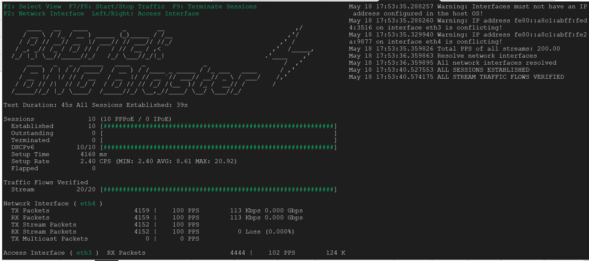

## 1. **Statefull SRRP master/backup status**

MAG1 is the master and can be checked via the below predefined script

```bash
A:admin@MAG1# show srrp

===============================================================================
SRRP Table
===============================================================================
ID        Service        Group Interface                 Admin     Oper
-------------------------------------------------------------------------------
1         51             grp-2                           Up        master
-------------------------------------------------------------------------------
No. of SRRP Entries: 1
===============================================================================
[/]
```

```bash
A:admin@MAG2# show srrp

===============================================================================
SRRP Table
===============================================================================
ID        Service        Group Interface                 Admin     Oper
-------------------------------------------------------------------------------
1         51             grp-2                           Up        backupShunt
-------------------------------------------------------------------------------
No. of SRRP Entries: 1
===============================================================================
[/]
```

There is a script that can change the status for the MAG1 to be the backup and MAG2 to be the master


```bash
A:admin@MAG1# show srrp-backup
INFO: CLI #2054: Entering global configuration mode

===============================================================================
SRRP Table
===============================================================================
ID        Service        Group Interface                 Admin     Oper
-------------------------------------------------------------------------------
1         51             grp-2                           Up        backupShunt
-------------------------------------------------------------------------------
No. of SRRP Entries: 1
===============================================================================
Executed 11 lines in 0.2 seconds from file "cf1:\scripts-md\srrp-backup"
```

```bash
A:admin@MAG1# show srrp-master

===============================================================================
SRRP Table
===============================================================================
ID        Service        Group Interface                 Admin     Oper
-------------------------------------------------------------------------------
1         51             grp-2                           Up        master
-------------------------------------------------------------------------------
No. of SRRP Entries: 1
===============================================================================
Executed 10 lines in 0.2 seconds from file "cf1:\scripts-md\srrp-master"
```


## 2.   **Start PPPoE/IPoE Session using BNGBlaster**
----
Start the broadband session using BNGBlaster to simulate PPPoE or IPoE sessions

### 2.1. **IPoE session**
The below section includes the steps to establish/debug IPoE sessions

### 2.1.1 **Start call-trace for the session**

A call trace can be started using predefined script to check the operation on MAG1 and MAG2 once the session is started

```bash
A:admin@MAG1# show ct-ipoe
INFO: CLI #2056: Exiting global configuration mode
INFO: CLI #2060: Entering exclusive configuration mode
INFO: CLI #2061: Uncommitted changes are discarded on configuration mode exit
# TiMOS-B-25.3.R1 both/x86_64 Nokia 7750 SR Copyright (c) 2000-2025 Nokia.
# All rights reserved. All use subject to applicable license agreements.
# Built on Wed Mar 12 21:50:19 UTC 2025 by builder in /builds/253B/R1/panos/main/sros
# Configuration format version 25.3 revision 0

# Generated 2025-04-13T17:00:28.3+02:00 by admin from 172.31.255.29
# Last modified 2025-04-13T15:59:48.5+02:00 by admin (MD-CLI) from 172.31.255.29

debug {
    call-trace {
        ipoe {
            trace "ipoe" {
                mac "02:00:01:00:00:01"
                profile "profile-debug-output"
                trace-existing-sessions true
            }
        }
        pppoe {
            trace "pppoe" {
                mac "02:00:05:00:00:01"
                profile "profile-debug-output"
                trace-existing-sessions true
            }
        }
    }
    router "vprn-2043" {
        radius {
            servers {
                detail-level medium
                packet-types {
                    authentication true
                    accounting true
                    coa true
                }
                attribute "radius-attr" {
                    type 1
                    value {
                        string "206010000000001"
                    }
                }
            }
        }
    } 
    subscriber-mgmt {
        gtp {
            packets {
                mode all
                detail-level high
            }
        }
    }
}
```

The call-trace script above includes the configuration for log-id 77, as shown below:
```bash
configure global
/configure log log-id 77
/configure log log-id 77 source debug
/configure log log-id 77 destination cli
/configure log log-id 77 admin-state enable
commit
/exit
```
To display the debug output on your screen, run the following command:
```bash
tools perform log subscribe-to log-id 77
```bash
 
To stop the debug output from appearing on your screen, use:
 
```bash
tools perform log unsubscribe-from log-id 77
```
### 2.1.2 **start IPoEv4v6 session**

10 dual-stack dhcp sessions are established using the BNGBlaster application.

```bash
./start_dhcp_bng.sh
```


The 10 IPoEs sessions are established and besides generic also detailed session information for the first IPoE session is available using the below script

   
```bash
A:admin@MAG1# show s-ipoe

===============================================================================
SLA Profile Statistics
===============================================================================
SLA-Profile Name                           Current     Peak      Peak Timestamp
-------------------------------------------------------------------------------
sla-default                                      0        0
sla-fwa                                          0        0
sla-ipoe                                        10       10 04/08/2025 17:06:39
sla-pppoe                                        0       10 04/08/2025 11:06:24
-------------------------------------------------------------------------------
Total                                           10
===============================================================================

===============================================================================
Subscriber Profile Statistics
===============================================================================
Subscriber-Profile Name                    Current     Peak      Peak Timestamp
-------------------------------------------------------------------------------
sub-default                                      0        0
sub-fwa                                          0        0
sub-ipoe                                        10       10 04/08/2025 17:06:39
sub-pppoe                                        0       10 04/08/2025 11:06:24
-------------------------------------------------------------------------------
Total                                           10
===============================================================================

===============================================================================
SubMgmt Statistics
===============================================================================
                 |       Hosts       |       Sessions       |    Subscribers
                 |   IPv4      IPv6  |   PPP   IPOE   PFCP  |
-------------------------------------------------------------------------------
System           |       10       20 |      0     10      0 |       10   (Curr)
                 |       20       40 |     10     10      0 |       20   (Peak)
===============================================================================

===============================================================================
Subscriber Management Statistics for System
===============================================================================
       Type                                Current     Peak      Peak Timestamp
-------------------------------------------------------------------------------

-------------------------------------------------------------------------------
Host & Protocol Statistics
-------------------------------------------------------------------------------
IPv4   PPP Hosts        - IPCP                   0       10 04/08/2025 17:41:01
       IPOE Hosts       - DHCP                  10       10 04/13/2025 17:04:31
-------------------------------------------------------------------------------
IPv6   PPP Hosts        - SLAAC                  0       10 04/08/2025 17:41:01
       PPP Hosts        - DHCP6 (PD)             0       10 04/08/2025 17:41:02
       IPOE Hosts       - SLAAC                 10       10 04/13/2025 17:04:31
       IPOE Hosts       - DHCP6 (PD)            10       10 04/13/2025 17:04:31
-------------------------------------------------------------------------------
Total  PPP Hosts                                 0       30 04/08/2025 17:41:02
       IPOE Hosts                               30       30 04/13/2025 17:04:31
       IPv4 Hosts                               10       20 04/08/2025 17:06:40
       IPv6 Hosts                               20       40 04/08/2025 17:06:39
       DHCP Leases                              10       10 04/13/2025 17:04:31
       DHCPv6 Leases                            10       20 04/08/2025 17:06:39
       System Hosts Scale                       30       60 04/08/2025 17:06:40
-------------------------------------------------------------------------------

-------------------------------------------------------------------------------
PPP Session Statistics
-------------------------------------------------------------------------------
Local  PPP Sessions     - PPPoE                  0       10 04/08/2025 17:41:01
-------------------------------------------------------------------------------
Total  PPP Sessions     - established            0       10 04/08/2025 17:41:01
       PPP Sessions     - in setup               0       10 04/08/2025 17:41:01
       PPP Sessions     - local                  0       10 04/08/2025 17:41:01
-------------------------------------------------------------------------------

-------------------------------------------------------------------------------
IPOE Session Statistics
-------------------------------------------------------------------------------
Total  IPOE Sessions    - established           10       10 04/13/2025 17:04:31
       IPOE Sessions    - in setup               0       10 04/13/2025 17:04:30
-------------------------------------------------------------------------------

-------------------------------------------------------------------------------
Subscriber Statistics
-------------------------------------------------------------------------------
Total  Subscribers                              10       20 04/08/2025 17:06:39
-------------------------------------------------------------------------------
===============================================================================
Peak values last reset at : n/a

===============================================================================
Subscriber Management Statistics for Group-interface grp-2
===============================================================================
       Type                                Current     Peak      Peak Timestamp
-------------------------------------------------------------------------------

-------------------------------------------------------------------------------
Host & Protocol Statistics
-------------------------------------------------------------------------------
IPv4   PPP Hosts        - IPCP                   0       10 04/08/2025 17:41:01
       IPOE Hosts       - DHCP                  10       10 04/13/2025 17:04:31
-------------------------------------------------------------------------------
IPv6   PPP Hosts        - SLAAC                  0       10 04/08/2025 17:41:01
       PPP Hosts        - DHCP6 (PD)             0       10 04/08/2025 17:41:02
       IPOE Hosts       - SLAAC                 10       10 04/13/2025 17:04:31
       IPOE Hosts       - DHCP6 (PD)            10       10 04/13/2025 17:04:31
-------------------------------------------------------------------------------
Total  PPP Hosts                                 0       30 04/08/2025 17:41:02
       IPOE Hosts                               30       30 04/13/2025 17:04:31
       IPv4 Hosts                               10       20 04/08/2025 17:06:40
       IPv6 Hosts                               20       40 04/08/2025 17:06:39
       DHCP Leases                              10       10 04/13/2025 17:04:31
       DHCPv6 Leases                            10       20 04/08/2025 17:06:39
       Subscriber Hosts                         30       60 04/08/2025 17:06:40
-------------------------------------------------------------------------------

-------------------------------------------------------------------------------
PPP Session Statistics
-------------------------------------------------------------------------------
Local  PPP Sessions     - PPPoE                  0       10 04/08/2025 17:41:01
-------------------------------------------------------------------------------
Total  PPP Sessions     - established            0       10 04/08/2025 17:41:01
       PPP Sessions     - in setup              50       50 04/08/2025 17:41:01
       PPP Sessions     - local                  0       10 04/08/2025 17:41:01
-------------------------------------------------------------------------------

-------------------------------------------------------------------------------
IPOE Session Statistics
-------------------------------------------------------------------------------
Total  IPOE Sessions    - established           10       10 04/13/2025 17:04:31
       IPOE Sessions    - in setup               0       10 04/13/2025 17:04:30
-------------------------------------------------------------------------------
===============================================================================
Peak values last reset at : n/a

===============================================================================
Leases for DHCP server ldhcpv4-server router 51
===============================================================================
IP Address      Lease State       Mac Address       Remaining   Clnt  Fail
  PPP user name/Opt82 Circuit Id                    LifeTime    Type  Ctrl
  User-db/Sticky-lease Hostname
-------------------------------------------------------------------------------
180.0.0.2       stable            02:00:01:00:00:01 0h53m13s    dhcp  local
  0.0.0.0/0.0.0.0 eth 1:1
  ipoe-1 (fixed IP address)
180.0.0.4       stable            02:00:01:00:00:04 1h28m13s    dhcp  local
  0.0.0.0/0.0.0.0 eth 1:4
180.0.0.5       stable            02:00:01:00:00:05 1h28m13s    dhcp  local
  0.0.0.0/0.0.0.0 eth 1:5
180.0.0.6       stable            02:00:01:00:00:06 1h28m13s    dhcp  local
  0.0.0.0/0.0.0.0 eth 1:6
180.0.0.7       stable            02:00:01:00:00:07 1h28m13s    dhcp  local
  0.0.0.0/0.0.0.0 eth 1:7
180.0.0.8       stable            02:00:01:00:00:08 1h28m13s    dhcp  local
  0.0.0.0/0.0.0.0 eth 1:8
180.0.0.9       stable            02:00:01:00:00:09 1h28m13s    dhcp  local
  0.0.0.0/0.0.0.0 eth 1:9
180.0.0.10      stable            02:00:01:00:00:0a 1h28m13s    dhcp  local
  0.0.0.0/0.0.0.0 eth 1:10
180.0.0.19      stable            02:00:01:00:00:02 1h28m13s    dhcp  local
  0.0.0.0/0.0.0.0 eth 1:2
180.0.0.20      stable            02:00:01:00:00:03 1h28m13s    dhcp  local
  0.0.0.0/0.0.0.0 eth 1:3
-------------------------------------------------------------------------------
10 leases found
===============================================================================

===============================================================================
Leases for DHCPv6 server ldhcpv6-server
===============================================================================
IP Address/Prefix                          Lease State       Remaining   Fail
  Link-local Address                                         LifeTime    Ctrl
-------------------------------------------------------------------------------
2002:2002:2002:5100::/56
  fe80::ffff:ffff:ff00:1                   stable            1d0h28m     local
2002:2002:2002:5200::/56
  fe80::ffff:ffff:ff00:2                   stable            1d0h28m     local
2002:2002:2002:5300::/56
  fe80::ffff:ffff:ff00:3                   stable            1d0h28m     local
2002:2002:2002:5400::/56
  fe80::ffff:ffff:ff00:4                   stable            1d0h28m     local
2002:2002:2002:5500::/56
  fe80::ffff:ffff:ff00:5                   stable            1d0h28m     local
2002:2002:2002:5600::/56
  fe80::ffff:ffff:ff00:6                   stable            1d0h28m     local
2002:2002:2002:5700::/56
  fe80::ffff:ffff:ff00:7                   stable            1d0h28m     local
2002:2002:2002:5800::/56
  fe80::ffff:ffff:ff00:8                   stable            1d0h28m     local
2002:2002:2002:5900::/56
  fe80::ffff:ffff:ff00:9                   stable            1d0h28m     local
2002:2002:2002:5a00::/56
  fe80::ffff:ffff:ff00:a                   stable            1d0h28m     local
2005:2005:2005:52::/64
                                           internal          N/A         N/A
2005:2005:2005:53::/64
                                           internal          N/A         N/A
2005:2005:2005:54::/64
                                           internal          N/A         N/A
2005:2005:2005:55::/64
                                           internal          N/A         N/A
2005:2005:2005:56::/64
                                           internal          N/A         N/A
2005:2005:2005:57::/64
                                           internal          N/A         N/A
2005:2005:2005:58::/64
                                           internal          N/A         N/A
2005:2005:2005:59::/64
                                           internal          N/A         N/A
2005:2005:2005:5a::/64
                                           internal          N/A         N/A
2005:2005:2005:5b::/64
                                           internal          N/A         N/A
-------------------------------------------------------------------------------
20 leases found
===============================================================================
===============================================================================
RADIUS server policy "FreeRadius" statistics
===============================================================================
Statistics last reset at                        : n/a
Server 1 "FreeRadius1" address 100.0.0.2 auth-port 1812 acct-port 1813
-------------------------------------------------------------------------------
Avg auth response delay (10 100 1K 10K) in ms   : n/a
Avg acct response delay (10 100 1K 10K) in ms   : n/a
Statistics last reset at                        : n/a
===============================================================================

===============================================================================
SRRP Table
===============================================================================
ID        Service        Group Interface                 Admin     Oper
-------------------------------------------------------------------------------
1         51             grp-2                           Up        master
-------------------------------------------------------------------------------
No. of SRRP Entries: 1
===============================================================================

===============================================================================
Active Subscribers Hierarchy
===============================================================================
-- 02:00:01:00:00:01|1/1/c2/1:201.100
   (sub-ipoe)
   |
   +-- sap:[1/1/c2/1:201.100] - sla:sla-ipoe
       |
       +-- IPOE-session - mac:02:00:01:00:00:01 - svc:51
           |
           |-- 180.0.0.2 - DHCP
           |
           |-- 2002:2002:2002:5100::/56 - DHCP6-PD
           |
           +-- 2005:2005:2005:52::/64 - SLAAC

===============================================================================

===============================================================================
Active Subscribers
===============================================================================
-------------------------------------------------------------------------------
Subscriber 02:00:01:00:00:01|1/1/c2/1:201.100
           (sub-ipoe)
-------------------------------------------------------------------------------
I. Sched. Policy : N/A
E. Sched. Policy : N/A                              E. Agg Rate Limit: 5000
Adaptation-rule  : closest                          E. Min Resv Bw   : 1
Burst-limit      : default
I. Policer Ctrl. : N/A
E. Policer Ctrl. : N/A
I. vport-hashing : Disabled
I. sec-sh-hashing: Disabled
Q Frame-Based Ac*: Disabled
Acct. Policy     : N/A                              Collect Stats    : Disabled
ANCP Pol.        : N/A
Accu-stats-pol   : (Not Specified)
HostTrk Pol.     : N/A
IGMP Policy      : N/A
MLD Policy       : N/A
PIM Policy       : N/A
Sub. MCAC Policy : N/A
NAT Policy       : N/A
Firewall Policy  : N/A
UPnP Policy      : N/A
NAT Prefix List  : N/A
Allow NAT bypass : No
NAT access mode  : auto
Def. Encap Offset: none                             Encap Offset Mode: none
Vol stats type   : full
Preference       : 5
LAG hash class   : 1
LAG hash weight  : 1
Sub. ANCP-String : "02:00:01:00:00:01|1/1/c2/1:201.100"
Sub. Int Dest Id : "201"
Igmp Rate Adj    : N/A
RADIUS Rate-Limit: N/A
Oper-Rate-Limit  : 5000
QoS-model        : fp
-------------------------------------------------------------------------------
Radius Accounting
-------------------------------------------------------------------------------
Policy           : acct-1
Session Opti.Stop: False
Oversubscribed   : False
* indicates that the corresponding row element may have been truncated.
-------------------------------------------------------------------------------
(1) SLA Profile Instance
    - sap:[1/1/c2/1:201.100] (VPRN 51 - grp-2)
    - sla:sla-ipoe
-------------------------------------------------------------------------------
Description          : (Not Specified)
Control plane(s)     : local
Alternate-profile    : (Not Specified)
Host Limits          : No Limit
Session Limits       : No Limit
Egr Sched-Policy     : N/A
Ingress Qos-Policy   : 100                    Egress Qos-Policy : 100 (vport)
Ingress Queuing Type : Service-queuing (Not Applicable to Policer)
Ingr IP Fltr-Id      : N/A                    Egr IP Fltr-Id    : N/A
Ingr IPv6 Fltr-Id    : N/A                    Egr IPv6 Fltr-Id  : N/A
Ingress Report-Rate  : N/A
Egress Report-Rate   : Maximum
Egress Remarking     : from Sap Qos
Credit Control Pol.  : N/A
Category Map         : (Not Specified)
Use ing L2TP DSCP    : false
Default SPI sharing  : per-sap
Bonding Rate-thresh. : high 90 low 80
Bonding Weight       : weight 100 5
Hs-Oper-Rate-Limit   : Maximum
Egr hqos mgmt status : disabled
Ing hqos mgmt status : disabled
-------------------------------------------------------------------------------
-------------------------------------------------------------------------------
IP Address
              MAC Address        Session            Origin       Svc        Fwd
-------------------------------------------------------------------------------
180.0.0.2
              02:00:01:00:00:01  IPoE               DHCP         51         Y
2002:2002:2002:5100::/56
              02:00:01:00:00:01  IPoE               DHCP6-PD     51         Y
2005:2005:2005:52::/64
              02:00:01:00:00:01  IPoE               SLAAC        51         Y
-------------------------------------------------------------------------------
-------------------------------------------------------------------------------
SLA Profile Instance statistics
-------------------------------------------------------------------------------
                        Packets                 Octets

Off. HiPrio           : 0                       0
Off. LowPrio          : 4069                    626626
Off. Uncolor          : 0                       0
Off. Managed          : 0                       0

Queueing Stats (Ingress QoS Policy 100)
Dro. HiPrio           : 0                       0
Dro. LowPrio          : 0                       0
For. InProf           : 0                       0
For. OutProf          : 4069                    626626

Queueing Stats (Egress QoS Policy 100)
Dro. In/InplusProf    : 0                       0
Dro. Out/ExcProf      : 0                       0
For. In/InplusProf    : 0                       0
For. Out/ExcProf      : 4068                    626472

-------------------------------------------------------------------------------
SLA Profile Instance per Queue statistics
-------------------------------------------------------------------------------
                        Packets                 Octets

Egress Queue 1
Dro. In/InplusProf    : 0                       0
Dro. Out/ExcProf      : 0                       0
For. In/InplusProf    : 0                       0
For. Out/ExcProf      : 4068                    626472

-------------------------------------------------------------------------------
SLA Profile Instance per Policer statistics
-------------------------------------------------------------------------------
                        Packets                 Octets

Ingress Policer 1 (Stats mode: minimal)
Off. All              : 4069                    626626
Dro. All              : 0                       0
For. All              : 4069                    626626


===============================================================================

===============================================================================
Scheduler Hierarchy
===============================================================================
Egress Scheduler Policy :
-------------------------------------------------------------------------------
Legend :
(*)     real-time dynamic value
(otw)   on-the-wire rates
(lmotw) last-mile-on-the-wire rates
B       Bytes
-------------------------------------------------------------------------------

Root (Egr)
|
| slot(1)
|
|--(Q) : sla-ipoe 51->1/1/c2/1:201.100->1  (Port 1/1/c2/1)
|   |    AdminPIR:40000000 kbps AdminCIR:0 kbps
|   |    Parent Limit Unused Bandwidth: not-found
|   |    AvgFrmOv:100.00 %
|   |    AdminPIR:40000000 kbps(otw) AdminCIR:0 kbps(otw)
|   |    CBS:0 B
|   |    MBS:50331648 B
|   |    Depth:0 B
|   |    HighPlus Drop Tail:50331648 B
|   |    High Drop Tail:50331648 B
|   |    Low Drop Tail:45088768 B
|   |    Exceed Drop Tail:39845888 B
|   |    MaxAggRate:5000 kbps(otw) CurAggRate:0 kbps(otw)    (Subscriber)
|   |    MaxAggRate:8000000 kbps(otw) CurAggRate:0 kbps(otw)    (Vport)
|   |
|   |    [Within CIR Level 0 Weight 0]
|   |    Assigned:0 kbps(otw) Offered:0 kbps(otw)
|   |    Consumed:0 kbps(otw)
|   |
|   |    [Above CIR Level 1 Weight 1]
|   |    Assigned:5000 kbps(otw) Offered:0 kbps(otw)
|   |    Consumed:0 kbps(otw)
|   |    TotalConsumed:0 kbps(otw)
|   |    OperPIR:5000 kbps   OperCIR:0 kbps
|   |
|   |    PktByteOffset:add 0*
|   |    OnTheWireRates:false
|   |    ATMOnTheWireRates:false
|   |    LastMileOnTheWireRates:false
|
No Active Members Found on slot 1
===============================================================================
No entries found.

===============================================================================
IPoE sessions for svc-id 51
===============================================================================
Sap Id                           Mac Address         Up Time         MC-Stdby
    Subscriber-Id
        [CircuitID] | [RemoteID]
-------------------------------------------------------------------------------
[1/1/c2/1:201.100]               02:00:01:00:00:01   0d 00:06:47
    02:00:01:00:00:01|1/1/c2/1:201.100
-------------------------------------------------------------------------------
CID | RID displayed when included in session-key
Number of sessions : 1
===============================================================================

===============================================================================
IPoE sessions for service 51
===============================================================================

SAP                     : [1/1/c2/1:201.100]
Mac Address             : 02:00:01:00:00:01
Circuit-Id              : 0.0.0.0/0.0.0.0 eth 1:1
Remote-Id               : 7750bng-sub.1
Session Key             : sap-mac

MC-Standby              : No

Subscriber-interface    : sub-1
Group-interface         : grp-2

Termination Type        : local
Up Time                 : 0d 00:06:47
Session Time Left       : N/A
Last Auth Time          : 04/13/2025 17:04:30
Min Auth Intvl (left)   : infinite (N/A)
Persistence Key         : N/A

Subscriber              : "02:00:01:00:00:01|1/1/c2/1:201.100"
Sub-Profile-String      : "sub-ipoe"
SLA-Profile-String      : "sla-ipoe"
SPI group ID            : (Not Specified)
ANCP-String             : ""
Int-Dest-Id             : "201"
App-Profile-String      : ""
Category-Map-Name       : ""
Acct-Session-Id         : "181007000001C267FBD27E"
Sap-Session-Index       : 1

IP Address              : 180.0.0.2/24
IP Origin               : DHCP
Address-Pool            : dhcpv4-pool-1

IPv6 Prefix             : 2005:2005:2005:52::/64
IPv6 Prefix Origin      : LclPool
IPv6 Prefix Pool        : "dhcpv6-slaac-pool-1"
IPv6 Del.Pfx.           : 2002:2002:2002:5100::/56
IPv6 Del.Pfx. Origin    : DHCP
IPv6 Del.Pfx. Pool      : "dhcpv6-pool-1"
IPv6 Address            : N/A
IPv6 Address Origin     : None
IPv6 Address Pool       : ""
Router adv. policy      : N/A
Radius sub-if prefix    : N/A

IPv4 NBNS Primary       : N/A
IPv4 NBNS Secondary     : N/A
IPv4 DNS Primary        : 91.74.74.74
IPv4 DNS Secondary      : 94.200.200.200
IPv6 DNS Primary        : 4001::208:67:5:1
IPv6 DNS Secondary      : 4001::208:67:5:2

Radius Session-TO       : N/A
Radius Class 1          : ipoe-1
Radius User-Name        : 02:00:01:00:00:01

GTP IMSI                :
GTP APN                 : (Not Specified)
-------------------------------------------------------------------------------
Number of sessions : 1
===============================================================================

===============================================================================
Active Subscribers Hierarchy (accounting information)
===============================================================================
-- 02:00:01:00:00:01|1/1/c2/1:201.100
   (sub-ipoe)
   |   Acct-policy         : acct-1
   |       Mode            : Session (Interim-Host)
   |       Cfg. update ivl : 00h10m00s
   |
   +-- sap:[1/1/c2/1:201.100] - sla:sla-ipoe
       |   |
       |   +-- no radius acct
       |       session-id          : 181007000001CD67FBD27E
       |
       +-- IPOE-Session - mac:02:00:01:00:00:01
           |   |
           |   +-- Session Acct - acct-1
           |       session-id      : 181007000001C267FBD27E
           |       multi-session-id: 181007000001CD67FBD27E
           |       interim-interval: 00h10m00s
           |
           |-- 180.0.0.2
           |   |
           |   +-- no radius acct
           |       session-id      : 181007000001CC67FBD27E
           |
           |-- 2002:2002:2002:5100::/56
           |   |
           |   +-- no radius acct
           |       session-id      : 181007000001CF67FBD27E
           |
           +-- 2005:2005:2005:52::/64
               |
               +-- no radius acct
                   session-id      : 181007000001CE67FBD27E

===============================================================================

===============================================================================
Active Subscribers Hierarchy
===============================================================================
-- 02:00:01:00:00:01|1/1/c2/1:201.100
   (sub-ipoe)
   |
   +-- sap:[1/1/c2/1:201.100] - sla:sla-ipoe
       |
       +-- IPOE-session - mac:02:00:01:00:00:01 - svc:51
           |
           |-- 180.0.0.2 - DHCP
           |
           |-- 2002:2002:2002:5100::/56 - DHCP6-PD
           |
           +-- 2005:2005:2005:52::/64 - SLAAC

===============================================================================
Executed 64 lines in 0.0 seconds from file "cf1:\scripts-md\s-ipoe"
```


Same script can be run on the backup BNG 

```bash
A:admin@MAG2# show s-ipoe

===============================================================================
SLA Profile Statistics
===============================================================================
SLA-Profile Name                           Current     Peak      Peak Timestamp
-------------------------------------------------------------------------------
sla-default                                      0        0
sla-fwa                                          0        1 04/08/2025 11:06:13
sla-ipoe                                        10       10 04/08/2025 17:06:39
sla-pppoe                                        0       10 04/08/2025 11:06:25
-------------------------------------------------------------------------------
Total                                           10
===============================================================================

===============================================================================
Subscriber Profile Statistics
===============================================================================
Subscriber-Profile Name                    Current     Peak      Peak Timestamp
-------------------------------------------------------------------------------
sub-default                                      0        0
sub-fwa                                          0        1 04/08/2025 11:06:13
sub-ipoe                                        10       10 04/08/2025 17:06:39
sub-pppoe                                        0       10 04/08/2025 11:06:25
-------------------------------------------------------------------------------
Total                                           10
===============================================================================

===============================================================================
SubMgmt Statistics
===============================================================================
                 |       Hosts       |       Sessions       |    Subscribers
                 |   IPv4      IPv6  |   PPP   IPOE   PFCP  |
-------------------------------------------------------------------------------
System           |       10       20 |      0     10      0 |       10   (Curr)
                 |       11       20 |      0     11      0 |       11   (Peak)
===============================================================================

===============================================================================
Subscriber Management Statistics for System
===============================================================================
       Type                                Current     Peak      Peak Timestamp
-------------------------------------------------------------------------------

-------------------------------------------------------------------------------
Host & Protocol Statistics
-------------------------------------------------------------------------------
IPv4   IPOE Hosts       - DHCP                  10       10 04/13/2025 17:04:31
       IPOE Mngd Hosts  - GTP                    0        1 04/13/2025 16:15:44
-------------------------------------------------------------------------------
IPv6   IPOE Hosts       - SLAAC                 10       10 04/13/2025 17:04:31
       IPOE Hosts       - DHCP6 (PD)            10       10 04/13/2025 17:04:31
-------------------------------------------------------------------------------
Total  IPOE Hosts                               30       31 04/13/2025 17:04:31
       IPv4 Hosts                               10       11 04/13/2025 17:04:31
       IPv6 Hosts                               20       20 04/13/2025 17:04:31
       DHCP Leases                              10       10 04/13/2025 17:04:31
       DHCPv6 Leases                            10       10 04/13/2025 17:04:31
       System Hosts Scale                       30       31 04/13/2025 17:04:31
-------------------------------------------------------------------------------

-------------------------------------------------------------------------------
IPOE Session Statistics
-------------------------------------------------------------------------------
Total  IPOE Sessions    - established           10       11 04/13/2025 17:04:31
       IPOE Sessions    - in setup               0        1 04/13/2025 17:04:31
-------------------------------------------------------------------------------

-------------------------------------------------------------------------------
Subscriber Statistics
-------------------------------------------------------------------------------
Total  Subscribers                              10       11 04/13/2025 17:04:31
-------------------------------------------------------------------------------
===============================================================================
Peak values last reset at : 04/13/2025 16:15:44

===============================================================================
Subscriber Management Statistics for Group-interface grp-1
===============================================================================
       Type                                Current     Peak      Peak Timestamp
-------------------------------------------------------------------------------

-------------------------------------------------------------------------------
Host & Protocol Statistics
-------------------------------------------------------------------------------
IPv4   IPOE Mngd Hosts  - GTP                    0        1 04/13/2025 16:15:44
-------------------------------------------------------------------------------
Total  IPOE Hosts                                0        1 04/13/2025 16:15:44
       IPv4 Hosts                                0        1 04/13/2025 16:15:44
       Subscriber Hosts                          0        1 04/13/2025 16:15:44
-------------------------------------------------------------------------------

-------------------------------------------------------------------------------
IPOE Session Statistics
-------------------------------------------------------------------------------
Total  IPOE Sessions    - established            0        1 04/13/2025 16:15:44
-------------------------------------------------------------------------------
===============================================================================
Peak values last reset at : 04/13/2025 16:15:44

===============================================================================
Subscriber Management Statistics for Group-interface grp-2
===============================================================================
       Type                                Current     Peak      Peak Timestamp
-------------------------------------------------------------------------------

-------------------------------------------------------------------------------
Host & Protocol Statistics
-------------------------------------------------------------------------------
IPv4   IPOE Hosts       - DHCP                  10       10 04/13/2025 17:04:31
-------------------------------------------------------------------------------
IPv6   IPOE Hosts       - SLAAC                 10       10 04/13/2025 17:04:31
       IPOE Hosts       - DHCP6 (PD)            10       10 04/13/2025 17:04:31
-------------------------------------------------------------------------------
Total  IPOE Hosts                               30       30 04/13/2025 17:04:31
       IPv4 Hosts                               10       10 04/13/2025 17:04:31
       IPv6 Hosts                               20       20 04/13/2025 17:04:31
       DHCP Leases                              10       10 04/13/2025 17:04:31
       DHCPv6 Leases                            10       10 04/13/2025 17:04:31
       Subscriber Hosts                         30       30 04/13/2025 17:04:31
-------------------------------------------------------------------------------

-------------------------------------------------------------------------------
IPOE Session Statistics
-------------------------------------------------------------------------------
Total  IPOE Sessions    - established           10       10 04/13/2025 17:04:31
       IPOE Sessions    - in setup               0        1 04/13/2025 17:04:31
-------------------------------------------------------------------------------
===============================================================================
Peak values last reset at : 04/13/2025 16:15:44

===============================================================================
Leases for DHCP server ldhcpv4-server router 51
===============================================================================
IP Address      Lease State       Mac Address       Remaining   Clnt  Fail
  PPP user name/Opt82 Circuit Id                    LifeTime    Type  Ctrl
  User-db/Sticky-lease Hostname
-------------------------------------------------------------------------------
180.0.0.4       stable            02:00:01:00:00:04 1h27m20s    dhcp  remote
  0.0.0.0/0.0.0.0 eth 1:4
180.0.0.5       stable            02:00:01:00:00:05 1h27m20s    dhcp  remote
  0.0.0.0/0.0.0.0 eth 1:5
180.0.0.6       stable            02:00:01:00:00:06 1h27m20s    dhcp  remote
  0.0.0.0/0.0.0.0 eth 1:6
180.0.0.7       stable            02:00:01:00:00:07 1h27m20s    dhcp  remote
  0.0.0.0/0.0.0.0 eth 1:7
180.0.0.8       stable            02:00:01:00:00:08 1h27m20s    dhcp  remote
  0.0.0.0/0.0.0.0 eth 1:8
180.0.0.9       stable            02:00:01:00:00:09 1h27m20s    dhcp  remote
  0.0.0.0/0.0.0.0 eth 1:9
180.0.0.10      stable            02:00:01:00:00:0a 1h27m20s    dhcp  remote
  0.0.0.0/0.0.0.0 eth 1:10
180.0.0.19      stable            02:00:01:00:00:02 1h27m20s    dhcp  remote
  0.0.0.0/0.0.0.0 eth 1:2
180.0.0.20      stable            02:00:01:00:00:03 1h27m20s    dhcp  remote
  0.0.0.0/0.0.0.0 eth 1:3
-------------------------------------------------------------------------------
9 leases found
===============================================================================

===============================================================================
Leases for DHCPv6 server ldhcpv6-server
===============================================================================
IP Address/Prefix                          Lease State       Remaining   Fail
  Link-local Address                                         LifeTime    Ctrl
-------------------------------------------------------------------------------
2002:2002:2002:5100::/56
  fe80::ffff:ffff:ff00:1                   stable            1d0h27m     remote
2002:2002:2002:5200::/56
  fe80::ffff:ffff:ff00:2                   stable            1d0h27m     remote
2002:2002:2002:5300::/56
  fe80::ffff:ffff:ff00:3                   stable            1d0h27m     remote
2002:2002:2002:5400::/56
  fe80::ffff:ffff:ff00:4                   stable            1d0h27m     remote
2002:2002:2002:5500::/56
  fe80::ffff:ffff:ff00:5                   stable            1d0h27m     remote
2002:2002:2002:5600::/56
  fe80::ffff:ffff:ff00:6                   stable            1d0h27m     remote
2002:2002:2002:5700::/56
  fe80::ffff:ffff:ff00:7                   stable            1d0h27m     remote
2002:2002:2002:5800::/56
  fe80::ffff:ffff:ff00:8                   stable            1d0h27m     remote
2002:2002:2002:5900::/56
  fe80::ffff:ffff:ff00:9                   stable            1d0h27m     remote
2002:2002:2002:5a00::/56
  fe80::ffff:ffff:ff00:a                   stable            1d0h27m     remote
2005:2005:2005:52::/64
                                           internal          N/A         N/A
2005:2005:2005:53::/64
                                           internal          N/A         N/A
2005:2005:2005:54::/64
                                           internal          N/A         N/A
2005:2005:2005:55::/64
                                           internal          N/A         N/A
2005:2005:2005:56::/64
                                           internal          N/A         N/A
2005:2005:2005:57::/64
                                           internal          N/A         N/A
2005:2005:2005:58::/64
                                           internal          N/A         N/A
2005:2005:2005:59::/64
                                           internal          N/A         N/A
2005:2005:2005:5a::/64
                                           internal          N/A         N/A
2005:2005:2005:5b::/64
                                           internal          N/A         N/A
-------------------------------------------------------------------------------
20 leases found
===============================================================================
===============================================================================
RADIUS server policy "FreeRadius" statistics
===============================================================================
Statistics last reset at                        : n/a
Server 1 "FreeRadius1" address 100.0.0.2 auth-port 1812 acct-port 1813
-------------------------------------------------------------------------------
Avg auth response delay (10 100 1K 10K) in ms   : n/a
Avg acct response delay (10 100 1K 10K) in ms   : n/a
Statistics last reset at                        : n/a
===============================================================================

===============================================================================
SRRP Table
===============================================================================
ID        Service        Group Interface                 Admin     Oper
-------------------------------------------------------------------------------
1         51             grp-2                           Up        backupShunt
-------------------------------------------------------------------------------
No. of SRRP Entries: 1
===============================================================================

===============================================================================
Active Subscribers Hierarchy
===============================================================================
-- 02:00:01:00:00:01|1/1/c2/1:201.100
   (sub-ipoe)
   |
   +-- sap:[1/1/c2/1:201.100] - sla:sla-ipoe
       |
       +-- IPOE-session - mac:02:00:01:00:00:01 - svc:51
           |
           |-- 180.0.0.2 - DHCP
           |
           |-- 2002:2002:2002:5100::/56 - DHCP6-PD
           |
           +-- 2005:2005:2005:52::/64 - SLAAC

===============================================================================

===============================================================================
Active Subscribers
===============================================================================
-------------------------------------------------------------------------------
Subscriber 02:00:01:00:00:01|1/1/c2/1:201.100
           (sub-ipoe)
-------------------------------------------------------------------------------
I. Sched. Policy : N/A
E. Sched. Policy : N/A                              E. Agg Rate Limit: 5000
Adaptation-rule  : closest                          E. Min Resv Bw   : 1
Burst-limit      : default
I. Policer Ctrl. : N/A
E. Policer Ctrl. : N/A
I. vport-hashing : Disabled
I. sec-sh-hashing: Disabled
Q Frame-Based Ac*: Disabled
Acct. Policy     : N/A                              Collect Stats    : Disabled
ANCP Pol.        : N/A
Accu-stats-pol   : (Not Specified)
HostTrk Pol.     : N/A
IGMP Policy      : N/A
MLD Policy       : N/A
PIM Policy       : N/A
Sub. MCAC Policy : N/A
NAT Policy       : N/A
Firewall Policy  : N/A
UPnP Policy      : N/A
NAT Prefix List  : N/A
Allow NAT bypass : No
NAT access mode  : auto
Def. Encap Offset: none                             Encap Offset Mode: none
Vol stats type   : full
Preference       : 5
LAG hash class   : 1
LAG hash weight  : 1
Sub. ANCP-String : "02:00:01:00:00:01|1/1/c2/1:201.100"
Sub. Int Dest Id : "201"
Igmp Rate Adj    : N/A
RADIUS Rate-Limit: N/A
Oper-Rate-Limit  : 5000
QoS-model        : fp
-------------------------------------------------------------------------------
Radius Accounting
-------------------------------------------------------------------------------
Policy           : acct-1
Session Opti.Stop: False
Oversubscribed   : False
* indicates that the corresponding row element may have been truncated.
-------------------------------------------------------------------------------
(1) SLA Profile Instance
    - sap:[1/1/c2/1:201.100] (VPRN 51 - grp-2)
    - sla:sla-ipoe
-------------------------------------------------------------------------------
Description          : (Not Specified)
Control plane(s)     : local
Alternate-profile    : (Not Specified)
Host Limits          : No Limit
Session Limits       : No Limit
Egr Sched-Policy     : N/A
Ingress Qos-Policy   : 100                    Egress Qos-Policy : 100 (vport)
Ingress Queuing Type : Service-queuing (Not Applicable to Policer)
Ingr IP Fltr-Id      : N/A                    Egr IP Fltr-Id    : N/A
Ingr IPv6 Fltr-Id    : N/A                    Egr IPv6 Fltr-Id  : N/A
Ingress Report-Rate  : N/A
Egress Report-Rate   : Maximum
Egress Remarking     : from Sap Qos
Credit Control Pol.  : N/A
Category Map         : (Not Specified)
Use ing L2TP DSCP    : false
Default SPI sharing  : per-sap
Bonding Rate-thresh. : high 90 low 80
Bonding Weight       : weight 100 5
Hs-Oper-Rate-Limit   : Maximum
Egr hqos mgmt status : disabled
Ing hqos mgmt status : disabled
-------------------------------------------------------------------------------
-------------------------------------------------------------------------------
IP Address
              MAC Address        Session            Origin       Svc        Fwd
-------------------------------------------------------------------------------
180.0.0.2
              02:00:01:00:00:01  IPoE               DHCP         51         Y
2002:2002:2002:5100::/56
              02:00:01:00:00:01  IPoE               DHCP6-PD     51         Y
2005:2005:2005:52::/64
              02:00:01:00:00:01  IPoE               SLAAC        51         Y
-------------------------------------------------------------------------------
-------------------------------------------------------------------------------
SLA Profile Instance statistics
-------------------------------------------------------------------------------
                        Packets                 Octets

Off. HiPrio           : 0                       0
Off. LowPrio          : 0                       0
Off. Uncolor          : 0                       0
Off. Managed          : 0                       0

Queueing Stats (Ingress QoS Policy 100)
Dro. HiPrio           : 0                       0
Dro. LowPrio          : 0                       0
For. InProf           : 0                       0
For. OutProf          : 0                       0

Queueing Stats (Egress QoS Policy 100)
Dro. In/InplusProf    : 0                       0
Dro. Out/ExcProf      : 0                       0
For. In/InplusProf    : 0                       0
For. Out/ExcProf      : 0                       0

-------------------------------------------------------------------------------
SLA Profile Instance per Queue statistics
-------------------------------------------------------------------------------
                        Packets                 Octets

Egress Queue 1
Dro. In/InplusProf    : 0                       0
Dro. Out/ExcProf      : 0                       0
For. In/InplusProf    : 0                       0
For. Out/ExcProf      : 0                       0

-------------------------------------------------------------------------------
SLA Profile Instance per Policer statistics
-------------------------------------------------------------------------------
                        Packets                 Octets

Ingress Policer 1 (Stats mode: minimal)
Off. All              : 0                       0
Dro. All              : 0                       0
For. All              : 0                       0


===============================================================================

===============================================================================
Scheduler Hierarchy
===============================================================================
Egress Scheduler Policy :
-------------------------------------------------------------------------------
Legend :
(*)     real-time dynamic value
(otw)   on-the-wire rates
(lmotw) last-mile-on-the-wire rates
B       Bytes
-------------------------------------------------------------------------------

Root (Egr)
|
| slot(1)
|
|--(Q) : sla-ipoe 51->1/1/c2/1:201.100->1  (Port 1/1/c2/1)
|   |    AdminPIR:40000000 kbps AdminCIR:0 kbps
|   |    Parent Limit Unused Bandwidth: not-found
|   |    AvgFrmOv:100.00 %
|   |    AdminPIR:40000000 kbps(otw) AdminCIR:0 kbps(otw)
|   |    CBS:0 B
|   |    MBS:50331648 B
|   |    Depth:0 B
|   |    HighPlus Drop Tail:50331648 B
|   |    High Drop Tail:50331648 B
|   |    Low Drop Tail:45088768 B
|   |    Exceed Drop Tail:39845888 B
|   |    MaxAggRate:5000 kbps(otw) CurAggRate:0 kbps(otw)    (Subscriber)
|   |    MaxAggRate:8000000 kbps(otw) CurAggRate:0 kbps(otw)    (Vport)
|   |
|   |    [Within CIR Level 0 Weight 0]
|   |    Assigned:0 kbps(otw) Offered:0 kbps(otw)
|   |    Consumed:0 kbps(otw)
|   |
|   |    [Above CIR Level 1 Weight 1]
|   |    Assigned:5000 kbps(otw) Offered:0 kbps(otw)
|   |    Consumed:0 kbps(otw)
|   |    TotalConsumed:0 kbps(otw)
|   |    OperPIR:5000 kbps   OperCIR:0 kbps
|   |
|   |    PktByteOffset:add 0*
|   |    OnTheWireRates:false
|   |    ATMOnTheWireRates:false
|   |    LastMileOnTheWireRates:false
|
No Active Members Found on slot 1
===============================================================================
No entries found.

===============================================================================
IPoE sessions for svc-id 51
===============================================================================
Sap Id                           Mac Address         Up Time         MC-Stdby
    Subscriber-Id
        [CircuitID] | [RemoteID]
-------------------------------------------------------------------------------
[1/1/c2/1:201.100]               02:00:01:00:00:01   0d 00:07:41     Yes
    02:00:01:00:00:01|1/1/c2/1:201.100
-------------------------------------------------------------------------------
CID | RID displayed when included in session-key
Number of sessions : 1
===============================================================================

===============================================================================
IPoE sessions for service 51
===============================================================================

SAP                     : [1/1/c2/1:201.100]
Mac Address             : 02:00:01:00:00:01
Circuit-Id              : 0.0.0.0/0.0.0.0 eth 1:1
Remote-Id               : 7750bng-sub.1
Session Key             : sap-mac

MC-Standby              : Yes

Subscriber-interface    : sub-1
Group-interface         : grp-2

Termination Type        : local
Up Time                 : 0d 00:07:41
Session Time Left       : N/A
Last Auth Time          : 04/13/2025 17:04:30
Min Auth Intvl (left)   : infinite (N/A)
Persistence Key         : N/A

Subscriber              : "02:00:01:00:00:01|1/1/c2/1:201.100"
Sub-Profile-String      : "sub-ipoe"
SLA-Profile-String      : "sla-ipoe"
SPI group ID            : (Not Specified)
ANCP-String             : ""
Int-Dest-Id             : "201"
App-Profile-String      : ""
Category-Map-Name       : ""
Acct-Session-Id         : "181007000001C267FBD27E"
Sap-Session-Index       : 1

IP Address              : 180.0.0.2/24
IP Origin               : DHCP
Address-Pool            : dhcpv4-pool-1

IPv6 Prefix             : 2005:2005:2005:52::/64
IPv6 Prefix Origin      : LclPool
IPv6 Prefix Pool        : "dhcpv6-slaac-pool-1"
IPv6 Del.Pfx.           : 2002:2002:2002:5100::/56
IPv6 Del.Pfx. Origin    : DHCP
IPv6 Del.Pfx. Pool      : "dhcpv6-pool-1"
IPv6 Address            : N/A
IPv6 Address Origin     : None
IPv6 Address Pool       : ""
Router adv. policy      : N/A
Radius sub-if prefix    : N/A

IPv4 NBNS Primary       : N/A
IPv4 NBNS Secondary     : N/A
IPv4 DNS Primary        : 91.74.74.74
IPv4 DNS Secondary      : 94.200.200.200
IPv6 DNS Primary        : 4001::208:67:5:1
IPv6 DNS Secondary      : 4001::208:67:5:2

Radius Session-TO       : N/A
Radius Class 1          : ipoe-1
Radius User-Name        : 02:00:01:00:00:01

GTP IMSI                :
GTP APN                 : (Not Specified)
-------------------------------------------------------------------------------
Number of sessions : 1
===============================================================================

===============================================================================
Active Subscribers Hierarchy (accounting information)
===============================================================================
-- 02:00:01:00:00:01|1/1/c2/1:201.100
   (sub-ipoe)
   |   Acct-policy         : acct-1
   |       Mode            : Session (Interim-Host)
   |       Cfg. update ivl : 00h10m00s
   |
   +-- sap:[1/1/c2/1:201.100] - sla:sla-ipoe
       |   |
       |   +-- no radius acct
       |       session-id          : 181007000001CD67FBD27E
       |
       +-- IPOE-Session - mac:02:00:01:00:00:01
           |   |
           |   +-- Session Acct - acct-1
           |       session-id      : 181007000001C267FBD27E
           |       multi-session-id: 181007000001CD67FBD27E
           |       interim-interval: 00h10m00s
           |
           |-- 180.0.0.2
           |   |
           |   +-- no radius acct
           |       session-id      : 181007000001CC67FBD27E
           |
           |-- 2002:2002:2002:5100::/56
           |   |
           |   +-- no radius acct
           |       session-id      : 181007000001CF67FBD27E
           |
           +-- 2005:2005:2005:52::/64
               |
               +-- no radius acct
                   session-id      : 181007000001CE67FBD27E

===============================================================================

===============================================================================
Active Subscribers Hierarchy
===============================================================================
-- 02:00:01:00:00:01|1/1/c2/1:201.100
   (sub-ipoe)
   |
   +-- sap:[1/1/c2/1:201.100] - sla:sla-ipoe
       |
       +-- IPOE-session - mac:02:00:01:00:00:01 - svc:51
           |
           |-- 180.0.0.2 - DHCP
           |
           |-- 2002:2002:2002:5100::/56 - DHCP6-PD
           |
           +-- 2005:2005:2005:52::/64 - SLAAC

===============================================================================
Executed 64 lines in 0.0 seconds from file "cf1:\scripts-md\s-ipoe"
```

### 2.1.3 **call-trace output**

The call-trace was enabled before the session is started ,below you can check the session call-trace debug output

```bash
491 2025/04/13 17:04:30.128 CEST minor: CALLTRACE #2003 Base CALL-TRACE
CALL-TRACE: CPM A
   Info:     sap-id: 1/1/c2/1:201.100
   Info:     mac-address: 02:00:01:00:00:01
   Info:     profile: profile-debug-output
   Info:     created by mask: ipoe
   Info:     anchor ingressing frame to application Connectivity-management

   IPv6/UDP: from fe80::ffff:ffff:ff00:1 (port 546) to ff02::1:2 (port 547)

   DHCPv6:
     Msg Type : SOLICIT (1)
     Trans Id : 0x662f11
     Option : ELAPSED_TIME (8), Length : 2
       Time : 0 ms
     Option : CLIENTID (1), Length : 10
       LL  : HwTyp=0001,LL=020001000001
       00030001020001000001
     Option : RAPID_COMMIT (14), Length : 0
     Option : IA_PD (25), Length : 41
       IAID : 16777216
       Time1: 0 seconds
       Time2: 0 seconds
       Option : IAPREFIX (26), Length : 25
         Prefix : ::/0
         Preferred Lifetime : 0 seconds
         Valid Lifetime     : 0 seconds
     Option : ORO (6), Length : 2
       Requested Option : DNS_NAME_SRVR (23)


492 2025/04/13 17:04:30.128 CEST minor: CALLTRACE #2003 Base CALL-TRACE
CALL-TRACE: CPM A
   Info:     sap-id: 1/1/c2/1:201.100
   Info:     mac-address: 02:00:01:00:00:01
   Info:     profile: profile-debug-output
   Info:     created by mask: ipoe
   Info:     anchor egressing frame from application Radius-auth

   IP/UDP:   from 192.0.2.10 (port 0) to 100.0.0.2 (port 1812)

   RADIUS:   Access-Request (1)  id 91  len 136
    USER NAME [1] 17 02:00:01:00:00:01
    PASSWORD [2] 16 rY9SSip0JsKANe5bqi49s.
    NAS IP ADDRESS [4] 4 192.0.2.10
    NAS PORT TYPE [61] 4 Ethernet(15)
    NAS PORT ID [87] 16 1/1/c2/1:201.100
    VSA [26] 19 Nokia(6527)
      CHADDR [27] 17 02:00:01:00:00:01
    SESSION ID [44] 22 181007000001C267FBD27E


493 2025/04/13 17:04:30.138 CEST minor: CALLTRACE #2003 Base CALL-TRACE
CALL-TRACE: CPM A
   Info:     sap-id: 1/1/c2/1:201.100
   Info:     mac-address: 02:00:01:00:00:01
   Info:     profile: profile-debug-output
   Info:     created by mask: ipoe
   Info:     anchor ingressing frame to application Radius-auth

   IP/UDP:   from 100.0.0.2 (port 1812) to 192.0.2.10 (port 64387)

   RADIUS:   Access-Accept (2)  id 91  len 123
    VSA [26] 10 Nokia(6527)
      SUBSC PROF STR [12] 8 sub-ipoe
    VSA [26] 10 Nokia(6527)
      SLA PROF STR [13] 8 sla-ipoe
    FRAMED POOL [88] 13 dhcpv4-pool-1
    VSA [26] 21 Nokia(6527)
      SLAAC IPV6 POOL [181] 19 dhcpv6-slaac-pool-1
    VSA [26] 15 Nokia(6527)
      DELEGATED IPV6 POOL [131] 13 dhcpv6-pool-1
    CLASS [25] 6 0x69706f652d31


494 2025/04/13 17:04:30.138 CEST minor: CALLTRACE #2003 Base CALL-TRACE
CALL-TRACE: CPM A
   Info:     sap-id: 1/1/c2/1:201.100
   Info:     mac-address: 02:00:01:00:00:01
   Info:     profile: profile-debug-output
   Info:     created by mask: ipoe
   Info:     anchor egressing frame from application Connectivity-management

   IPv6/UDP: from 2001:db8::48 (port 547) to 2001:db8::48 (port 547)

   DHCPv6:
     Msg Type : RELAY_FORW (12)
     Hop Count : 0
     Link Addr : 2005:2005:2005::
     Peer Addr : fe80::ffff:ffff:ff00:1
     Option : RELAY_MSG (9), Length : 79
       Msg Type : SOLICIT (1)
       Trans Id : 0x662f11
       Option : ELAPSED_TIME (8), Length : 2
         Time : 0 ms
       Option : CLIENTID (1), Length : 10
         LL  : HwTyp=0001,LL=020001000001
         00030001020001000001
       Option : RAPID_COMMIT (14), Length : 0
       Option : IA_PD (25), Length : 41
         IAID : 16777216
         Time1: 0 seconds
         Time2: 0 seconds
         Option : IAPREFIX (26), Length : 25
           Prefix : ::/0
           Preferred Lifetime : 0 seconds
           Valid Lifetime     : 0 seconds
       Option : ORO (6), Length : 2
         Requested Option : DNS_NAME_SRVR (23)
     Option : VENDOR_OPTS (17), Length : 31
       Enterprise : 0000197f
       Option : PFX_POOL (2), Length : 13
         dhcpv6-pool-1
       Option : PFX_LEN (3), Length : 1
         56
       Option : RESERVED_NA_LEN (4), Length : 1
         64


495 2025/04/13 17:04:30.138 CEST minor: CALLTRACE #2003 Base CALL-TRACE
CALL-TRACE: CPM A
   Info:     sap-id: 1/1/c2/1:201.100
   Info:     mac-address: 02:00:01:00:00:01
   Info:     profile: profile-debug-output
   Info:     created by mask: ipoe
   Info:     anchor egressing frame from application Connectivity-management

   IPv6/UDP: from 2001:db8::48 (port 547) to 2002:db8::48 (port 547)

   DHCPv6:
     Msg Type : RELAY_FORW (12)
     Hop Count : 0
     Link Addr : 2005:2005:2005::
     Peer Addr : fe80::ffff:ffff:ff00:1
     Option : RELAY_MSG (9), Length : 79
       Msg Type : SOLICIT (1)
       Trans Id : 0x662f11
       Option : ELAPSED_TIME (8), Length : 2
         Time : 0 ms
       Option : CLIENTID (1), Length : 10
         LL  : HwTyp=0001,LL=020001000001
         00030001020001000001
       Option : RAPID_COMMIT (14), Length : 0
       Option : IA_PD (25), Length : 41
         IAID : 16777216
         Time1: 0 seconds
         Time2: 0 seconds
         Option : IAPREFIX (26), Length : 25
           Prefix : ::/0
           Preferred Lifetime : 0 seconds
           Valid Lifetime     : 0 seconds
       Option : ORO (6), Length : 2
         Requested Option : DNS_NAME_SRVR (23)
     Option : VENDOR_OPTS (17), Length : 31
       Enterprise : 0000197f
       Option : PFX_POOL (2), Length : 13
         dhcpv6-pool-1
       Option : PFX_LEN (3), Length : 1
         56
       Option : RESERVED_NA_LEN (4), Length : 1
         64


496 2025/04/13 17:04:30.138 CEST minor: CALLTRACE #2003 Base CALL-TRACE
CALL-TRACE: CPM A
   Info:     sap-id: 1/1/c2/1:201.100
   Info:     mac-address: 02:00:01:00:00:01
   Info:     profile: profile-debug-output
   Info:     created by mask: ipoe
   Info:     anchor ingressing frame to application Connectivity-management

   IPv6/UDP: from 2001:db8::48 (port 547) to 2001:db8::48 (port 547)

   DHCPv6:
     Msg Type : RELAY_REPLY (13)
     Hop Count : 0
     Link Addr : 2005:2005:2005::
     Peer Addr : fe80::ffff:ffff:ff00:1
     Option : RELAY_MSG (9), Length : 81
       Msg Type : ADVERTISE (2)
       Trans Id : 0x662f11
       Option : SERVERID (2), Length : 10
         LL  : HwTyp=0001,LL=0c0007141000
         000300010c0007141000
       Option : CLIENTID (1), Length : 10
         LL  : HwTyp=0001,LL=020001000001
         00030001020001000001
       Option : RAPID_COMMIT (14), Length : 0
       Option : IA_PD (25), Length : 41
         IAID : 16777216
         Time1: 300 seconds
         Time2: 400 seconds
         Option : IAPREFIX (26), Length : 25
           Prefix : 2002:2002:2002:5100::/56
           Preferred Lifetime : 600 seconds
           Valid Lifetime     : 600 seconds
     Option : VENDOR_OPTS (17), Length : 31
       Enterprise : 0000197f
       Option : PFX_POOL (2), Length : 13
         dhcpv6-pool-1
       Option : PFX_LEN (3), Length : 1
         56
       Option : RESERVED_NA_LEN (4), Length : 1
         64


497 2025/04/13 17:04:30.138 CEST minor: CALLTRACE #2003 Base CALL-TRACE
CALL-TRACE: CPM A
   Info:     sap-id: 1/1/c2/1:201.100
   Info:     mac-address: 02:00:01:00:00:01
   Info:     profile: profile-debug-output
   Info:     created by mask: ipoe
   Info:     anchor egressing frame from application Connectivity-management

   IPv6/UDP: from fe80::5151:ffff:fe51:4321 (port 547) to
   fe80::ffff:ffff:ff00:1 (port 546)

   DHCPv6:
     Msg Type : ADVERTISE (2)
     Trans Id : 0x662f11
     Option : SERVERID (2), Length : 10
       LL  : HwTyp=0001,LL=0c0007141000
       000300010c0007141000
     Option : CLIENTID (1), Length : 10
       LL  : HwTyp=0001,LL=020001000001
       00030001020001000001
     Option : RAPID_COMMIT (14), Length : 0
     Option : IA_PD (25), Length : 41
       IAID : 16777216
       Time1: 300 seconds
       Time2: 400 seconds
       Option : IAPREFIX (26), Length : 25
         Prefix : 2002:2002:2002:5100::/56
         Preferred Lifetime : 600 seconds
         Valid Lifetime     : 600 seconds
     Option : DNS_NAME_SRVR (23), Length : 32
       Server : 4001::208:67:5:1
       Server : 4001::208:67:5:2


498 2025/04/13 17:04:30.148 CEST minor: CALLTRACE #2003 Base CALL-TRACE
CALL-TRACE: CPM A
   Info:     sap-id: 1/1/c2/1:201.100
   Info:     mac-address: 02:00:01:00:00:01
   Info:     profile: profile-debug-output
   Info:     created by mask: ipoe
   Info:     anchor ingressing frame to application Connectivity-management

   IPv6/UDP: from 2002:db8::48 (port 547) to 2001:db8::48 (port 547)

   DHCPv6:
     Msg Type : RELAY_REPLY (13)
     Hop Count : 0
     Link Addr : 2005:2005:2005::
     Peer Addr : fe80::ffff:ffff:ff00:1
     Option : RELAY_MSG (9), Length : 81
       Msg Type : ADVERTISE (2)
       Trans Id : 0x662f11
       Option : SERVERID (2), Length : 10
         LL  : HwTyp=0001,LL=0c001ba7de00
         000300010c001ba7de00
       Option : CLIENTID (1), Length : 10
         LL  : HwTyp=0001,LL=020001000001
         00030001020001000001
       Option : RAPID_COMMIT (14), Length : 0
       Option : IA_PD (25), Length : 41
         IAID : 16777216
         Time1: 300 seconds
         Time2: 400 seconds
         Option : IAPREFIX (26), Length : 25
           Prefix : 2004:2004:2004:2500::/56
           Preferred Lifetime : 600 seconds
           Valid Lifetime     : 600 seconds
     Option : VENDOR_OPTS (17), Length : 31
       Enterprise : 0000197f
       Option : PFX_POOL (2), Length : 13
         dhcpv6-pool-1
       Option : PFX_LEN (3), Length : 1
         56
       Option : RESERVED_NA_LEN (4), Length : 1
         64


499 2025/04/13 17:04:30.148 CEST minor: CALLTRACE #2003 Base CALL-TRACE
CALL-TRACE: CPM A
   Info:     sap-id: 1/1/c2/1:201.100
   Info:     mac-address: 02:00:01:00:00:01
   Info:     profile: profile-debug-output
   Info:     created by mask: ipoe
   Info:     anchor egressing frame from application Connectivity-management

   IPv6/UDP: from fe80::5151:ffff:fe51:4321 (port 547) to
   fe80::ffff:ffff:ff00:1 (port 546)

   DHCPv6:
     Msg Type : ADVERTISE (2)
     Trans Id : 0x662f11
     Option : SERVERID (2), Length : 10
       LL  : HwTyp=0001,LL=0c001ba7de00
       000300010c001ba7de00
     Option : CLIENTID (1), Length : 10
       LL  : HwTyp=0001,LL=020001000001
       00030001020001000001
     Option : RAPID_COMMIT (14), Length : 0
     Option : IA_PD (25), Length : 41
       IAID : 16777216
       Time1: 300 seconds
       Time2: 400 seconds
       Option : IAPREFIX (26), Length : 25
         Prefix : 2004:2004:2004:2500::/56
         Preferred Lifetime : 600 seconds
         Valid Lifetime     : 600 seconds
     Option : DNS_NAME_SRVR (23), Length : 32
       Server : 4001::208:67:5:1
       Server : 4001::208:67:5:2


500 2025/04/13 17:04:30.158 CEST minor: CALLTRACE #2003 Base CALL-TRACE
CALL-TRACE: CPM A
   Info:     sap-id: 1/1/c2/1:201.100
   Info:     mac-address: 02:00:01:00:00:01
   Info:     profile: profile-debug-output
   Info:     created by mask: ipoe
   Info:     anchor ingressing frame to application Connectivity-management

   IP/UDP:   from 0.0.0.0 (port 68) to 255.255.255.255 (port 67)

   DHCP:
   ciaddr: 0.0.0.0           yiaddr: 0.0.0.0
   siaddr: 0.0.0.0           giaddr: 0.0.0.0
   chaddr: 02:00:01:00:00:01    xid: 0x6c71b0d

   DHCP options:
   [82] Relay agent information: len = 40
      [1] Circuit-id: 0.0.0.0/0.0.0.0 eth 1:1
      [2] Remote-id: 7750bng-sub.1
   [53] Message type: Discover
   [55] Param request list: len = 4
             1  Subnet mask
             3  Router
             6  Domain name server
            15  Domain name
   [255] End


501 2025/04/13 17:04:30.158 CEST minor: CALLTRACE #2003 Base CALL-TRACE
CALL-TRACE: CPM A
   Info:     sap-id: 1/1/c2/1:201.100
   Info:     mac-address: 02:00:01:00:00:01
   Info:     profile: profile-debug-output
   Info:     created by mask: ipoe
   Info:     anchor egressing frame from application Connectivity-management

   IP/UDP:   from 0.0.0.0 (port 67) to 5.5.5.5 (port 67)

   DHCP:
   ciaddr: 0.0.0.0           yiaddr: 0.0.0.0
   siaddr: 0.0.0.0           giaddr: 180.0.0.252
   chaddr: 02:00:01:00:00:01    xid: 0x6c71b0d

   DHCP options:
   [82] Relay agent information: len = 62
      [1] Circuit-id: 0.0.0.0/0.0.0.0 eth 1:1
      [2] Remote-id: 7750bng-sub.1
      [9] Vendor-Specific info: len = 20
          Enterprise [6527] : len = 15
          [13] dhcpPool: dhcpv4-pool-1
   [53] Message type: Discover
   [55] Param request list: len = 4
             1  Subnet mask
             3  Router
             6  Domain name server
            15  Domain name
   [255] End


502 2025/04/13 17:04:30.159 CEST minor: CALLTRACE #2003 Base CALL-TRACE
CALL-TRACE: CPM A
   Info:     sap-id: 1/1/c2/1:201.100
   Info:     mac-address: 02:00:01:00:00:01
   Info:     profile: profile-debug-output
   Info:     created by mask: ipoe
   Info:     anchor egressing frame from application Connectivity-management

   IP/UDP:   from 5.5.5.5 (port 67) to 6.6.6.6 (port 67)

   DHCP:
   ciaddr: 0.0.0.0           yiaddr: 0.0.0.0
   siaddr: 0.0.0.0           giaddr: 180.0.0.252
   chaddr: 02:00:01:00:00:01    xid: 0x6c71b0d

   DHCP options:
   [82] Relay agent information: len = 62
      [1] Circuit-id: 0.0.0.0/0.0.0.0 eth 1:1
      [2] Remote-id: 7750bng-sub.1
      [9] Vendor-Specific info: len = 20
          Enterprise [6527] : len = 15
          [13] dhcpPool: dhcpv4-pool-1
   [53] Message type: Discover
   [55] Param request list: len = 4
             1  Subnet mask
             3  Router
             6  Domain name server
            15  Domain name
   [255] End


503 2025/04/13 17:04:30.159 CEST minor: CALLTRACE #2003 Base CALL-TRACE
CALL-TRACE: CPM A
   Info:     sap-id: 1/1/c2/1:201.100
   Info:     mac-address: 02:00:01:00:00:01
   Info:     profile: profile-debug-output
   Info:     created by mask: ipoe
   Info:     anchor egressing frame from application Connectivity-management

   IP/UDP:   from 180.0.0.252 (port 67) to 255.255.255.255 (port 68)

   DHCP:
   ciaddr: 0.0.0.0           yiaddr: 180.0.0.2
   siaddr: 5.5.5.5           giaddr: 180.0.0.252
   chaddr: 02:00:01:00:00:01    xid: 0x6c71b0d

   DHCP options:
   [82] Relay agent information: len = 40
      [1] Circuit-id: 0.0.0.0/0.0.0.0 eth 1:1
      [2] Remote-id: 7750bng-sub.1
   [53] Message type: Offer
   [54] DHCP server addr: 5.5.5.5
   [51] Lease time: 3600
   [1] Subnet mask: 255.255.255.0
   [3] Router: 180.0.0.254
   [6] Domain name server: length = 8
             91.74.74.74
             94.200.200.200
   [255] End


504 2025/04/13 17:04:30.188 CEST minor: CALLTRACE #2003 Base CALL-TRACE
CALL-TRACE: CPM A
   Info:     sap-id: 1/1/c2/1:201.100
   Info:     mac-address: 02:00:01:00:00:01
   Info:     profile: profile-debug-output
   Info:     created by mask: ipoe
   Info:     anchor ingressing frame to application Connectivity-management

   IP/UDP:   from 6.6.6.6 (port 67) to 180.0.0.252 (port 67)

   DHCP:
   ciaddr: 0.0.0.0           yiaddr: 180.0.0.2
   siaddr: 6.6.6.6           giaddr: 180.0.0.252
   chaddr: 02:00:01:00:00:01    xid: 0x6c71b0d

   DHCP options:
   [82] Relay agent information: len = 62
      [1] Circuit-id: 0.0.0.0/0.0.0.0 eth 1:1
      [2] Remote-id: 7750bng-sub.1
      [9] Vendor-Specific info: len = 20
          Enterprise [6527] : len = 15
          [13] dhcpPool: dhcpv4-pool-1
   [53] Message type: Offer
   [54] DHCP server addr: 6.6.6.6
   [51] Lease time: 3600
   [1] Subnet mask: 255.255.255.0
   [3] Router: 180.0.0.254
   [255] End


505 2025/04/13 17:04:30.188 CEST minor: CALLTRACE #2003 Base CALL-TRACE
CALL-TRACE: CPM A
   Info:     sap-id: 1/1/c2/1:201.100
   Info:     mac-address: 02:00:01:00:00:01
   Info:     profile: profile-debug-output
   Info:     created by mask: ipoe
   Info:     anchor egressing frame from application Connectivity-management

   IP/UDP:   from 180.0.0.252 (port 67) to 255.255.255.255 (port 68)

   DHCP:
   ciaddr: 0.0.0.0           yiaddr: 180.0.0.2
   siaddr: 6.6.6.6           giaddr: 180.0.0.252
   chaddr: 02:00:01:00:00:01    xid: 0x6c71b0d

   DHCP options:
   [82] Relay agent information: len = 40
      [1] Circuit-id: 0.0.0.0/0.0.0.0 eth 1:1
      [2] Remote-id: 7750bng-sub.1
   [53] Message type: Offer
   [54] DHCP server addr: 6.6.6.6
   [51] Lease time: 3600
   [1] Subnet mask: 255.255.255.0
   [3] Router: 180.0.0.254
   [6] Domain name server: length = 8
             91.74.74.74
             94.200.200.200
   [255] End


506 2025/04/13 17:04:30.198 CEST minor: CALLTRACE #2003 Base CALL-TRACE
CALL-TRACE: CPM A
   Info:     sap-id: 1/1/c2/1:201.100
   Info:     mac-address: 02:00:01:00:00:01
   Info:     profile: profile-debug-output
   Info:     created by mask: ipoe
   Info:     anchor ingressing frame to application Connectivity-management

   IPv6/UDP: from fe80::ffff:ffff:ff00:1 (port 546) to ff02::1:2 (port 547)

   DHCPv6:
     Msg Type : REQUEST (3)
     Trans Id : 0x662f11
     Option : ELAPSED_TIME (8), Length : 2
       Time : 360 ms
     Option : CLIENTID (1), Length : 10
       LL  : HwTyp=0001,LL=020001000001
       00030001020001000001
     Option : SERVERID (2), Length : 10
       LL  : HwTyp=0001,LL=0c0007141000
       000300010c0007141000
     Option : IA_PD (25), Length : 41
       IAID : 16777216
       Time1: 300 seconds
       Time2: 400 seconds
       Option : IAPREFIX (26), Length : 25
         Prefix : 2002:2002:2002:5100::/56
         Preferred Lifetime : 600 seconds
         Valid Lifetime     : 600 seconds
     Option : ORO (6), Length : 2
       Requested Option : DNS_NAME_SRVR (23)


507 2025/04/13 17:04:30.198 CEST minor: CALLTRACE #2003 Base CALL-TRACE
CALL-TRACE: CPM A
   Info:     sap-id: 1/1/c2/1:201.100
   Info:     mac-address: 02:00:01:00:00:01
   Info:     profile: profile-debug-output
   Info:     created by mask: ipoe
   Info:     anchor egressing frame from application Connectivity-management

   IPv6/UDP: from 2001:db8::48 (port 547) to 2001:db8::48 (port 547)

   DHCPv6:
     Msg Type : RELAY_FORW (12)
     Hop Count : 0
     Link Addr : 2005:2005:2005::
     Peer Addr : fe80::ffff:ffff:ff00:1
     Option : RELAY_MSG (9), Length : 89
       Msg Type : REQUEST (3)
       Trans Id : 0x662f11
       Option : ELAPSED_TIME (8), Length : 2
         Time : 360 ms
       Option : CLIENTID (1), Length : 10
         LL  : HwTyp=0001,LL=020001000001
         00030001020001000001
       Option : SERVERID (2), Length : 10
         LL  : HwTyp=0001,LL=0c0007141000
         000300010c0007141000
       Option : IA_PD (25), Length : 41
         IAID : 16777216
         Time1: 300 seconds
         Time2: 400 seconds
         Option : IAPREFIX (26), Length : 25
           Prefix : 2002:2002:2002:5100::/56
           Preferred Lifetime : 600 seconds
           Valid Lifetime     : 600 seconds
       Option : ORO (6), Length : 2
         Requested Option : DNS_NAME_SRVR (23)
     Option : VENDOR_OPTS (17), Length : 31
       Enterprise : 0000197f
       Option : PFX_POOL (2), Length : 13
         dhcpv6-pool-1
       Option : PFX_LEN (3), Length : 1
         56
       Option : RESERVED_NA_LEN (4), Length : 1
         64


508 2025/04/13 17:04:30.198 CEST minor: CALLTRACE #2003 Base CALL-TRACE
CALL-TRACE: CPM A
   Info:     sap-id: 1/1/c2/1:201.100
   Info:     mac-address: 02:00:01:00:00:01
   Info:     profile: profile-debug-output
   Info:     created by mask: ipoe
   Info:     anchor egressing frame from application Connectivity-management

   IPv6/UDP: from 2001:db8::48 (port 547) to 2002:db8::48 (port 547)

   DHCPv6:
     Msg Type : RELAY_FORW (12)
     Hop Count : 0
     Link Addr : 2005:2005:2005::
     Peer Addr : fe80::ffff:ffff:ff00:1
     Option : RELAY_MSG (9), Length : 89
       Msg Type : REQUEST (3)
       Trans Id : 0x662f11
       Option : ELAPSED_TIME (8), Length : 2
         Time : 360 ms
       Option : CLIENTID (1), Length : 10
         LL  : HwTyp=0001,LL=020001000001
         00030001020001000001
       Option : SERVERID (2), Length : 10
         LL  : HwTyp=0001,LL=0c0007141000
         000300010c0007141000
       Option : IA_PD (25), Length : 41
         IAID : 16777216
         Time1: 300 seconds
         Time2: 400 seconds
         Option : IAPREFIX (26), Length : 25
           Prefix : 2002:2002:2002:5100::/56
           Preferred Lifetime : 600 seconds
           Valid Lifetime     : 600 seconds
       Option : ORO (6), Length : 2
         Requested Option : DNS_NAME_SRVR (23)
     Option : VENDOR_OPTS (17), Length : 31
       Enterprise : 0000197f
       Option : PFX_POOL (2), Length : 13
         dhcpv6-pool-1
       Option : PFX_LEN (3), Length : 1
         56
       Option : RESERVED_NA_LEN (4), Length : 1
         64


509 2025/04/13 17:04:30.228 CEST minor: CALLTRACE #2003 Base CALL-TRACE
CALL-TRACE: CPM A
   Info:     sap-id: 1/1/c2/1:201.100
   Info:     mac-address: 02:00:01:00:00:01
   Info:     profile: profile-debug-output
   Info:     created by mask: ipoe
   Info:     anchor ingressing frame to application Connectivity-management

   IPv6/UDP: from fe80::ffff:ffff:ff00:1 (port 546) to ff02::1:2 (port 547)

   DHCPv6:
     Msg Type : REQUEST (3)
     Trans Id : 0x662f11
     Option : ELAPSED_TIME (8), Length : 2
       Time : 370 ms
     Option : CLIENTID (1), Length : 10
       LL  : HwTyp=0001,LL=020001000001
       00030001020001000001
     Option : SERVERID (2), Length : 10
       LL  : HwTyp=0001,LL=0c001ba7de00
       000300010c001ba7de00
     Option : IA_PD (25), Length : 41
       IAID : 16777216
       Time1: 300 seconds
       Time2: 400 seconds
       Option : IAPREFIX (26), Length : 25
         Prefix : 2004:2004:2004:2500::/56
         Preferred Lifetime : 600 seconds
         Valid Lifetime     : 600 seconds
     Option : ORO (6), Length : 2
       Requested Option : DNS_NAME_SRVR (23)


510 2025/04/13 17:04:30.228 CEST minor: CALLTRACE #2003 Base CALL-TRACE
CALL-TRACE: CPM A
   Info:     sap-id: 1/1/c2/1:201.100
   Info:     mac-address: 02:00:01:00:00:01
   Info:     profile: profile-debug-output
   Info:     created by mask: ipoe
   Info:     anchor egressing frame from application Connectivity-management

   IPv6/UDP: from 2001:db8::48 (port 547) to 2001:db8::48 (port 547)

   DHCPv6:
     Msg Type : RELAY_FORW (12)
     Hop Count : 0
     Link Addr : 2005:2005:2005::
     Peer Addr : fe80::ffff:ffff:ff00:1
     Option : RELAY_MSG (9), Length : 89
       Msg Type : REQUEST (3)
       Trans Id : 0x662f11
       Option : ELAPSED_TIME (8), Length : 2
         Time : 370 ms
       Option : CLIENTID (1), Length : 10
         LL  : HwTyp=0001,LL=020001000001
         00030001020001000001
       Option : SERVERID (2), Length : 10
         LL  : HwTyp=0001,LL=0c001ba7de00
         000300010c001ba7de00
       Option : IA_PD (25), Length : 41
         IAID : 16777216
         Time1: 300 seconds
         Time2: 400 seconds
         Option : IAPREFIX (26), Length : 25
           Prefix : 2004:2004:2004:2500::/56
           Preferred Lifetime : 600 seconds
           Valid Lifetime     : 600 seconds
       Option : ORO (6), Length : 2
         Requested Option : DNS_NAME_SRVR (23)
     Option : VENDOR_OPTS (17), Length : 31
       Enterprise : 0000197f
       Option : PFX_POOL (2), Length : 13
         dhcpv6-pool-1
       Option : PFX_LEN (3), Length : 1
         56
       Option : RESERVED_NA_LEN (4), Length : 1
         64


511 2025/04/13 17:04:30.228 CEST minor: CALLTRACE #2003 Base CALL-TRACE
CALL-TRACE: CPM A
   Info:     sap-id: 1/1/c2/1:201.100
   Info:     mac-address: 02:00:01:00:00:01
   Info:     profile: profile-debug-output
   Info:     created by mask: ipoe
   Info:     anchor egressing frame from application Connectivity-management

   IPv6/UDP: from 2001:db8::48 (port 547) to 2002:db8::48 (port 547)

   DHCPv6:
     Msg Type : RELAY_FORW (12)
     Hop Count : 0
     Link Addr : 2005:2005:2005::
     Peer Addr : fe80::ffff:ffff:ff00:1
     Option : RELAY_MSG (9), Length : 89
       Msg Type : REQUEST (3)
       Trans Id : 0x662f11
       Option : ELAPSED_TIME (8), Length : 2
         Time : 370 ms
       Option : CLIENTID (1), Length : 10
         LL  : HwTyp=0001,LL=020001000001
         00030001020001000001
       Option : SERVERID (2), Length : 10
         LL  : HwTyp=0001,LL=0c001ba7de00
         000300010c001ba7de00
       Option : IA_PD (25), Length : 41
         IAID : 16777216
         Time1: 300 seconds
         Time2: 400 seconds
         Option : IAPREFIX (26), Length : 25
           Prefix : 2004:2004:2004:2500::/56
           Preferred Lifetime : 600 seconds
           Valid Lifetime     : 600 seconds
       Option : ORO (6), Length : 2
         Requested Option : DNS_NAME_SRVR (23)
     Option : VENDOR_OPTS (17), Length : 31
       Enterprise : 0000197f
       Option : PFX_POOL (2), Length : 13
         dhcpv6-pool-1
       Option : PFX_LEN (3), Length : 1
         56
       Option : RESERVED_NA_LEN (4), Length : 1
         64


512 2025/04/13 17:04:30.237 CEST warning: SVCMGR #2500 Base Subscriber created
Subscriber 02:00:01:00:00:01|1/1/c2/1:201.100 has been created in the system

513 2025/04/13 17:04:30.239 CEST minor: CALLTRACE #2003 Base CALL-TRACE
CALL-TRACE: CPM A
   Info:     sap-id: 1/1/c2/1:201.100
   Info:     mac-address: 02:00:01:00:00:01
   Info:     profile: profile-debug-output
   Info:     created by mask: ipoe
   Info:     anchor ingressing frame to application Connectivity-management

   IP/UDP:   from 0.0.0.0 (port 68) to 255.255.255.255 (port 67)

   DHCP:
   ciaddr: 0.0.0.0           yiaddr: 0.0.0.0
   siaddr: 0.0.0.0           giaddr: 0.0.0.0
   chaddr: 02:00:01:00:00:01    xid: 0x6c71b0d

   DHCP options:
   [82] Relay agent information: len = 40
      [1] Circuit-id: 0.0.0.0/0.0.0.0 eth 1:1
      [2] Remote-id: 7750bng-sub.1
   [53] Message type: Request
   [55] Param request list: len = 4
             1  Subnet mask
             3  Router
             6  Domain name server
            15  Domain name
   [54] DHCP server addr: 5.5.5.5
   [50] Requested IP addr: 180.0.0.2
   [255] End


514 2025/04/13 17:04:30.239 CEST minor: CALLTRACE #2003 Base CALL-TRACE
CALL-TRACE: CPM A
   Info:     sap-id: 1/1/c2/1:201.100
   Info:     mac-address: 02:00:01:00:00:01
   Info:     profile: profile-debug-output
   Info:     created by mask: ipoe
   Info:     anchor egressing frame from application Connectivity-management

   IP/UDP:   from 0.0.0.0 (port 67) to 5.5.5.5 (port 67)

   DHCP:
   ciaddr: 0.0.0.0           yiaddr: 0.0.0.0
   siaddr: 0.0.0.0           giaddr: 180.0.0.252
   chaddr: 02:00:01:00:00:01    xid: 0x6c71b0d

   DHCP options:
   [82] Relay agent information: len = 62
      [1] Circuit-id: 0.0.0.0/0.0.0.0 eth 1:1
      [2] Remote-id: 7750bng-sub.1
      [9] Vendor-Specific info: len = 20
          Enterprise [6527] : len = 15
          [13] dhcpPool: dhcpv4-pool-1
   [53] Message type: Request
   [55] Param request list: len = 4
             1  Subnet mask
             3  Router
             6  Domain name server
            15  Domain name
   [54] DHCP server addr: 5.5.5.5
   [50] Requested IP addr: 180.0.0.2
   [255] End


515 2025/04/13 17:04:30.239 CEST minor: CALLTRACE #2003 Base CALL-TRACE
CALL-TRACE: CPM A
   Info:     sap-id: 1/1/c2/1:201.100
   Info:     mac-address: 02:00:01:00:00:01
   Info:     profile: profile-debug-output
   Info:     created by mask: ipoe
   Info:     anchor egressing frame from application Connectivity-management

   IP/UDP:   from 5.5.5.5 (port 67) to 6.6.6.6 (port 67)

   DHCP:
   ciaddr: 0.0.0.0           yiaddr: 0.0.0.0
   siaddr: 0.0.0.0           giaddr: 180.0.0.252
   chaddr: 02:00:01:00:00:01    xid: 0x6c71b0d

   DHCP options:
   [82] Relay agent information: len = 62
      [1] Circuit-id: 0.0.0.0/0.0.0.0 eth 1:1
      [2] Remote-id: 7750bng-sub.1
      [9] Vendor-Specific info: len = 20
          Enterprise [6527] : len = 15
          [13] dhcpPool: dhcpv4-pool-1
   [53] Message type: Request
   [55] Param request list: len = 4
             1  Subnet mask
             3  Router
             6  Domain name server
            15  Domain name
   [54] DHCP server addr: 5.5.5.5
   [50] Requested IP addr: 180.0.0.2
   [255] End


516 2025/04/13 17:04:30.239 CEST minor: CALLTRACE #2003 Base CALL-TRACE
CALL-TRACE: CPM A
   Info:     sap-id: 1/1/c2/1:201.100
   Info:     mac-address: 02:00:01:00:00:01
   Info:     profile: profile-debug-output
   Info:     created by mask: ipoe
   Info:     anchor egressing frame from application Radius-acct

   IP/UDP:   from 192.0.2.10 (port 0) to 100.0.0.2 (port 1813)

   RADIUS:   Accounting-Request (4)  id 161  len 311
    STATUS TYPE [40] 4 Start(1)
    NAS IP ADDRESS [4] 4 192.0.2.10
    USER NAME [1] 17 02:00:01:00:00:01
    FRAMED IP ADDRESS [8] 4 180.0.0.2
    FRAMED IP NETMASK [9] 4 255.255.255.0
    CLASS [25] 6 0x69706f652d31
    NAS IDENTIFIER [32] 4 MAG1
    SESSION ID [44] 22 181007000001C267FBD27E
    MULTI SESSION ID [50] 22 181007000001CD67FBD27E
    EVENT TIMESTAMP [55] 4 1744556670
    NAS PORT TYPE [61] 4 Ethernet(15)
    NAS PORT ID [87] 16 1/1/c2/1:201.100
    VSA [26] 40 DSL(3561)
      AGENT CIRCUIT ID [1] 23 0.0.0.0/0.0.0.0 eth 1:1
      AGENT REMOTE ID [2] 13 7750bng-sub.1
    VSA [26] 56 Nokia(6527)
      SUBSC ID STR [11] 34 02:00:01:00:00:01|1/1/c2/1:201.100
      SUBSC PROF STR [12] 8 sub-ipoe
      SLA PROF STR [13] 8 sla-ipoe
    VSA [241.26] 3 Nokia(6527)
      SPI SHARING_ID [47] 3 SAP
    VSA [26] 19 Nokia(6527)
      CHADDR [27] 17 02:00:01:00:00:01
    DELAY TIME [41] 4 0
    AUTHENTIC [45] 4 RADIUS(1)


517 2025/04/13 17:04:30.245 CEST warning: SVCMGR #2500 Base Subscriber created
Subscriber 02:00:01:00:00:02|1/1/c2/1:201.101 has been created in the system

518 2025/04/13 17:04:30.248 CEST minor: CALLTRACE #2003 Base CALL-TRACE
CALL-TRACE: CPM A
   Info:     sap-id: 1/1/c2/1:201.100
   Info:     mac-address: 02:00:01:00:00:01
   Info:     profile: profile-debug-output
   Info:     created by mask: ipoe
   Info:     anchor egressing frame from application Radius-acct

   IP/UDP:   from 192.0.2.10 (port 0) to 100.0.0.2 (port 1813)

   RADIUS:   Accounting-Request (4)  id 162  len 468
    STATUS TYPE [40] 4 Interim-Update(3)
    NAS IP ADDRESS [4] 4 192.0.2.10
    USER NAME [1] 17 02:00:01:00:00:01
    FRAMED IP ADDRESS [8] 4 180.0.0.2
    FRAMED IP NETMASK [9] 4 255.255.255.0
    FRAMED IPV6 PREFIX [97] 18 2005:2005:2005:52::/64
    CLASS [25] 6 0x69706f652d31
    NAS IDENTIFIER [32] 4 MAG1
    SESSION ID [44] 22 181007000001C267FBD27E
    SESSION TIME [46] 4 0
    MULTI SESSION ID [50] 22 181007000001CD67FBD27E
    EVENT TIMESTAMP [55] 4 1744556670
    NAS PORT TYPE [61] 4 Ethernet(15)
    NAS PORT ID [87] 16 1/1/c2/1:201.100
    VSA [26] 40 DSL(3561)
      AGENT CIRCUIT ID [1] 23 0.0.0.0/0.0.0.0 eth 1:1
      AGENT REMOTE ID [2] 13 7750bng-sub.1
    VSA [26] 56 Nokia(6527)
      SUBSC ID STR [11] 34 02:00:01:00:00:01|1/1/c2/1:201.100
      SUBSC PROF STR [12] 8 sub-ipoe
      SLA PROF STR [13] 8 sla-ipoe
    VSA [241.26] 3 Nokia(6527)
      SPI SHARING_ID [47] 3 SAP
    VSA [26] 19 Nokia(6527)
      CHADDR [27] 17 02:00:01:00:00:01
    DELAY TIME [41] 4 0
    AUTHENTIC [45] 4 RADIUS(1)
    VSA [26] 6 Nokia(6527)
      ACCT TRIGGERED INTERIM REASON [163] 4 Framed-IPv6-Prefix-up(10)
    INPUT PACKETS [47] 4 0
    INPUT OCTETS [42] 4 0
    OUTPUT PACKETS [48] 4 0
    OUTPUT OCTETS [43] 4 0
    VSA [26] 89 Nokia(6527)
      INPUT V6 PACKETS [194] 4 0
      INPUT V6 OCTETS [195] 4 0
      OUTPUT V6 PACKETS [197] 4 0
      OUTPUT V6 OCTETS [198] 4 0
      OUTPUT_INPROF_OCTETS_64 [21] 10 0x00010000000000000000
      OUTPUT_OUTPROF_OCTETS_64 [22] 10 0x00010000000000000000
      OUTPUT_INPROF_PACKETS_64 [25] 10 0x00010000000000000000
      OUTPUT_OUTPROF_PACKETS_64 [26] 10 0x00010000000000000000
      INPUT_STATMODE [107] 15 0x8001 no-stats


519 2025/04/13 17:04:30.248 CEST minor: CALLTRACE #2003 Base CALL-TRACE
CALL-TRACE: CPM A
   Info:     sap-id: 1/1/c2/1:201.100
   Info:     mac-address: 02:00:01:00:00:01
   Info:     profile: profile-debug-output
   Info:     created by mask: ipoe
   Info:     anchor egressing frame from application Connectivity-management

   IP/UDP:   from 180.0.0.252 (port 67) to 255.255.255.255 (port 68)

   DHCP:
   ciaddr: 0.0.0.0           yiaddr: 180.0.0.2
   siaddr: 5.5.5.5           giaddr: 180.0.0.252
   chaddr: 02:00:01:00:00:01    xid: 0x6c71b0d

   DHCP options:
   [82] Relay agent information: len = 40
      [1] Circuit-id: 0.0.0.0/0.0.0.0 eth 1:1
      [2] Remote-id: 7750bng-sub.1
   [53] Message type: Ack
   [54] DHCP server addr: 5.5.5.5
   [51] Lease time: 3600
   [1] Subnet mask: 255.255.255.0
   [3] Router: 180.0.0.254
   [6] Domain name server: length = 8
             91.74.74.74
             94.200.200.200
   [255] End


520 2025/04/13 17:04:30.248 CEST minor: CALLTRACE #2003 Base CALL-TRACE
CALL-TRACE: CPM A
   Info:     sap-id: 1/1/c2/1:201.100
   Info:     mac-address: 02:00:01:00:00:01
   Info:     profile: profile-debug-output
   Info:     created by mask: ipoe
   Info:     anchor ingressing frame to application Connectivity-management

   IPv6/UDP: from 2001:db8::48 (port 547) to 2001:db8::48 (port 547)

   DHCPv6:
     Msg Type : RELAY_REPLY (13)
     Hop Count : 0
     Link Addr : 2005:2005:2005::
     Peer Addr : fe80::ffff:ffff:ff00:1
     Option : RELAY_MSG (9), Length : 77
       Msg Type : REPLY (7)
       Trans Id : 0x662f11
       Option : SERVERID (2), Length : 10
         LL  : HwTyp=0001,LL=0c0007141000
         000300010c0007141000
       Option : CLIENTID (1), Length : 10
         LL  : HwTyp=0001,LL=020001000001
         00030001020001000001
       Option : IA_PD (25), Length : 41
         IAID : 16777216
         Time1: 300 seconds
         Time2: 400 seconds
         Option : IAPREFIX (26), Length : 25
           Prefix : 2002:2002:2002:5100::/56
           Preferred Lifetime : 600 seconds
           Valid Lifetime     : 600 seconds
     Option : VENDOR_OPTS (17), Length : 31
       Enterprise : 0000197f
       Option : PFX_POOL (2), Length : 13
         dhcpv6-pool-1
       Option : PFX_LEN (3), Length : 1
         56
       Option : RESERVED_NA_LEN (4), Length : 1
         64


521 2025/04/13 17:04:30.248 CEST minor: CALLTRACE #2003 Base CALL-TRACE
CALL-TRACE: CPM A
   Info:     sap-id: 1/1/c2/1:201.100
   Info:     mac-address: 02:00:01:00:00:01
   Info:     profile: profile-debug-output
   Info:     created by mask: ipoe
   Info:     anchor egressing frame from application Radius-acct

   IP/UDP:   from 192.0.2.10 (port 0) to 100.0.0.2 (port 1813)

   RADIUS:   Accounting-Request (4)  id 163  len 521
    STATUS TYPE [40] 4 Interim-Update(3)
    NAS IP ADDRESS [4] 4 192.0.2.10
    USER NAME [1] 17 02:00:01:00:00:01
    FRAMED IP ADDRESS [8] 4 180.0.0.2
    FRAMED IP NETMASK [9] 4 255.255.255.0
    FRAMED IPV6 PREFIX [97] 18 2005:2005:2005:52::/64
    DELEGATED IPV6 PREFIX [123] 18 2002:2002:2002:5100::/56
    FRAMED INTERFACE ID [96] 8 ff:ff:ff:ff:ff:00:00:01
    CLASS [25] 6 0x69706f652d31
    NAS IDENTIFIER [32] 4 MAG1
    SESSION ID [44] 22 181007000001C267FBD27E
    SESSION TIME [46] 4 0
    MULTI SESSION ID [50] 22 181007000001CD67FBD27E
    EVENT TIMESTAMP [55] 4 1744556670
    NAS PORT TYPE [61] 4 Ethernet(15)
    NAS PORT ID [87] 16 1/1/c2/1:201.100
    VSA [26] 40 DSL(3561)
      AGENT CIRCUIT ID [1] 23 0.0.0.0/0.0.0.0 eth 1:1
      AGENT REMOTE ID [2] 13 7750bng-sub.1
    VSA [26] 56 Nokia(6527)
      SUBSC ID STR [11] 34 02:00:01:00:00:01|1/1/c2/1:201.100
      SUBSC PROF STR [12] 8 sub-ipoe
      SLA PROF STR [13] 8 sla-ipoe
    VSA [241.26] 3 Nokia(6527)
      SPI SHARING_ID [47] 3 SAP
    VSA [26] 19 Nokia(6527)
      CHADDR [27] 17 02:00:01:00:00:01
    DELAY TIME [41] 4 0
    AUTHENTIC [45] 4 RADIUS(1)
    VSA [26] 6 Nokia(6527)
      ACCT TRIGGERED INTERIM REASON [163] 4 Delegated-IPv6-Prefix-up(8)
    INPUT PACKETS [47] 4 0
    INPUT OCTETS [42] 4 0
    OUTPUT PACKETS [48] 4 0
    OUTPUT OCTETS [43] 4 0
    VSA [26] 112 Nokia(6527)
      INPUT V6 PACKETS [194] 4 0
      INPUT V6 OCTETS [195] 4 0
      OUTPUT V6 PACKETS [197] 4 0
      OUTPUT V6 OCTETS [198] 4 0
      OUTPUT_INPROF_OCTETS_64 [21] 10 0x00010000000000000000
      OUTPUT_OUTPROF_OCTETS_64 [22] 10 0x00010000000000000000
      OUTPUT_INPROF_PACKETS_64 [25] 10 0x00010000000000000000
      OUTPUT_OUTPROF_PACKETS_64 [26] 10 0x00010000000000000000
      INPUT_STATMODE [107] 14 0x8001 minimal
      INPUT_ALL_OCTETS_64 [116] 10 0x80010000000000000000
      INPUT_ALL_PACKETS_64 [118] 10 0x80010000000000000000


522 2025/04/13 17:04:30.260 CEST warning: SVCMGR #2500 Base Subscriber created
Subscriber 02:00:01:00:00:03|1/1/c2/1:201.102 has been created in the system

523 2025/04/13 17:04:30.261 CEST warning: SVCMGR #2500 Base Subscriber created
Subscriber 02:00:01:00:00:04|1/1/c2/1:201.103 has been created in the system

524 2025/04/13 17:04:30.261 CEST warning: SVCMGR #2500 Base Subscriber created
Subscriber 02:00:01:00:00:05|1/1/c2/1:201.104 has been created in the system

525 2025/04/13 17:04:30.269 CEST warning: SVCMGR #2500 Base Subscriber created
Subscriber 02:00:01:00:00:06|1/1/c2/1:201.105 has been created in the system

526 2025/04/13 17:04:30.269 CEST warning: SVCMGR #2500 Base Subscriber created
Subscriber 02:00:01:00:00:07|1/1/c2/1:201.106 has been created in the system

527 2025/04/13 17:04:30.309 CEST minor: CALLTRACE #2003 Base CALL-TRACE
CALL-TRACE: CPM A
   Info:     sap-id: 1/1/c2/1:201.100
   Info:     mac-address: 02:00:01:00:00:01
   Info:     profile: profile-debug-output
   Info:     created by mask: ipoe
   Info:     anchor ingressing frame to application Radius-acct

   IP/UDP:   from 100.0.0.2 (port 1813) to 192.0.2.10 (port 64388)

   RADIUS:   Accounting-Response (5)  id 161  len 20


528 2025/04/13 17:04:30.309 CEST minor: CALLTRACE #2003 Base CALL-TRACE
CALL-TRACE: CPM A
   Info:     sap-id: 1/1/c2/1:201.100
   Info:     mac-address: 02:00:01:00:00:01
   Info:     profile: profile-debug-output
   Info:     created by mask: ipoe
   Info:     anchor ingressing frame to application Radius-acct

   IP/UDP:   from 100.0.0.2 (port 1813) to 192.0.2.10 (port 64388)

   RADIUS:   Accounting-Response (5)  id 162  len 20


529 2025/04/13 17:04:30.318 CEST minor: CALLTRACE #2003 Base CALL-TRACE
CALL-TRACE: CPM A
   Info:     sap-id: 1/1/c2/1:201.100
   Info:     mac-address: 02:00:01:00:00:01
   Info:     profile: profile-debug-output
   Info:     created by mask: ipoe
   Info:     anchor ingressing frame to application Connectivity-management

   ARP:      Who has 180.0.0.254 ?  Tell 180.0.0.2


530 2025/04/13 17:04:30.318 CEST minor: CALLTRACE #2003 Base CALL-TRACE
CALL-TRACE: CPM A
   Info:     sap-id: 1/1/c2/1:201.100
   Info:     mac-address: 02:00:01:00:00:01
   Info:     profile: profile-debug-output
   Info:     created by mask: ipoe
   Info:     anchor egressing frame from application Connectivity-management

   ARP:      180.0.0.254 is at 00:00:5e:00:01:01


531 2025/04/13 17:04:30.328 CEST minor: CALLTRACE #2003 Base CALL-TRACE
CALL-TRACE: CPM A
   Info:     sap-id: 1/1/c2/1:201.100
   Info:     mac-address: 02:00:01:00:00:01
   Info:     profile: profile-debug-output
   Info:     created by mask: ipoe
   Info:     anchor ingressing frame to application Radius-acct

   IP/UDP:   from 100.0.0.2 (port 1813) to 192.0.2.10 (port 64388)

   RADIUS:   Accounting-Response (5)  id 163  len 20


532 2025/04/13 17:04:30.328 CEST minor: CALLTRACE #2003 Base CALL-TRACE
CALL-TRACE: CPM A
   Info:     sap-id: 1/1/c2/1:201.100
   Info:     mac-address: 02:00:01:00:00:01
   Info:     profile: profile-debug-output
   Info:     created by mask: ipoe
   Info:     anchor egressing frame from application Connectivity-management

   IPv6/UDP: from fe80::5151:ffff:fe51:4321 (port 547) to
   fe80::ffff:ffff:ff00:1 (port 546)

   DHCPv6:
     Msg Type : REPLY (7)
     Trans Id : 0x662f11
     Option : SERVERID (2), Length : 10
       LL  : HwTyp=0001,LL=0c0007141000
       000300010c0007141000
     Option : CLIENTID (1), Length : 10
       LL  : HwTyp=0001,LL=020001000001
       00030001020001000001
     Option : IA_PD (25), Length : 41
       IAID : 16777216
       Time1: 300 seconds
       Time2: 400 seconds
       Option : IAPREFIX (26), Length : 25
         Prefix : 2002:2002:2002:5100::/56
         Preferred Lifetime : 600 seconds
         Valid Lifetime     : 600 seconds
     Option : DNS_NAME_SRVR (23), Length : 32
       Server : 4001::208:67:5:1
       Server : 4001::208:67:5:2


533 2025/04/13 17:04:30.338 CEST minor: CALLTRACE #2003 Base CALL-TRACE
CALL-TRACE: CPM A
   Info:     sap-id: 1/1/c2/1:201.100
   Info:     mac-address: 02:00:01:00:00:01
   Info:     profile: profile-debug-output
   Info:     created by mask: ipoe
   Info:     anchor ingressing frame to application Connectivity-management
   Info:     protocol: ICMPV6

   ICMPv6:
      Type    : Router Solicitation (133)
      Code    : No Code (0)
      Checksum: 0x7e35


534 2025/04/13 17:04:30.421 CEST warning: SVCMGR #2500 Base Subscriber created
Subscriber 02:00:01:00:00:08|1/1/c2/1:201.107 has been created in the system

535 2025/04/13 17:04:30.519 CEST warning: SVCMGR #2500 Base Subscriber created
Subscriber 02:00:01:00:00:09|1/1/c2/1:201.108 has been created in the system

536 2025/04/13 17:04:30.520 CEST warning: SVCMGR #2500 Base Subscriber created
Subscriber 02:00:01:00:00:0a|1/1/c2/1:201.109 has been created in the system

537 2025/04/13 17:04:31.338 CEST minor: CALLTRACE #2003 Base CALL-TRACE
CALL-TRACE: CPM A
   Info:     sap-id: 1/1/c2/1:201.100
   Info:     mac-address: 02:00:01:00:00:01
   Info:     profile: profile-debug-output
   Info:     created by mask: ipoe
   Info:     anchor egressing frame from application Connectivity-management
   Info:     protocol: ICMPV6

   ICMPv6:
      Type    : Router Advertisement (134)
      Code    : No Code (0)
      Checksum: 0x888c
      Hop Limit        : 64
      Flags            : Managed Other
      Retrans Time     : 0
      Def Life Time    : 4500
      Reachable Time   : 0
      Router Preference: medium
      Option  : Src Link Layer Addr 00:00:5e:00:01:01
      Option  : Prefix         : 2005:2005:2005:52::/64
                Flags          : On Link Autoconfig
                Valid Life Time: 86400
                Pref  Life Time: 3600
      Option  : DNS Lifetime : 3600
                DNS Address  : 4001::208:67:5:1
                DNS Address  : 4001::208:67:5:2


[/]
```

On the backup MAG2, protocol packets like ARP, DHCP or PPP are dropped on the non-master SRRP node (backup MAG2), but subscribers are still created due to the multi-chassis synchronization mechanism as seen in the subscriber created log

```bash
3 2025/04/13 17:33:15.652 CEST minor: CALLTRACE #2003 Base CALL-TRACE
CALL-TRACE: CPM A
   Info:     sap-id: 1/1/c2/1:201.100
   Info:     mac-address: 02:00:01:00:00:01
   Info:     profile: profile-debug-output
   Info:     created by mask: ipoe
   Info:     anchor ingressing frame dropped to application
   Connectivity-management
   Info:     drop reason: wrong SRRP state

   ARP:      Who has 180.0.0.254 ?  Tell 180.0.0.2

<snip>
480 2025/04/13 17:04:30.297 CEST warning: SVCMGR #2500 Base Subscriber created
Subscriber 02:00:01:00:00:01|1/1/c2/1:201.100 has been created in the system

481 2025/04/13 17:04:30.347 CEST warning: SVCMGR #2500 Base Subscriber created
Subscriber 02:00:01:00:00:02|1/1/c2/1:201.101 has been created in the system

482 2025/04/13 17:04:30.386 CEST warning: SVCMGR #2500 Base Subscriber created
Subscriber 02:00:01:00:00:03|1/1/c2/1:201.102 has been created in the system

483 2025/04/13 17:04:30.397 CEST warning: SVCMGR #2500 Base Subscriber created
Subscriber 02:00:01:00:00:04|1/1/c2/1:201.103 has been created in the system

484 2025/04/13 17:04:30.407 CEST warning: SVCMGR #2500 Base Subscriber created
Subscriber 02:00:01:00:00:05|1/1/c2/1:201.104 has been created in the system

485 2025/04/13 17:04:30.476 CEST warning: SVCMGR #2500 Base Subscriber created
Subscriber 02:00:01:00:00:06|1/1/c2/1:201.105 has been created in the system

486 2025/04/13 17:04:30.477 CEST warning: SVCMGR #2500 Base Subscriber created
Subscriber 02:00:01:00:00:07|1/1/c2/1:201.106 has been created in the system

487 2025/04/13 17:04:30.637 CEST warning: SVCMGR #2500 Base Subscriber created
Subscriber 02:00:01:00:00:08|1/1/c2/1:201.107 has been created in the system

488 2025/04/13 17:04:30.726 CEST warning: SVCMGR #2500 Base Subscriber created
Subscriber 02:00:01:00:00:09|1/1/c2/1:201.108 has been created in the system

489 2025/04/13 17:04:30.742 CEST warning: SVCMGR #2500 Base Subscriber created
Subscriber 02:00:01:00:00:0a|1/1/c2/1:201.109 has been created in the system
```


### 2.1.4. **Data-plane verification IPoE sessions**

The script ./start_dhcp_bng.sh, introduced in the previous section, was already generating traffic as part of the session establishment process.
Additionally, you can manually initiate traffic for the first IPoE user by running the show ping-ipoe command via md-cli on the TRA-integrated node, as shown in the example below.


```bash
A:admin@TRA-integrated# show ping-ipoe
PING 180.0.0.2 56 data bytes
64 bytes from 180.0.0.2: icmp_seq=1 ttl=63 time=2.57ms.
64 bytes from 180.0.0.2: icmp_seq=2 ttl=63 time=2.99ms.
64 bytes from 180.0.0.2: icmp_seq=3 ttl=63 time=1.84ms.
```bash


## 2.2. **start PPPoEv4v6 sessios**
The below section include the steps to establish/debug PPPoE sessions


### 2.2.1. **Start call-trace for the session**
A call trace is started using the customized md-cli command A:admin@MAG1# show ct-ipoe . The debug output is automatically routed to your current session as seen below.

```bash
A:admin@MAG1# show ct-pppoe
INFO: CLI #2060: Entering exclusive configuration mode
INFO: CLI #2061: Uncommitted changes are discarded on configuration mode exit
# TiMOS-B-25.3.R1 both/x86_64 Nokia 7750 SR Copyright (c) 2000-2025 Nokia.
# All rights reserved. All use subject to applicable license agreements.
# Built on Wed Mar 12 21:50:19 UTC 2025 by builder in /builds/253B/R1/panos/main/sros
# Configuration format version 25.3 revision 0

# Generated 2025-04-13T17:20:27.0+02:00 by admin from 172.31.255.29
# Last modified 2025-04-13T15:59:48.5+02:00 by admin (MD-CLI) from 172.31.255.29

debug {
    call-trace {
        ipoe {
            trace "ipoe" {
                mac "02:00:01:00:00:01"
                profile "profile-debug-output"
                trace-existing-sessions true
            }
        }
        pppoe {
            trace "pppoe" {
                mac "02:00:05:00:00:01"
                profile "profile-debug-output"
                trace-existing-sessions true
            }
        }
    }
    router "vprn-2043" {
        radius {
            servers {
                detail-level medium
                packet-types {
                    authentication true
                    accounting true
                    coa true
                }
                attribute "radius-attr" {
                    type 1
                    value {
                        string "206010000000001"
                    }
                }
            }
        }
    }
    subscriber-mgmt {
        gtp {
            packets {
                mode all
                detail-level high
            }
        }
    }
}
```
The call-trace script above includes the configuration for log-id 77, as shown below:
```bash
configure global
/configure log log-id 77
/configure log log-id 77 source debug
/configure log log-id 77 destination cli
/configure log log-id 77 admin-state enable
commit
/exit
```
To display the debug output on your screen, run the following command:
```bash
tools perform log subscribe-to log-id 77
```bash
 
To stop the debug output from appearing on your screen, use:
 
```bash
tools perform log unsubscribe-from log-id 77
```
### 2.2.2. **start PPPoEv4v6 session**
  
 Another example with 10 PPPoE v4v6 sessions can be started using the below predefined script
	
 
```bash
 ./start_pppoe_bng_traffic.sh
```


  

The 10 PPPoEv4v6 sessions are established and  besides generic also detailed session information for the first PPPoE session is available using the below script 

```bash
A:admin@MAG1# show s-pppoe

===============================================================================
SRRP Table
===============================================================================
ID        Service        Group Interface                 Admin     Oper
-------------------------------------------------------------------------------
1         51             grp-2                           Up        master
-------------------------------------------------------------------------------
No. of SRRP Entries: 1
===============================================================================

===============================================================================
Active Subscribers Hierarchy
===============================================================================
-- 02:00:05:00:00:01|1/1/c2/1:201.1|1
   (sub-pppoe)
   |
   +-- sap:[1/1/c2/1:201.1] - sla:sla-pppoe
       |
       +-- PPP-session - mac:02:00:05:00:00:01 - sid:1 - svc:51
           |   circuit-id:0.0.0.0/0.0.0.0 eth 201:1
           |   remote-id:nokia.1
           |
           |-- 180.0.0.3 - IPCP
           |
           |-- 2002:2002:2002:5d00::/56 - DHCP6-PD
           |
           +-- 2005:2005:2005:5c::/64 - SLAAC

===============================================================================

===============================================================================
Active Subscribers
===============================================================================
-------------------------------------------------------------------------------
Subscriber 02:00:05:00:00:01|1/1/c2/1:201.1|1
           (sub-pppoe)
-------------------------------------------------------------------------------
I. Sched. Policy : N/A
E. Sched. Policy : N/A                              E. Agg Rate Limit: 5000
Adaptation-rule  : closest                          E. Min Resv Bw   : 1
Burst-limit      : default
I. Policer Ctrl. : N/A
E. Policer Ctrl. : N/A
I. vport-hashing : Disabled
I. sec-sh-hashing: Disabled
Q Frame-Based Ac*: Disabled
Acct. Policy     : N/A                              Collect Stats    : Disabled
ANCP Pol.        : N/A
Accu-stats-pol   : (Not Specified)
HostTrk Pol.     : N/A
IGMP Policy      : N/A
MLD Policy       : N/A
PIM Policy       : N/A
Sub. MCAC Policy : N/A
NAT Policy       : N/A
Firewall Policy  : N/A
UPnP Policy      : N/A
NAT Prefix List  : N/A
Allow NAT bypass : No
NAT access mode  : auto
Def. Encap Offset: none                             Encap Offset Mode: none
Vol stats type   : full
Preference       : 5
LAG hash class   : 1
LAG hash weight  : 1
Sub. ANCP-String : "02:00:05:00:00:01|1/1/c2/1:201.1|1"
Sub. Int Dest Id : "201"
Igmp Rate Adj    : N/A
RADIUS Rate-Limit: 200000
Oper-Rate-Limit  : 200000
QoS-model        : fp
-------------------------------------------------------------------------------
Radius Accounting
-------------------------------------------------------------------------------
Policy           : acct-1
Session Opti.Stop: False
Oversubscribed   : False
* indicates that the corresponding row element may have been truncated.
-------------------------------------------------------------------------------
(1) SLA Profile Instance
    - sap:[1/1/c2/1:201.1] (VPRN 51 - grp-2)
    - sla:sla-pppoe
-------------------------------------------------------------------------------
Description          : (Not Specified)
Control plane(s)     : local
Alternate-profile    : (Not Specified)
Host Limits          : No Limit
Session Limits       : No Limit
Egr Sched-Policy     : N/A
Ingress Qos-Policy   : 100                    Egress Qos-Policy : 100 (vport)
Ingress Queuing Type : Service-queuing (Not Applicable to Policer)
Ingr IP Fltr-Id      : N/A                    Egr IP Fltr-Id    : N/A
Ingr IPv6 Fltr-Id    : N/A                    Egr IPv6 Fltr-Id  : N/A
Ingress Report-Rate  : N/A
Egress Report-Rate   : Maximum
Egress Remarking     : from Sap Qos
Credit Control Pol.  : N/A
Category Map         : (Not Specified)
Use ing L2TP DSCP    : false
Default SPI sharing  : per-sap
Bonding Rate-thresh. : high 90 low 80
Bonding Weight       : weight 100 5
Hs-Oper-Rate-Limit   : Maximum
Egr hqos mgmt status : disabled
Ing hqos mgmt status : disabled
-------------------------------------------------------------------------------
-------------------------------------------------------------------------------
IP Address
              MAC Address        Session            Origin       Svc        Fwd
-------------------------------------------------------------------------------
180.0.0.3
              02:00:05:00:00:01  PPP 1              IPCP         51         Y
2002:2002:2002:5d00::/56
              02:00:05:00:00:01  PPP 1              DHCP6-PD     51         Y
2005:2005:2005:5c::/64
              02:00:05:00:00:01  PPP 1              SLAAC        51         Y
-------------------------------------------------------------------------------

-------------------------------------------------------------------------------
SLA Profile Instance Overrides
-------------------------------------------------------------------------------
Dir Type           Id         PIR        CIR        CBS        MBS        WRR
    Class-Weight Burst-Limit Parent-Weight Parent-CIR-Weight
-------------------------------------------------------------------------------
Ing Policer        1          20000      0          N/A        N/A        N/A
    N/A          N/A         N/A           N/A
-------------------------------------------------------------------------------
No. of Overrides: 1
-------------------------------------------------------------------------------
-------------------------------------------------------------------------------
SLA Profile Instance statistics
-------------------------------------------------------------------------------
                        Packets                 Octets

Off. HiPrio           : 0                       0
Off. LowPrio          : 3648                    590976
Off. Uncolor          : 0                       0
Off. Managed          : 0                       0

Queueing Stats (Ingress QoS Policy 100)
Dro. HiPrio           : 0                       0
Dro. LowPrio          : 0                       0
For. InProf           : 0                       0
For. OutProf          : 3648                    590976

Queueing Stats (Egress QoS Policy 100)
Dro. In/InplusProf    : 0                       0
Dro. Out/ExcProf      : 0                       0
For. In/InplusProf    : 0                       0
For. Out/ExcProf      : 3648                    590976

-------------------------------------------------------------------------------
SLA Profile Instance per Queue statistics
-------------------------------------------------------------------------------
                        Packets                 Octets

Egress Queue 1
Dro. In/InplusProf    : 0                       0
Dro. Out/ExcProf      : 0                       0
For. In/InplusProf    : 0                       0
For. Out/ExcProf      : 3648                    590976

-------------------------------------------------------------------------------
SLA Profile Instance per Policer statistics
-------------------------------------------------------------------------------
                        Packets                 Octets

Ingress Policer 1 (Stats mode: minimal)
Off. All              : 3648                    590976
Dro. All              : 0                       0
For. All              : 3648                    590976


===============================================================================

===============================================================================
Scheduler Hierarchy
===============================================================================
Egress Scheduler Policy :
-------------------------------------------------------------------------------
Legend :
(*)     real-time dynamic value
(otw)   on-the-wire rates
(lmotw) last-mile-on-the-wire rates
B       Bytes
-------------------------------------------------------------------------------

Root (Egr)
|
| slot(1)
|
|--(Q) : sla-pppoe 51->1/1/c2/1:201.1->1  (Port 1/1/c2/1)
|   |    AdminPIR:40000000 kbps AdminCIR:0 kbps
|   |    Parent Limit Unused Bandwidth: not-found
|   |    AvgFrmOv:100.00 %
|   |    AdminPIR:40000000 kbps(otw) AdminCIR:0 kbps(otw)
|   |    CBS:0 B
|   |    MBS:50331648 B
|   |    Depth:0 B
|   |    HighPlus Drop Tail:50331648 B
|   |    High Drop Tail:50331648 B
|   |    Low Drop Tail:45088768 B
|   |    Exceed Drop Tail:39845888 B
|   |    MaxAggRate:200000 kbps(otw) CurAggRate:0 kbps(otw)    (Subscriber)
|   |    MaxAggRate:8000000 kbps(otw) CurAggRate:0 kbps(otw)    (Vport)
|   |
|   |    [Within CIR Level 0 Weight 0]
|   |    Assigned:0 kbps(otw) Offered:0 kbps(otw)
|   |    Consumed:0 kbps(otw)
|   |
|   |    [Above CIR Level 1 Weight 1]
|   |    Assigned:200000 kbps(otw) Offered:0 kbps(otw)
|   |    Consumed:0 kbps(otw)
|   |    TotalConsumed:0 kbps(otw)
|   |    OperPIR:200000 kbps  OperCIR:0 kbps
|   |
|   |    PktByteOffset:add 0*
|   |    OnTheWireRates:false
|   |    ATMOnTheWireRates:false
|   |    LastMileOnTheWireRates:false
|
No Active Members Found on slot 1
===============================================================================

===============================================================================
PPP sessions for service 51
===============================================================================
User-Name
  Descr.
           Up Time       Type  Termination     IP/L2TP-Id/Interface-Id MC-Stdby
-------------------------------------------------------------------------------
nokia
  svc:51 sap:[1/1/c2/1:201.1] mac:02:00:05:00:00:01 sid:1
           0d 00:06:05   oE    local           180.0.0.3
                                               02:00:05:FF:FE:00:00:01
-------------------------------------------------------------------------------
No. of PPP sessions: 1
===============================================================================

===============================================================================
PPPoE sessions for svc-id 51
===============================================================================
Sap Id              Mac Address       Sid    Up Time         Type
    IP/L2TP-Id/Interface-Id                                      MC-Stdby
-------------------------------------------------------------------------------
[1/1/c2/1:201.1]    02:00:05:00:00:01 1      0d 00:06:05     local
    180.0.0.3
    02:00:05:FF:FE:00:00:01
-------------------------------------------------------------------------------
Number of sessions   : 1
===============================================================================

===============================================================================
PPPoE sessions for svc-id 51
===============================================================================
Sap Id              Mac Address       Sid    Up Time         Type
    IP/L2TP-Id/Interface-Id                                      MC-Stdby
-------------------------------------------------------------------------------
[1/1/c2/1:201.1]    02:00:05:00:00:01 1      0d 00:06:05     local
    180.0.0.3
    02:00:05:FF:FE:00:00:01


LCP State            : Opened
IPCP State           : Opened
IPv6CP State         : Opened
PPP MTU              : 1492
PPP Auth-Protocol    : CHAP
PPP User-Name        : nokia

Subscriber-interface : sub-1
Group-interface      : grp-2

IP Origin            : dhcp
DNS Origin           : default
NBNS Origin          : none

Subscriber           : "02:00:05:00:00:01|1/1/c2/1:201.1|1"
Sub-Profile-String   : "sub-pppoe"
SLA-Profile-String   : "sla-pppoe"
SPI group ID         : (Not Specified)
ANCP-String          : ""
Int-Dest-Id          : "201"
App-Profile-String   : ""
Category-Map-Name    : ""
Acct-Session-Id      : "181007000001F467FBD70B"
Sap-Session-Index    : 1

IP Address           : 180.0.0.3/32
Primary DNS          : 91.74.74.74
Secondary DNS        : 94.200.200.200
Primary NBNS         : N/A
Secondary NBNS       : N/A
Address-Pool         : dhcpv4-pool-1

IPv6 Prefix          : 2005:2005:2005:5c::/64
IPv6 Prefix Origin   : local-pool
IPv6 Prefix Pool     : "dhcpv6-slaac-pool-1"
IPv6 Del.Pfx.        : 2002:2002:2002:5d00::/56
IPv6 Del.Pfx. Origin : dhcp
IPv6 Del.Pfx. Pool   : "dhcpv6-pool-1"
IPv6 Address         : N/A
IPv6 Address Origin  : none
IPv6 Address Pool    : ""
Primary IPv6 DNS     : 4001::208:67:5:1
Secondary IPv6 DNS   : 4001::208:67:5:2
Router adv. policy   : N/A

Ignoring DF bit      : false
Radius sub-if prefix : N/A

Circuit-Id           : 0.0.0.0/0.0.0.0 eth 201:1
Remote-Id            : nokia.1

Radius Session-TO    : N/A
Radius Class 1       : ppp-1
Radius User-Name     : nokia
Logical-Line-Id      :
Service-Name         :
Data link            : aal5
Encaps 1             : not-available
Encaps 2             : not-available
Origin               : none
Link Rate Down       : 16384
Rate Origin          : tags

-------------------------------------------------------------------------------
Overrides
-------------------------------------------------------------------------------
Dir Type           Id         PIR        CIR        CBS        MBS        WRR
    Class-Weight Burst-Limit Parent-Weight Parent-CIR-Weight
-------------------------------------------------------------------------------
Ing Policer        1          20000      0          N/A        N/A        N/A
    N/A          N/A         N/A           N/A
Egr Agg-Rate-Limit N/A        200000     N/A        N/A        N/A        N/A
    N/A          N/A         N/A           N/A
-------------------------------------------------------------------------------
No. of Overrides: 2
-------------------------------------------------------------------------------

Keepalive Origin     : Policy
Keepalive Interval   : 30
Keepalive Multiplier : 3
-------------------------------------------------------------------------------
Number of sessions   : 1
===============================================================================

===============================================================================
PPPoE sessions for svc-id 51
===============================================================================
Sap Id              Mac Address       Sid    Up Time         Type
    IP/L2TP-Id/Interface-Id                                      MC-Stdby
-------------------------------------------------------------------------------
[1/1/c2/1:201.1]    02:00:05:00:00:01 1      0d 00:06:05     local
    180.0.0.3
    02:00:05:FF:FE:00:00:01

Packet Type               Received        Transmitted
-------------------------------------------------------------------------------
LCP Configure-Request     1               1
LCP Configure-Ack         1               1
LCP Configure-Nak         0               0
LCP Configure-Reject      0               0
LCP Terminate-Request     0               0
LCP Terminate-Ack         0               0
LCP Code-Reject           0               0
LCP Echo-Request          13              0
LCP Echo-Reply            0               13
LCP Protocol-Reject       0               0
LCP Discard-Request       0               0
-------------------------------------------------------------------------------
PAP Authenticate-Request  0               -
PAP Authenticate-Ack      -               0
PAP Authenticate-Nak      -               0
-------------------------------------------------------------------------------
CHAP Challenge            -               1
CHAP Response             1               -
CHAP Success              -               1
CHAP Failure              -               0
-------------------------------------------------------------------------------
IPCP Configure-Request    2               1
IPCP Configure-Ack        1               1
IPCP Configure-Nak        0               1
IPCP Configure-Reject     0               0
IPCP Terminate-Request    0               0
IPCP Terminate-Ack        0               0
IPCP Code-Reject          0               0
-------------------------------------------------------------------------------
IPV6CP Configure-Request  1               1
IPV6CP Configure-Ack      1               1
IPV6CP Configure-Nak      0               0
IPV6CP Configure-Reject   0               0
IPV6CP Terminate-Request  0               0
IPV6CP Terminate-Ack      0               0
IPV6CP Code-Reject        0               0
-------------------------------------------------------------------------------
Unknown Protocol          0               -
-------------------------------------------------------------------------------
Number of sessions   : 1
===============================================================================

===============================================================================
SLA Profile Statistics
===============================================================================
SLA-Profile Name                           Current     Peak      Peak Timestamp
-------------------------------------------------------------------------------
sla-default                                      0        0
sla-fwa                                          0        0
sla-ipoe                                         0       10 04/08/2025 17:06:39
sla-pppoe                                       10       10 04/08/2025 11:06:24
-------------------------------------------------------------------------------
Total                                           10
===============================================================================

===============================================================================
Subscriber Profile Statistics
===============================================================================
Subscriber-Profile Name                    Current     Peak      Peak Timestamp
-------------------------------------------------------------------------------
sub-default                                      0        0
sub-fwa                                          0        0
sub-ipoe                                         0       10 04/08/2025 17:06:39
sub-pppoe                                       10       10 04/08/2025 11:06:24
-------------------------------------------------------------------------------
Total                                           10
===============================================================================

===============================================================================
SubMgmt Statistics
===============================================================================
                 |       Hosts       |       Sessions       |    Subscribers
                 |   IPv4      IPv6  |   PPP   IPOE   PFCP  |
-------------------------------------------------------------------------------
System           |       10       20 |     10      0      0 |       10   (Curr)
                 |       20       40 |     10     10      0 |       20   (Peak)
===============================================================================

===============================================================================
Subscriber Management Statistics for System
===============================================================================
       Type                                Current     Peak      Peak Timestamp
-------------------------------------------------------------------------------

-------------------------------------------------------------------------------
Host & Protocol Statistics
-------------------------------------------------------------------------------
IPv4   PPP Hosts        - IPCP                  10       10 04/13/2025 17:23:55
       IPOE Hosts       - DHCP                   0       10 04/13/2025 17:04:31
-------------------------------------------------------------------------------
IPv6   PPP Hosts        - SLAAC                 10       10 04/13/2025 17:23:55
       PPP Hosts        - DHCP6 (PD)            10       10 04/13/2025 17:23:57
       IPOE Hosts       - SLAAC                  0       10 04/13/2025 17:04:31
       IPOE Hosts       - DHCP6 (PD)             0       10 04/13/2025 17:04:31
-------------------------------------------------------------------------------
Total  PPP Hosts                                30       30 04/13/2025 17:23:57
       IPOE Hosts                                0       30 04/13/2025 17:04:31
       IPv4 Hosts                               10       20 04/08/2025 17:06:40
       IPv6 Hosts                               20       40 04/08/2025 17:06:39
       DHCP Leases                               0       10 04/13/2025 17:04:31
       DHCPv6 Leases                            10       20 04/08/2025 17:06:39
       System Hosts Scale                       30       60 04/08/2025 17:06:40
-------------------------------------------------------------------------------

-------------------------------------------------------------------------------
PPP Session Statistics
-------------------------------------------------------------------------------
Local  PPP Sessions     - PPPoE                 10       10 04/13/2025 17:23:55
-------------------------------------------------------------------------------
Total  PPP Sessions     - established           10       10 04/13/2025 17:23:55
       PPP Sessions     - in setup               0       10 04/13/2025 17:23:55
       PPP Sessions     - local                 10       10 04/13/2025 17:23:55
-------------------------------------------------------------------------------

-------------------------------------------------------------------------------
IPOE Session Statistics
-------------------------------------------------------------------------------
Total  IPOE Sessions    - established            0       10 04/13/2025 17:04:31
       IPOE Sessions    - in setup               0       10 04/13/2025 17:04:30
-------------------------------------------------------------------------------

-------------------------------------------------------------------------------
Subscriber Statistics
-------------------------------------------------------------------------------
Total  Subscribers                              10       20 04/08/2025 17:06:39
-------------------------------------------------------------------------------
===============================================================================
Peak values last reset at : n/a

===============================================================================
Subscriber Management Statistics for Group-interface grp-2
===============================================================================
       Type                                Current     Peak      Peak Timestamp
-------------------------------------------------------------------------------

-------------------------------------------------------------------------------
Host & Protocol Statistics
-------------------------------------------------------------------------------
IPv4   PPP Hosts        - IPCP                  10       10 04/13/2025 17:23:55
       IPOE Hosts       - DHCP                   0       10 04/13/2025 17:04:31
-------------------------------------------------------------------------------
IPv6   PPP Hosts        - SLAAC                 10       10 04/13/2025 17:23:55
       PPP Hosts        - DHCP6 (PD)            10       10 04/13/2025 17:23:57
       IPOE Hosts       - SLAAC                  0       10 04/13/2025 17:04:31
       IPOE Hosts       - DHCP6 (PD)             0       10 04/13/2025 17:04:31
-------------------------------------------------------------------------------
Total  PPP Hosts                                30       30 04/13/2025 17:23:57
       IPOE Hosts                                0       30 04/13/2025 17:04:31
       IPv4 Hosts                               10       20 04/08/2025 17:06:40
       IPv6 Hosts                               20       40 04/08/2025 17:06:39
       DHCP Leases                               0       10 04/13/2025 17:04:31
       DHCPv6 Leases                            10       20 04/08/2025 17:06:39
       Subscriber Hosts                         30       60 04/08/2025 17:06:40
-------------------------------------------------------------------------------

-------------------------------------------------------------------------------
PPP Session Statistics
-------------------------------------------------------------------------------
Local  PPP Sessions     - PPPoE                 10       10 04/13/2025 17:23:55
-------------------------------------------------------------------------------
Total  PPP Sessions     - established           10       10 04/13/2025 17:23:55
       PPP Sessions     - in setup              60       60 04/13/2025 17:23:55
       PPP Sessions     - local                 10       10 04/13/2025 17:23:55
-------------------------------------------------------------------------------

-------------------------------------------------------------------------------
IPOE Session Statistics
-------------------------------------------------------------------------------
Total  IPOE Sessions    - established            0       10 04/13/2025 17:04:31
       IPOE Sessions    - in setup               0       10 04/13/2025 17:04:30
-------------------------------------------------------------------------------
===============================================================================
Peak values last reset at : n/a

===============================================================================
Leases for DHCP server ldhcpv4-server router 51
===============================================================================
IP Address      Lease State       Mac Address       Remaining   Clnt  Fail
  PPP user name/Opt82 Circuit Id                    LifeTime    Type  Ctrl
  User-db/Sticky-lease Hostname
-------------------------------------------------------------------------------
180.0.0.3       stable            02:00:05:00:00:01 0h53m55s    ppp   local
  nokia
  pppoe-1 (fixed IP address)
180.0.0.11      stable            02:00:05:00:00:02 0h13m55s    ppp   local
  nokia
180.0.0.12      stable            02:00:05:00:00:03 0h13m55s    ppp   local
  nokia
180.0.0.13      stable            02:00:05:00:00:04 0h13m55s    ppp   local
  nokia
180.0.0.14      stable            02:00:05:00:00:05 0h13m55s    ppp   local
  nokia
180.0.0.15      stable            02:00:05:00:00:06 0h13m55s    ppp   local
  nokia
180.0.0.16      stable            02:00:05:00:00:07 0h13m55s    ppp   local
  nokia
180.0.0.17      stable            02:00:05:00:00:08 0h13m55s    ppp   local
  nokia
180.0.0.18      stable            02:00:05:00:00:09 0h13m55s    ppp   local
  nokia
180.0.0.19      stable            02:00:05:00:00:0a 0h13m55s    ppp   local
  nokia
-------------------------------------------------------------------------------
10 leases found
===============================================================================

===============================================================================
Leases for DHCPv6 server ldhcpv6-server
===============================================================================
IP Address/Prefix                          Lease State       Remaining   Fail
  Link-local Address                                         LifeTime    Ctrl
-------------------------------------------------------------------------------
2002:2002:2002:5a00::/56
  fe80::200:5ff:fe00:5                     stable            1d0h28m     local
2002:2002:2002:5b00::/56
  fe80::200:5ff:fe00:6                     stable            1d0h28m     local
2002:2002:2002:5c00::/56
  fe80::200:5ff:fe00:7                     stable            1d0h28m     local
2002:2002:2002:5d00::/56
  fe80::200:5ff:fe00:1                     stable            1d0h28m     local
2002:2002:2002:5e00::/56
  fe80::200:5ff:fe00:2                     stable            1d0h28m     local
2002:2002:2002:5f00::/56
  fe80::200:5ff:fe00:3                     stable            1d0h28m     local
2002:2002:2002:6000::/56
  fe80::200:5ff:fe00:4                     stable            1d0h28m     local
2002:2002:2002:6100::/56
  fe80::200:5ff:fe00:8                     stable            1d0h28m     local
2002:2002:2002:6200::/56
  fe80::200:5ff:fe00:a                     stable            1d0h28m     local
2002:2002:2002:6300::/56
  fe80::200:5ff:fe00:9                     stable            1d0h28m     local
2005:2005:2005:5b::/64
                                           internal          N/A         N/A
2005:2005:2005:5c::/64
                                           internal          N/A         N/A
2005:2005:2005:5d::/64
                                           internal          N/A         N/A
2005:2005:2005:5e::/64
                                           internal          N/A         N/A
2005:2005:2005:5f::/64
                                           internal          N/A         N/A
2005:2005:2005:60::/64
                                           internal          N/A         N/A
2005:2005:2005:61::/64
                                           internal          N/A         N/A
2005:2005:2005:62::/64
                                           internal          N/A         N/A
2005:2005:2005:63::/64
                                           internal          N/A         N/A
2005:2005:2005:64::/64
                                           internal          N/A         N/A
-------------------------------------------------------------------------------
20 leases found
===============================================================================
===============================================================================
RADIUS server policy "FreeRadius" statistics
===============================================================================
Statistics last reset at                        : n/a
Server 1 "FreeRadius1" address 100.0.0.2 auth-port 1812 acct-port 1813
-------------------------------------------------------------------------------
Avg auth response delay (10 100 1K 10K) in ms   : n/a
Avg acct response delay (10 100 1K 10K) in ms   : n/a
Statistics last reset at                        : n/a
===============================================================================

===============================================================================
Active Subscribers Hierarchy
===============================================================================
-- 02:00:05:00:00:01|1/1/c2/1:201.1|1
   (sub-pppoe)
   |
   +-- sap:[1/1/c2/1:201.1] - sla:sla-pppoe
       |
       +-- PPP-session - mac:02:00:05:00:00:01 - sid:1 - svc:51
           |   circuit-id:0.0.0.0/0.0.0.0 eth 201:1
           |   remote-id:nokia.1
           |
           |-- 180.0.0.3 - IPCP
           |
           |-- 2002:2002:2002:5d00::/56 - DHCP6-PD
           |
           +-- 2005:2005:2005:5c::/64 - SLAAC

===============================================================================
Executed 65 lines in 0.0 seconds from file "cf1:\scripts-md\s-pppoe"

[/]


```

The same script can be run on the backup MAG

```bash
A:admin@MAG2# show s-pppoe

===============================================================================
SRRP Table
===============================================================================
ID        Service        Group Interface                 Admin     Oper
-------------------------------------------------------------------------------
1         51             grp-2                           Up        backupShunt
-------------------------------------------------------------------------------
No. of SRRP Entries: 1
===============================================================================

===============================================================================
Active Subscribers Hierarchy
===============================================================================
-- 02:00:05:00:00:01|1/1/c2/1:201.1|1
   (sub-pppoe)
   |
   +-- sap:[1/1/c2/1:201.1] - sla:sla-pppoe
       |
       +-- PPP-session - mac:02:00:05:00:00:01 - sid:1 - svc:51
           |   circuit-id:0.0.0.0/0.0.0.0 eth 201:1
           |   remote-id:nokia.1
           |
           |-- 180.0.0.3 - IPCP
           |
           |-- 2002:2002:2002:5d00::/56 - DHCP6-PD
           |
           +-- 2005:2005:2005:5c::/64 - SLAAC

===============================================================================

===============================================================================
Active Subscribers
===============================================================================
-------------------------------------------------------------------------------
Subscriber 02:00:05:00:00:01|1/1/c2/1:201.1|1
           (sub-pppoe)
-------------------------------------------------------------------------------
I. Sched. Policy : N/A
E. Sched. Policy : N/A                              E. Agg Rate Limit: 5000
Adaptation-rule  : closest                          E. Min Resv Bw   : 1
Burst-limit      : default
I. Policer Ctrl. : N/A
E. Policer Ctrl. : N/A
I. vport-hashing : Disabled
I. sec-sh-hashing: Disabled
Q Frame-Based Ac*: Disabled
Acct. Policy     : N/A                              Collect Stats    : Disabled
ANCP Pol.        : N/A
Accu-stats-pol   : (Not Specified)
HostTrk Pol.     : N/A
IGMP Policy      : N/A
MLD Policy       : N/A
PIM Policy       : N/A
Sub. MCAC Policy : N/A
NAT Policy       : N/A
Firewall Policy  : N/A
UPnP Policy      : N/A
NAT Prefix List  : N/A
Allow NAT bypass : No
NAT access mode  : auto
Def. Encap Offset: none                             Encap Offset Mode: none
Vol stats type   : full
Preference       : 5
LAG hash class   : 1
LAG hash weight  : 1
Sub. ANCP-String : "02:00:05:00:00:01|1/1/c2/1:201.1|1"
Sub. Int Dest Id : "201"
Igmp Rate Adj    : N/A
RADIUS Rate-Limit: 200000
Oper-Rate-Limit  : 200000
QoS-model        : fp
-------------------------------------------------------------------------------
Radius Accounting
-------------------------------------------------------------------------------
Policy           : acct-1
Session Opti.Stop: False
Oversubscribed   : False
* indicates that the corresponding row element may have been truncated.
-------------------------------------------------------------------------------
(1) SLA Profile Instance
    - sap:[1/1/c2/1:201.1] (VPRN 51 - grp-2)
    - sla:sla-pppoe
-------------------------------------------------------------------------------
Description          : (Not Specified)
Control plane(s)     : local
Alternate-profile    : (Not Specified)
Host Limits          : No Limit
Session Limits       : No Limit
Egr Sched-Policy     : N/A
Ingress Qos-Policy   : 100                    Egress Qos-Policy : 100 (vport)
Ingress Queuing Type : Service-queuing (Not Applicable to Policer)
Ingr IP Fltr-Id      : N/A                    Egr IP Fltr-Id    : N/A
Ingr IPv6 Fltr-Id    : N/A                    Egr IPv6 Fltr-Id  : N/A
Ingress Report-Rate  : N/A
Egress Report-Rate   : Maximum
Egress Remarking     : from Sap Qos
Credit Control Pol.  : N/A
Category Map         : (Not Specified)
Use ing L2TP DSCP    : false
Default SPI sharing  : per-sap
Bonding Rate-thresh. : high 90 low 80
Bonding Weight       : weight 100 5
Hs-Oper-Rate-Limit   : Maximum
Egr hqos mgmt status : disabled
Ing hqos mgmt status : disabled
-------------------------------------------------------------------------------
-------------------------------------------------------------------------------
IP Address
              MAC Address        Session            Origin       Svc        Fwd
-------------------------------------------------------------------------------
180.0.0.3
              02:00:05:00:00:01  PPP 1              IPCP         51         Y
2002:2002:2002:5d00::/56
              02:00:05:00:00:01  PPP 1              DHCP6-PD     51         Y
2005:2005:2005:5c::/64
              02:00:05:00:00:01  PPP 1              SLAAC        51         Y
-------------------------------------------------------------------------------

-------------------------------------------------------------------------------
SLA Profile Instance Overrides
-------------------------------------------------------------------------------
Dir Type           Id         PIR        CIR        CBS        MBS        WRR
    Class-Weight Burst-Limit Parent-Weight Parent-CIR-Weight
-------------------------------------------------------------------------------
Ing Policer        1          20000      0          N/A        N/A        N/A
    N/A          N/A         N/A           N/A
-------------------------------------------------------------------------------
No. of Overrides: 1
-------------------------------------------------------------------------------
-------------------------------------------------------------------------------
SLA Profile Instance statistics
-------------------------------------------------------------------------------
                        Packets                 Octets

Off. HiPrio           : 0                       0
Off. LowPrio          : 0                       0
Off. Uncolor          : 0                       0
Off. Managed          : 0                       0

Queueing Stats (Ingress QoS Policy 100)
Dro. HiPrio           : 0                       0
Dro. LowPrio          : 0                       0
For. InProf           : 0                       0
For. OutProf          : 0                       0

Queueing Stats (Egress QoS Policy 100)
Dro. In/InplusProf    : 0                       0
Dro. Out/ExcProf      : 0                       0
For. In/InplusProf    : 0                       0
For. Out/ExcProf      : 0                       0

-------------------------------------------------------------------------------
SLA Profile Instance per Queue statistics
-------------------------------------------------------------------------------
                        Packets                 Octets

Egress Queue 1
Dro. In/InplusProf    : 0                       0
Dro. Out/ExcProf      : 0                       0
For. In/InplusProf    : 0                       0
For. Out/ExcProf      : 0                       0

-------------------------------------------------------------------------------
SLA Profile Instance per Policer statistics
-------------------------------------------------------------------------------
                        Packets                 Octets

Ingress Policer 1 (Stats mode: minimal)
Off. All              : 0                       0
Dro. All              : 0                       0
For. All              : 0                       0


===============================================================================

===============================================================================
Scheduler Hierarchy
===============================================================================
Egress Scheduler Policy :
-------------------------------------------------------------------------------
Legend :
(*)     real-time dynamic value
(otw)   on-the-wire rates
(lmotw) last-mile-on-the-wire rates
B       Bytes
-------------------------------------------------------------------------------

Root (Egr)
|
| slot(1)
|
|--(Q) : sla-pppoe 51->1/1/c2/1:201.1->1  (Port 1/1/c2/1)
|   |    AdminPIR:40000000 kbps AdminCIR:0 kbps
|   |    Parent Limit Unused Bandwidth: not-found
|   |    AvgFrmOv:100.00 %
|   |    AdminPIR:40000000 kbps(otw) AdminCIR:0 kbps(otw)
|   |    CBS:0 B
|   |    MBS:50331648 B
|   |    Depth:0 B
|   |    HighPlus Drop Tail:50331648 B
|   |    High Drop Tail:50331648 B
|   |    Low Drop Tail:45088768 B
|   |    Exceed Drop Tail:39845888 B
|   |    MaxAggRate:200000 kbps(otw) CurAggRate:0 kbps(otw)    (Subscriber)
|   |    MaxAggRate:8000000 kbps(otw) CurAggRate:0 kbps(otw)    (Vport)
|   |
|   |    [Within CIR Level 0 Weight 0]
|   |    Assigned:0 kbps(otw) Offered:0 kbps(otw)
|   |    Consumed:0 kbps(otw)
|   |
|   |    [Above CIR Level 1 Weight 1]
|   |    Assigned:200000 kbps(otw) Offered:0 kbps(otw)
|   |    Consumed:0 kbps(otw)
|   |    TotalConsumed:0 kbps(otw)
|   |    OperPIR:200000 kbps  OperCIR:0 kbps
|   |
|   |    PktByteOffset:add 0*
|   |    OnTheWireRates:false
|   |    ATMOnTheWireRates:false
|   |    LastMileOnTheWireRates:false
|
No Active Members Found on slot 1
===============================================================================

===============================================================================
PPP sessions for service 51
===============================================================================
User-Name
  Descr.
           Up Time       Type  Termination     IP/L2TP-Id/Interface-Id MC-Stdby
-------------------------------------------------------------------------------
nokia
  svc:51 sap:[1/1/c2/1:201.1] mac:02:00:05:00:00:01 sid:1
           0d 00:06:50   oE    local           180.0.0.3               Yes
                                               02:00:05:FF:FE:00:00:01
-------------------------------------------------------------------------------
No. of PPP sessions: 1
===============================================================================

===============================================================================
PPPoE sessions for svc-id 51
===============================================================================
Sap Id              Mac Address       Sid    Up Time         Type
    IP/L2TP-Id/Interface-Id                                      MC-Stdby
-------------------------------------------------------------------------------
[1/1/c2/1:201.1]    02:00:05:00:00:01 1      0d 00:06:50     local
    180.0.0.3                                                    Yes
    02:00:05:FF:FE:00:00:01
-------------------------------------------------------------------------------
Number of sessions   : 1
===============================================================================

===============================================================================
PPPoE sessions for svc-id 51
===============================================================================
Sap Id              Mac Address       Sid    Up Time         Type
    IP/L2TP-Id/Interface-Id                                      MC-Stdby
-------------------------------------------------------------------------------
[1/1/c2/1:201.1]    02:00:05:00:00:01 1      0d 00:06:50     local
    180.0.0.3                                                    Yes
    02:00:05:FF:FE:00:00:01


LCP State            : Opened
IPCP State           : Opened
IPv6CP State         : Opened
PPP MTU              : 1492
PPP Auth-Protocol    : CHAP
PPP User-Name        : nokia

Subscriber-interface : sub-1
Group-interface      : grp-2

IP Origin            : dhcp
DNS Origin           : default
NBNS Origin          : none

Subscriber           : "02:00:05:00:00:01|1/1/c2/1:201.1|1"
Sub-Profile-String   : "sub-pppoe"
SLA-Profile-String   : "sla-pppoe"
SPI group ID         : (Not Specified)
ANCP-String          : ""
Int-Dest-Id          : "201"
App-Profile-String   : ""
Category-Map-Name    : ""
Acct-Session-Id      : "181007000001F467FBD70B"
Sap-Session-Index    : 1

IP Address           : 180.0.0.3/32
Primary DNS          : 91.74.74.74
Secondary DNS        : 94.200.200.200
Primary NBNS         : N/A
Secondary NBNS       : N/A
Address-Pool         : dhcpv4-pool-1

IPv6 Prefix          : 2005:2005:2005:5c::/64
IPv6 Prefix Origin   : local-pool
IPv6 Prefix Pool     : "dhcpv6-slaac-pool-1"
IPv6 Del.Pfx.        : 2002:2002:2002:5d00::/56
IPv6 Del.Pfx. Origin : dhcp
IPv6 Del.Pfx. Pool   : "dhcpv6-pool-1"
IPv6 Address         : N/A
IPv6 Address Origin  : none
IPv6 Address Pool    : ""
Primary IPv6 DNS     : 4001::208:67:5:1
Secondary IPv6 DNS   : 4001::208:67:5:2
Router adv. policy   : N/A

Ignoring DF bit      : false
Radius sub-if prefix : N/A

Circuit-Id           : 0.0.0.0/0.0.0.0 eth 201:1
Remote-Id            : nokia.1

Radius Session-TO    : N/A
Radius Class 1       : ppp-1
Radius User-Name     : nokia
Logical-Line-Id      :
Service-Name         :

-------------------------------------------------------------------------------
Overrides
-------------------------------------------------------------------------------
Dir Type           Id         PIR        CIR        CBS        MBS        WRR
    Class-Weight Burst-Limit Parent-Weight Parent-CIR-Weight
-------------------------------------------------------------------------------
Ing Policer        1          20000      0          N/A        N/A        N/A
    N/A          N/A         N/A           N/A
Egr Agg-Rate-Limit N/A        200000     N/A        N/A        N/A        N/A
    N/A          N/A         N/A           N/A
-------------------------------------------------------------------------------
No. of Overrides: 2
-------------------------------------------------------------------------------

Keepalive Origin     : Policy
Keepalive Interval   : 30
Keepalive Multiplier : 3
-------------------------------------------------------------------------------
Number of sessions   : 1
===============================================================================

===============================================================================
PPPoE sessions for svc-id 51
===============================================================================
Sap Id              Mac Address       Sid    Up Time         Type
    IP/L2TP-Id/Interface-Id                                      MC-Stdby
-------------------------------------------------------------------------------
[1/1/c2/1:201.1]    02:00:05:00:00:01 1      0d 00:06:50     local
    180.0.0.3                                                    Yes
    02:00:05:FF:FE:00:00:01

Packet Type               Received        Transmitted
-------------------------------------------------------------------------------
LCP Configure-Request     0               0
LCP Configure-Ack         0               0
LCP Configure-Nak         0               0
LCP Configure-Reject      0               0
LCP Terminate-Request     0               0
LCP Terminate-Ack         0               0
LCP Code-Reject           0               0
LCP Echo-Request          0               0
LCP Echo-Reply            0               0
LCP Protocol-Reject       0               0
LCP Discard-Request       0               0
-------------------------------------------------------------------------------
PAP Authenticate-Request  0               -
PAP Authenticate-Ack      -               0
PAP Authenticate-Nak      -               0
-------------------------------------------------------------------------------
CHAP Challenge            -               0
CHAP Response             0               -
CHAP Success              -               0
CHAP Failure              -               0
-------------------------------------------------------------------------------
IPCP Configure-Request    0               0
IPCP Configure-Ack        0               0
IPCP Configure-Nak        0               0
IPCP Configure-Reject     0               0
IPCP Terminate-Request    0               0
IPCP Terminate-Ack        0               0
IPCP Code-Reject          0               0
-------------------------------------------------------------------------------
IPV6CP Configure-Request  0               0
IPV6CP Configure-Ack      0               0
IPV6CP Configure-Nak      0               0
IPV6CP Configure-Reject   0               0
IPV6CP Terminate-Request  0               0
IPV6CP Terminate-Ack      0               0
IPV6CP Code-Reject        0               0
-------------------------------------------------------------------------------
Unknown Protocol          0               -
-------------------------------------------------------------------------------
Number of sessions   : 1
===============================================================================

===============================================================================
SLA Profile Statistics
===============================================================================
SLA-Profile Name                           Current     Peak      Peak Timestamp
-------------------------------------------------------------------------------
sla-default                                      0        0
sla-fwa                                          0        1 04/08/2025 11:06:13
sla-ipoe                                         0       10 04/08/2025 17:06:39
sla-pppoe                                       10       10 04/08/2025 11:06:25
-------------------------------------------------------------------------------
Total                                           10
===============================================================================

===============================================================================
Subscriber Profile Statistics
===============================================================================
Subscriber-Profile Name                    Current     Peak      Peak Timestamp
-------------------------------------------------------------------------------
sub-default                                      0        0
sub-fwa                                          0        1 04/08/2025 11:06:13
sub-ipoe                                         0       10 04/08/2025 17:06:39
sub-pppoe                                       10       10 04/08/2025 11:06:25
-------------------------------------------------------------------------------
Total                                           10
===============================================================================

===============================================================================
SubMgmt Statistics
===============================================================================
                 |       Hosts       |       Sessions       |    Subscribers
                 |   IPv4      IPv6  |   PPP   IPOE   PFCP  |
-------------------------------------------------------------------------------
System           |       10       20 |     10      0      0 |       10   (Curr)
                 |       11       20 |     10     11      0 |       11   (Peak)
===============================================================================

===============================================================================
Subscriber Management Statistics for System
===============================================================================
       Type                                Current     Peak      Peak Timestamp
-------------------------------------------------------------------------------

-------------------------------------------------------------------------------
Host & Protocol Statistics
-------------------------------------------------------------------------------
IPv4   PPP Hosts        - IPCP                  10       10 04/13/2025 17:23:56
       IPOE Hosts       - DHCP                   0       10 04/13/2025 17:04:31
       IPOE Mngd Hosts  - GTP                    0        1 04/13/2025 16:15:44
-------------------------------------------------------------------------------
IPv6   PPP Hosts        - SLAAC                 10       10 04/13/2025 17:23:56
       PPP Hosts        - DHCP6 (PD)            10       10 04/13/2025 17:23:57
       IPOE Hosts       - SLAAC                  0       10 04/13/2025 17:04:31
       IPOE Hosts       - DHCP6 (PD)             0       10 04/13/2025 17:04:31
-------------------------------------------------------------------------------
Total  PPP Hosts                                30       30 04/13/2025 17:23:57
       IPOE Hosts                                0       31 04/13/2025 17:04:31
       IPv4 Hosts                               10       11 04/13/2025 17:04:31
       IPv6 Hosts                               20       20 04/13/2025 17:23:57
       DHCP Leases                               0       10 04/13/2025 17:04:31
       DHCPv6 Leases                            10       10 04/13/2025 17:23:57
       System Hosts Scale                       30       31 04/13/2025 17:04:31
-------------------------------------------------------------------------------

-------------------------------------------------------------------------------
PPP Session Statistics
-------------------------------------------------------------------------------
Local  PPP Sessions     - PPPoE                 10       10 04/13/2025 17:23:56
-------------------------------------------------------------------------------
Total  PPP Sessions     - established           10       10 04/13/2025 17:23:56
       PPP Sessions     - local                 10       10 04/13/2025 17:23:56
-------------------------------------------------------------------------------

-------------------------------------------------------------------------------
IPOE Session Statistics
-------------------------------------------------------------------------------
Total  IPOE Sessions    - established            0       11 04/13/2025 17:04:31
       IPOE Sessions    - in setup               0        1 04/13/2025 17:04:31
-------------------------------------------------------------------------------

-------------------------------------------------------------------------------
Subscriber Statistics
-------------------------------------------------------------------------------
Total  Subscribers                              10       11 04/13/2025 17:04:31
-------------------------------------------------------------------------------
===============================================================================
Peak values last reset at : 04/13/2025 16:15:44

===============================================================================
Subscriber Management Statistics for Group-interface grp-1
===============================================================================
       Type                                Current     Peak      Peak Timestamp
-------------------------------------------------------------------------------

-------------------------------------------------------------------------------
Host & Protocol Statistics
-------------------------------------------------------------------------------
IPv4   IPOE Mngd Hosts  - GTP                    0        1 04/13/2025 16:15:44
-------------------------------------------------------------------------------
Total  IPOE Hosts                                0        1 04/13/2025 16:15:44
       IPv4 Hosts                                0        1 04/13/2025 16:15:44
       Subscriber Hosts                          0        1 04/13/2025 16:15:44
-------------------------------------------------------------------------------

-------------------------------------------------------------------------------
IPOE Session Statistics
-------------------------------------------------------------------------------
Total  IPOE Sessions    - established            0        1 04/13/2025 16:15:44
-------------------------------------------------------------------------------
===============================================================================
Peak values last reset at : 04/13/2025 16:15:44

===============================================================================
Subscriber Management Statistics for Group-interface grp-2
===============================================================================
       Type                                Current     Peak      Peak Timestamp
-------------------------------------------------------------------------------

-------------------------------------------------------------------------------
Host & Protocol Statistics
-------------------------------------------------------------------------------
IPv4   PPP Hosts        - IPCP                  10       10 04/13/2025 17:23:56
       IPOE Hosts       - DHCP                   0       10 04/13/2025 17:04:31
-------------------------------------------------------------------------------
IPv6   PPP Hosts        - SLAAC                 10       10 04/13/2025 17:23:56
       PPP Hosts        - DHCP6 (PD)            10       10 04/13/2025 17:23:57
       IPOE Hosts       - SLAAC                  0       10 04/13/2025 17:04:31
       IPOE Hosts       - DHCP6 (PD)             0       10 04/13/2025 17:04:31
-------------------------------------------------------------------------------
Total  PPP Hosts                                30       30 04/13/2025 17:23:57
       IPOE Hosts                                0       30 04/13/2025 17:04:31
       IPv4 Hosts                               10       10 04/13/2025 17:23:56
       IPv6 Hosts                               20       20 04/13/2025 17:23:57
       DHCP Leases                               0       10 04/13/2025 17:04:31
       DHCPv6 Leases                            10       10 04/13/2025 17:23:57
       Subscriber Hosts                         30       30 04/13/2025 17:23:57
-------------------------------------------------------------------------------

-------------------------------------------------------------------------------
PPP Session Statistics
-------------------------------------------------------------------------------
Local  PPP Sessions     - PPPoE                 10       10 04/13/2025 17:23:56
-------------------------------------------------------------------------------
Total  PPP Sessions     - established           10       10 04/13/2025 17:23:56
       PPP Sessions     - local                 10       10 04/13/2025 17:23:56
-------------------------------------------------------------------------------

-------------------------------------------------------------------------------
IPOE Session Statistics
-------------------------------------------------------------------------------
Total  IPOE Sessions    - established            0       10 04/13/2025 17:04:31
       IPOE Sessions    - in setup               0        1 04/13/2025 17:04:31
-------------------------------------------------------------------------------
===============================================================================
Peak values last reset at : 04/13/2025 16:15:44

===============================================================================
Leases for DHCP server ldhcpv4-server router 51
===============================================================================
IP Address      Lease State       Mac Address       Remaining   Clnt  Fail
  PPP user name/Opt82 Circuit Id                    LifeTime    Type  Ctrl
  User-db/Sticky-lease Hostname
-------------------------------------------------------------------------------
180.0.0.11      stable            02:00:05:00:00:02 0h13m10s    ppp   remote
  nokia
180.0.0.12      stable            02:00:05:00:00:03 0h13m10s    ppp   remote
  nokia
180.0.0.13      stable            02:00:05:00:00:04 0h13m10s    ppp   remote
  nokia
180.0.0.14      stable            02:00:05:00:00:05 0h13m10s    ppp   remote
  nokia
180.0.0.15      stable            02:00:05:00:00:06 0h13m10s    ppp   remote
  nokia
180.0.0.16      stable            02:00:05:00:00:07 0h13m10s    ppp   remote
  nokia
180.0.0.17      stable            02:00:05:00:00:08 0h13m10s    ppp   remote
  nokia
180.0.0.18      stable            02:00:05:00:00:09 0h13m10s    ppp   remote
  nokia
180.0.0.19      stable            02:00:05:00:00:0a 0h13m10s    ppp   remote
  nokia
-------------------------------------------------------------------------------
9 leases found
===============================================================================

===============================================================================
Leases for DHCPv6 server ldhcpv6-server
===============================================================================
IP Address/Prefix                          Lease State       Remaining   Fail
  Link-local Address                                         LifeTime    Ctrl
-------------------------------------------------------------------------------
2002:2002:2002:5a00::/56
  fe80::200:5ff:fe00:5                     stable            1d0h28m     remote
2002:2002:2002:5b00::/56
  fe80::200:5ff:fe00:6                     stable            1d0h28m     remote
2002:2002:2002:5c00::/56
  fe80::200:5ff:fe00:7                     stable            1d0h28m     remote
2002:2002:2002:5d00::/56
  fe80::200:5ff:fe00:1                     stable            1d0h28m     remote
2002:2002:2002:5e00::/56
  fe80::200:5ff:fe00:2                     stable            1d0h28m     remote
2002:2002:2002:5f00::/56
  fe80::200:5ff:fe00:3                     stable            1d0h28m     remote
2002:2002:2002:6000::/56
  fe80::200:5ff:fe00:4                     stable            1d0h28m     remote
2002:2002:2002:6100::/56
  fe80::200:5ff:fe00:8                     stable            1d0h28m     remote
2002:2002:2002:6200::/56
  fe80::200:5ff:fe00:a                     stable            1d0h28m     remote
2002:2002:2002:6300::/56
  fe80::200:5ff:fe00:9                     stable            1d0h28m     remote
2005:2005:2005:5b::/64
                                           internal          N/A         N/A
2005:2005:2005:5c::/64
                                           internal          N/A         N/A
2005:2005:2005:5d::/64
                                           internal          N/A         N/A
2005:2005:2005:5e::/64
                                           internal          N/A         N/A
2005:2005:2005:5f::/64
                                           internal          N/A         N/A
2005:2005:2005:60::/64
                                           internal          N/A         N/A
2005:2005:2005:61::/64
                                           internal          N/A         N/A
2005:2005:2005:62::/64
                                           internal          N/A         N/A
2005:2005:2005:63::/64
                                           internal          N/A         N/A
2005:2005:2005:64::/64
                                           internal          N/A         N/A
-------------------------------------------------------------------------------
20 leases found
===============================================================================
===============================================================================
RADIUS server policy "FreeRadius" statistics
===============================================================================
Statistics last reset at                        : n/a
Server 1 "FreeRadius1" address 100.0.0.2 auth-port 1812 acct-port 1813
-------------------------------------------------------------------------------
Avg auth response delay (10 100 1K 10K) in ms   : n/a
Avg acct response delay (10 100 1K 10K) in ms   : n/a
Statistics last reset at                        : n/a
===============================================================================

===============================================================================
Active Subscribers Hierarchy
===============================================================================
-- 02:00:05:00:00:01|1/1/c2/1:201.1|1
   (sub-pppoe)
   |
   +-- sap:[1/1/c2/1:201.1] - sla:sla-pppoe
       |
       +-- PPP-session - mac:02:00:05:00:00:01 - sid:1 - svc:51
           |   circuit-id:0.0.0.0/0.0.0.0 eth 201:1
           |   remote-id:nokia.1
           |
           |-- 180.0.0.3 - IPCP
           |
           |-- 2002:2002:2002:5d00::/56 - DHCP6-PD
           |
           +-- 2005:2005:2005:5c::/64 - SLAAC

===============================================================================
Executed 65 lines in 0.0 seconds from file "cf1:\scripts-md\s-pppoe"
[/]
```


### 2.2.3. **call-trace output**

The call-trace was enabled before the session is started ,below you can check the session call-trace debug output
```bash
585 2025/04/13 17:23:55.028 CEST minor: CALLTRACE #2003 Base CALL-TRACE
CALL-TRACE: CPM A
   Info:     sap-id: 1/1/c2/1:201.1
   Info:     mac-address: 02:00:05:00:00:01
   Info:     circuit-id: 0.0.0.0/0.0.0.0 eth 201:1
   Info:     remote-id: nokia.1
   Info:     profile: profile-debug-output
   Info:     created by mask: pppoe
   Info:     anchor ingressing frame to application Connectivity-management
   Info:     protocol: PPPoE

   Ether Type: 0x8863 (Discovery)

   PPPoE Header:
   Version: 1                 Type      : 1
   Code   : 0x09 (PADI)       Session-Id: 0x0000 (0)
   Length : 60

   PPPoE Tags:
   [0x0101] Service-Name: ""
   [0x0105] Vendor-Specific: vendor-id = 0x0de9 (ADSL Forum)
      [0x01] Agent-Circuit-Id: "0.0.0.0/0.0.0.0 eth 201:1"
      [0x02] Agent-Remote-Id: "nokia.1"
      [0x81] Actual-Upstream: 1024
      [0x82] Actual-Downstream: 16384


1 2025/04/13 17:23:55.028 CEST minor: CALLTRACE #2003 Base CALL-TRACE
CALL-TRACE: CPM A
   Info:     sap-id: 1/1/c2/1:201.1
   Info:     mac-address: 02:00:05:00:00:01
   Info:     circuit-id: 0.0.0.0/0.0.0.0 eth 201:1
   Info:     remote-id: nokia.1
   Info:     profile: profile-debug-output
   Info:     created by mask: pppoe
   Info:     anchor ingressing frame to application Connectivity-management
   Info:     protocol: PPPoE

   Ether Type: 0x8863 (Discovery)

   PPPoE Header:
   Version: 1                 Type      : 1
   Code   : 0x09 (PADI)       Session-Id: 0x0000 (0)
   Length : 60

   PPPoE Tags:
   [0x0101] Service-Name: ""
   [0x0105] Vendor-Specific: vendor-id = 0x0de9 (ADSL Forum)
      [0x01] Agent-Circuit-Id: "0.0.0.0/0.0.0.0 eth 201:1"
      [0x02] Agent-Remote-Id: "nokia.1"
      [0x81] Actual-Upstream: 1024
      [0x82] Actual-Downstream: 16384


1 2025/04/13 17:23:55.028 CEST minor: CALLTRACE #2003 Base CALL-TRACE
CALL-TRACE: CPM A
   Info:     sap-id: 1/1/c2/1:201.1
   Info:     mac-address: 02:00:05:00:00:01
   Info:     circuit-id: 0.0.0.0/0.0.0.0 eth 201:1
   Info:     remote-id: nokia.1
   Info:     profile: profile-debug-output
   Info:     created by mask: pppoe
   Info:     anchor ingressing frame to application Connectivity-management
   Info:     protocol: PPPoE

   Ether Type: 0x8863 (Discovery)

   PPPoE Header:
   Version: 1                 Type      : 1
   Code   : 0x09 (PADI)       Session-Id: 0x0000 (0)
   Length : 60

   PPPoE Tags:
   [0x0101] Service-Name: ""
   [0x0105] Vendor-Specific: vendor-id = 0x0de9 (ADSL Forum)
      [0x01] Agent-Circuit-Id: "0.0.0.0/0.0.0.0 eth 201:1"
      [0x02] Agent-Remote-Id: "nokia.1"
      [0x81] Actual-Upstream: 1024
      [0x82] Actual-Downstream: 16384


586 2025/04/13 17:23:55.029 CEST minor: CALLTRACE #2003 Base CALL-TRACE
CALL-TRACE: CPM A
   Info:     sap-id: 1/1/c2/1:201.1
   Info:     mac-address: 02:00:05:00:00:01
   Info:     circuit-id: 0.0.0.0/0.0.0.0 eth 201:1
   Info:     remote-id: nokia.1
   Info:     profile: profile-debug-output
   Info:     created by mask: pppoe
   Info:     anchor egressing frame from application Connectivity-management
   Info:     protocol: PPPoE

   Ether Type: 0x8863 (Discovery)

   PPPoE Header:
   Version: 1                 Type      : 1
   Code   : 0x07 (PADO)       Session-Id: 0x0000 (0)
   Length : 32

   PPPoE Tags:
   [0x0101] Service-Name: ""
   [0x0102] AC-Name: "MAG1"
   [0x0104] AC-Cookie: len = 16, value = 0c 74 27 cb ba 6d 2a d7 bc ad 98 66 15 10 e3 0b


2 2025/04/13 17:23:55.029 CEST minor: CALLTRACE #2003 Base CALL-TRACE
CALL-TRACE: CPM A
   Info:     sap-id: 1/1/c2/1:201.1
   Info:     mac-address: 02:00:05:00:00:01
   Info:     circuit-id: 0.0.0.0/0.0.0.0 eth 201:1
   Info:     remote-id: nokia.1
   Info:     profile: profile-debug-output
   Info:     created by mask: pppoe
   Info:     anchor egressing frame from application Connectivity-management
   Info:     protocol: PPPoE

   Ether Type: 0x8863 (Discovery)

   PPPoE Header:
   Version: 1                 Type      : 1
   Code   : 0x07 (PADO)       Session-Id: 0x0000 (0)
   Length : 32

   PPPoE Tags:
   [0x0101] Service-Name: ""
   [0x0102] AC-Name: "MAG1"
   [0x0104] AC-Cookie: len = 16, value = 0c 74 27 cb ba 6d 2a d7 bc ad 98 66 15 10 e3 0b


2 2025/04/13 17:23:55.029 CEST minor: CALLTRACE #2003 Base CALL-TRACE
CALL-TRACE: CPM A
   Info:     sap-id: 1/1/c2/1:201.1
   Info:     mac-address: 02:00:05:00:00:01
   Info:     circuit-id: 0.0.0.0/0.0.0.0 eth 201:1
   Info:     remote-id: nokia.1
   Info:     profile: profile-debug-output
   Info:     created by mask: pppoe
   Info:     anchor egressing frame from application Connectivity-management
   Info:     protocol: PPPoE

   Ether Type: 0x8863 (Discovery)

   PPPoE Header:
   Version: 1                 Type      : 1
   Code   : 0x07 (PADO)       Session-Id: 0x0000 (0)
   Length : 32

   PPPoE Tags:
   [0x0101] Service-Name: ""
   [0x0102] AC-Name: "MAG1"
   [0x0104] AC-Cookie: len = 16, value = 0c 74 27 cb ba 6d 2a d7 bc ad 98 66 15 10 e3 0b


587 2025/04/13 17:23:55.058 CEST minor: CALLTRACE #2003 Base CALL-TRACE
CALL-TRACE: CPM A
   Info:     sap-id: 1/1/c2/1:201.1
   Info:     mac-address: 02:00:05:00:00:01
   Info:     circuit-id: 0.0.0.0/0.0.0.0 eth 201:1
   Info:     remote-id: nokia.1
   Info:     profile: profile-debug-output
   Info:     created by mask: pppoe
   Info:     anchor ingressing frame to application Connectivity-management
   Info:     protocol: PPPoE

   Ether Type: 0x8863 (Discovery)

   PPPoE Header:
   Version: 1                 Type      : 1
   Code   : 0x19 (PADR)       Session-Id: 0x0000 (0)
   Length : 80

   PPPoE Tags:
   [0x0101] Service-Name: ""
   [0x0104] AC-Cookie: len = 16, value = 0c 74 27 cb ba 6d 2a d7 bc ad 98 66 15 10 e3 0b
   [0x0105] Vendor-Specific: vendor-id = 0x0de9 (ADSL Forum)
      [0x01] Agent-Circuit-Id: "0.0.0.0/0.0.0.0 eth 201:1"
      [0x02] Agent-Remote-Id: "nokia.1"
      [0x81] Actual-Upstream: 1024
      [0x82] Actual-Downstream: 16384


3 2025/04/13 17:23:55.058 CEST minor: CALLTRACE #2003 Base CALL-TRACE
CALL-TRACE: CPM A
   Info:     sap-id: 1/1/c2/1:201.1
   Info:     mac-address: 02:00:05:00:00:01
   Info:     circuit-id: 0.0.0.0/0.0.0.0 eth 201:1
   Info:     remote-id: nokia.1
   Info:     profile: profile-debug-output
   Info:     created by mask: pppoe
   Info:     anchor ingressing frame to application Connectivity-management
   Info:     protocol: PPPoE

   Ether Type: 0x8863 (Discovery)

   PPPoE Header:
   Version: 1                 Type      : 1
   Code   : 0x19 (PADR)       Session-Id: 0x0000 (0)
   Length : 80

   PPPoE Tags:
   [0x0101] Service-Name: ""
   [0x0104] AC-Cookie: len = 16, value = 0c 74 27 cb ba 6d 2a d7 bc ad 98 66 15 10 e3 0b
   [0x0105] Vendor-Specific: vendor-id = 0x0de9 (ADSL Forum)
      [0x01] Agent-Circuit-Id: "0.0.0.0/0.0.0.0 eth 201:1"
      [0x02] Agent-Remote-Id: "nokia.1"
      [0x81] Actual-Upstream: 1024
      [0x82] Actual-Downstream: 16384


3 2025/04/13 17:23:55.058 CEST minor: CALLTRACE #2003 Base CALL-TRACE
CALL-TRACE: CPM A
   Info:     sap-id: 1/1/c2/1:201.1
   Info:     mac-address: 02:00:05:00:00:01
   Info:     circuit-id: 0.0.0.0/0.0.0.0 eth 201:1
   Info:     remote-id: nokia.1
   Info:     profile: profile-debug-output
   Info:     created by mask: pppoe
   Info:     anchor ingressing frame to application Connectivity-management
   Info:     protocol: PPPoE

   Ether Type: 0x8863 (Discovery)

   PPPoE Header:
   Version: 1                 Type      : 1
   Code   : 0x19 (PADR)       Session-Id: 0x0000 (0)
   Length : 80

   PPPoE Tags:
   [0x0101] Service-Name: ""
   [0x0104] AC-Cookie: len = 16, value = 0c 74 27 cb ba 6d 2a d7 bc ad 98 66 15 10 e3 0b
   [0x0105] Vendor-Specific: vendor-id = 0x0de9 (ADSL Forum)
      [0x01] Agent-Circuit-Id: "0.0.0.0/0.0.0.0 eth 201:1"
      [0x02] Agent-Remote-Id: "nokia.1"
      [0x81] Actual-Upstream: 1024
      [0x82] Actual-Downstream: 16384


588 2025/04/13 17:23:55.058 CEST minor: CALLTRACE #2003 Base CALL-TRACE
CALL-TRACE: CPM A
   Info:     sap-id: 1/1/c2/1:201.1
   Info:     mac-address: 02:00:05:00:00:01
   Info:     circuit-id: 0.0.0.0/0.0.0.0 eth 201:1
   Info:     remote-id: nokia.1
   Info:     profile: profile-debug-output
   Info:     created by mask: pppoe
   Info:     anchor egressing frame from application Connectivity-management
   Info:     protocol: PPPoE

   Ether Type: 0x8863 (Discovery)

   PPPoE Header:
   Version: 1                 Type      : 1
   Code   : 0x65 (PADS)       Session-Id: 0x0001 (1)
   Length : 4

   PPPoE Tags:
   [0x0101] Service-Name: ""


4 2025/04/13 17:23:55.058 CEST minor: CALLTRACE #2003 Base CALL-TRACE
CALL-TRACE: CPM A
   Info:     sap-id: 1/1/c2/1:201.1
   Info:     mac-address: 02:00:05:00:00:01
   Info:     circuit-id: 0.0.0.0/0.0.0.0 eth 201:1
   Info:     remote-id: nokia.1
   Info:     profile: profile-debug-output
   Info:     created by mask: pppoe
   Info:     anchor egressing frame from application Connectivity-management
   Info:     protocol: PPPoE

   Ether Type: 0x8863 (Discovery)

   PPPoE Header:
   Version: 1                 Type      : 1
   Code   : 0x65 (PADS)       Session-Id: 0x0001 (1)
   Length : 4

   PPPoE Tags:
   [0x0101] Service-Name: ""


4 2025/04/13 17:23:55.058 CEST minor: CALLTRACE #2003 Base CALL-TRACE
CALL-TRACE: CPM A
   Info:     sap-id: 1/1/c2/1:201.1
   Info:     mac-address: 02:00:05:00:00:01
   Info:     circuit-id: 0.0.0.0/0.0.0.0 eth 201:1
   Info:     remote-id: nokia.1
   Info:     profile: profile-debug-output
   Info:     created by mask: pppoe
   Info:     anchor egressing frame from application Connectivity-management
   Info:     protocol: PPPoE

   Ether Type: 0x8863 (Discovery)

   PPPoE Header:
   Version: 1                 Type      : 1
   Code   : 0x65 (PADS)       Session-Id: 0x0001 (1)
   Length : 4

   PPPoE Tags:
   [0x0101] Service-Name: ""


589 2025/04/13 17:23:55.058 CEST minor: CALLTRACE #2003 Base CALL-TRACE
CALL-TRACE: CPM A
   Info:     sap-id: 1/1/c2/1:201.1
   Info:     mac-address: 02:00:05:00:00:01
   Info:     circuit-id: 0.0.0.0/0.0.0.0 eth 201:1
   Info:     remote-id: nokia.1
   Info:     profile: profile-debug-output
   Info:     created by mask: pppoe
   Info:     anchor egressing frame from application Connectivity-management
   Info:     protocol: PPPoE

   Ether Type: 0x8864 (Session)

   PPPoE Header:
   Version: 1                 Type      : 1
   Code   : 0x00              Session-Id: 0x0001 (1)
   Length : 21

   PPP:
   Protocol  : 0xc021 (LCP)
   Code      : 1 (Configure-Request)
   Identifier: 254            Length    : 19

   Options:
   [1] MRU: 1492
   [3] Authentication-Protocol: 0xc223 (CHAP), Algorithm = 5 (MD5)
   [5] Magic-Number: 0x78a44451


5 2025/04/13 17:23:55.058 CEST minor: CALLTRACE #2003 Base CALL-TRACE
CALL-TRACE: CPM A
   Info:     sap-id: 1/1/c2/1:201.1
   Info:     mac-address: 02:00:05:00:00:01
   Info:     circuit-id: 0.0.0.0/0.0.0.0 eth 201:1
   Info:     remote-id: nokia.1
   Info:     profile: profile-debug-output
   Info:     created by mask: pppoe
   Info:     anchor egressing frame from application Connectivity-management
   Info:     protocol: PPPoE

   Ether Type: 0x8864 (Session)

   PPPoE Header:
   Version: 1                 Type      : 1
   Code   : 0x00              Session-Id: 0x0001 (1)
   Length : 21

   PPP:
   Protocol  : 0xc021 (LCP)
   Code      : 1 (Configure-Request)
   Identifier: 254            Length    : 19

   Options:
   [1] MRU: 1492
   [3] Authentication-Protocol: 0xc223 (CHAP), Algorithm = 5 (MD5)
   [5] Magic-Number: 0x78a44451


5 2025/04/13 17:23:55.058 CEST minor: CALLTRACE #2003 Base CALL-TRACE
CALL-TRACE: CPM A
   Info:     sap-id: 1/1/c2/1:201.1
   Info:     mac-address: 02:00:05:00:00:01
   Info:     circuit-id: 0.0.0.0/0.0.0.0 eth 201:1
   Info:     remote-id: nokia.1
   Info:     profile: profile-debug-output
   Info:     created by mask: pppoe
   Info:     anchor egressing frame from application Connectivity-management
   Info:     protocol: PPPoE

   Ether Type: 0x8864 (Session)

   PPPoE Header:
   Version: 1                 Type      : 1
   Code   : 0x00              Session-Id: 0x0001 (1)
   Length : 21

   PPP:
   Protocol  : 0xc021 (LCP)
   Code      : 1 (Configure-Request)
   Identifier: 254            Length    : 19

   Options:
   [1] MRU: 1492
   [3] Authentication-Protocol: 0xc223 (CHAP), Algorithm = 5 (MD5)
   [5] Magic-Number: 0x78a44451


590 2025/04/13 17:23:55.098 CEST minor: CALLTRACE #2003 Base CALL-TRACE
CALL-TRACE: CPM A
   Info:     sap-id: 1/1/c2/1:201.1
   Info:     mac-address: 02:00:05:00:00:01
   Info:     circuit-id: 0.0.0.0/0.0.0.0 eth 201:1
   Info:     remote-id: nokia.1
   Info:     profile: profile-debug-output
   Info:     created by mask: pppoe
   Info:     anchor ingressing frame to application Connectivity-management
   Info:     protocol: PPPoE

   Ether Type: 0x8864 (Session)

   PPPoE Header:
   Version: 1                 Type      : 1
   Code   : 0x00              Session-Id: 0x0001 (1)
   Length : 16

   PPP:
   Protocol  : 0xc021 (LCP)
   Code      : 1 (Configure-Request)
   Identifier: 1              Length    : 14

   Options:
   [1] MRU: 1492
   [5] Magic-Number: 0x00000001


6 2025/04/13 17:23:55.098 CEST minor: CALLTRACE #2003 Base CALL-TRACE
CALL-TRACE: CPM A
   Info:     sap-id: 1/1/c2/1:201.1
   Info:     mac-address: 02:00:05:00:00:01
   Info:     circuit-id: 0.0.0.0/0.0.0.0 eth 201:1
   Info:     remote-id: nokia.1
   Info:     profile: profile-debug-output
   Info:     created by mask: pppoe
   Info:     anchor ingressing frame to application Connectivity-management
   Info:     protocol: PPPoE

   Ether Type: 0x8864 (Session)

   PPPoE Header:
   Version: 1                 Type      : 1
   Code   : 0x00              Session-Id: 0x0001 (1)
   Length : 16

   PPP:
   Protocol  : 0xc021 (LCP)
   Code      : 1 (Configure-Request)
   Identifier: 1              Length    : 14

   Options:
   [1] MRU: 1492
   [5] Magic-Number: 0x00000001


6 2025/04/13 17:23:55.098 CEST minor: CALLTRACE #2003 Base CALL-TRACE
CALL-TRACE: CPM A
   Info:     sap-id: 1/1/c2/1:201.1
   Info:     mac-address: 02:00:05:00:00:01
   Info:     circuit-id: 0.0.0.0/0.0.0.0 eth 201:1
   Info:     remote-id: nokia.1
   Info:     profile: profile-debug-output
   Info:     created by mask: pppoe
   Info:     anchor ingressing frame to application Connectivity-management
   Info:     protocol: PPPoE

   Ether Type: 0x8864 (Session)

   PPPoE Header:
   Version: 1                 Type      : 1
   Code   : 0x00              Session-Id: 0x0001 (1)
   Length : 16

   PPP:
   Protocol  : 0xc021 (LCP)
   Code      : 1 (Configure-Request)
   Identifier: 1              Length    : 14

   Options:
   [1] MRU: 1492
   [5] Magic-Number: 0x00000001


591 2025/04/13 17:23:55.098 CEST minor: CALLTRACE #2003 Base CALL-TRACE
CALL-TRACE: CPM A
   Info:     sap-id: 1/1/c2/1:201.1
   Info:     mac-address: 02:00:05:00:00:01
   Info:     circuit-id: 0.0.0.0/0.0.0.0 eth 201:1
   Info:     remote-id: nokia.1
   Info:     profile: profile-debug-output
   Info:     created by mask: pppoe
   Info:     anchor egressing frame from application Connectivity-management
   Info:     protocol: PPPoE

   Ether Type: 0x8864 (Session)

   PPPoE Header:
   Version: 1                 Type      : 1
   Code   : 0x00              Session-Id: 0x0001 (1)
   Length : 16

   PPP:
   Protocol  : 0xc021 (LCP)
   Code      : 2 (Configure-Ack)
   Identifier: 1              Length    : 14

   Options:
   [1] MRU: 1492
   [5] Magic-Number: 0x00000001


7 2025/04/13 17:23:55.098 CEST minor: CALLTRACE #2003 Base CALL-TRACE
CALL-TRACE: CPM A
   Info:     sap-id: 1/1/c2/1:201.1
   Info:     mac-address: 02:00:05:00:00:01
   Info:     circuit-id: 0.0.0.0/0.0.0.0 eth 201:1
   Info:     remote-id: nokia.1
   Info:     profile: profile-debug-output
   Info:     created by mask: pppoe
   Info:     anchor egressing frame from application Connectivity-management
   Info:     protocol: PPPoE

   Ether Type: 0x8864 (Session)

   PPPoE Header:
   Version: 1                 Type      : 1
   Code   : 0x00              Session-Id: 0x0001 (1)
   Length : 16

   PPP:
   Protocol  : 0xc021 (LCP)
   Code      : 2 (Configure-Ack)
   Identifier: 1              Length    : 14

   Options:
   [1] MRU: 1492
   [5] Magic-Number: 0x00000001


7 2025/04/13 17:23:55.098 CEST minor: CALLTRACE #2003 Base CALL-TRACE
CALL-TRACE: CPM A
   Info:     sap-id: 1/1/c2/1:201.1
   Info:     mac-address: 02:00:05:00:00:01
   Info:     circuit-id: 0.0.0.0/0.0.0.0 eth 201:1
   Info:     remote-id: nokia.1
   Info:     profile: profile-debug-output
   Info:     created by mask: pppoe
   Info:     anchor egressing frame from application Connectivity-management
   Info:     protocol: PPPoE

   Ether Type: 0x8864 (Session)

   PPPoE Header:
   Version: 1                 Type      : 1
   Code   : 0x00              Session-Id: 0x0001 (1)
   Length : 16

   PPP:
   Protocol  : 0xc021 (LCP)
   Code      : 2 (Configure-Ack)
   Identifier: 1              Length    : 14

   Options:
   [1] MRU: 1492
   [5] Magic-Number: 0x00000001


592 2025/04/13 17:23:55.098 CEST minor: CALLTRACE #2003 Base CALL-TRACE
CALL-TRACE: CPM A
   Info:     sap-id: 1/1/c2/1:201.1
   Info:     mac-address: 02:00:05:00:00:01
   Info:     circuit-id: 0.0.0.0/0.0.0.0 eth 201:1
   Info:     remote-id: nokia.1
   Info:     profile: profile-debug-output
   Info:     created by mask: pppoe
   Info:     anchor ingressing frame to application Connectivity-management
   Info:     protocol: PPPoE

   Ether Type: 0x8864 (Session)

   PPPoE Header:
   Version: 1                 Type      : 1
   Code   : 0x00              Session-Id: 0x0001 (1)
   Length : 21

   PPP:
   Protocol  : 0xc021 (LCP)
   Code      : 2 (Configure-Ack)
   Identifier: 254            Length    : 19

   Options:
   [1] MRU: 1492
   [3] Authentication-Protocol: 0xc223 (CHAP), Algorithm = 5 (MD5)
   [5] Magic-Number: 0x78a44451


8 2025/04/13 17:23:55.098 CEST minor: CALLTRACE #2003 Base CALL-TRACE
CALL-TRACE: CPM A
   Info:     sap-id: 1/1/c2/1:201.1
   Info:     mac-address: 02:00:05:00:00:01
   Info:     circuit-id: 0.0.0.0/0.0.0.0 eth 201:1
   Info:     remote-id: nokia.1
   Info:     profile: profile-debug-output
   Info:     created by mask: pppoe
   Info:     anchor ingressing frame to application Connectivity-management
   Info:     protocol: PPPoE

   Ether Type: 0x8864 (Session)

   PPPoE Header:
   Version: 1                 Type      : 1
   Code   : 0x00              Session-Id: 0x0001 (1)
   Length : 21

   PPP:
   Protocol  : 0xc021 (LCP)
   Code      : 2 (Configure-Ack)
   Identifier: 254            Length    : 19

   Options:
   [1] MRU: 1492
   [3] Authentication-Protocol: 0xc223 (CHAP), Algorithm = 5 (MD5)
   [5] Magic-Number: 0x78a44451


8 2025/04/13 17:23:55.098 CEST minor: CALLTRACE #2003 Base CALL-TRACE
CALL-TRACE: CPM A
   Info:     sap-id: 1/1/c2/1:201.1
   Info:     mac-address: 02:00:05:00:00:01
   Info:     circuit-id: 0.0.0.0/0.0.0.0 eth 201:1
   Info:     remote-id: nokia.1
   Info:     profile: profile-debug-output
   Info:     created by mask: pppoe
   Info:     anchor ingressing frame to application Connectivity-management
   Info:     protocol: PPPoE

   Ether Type: 0x8864 (Session)

   PPPoE Header:
   Version: 1                 Type      : 1
   Code   : 0x00              Session-Id: 0x0001 (1)
   Length : 21

   PPP:
   Protocol  : 0xc021 (LCP)
   Code      : 2 (Configure-Ack)
   Identifier: 254            Length    : 19

   Options:
   [1] MRU: 1492
   [3] Authentication-Protocol: 0xc223 (CHAP), Algorithm = 5 (MD5)
   [5] Magic-Number: 0x78a44451


593 2025/04/13 17:23:55.098 CEST minor: CALLTRACE #2003 Base CALL-TRACE
CALL-TRACE: CPM A
   Info:     sap-id: 1/1/c2/1:201.1
   Info:     mac-address: 02:00:05:00:00:01
   Info:     circuit-id: 0.0.0.0/0.0.0.0 eth 201:1
   Info:     remote-id: nokia.1
   Info:     profile: profile-debug-output
   Info:     created by mask: pppoe
   Info:     anchor egressing frame from application Connectivity-management
   Info:     protocol: PPPoE

   Ether Type: 0x8864 (Session)

   PPPoE Header:
   Version: 1                 Type      : 1
   Code   : 0x00              Session-Id: 0x0001 (1)
   Length : 74

   PPP:
   Protocol  : 0xc223 (CHAP)
   Code      : 1 (Challenge)
   Identifier: 1              Length    : 72

   Value-Size: 63
   Value     : e2 f5 9b fb 9b b5 4b c0 0c 5a 7b 99 3a 3f 9b e2 3b 6a 14 6e cc
   04 1f c8 9f 32 e8 3d 98 22 22 fa 19 bd f6 34 f2 c1 74 fe 1d f0 18 d6 af 34
   3a 6a 9e cd d8 ea d2 78 b4 72 aa 1d 30 43 3f d1 3f
   Name      : "MAG1"


9 2025/04/13 17:23:55.098 CEST minor: CALLTRACE #2003 Base CALL-TRACE
CALL-TRACE: CPM A
   Info:     sap-id: 1/1/c2/1:201.1
   Info:     mac-address: 02:00:05:00:00:01
   Info:     circuit-id: 0.0.0.0/0.0.0.0 eth 201:1
   Info:     remote-id: nokia.1
   Info:     profile: profile-debug-output
   Info:     created by mask: pppoe
   Info:     anchor egressing frame from application Connectivity-management
   Info:     protocol: PPPoE

   Ether Type: 0x8864 (Session)

   PPPoE Header:
   Version: 1                 Type      : 1
   Code   : 0x00              Session-Id: 0x0001 (1)
   Length : 74

   PPP:
   Protocol  : 0xc223 (CHAP)
   Code      : 1 (Challenge)
   Identifier: 1              Length    : 72

   Value-Size: 63
   Value     : e2 f5 9b fb 9b b5 4b c0 0c 5a 7b 99 3a 3f 9b e2 3b 6a 14 6e cc
   04 1f c8 9f 32 e8 3d 98 22 22 fa 19 bd f6 34 f2 c1 74 fe 1d f0 18 d6 af 34
   3a 6a 9e cd d8 ea d2 78 b4 72 aa 1d 30 43 3f d1 3f
   Name      : "MAG1"


9 2025/04/13 17:23:55.098 CEST minor: CALLTRACE #2003 Base CALL-TRACE
CALL-TRACE: CPM A
   Info:     sap-id: 1/1/c2/1:201.1
   Info:     mac-address: 02:00:05:00:00:01
   Info:     circuit-id: 0.0.0.0/0.0.0.0 eth 201:1
   Info:     remote-id: nokia.1
   Info:     profile: profile-debug-output
   Info:     created by mask: pppoe
   Info:     anchor egressing frame from application Connectivity-management
   Info:     protocol: PPPoE

   Ether Type: 0x8864 (Session)

   PPPoE Header:
   Version: 1                 Type      : 1
   Code   : 0x00              Session-Id: 0x0001 (1)
   Length : 74

   PPP:
   Protocol  : 0xc223 (CHAP)
   Code      : 1 (Challenge)
   Identifier: 1              Length    : 72

   Value-Size: 63
   Value     : e2 f5 9b fb 9b b5 4b c0 0c 5a 7b 99 3a 3f 9b e2 3b 6a 14 6e cc
   04 1f c8 9f 32 e8 3d 98 22 22 fa 19 bd f6 34 f2 c1 74 fe 1d f0 18 d6 af 34
   3a 6a 9e cd d8 ea d2 78 b4 72 aa 1d 30 43 3f d1 3f
   Name      : "MAG1"


594 2025/04/13 17:23:55.178 CEST minor: CALLTRACE #2003 Base CALL-TRACE
CALL-TRACE: CPM A
   Info:     sap-id: 1/1/c2/1:201.1
   Info:     mac-address: 02:00:05:00:00:01
   Info:     circuit-id: 0.0.0.0/0.0.0.0 eth 201:1
   Info:     remote-id: nokia.1
   Info:     username: nokia
   Info:     profile: profile-debug-output
   Info:     created by mask: pppoe
   Info:     anchor ingressing frame to application Connectivity-management
   Info:     protocol: PPPoE

   Ether Type: 0x8864 (Session)

   PPPoE Header:
   Version: 1                 Type      : 1
   Code   : 0x00              Session-Id: 0x0001 (1)
   Length : 28

   PPP:
   Protocol  : 0xc223 (CHAP)
   Code      : 2 (Response)
   Identifier: 1              Length    : 26

   Value-Size: 16
   Value     : 51 08 e6 5d 30 bf 2b f6 48 9b 6f b7 d8 cc d6 91
   Name      : "nokia"


10 2025/04/13 17:23:55.178 CEST minor: CALLTRACE #2003 Base CALL-TRACE
CALL-TRACE: CPM A
   Info:     sap-id: 1/1/c2/1:201.1
   Info:     mac-address: 02:00:05:00:00:01
   Info:     circuit-id: 0.0.0.0/0.0.0.0 eth 201:1
   Info:     remote-id: nokia.1
   Info:     username: nokia
   Info:     profile: profile-debug-output
   Info:     created by mask: pppoe
   Info:     anchor ingressing frame to application Connectivity-management
   Info:     protocol: PPPoE

   Ether Type: 0x8864 (Session)

   PPPoE Header:
   Version: 1                 Type      : 1
   Code   : 0x00              Session-Id: 0x0001 (1)
   Length : 28

   PPP:
   Protocol  : 0xc223 (CHAP)
   Code      : 2 (Response)
   Identifier: 1              Length    : 26

   Value-Size: 16
   Value     : 51 08 e6 5d 30 bf 2b f6 48 9b 6f b7 d8 cc d6 91
   Name      : "nokia"


10 2025/04/13 17:23:55.178 CEST minor: CALLTRACE #2003 Base CALL-TRACE
CALL-TRACE: CPM A
   Info:     sap-id: 1/1/c2/1:201.1
   Info:     mac-address: 02:00:05:00:00:01
   Info:     circuit-id: 0.0.0.0/0.0.0.0 eth 201:1
   Info:     remote-id: nokia.1
   Info:     username: nokia
   Info:     profile: profile-debug-output
   Info:     created by mask: pppoe
   Info:     anchor ingressing frame to application Connectivity-management
   Info:     protocol: PPPoE

   Ether Type: 0x8864 (Session)

   PPPoE Header:
   Version: 1                 Type      : 1
   Code   : 0x00              Session-Id: 0x0001 (1)
   Length : 28

   PPP:
   Protocol  : 0xc223 (CHAP)
   Code      : 2 (Response)
   Identifier: 1              Length    : 26

   Value-Size: 16
   Value     : 51 08 e6 5d 30 bf 2b f6 48 9b 6f b7 d8 cc d6 91
   Name      : "nokia"


595 2025/04/13 17:23:55.178 CEST minor: CALLTRACE #2003 Base CALL-TRACE
CALL-TRACE: CPM A
   Info:     sap-id: 1/1/c2/1:201.1
   Info:     mac-address: 02:00:05:00:00:01
   Info:     circuit-id: 0.0.0.0/0.0.0.0 eth 201:1
   Info:     remote-id: nokia.1
   Info:     username: nokia
   Info:     profile: profile-debug-output
   Info:     created by mask: pppoe
   Info:     anchor egressing frame from application Radius-auth

   IP/UDP:   from 192.0.2.10 (port 0) to 100.0.0.2 (port 1812)

   RADIUS:   Access-Request (1)  id 101  len 242
    USER NAME [1] 5 nokia
    NAS IP ADDRESS [4] 4 192.0.2.10
    SERVICE TYPE [6] 4 Framed(2)
    FRAMED PROTOCOL [7] 4 PPP(1)
    CHAP PASSWORD [3] 17 1 0x5108e65d30bf2bf6489b6fb7d8ccd691
    CHAP CHALLENGE [60] 63 0xe2f59bfb9bb54bc00c5a7b993a3f9be23b6a146ecc041fc89f32e83d982222fa19bdf634f2c174fe1df018d6af343a6a9ecdd8ead278b472aa1d30433fd13f
    VSA [26] 36 DSL(3561)
      AGENT CIRCUIT ID [1] 25 0.0.0.0/0.0.0.0 eth 201:1
      AGENT REMOTE ID [2] 7 nokia.1
    NAS PORT TYPE [61] 4 PPPoEoQinQ(34)
    NAS PORT ID [87] 14 1/1/c2/1:201.1
    VSA [26] 19 Nokia(6527)
      CHADDR [27] 17 02:00:05:00:00:01
    SESSION ID [44] 22 181007000001F467FBD70B


11 2025/04/13 17:23:55.178 CEST minor: CALLTRACE #2003 Base CALL-TRACE
CALL-TRACE: CPM A
   Info:     sap-id: 1/1/c2/1:201.1
   Info:     mac-address: 02:00:05:00:00:01
   Info:     circuit-id: 0.0.0.0/0.0.0.0 eth 201:1
   Info:     remote-id: nokia.1
   Info:     username: nokia
   Info:     profile: profile-debug-output
   Info:     created by mask: pppoe
   Info:     anchor egressing frame from application Radius-auth

   IP/UDP:   from 192.0.2.10 (port 0) to 100.0.0.2 (port 1812)

   RADIUS:   Access-Request (1)  id 101  len 242
    USER NAME [1] 5 nokia
    NAS IP ADDRESS [4] 4 192.0.2.10
    SERVICE TYPE [6] 4 Framed(2)
    FRAMED PROTOCOL [7] 4 PPP(1)
    CHAP PASSWORD [3] 17 1 0x5108e65d30bf2bf6489b6fb7d8ccd691
    CHAP CHALLENGE [60] 63 0xe2f59bfb9bb54bc00c5a7b993a3f9be23b6a146ecc041fc89f32e83d982222fa19bdf634f2c174fe1df018d6af343a6a9ecdd8ead278b472aa1d30433fd13f
    VSA [26] 36 DSL(3561)
      AGENT CIRCUIT ID [1] 25 0.0.0.0/0.0.0.0 eth 201:1
      AGENT REMOTE ID [2] 7 nokia.1
    NAS PORT TYPE [61] 4 PPPoEoQinQ(34)
    NAS PORT ID [87] 14 1/1/c2/1:201.1
    VSA [26] 19 Nokia(6527)
      CHADDR [27] 17 02:00:05:00:00:01
    SESSION ID [44] 22 181007000001F467FBD70B


11 2025/04/13 17:23:55.178 CEST minor: CALLTRACE #2003 Base CALL-TRACE
CALL-TRACE: CPM A
   Info:     sap-id: 1/1/c2/1:201.1
   Info:     mac-address: 02:00:05:00:00:01
   Info:     circuit-id: 0.0.0.0/0.0.0.0 eth 201:1
   Info:     remote-id: nokia.1
   Info:     username: nokia
   Info:     profile: profile-debug-output
   Info:     created by mask: pppoe
   Info:     anchor egressing frame from application Radius-auth

   IP/UDP:   from 192.0.2.10 (port 0) to 100.0.0.2 (port 1812)

   RADIUS:   Access-Request (1)  id 101  len 242
    USER NAME [1] 5 nokia
    NAS IP ADDRESS [4] 4 192.0.2.10
    SERVICE TYPE [6] 4 Framed(2)
    FRAMED PROTOCOL [7] 4 PPP(1)
    CHAP PASSWORD [3] 17 1 0x5108e65d30bf2bf6489b6fb7d8ccd691
    CHAP CHALLENGE [60] 63 0xe2f59bfb9bb54bc00c5a7b993a3f9be23b6a146ecc041fc89f32e83d982222fa19bdf634f2c174fe1df018d6af343a6a9ecdd8ead278b472aa1d30433fd13f
    VSA [26] 36 DSL(3561)
      AGENT CIRCUIT ID [1] 25 0.0.0.0/0.0.0.0 eth 201:1
      AGENT REMOTE ID [2] 7 nokia.1
    NAS PORT TYPE [61] 4 PPPoEoQinQ(34)
    NAS PORT ID [87] 14 1/1/c2/1:201.1
    VSA [26] 19 Nokia(6527)
      CHADDR [27] 17 02:00:05:00:00:01
    SESSION ID [44] 22 181007000001F467FBD70B


596 2025/04/13 17:23:55.178 CEST minor: CALLTRACE #2003 Base CALL-TRACE
CALL-TRACE: CPM A
   Info:     sap-id: 1/1/c2/1:201.1
   Info:     mac-address: 02:00:05:00:00:01
   Info:     circuit-id: 0.0.0.0/0.0.0.0 eth 201:1
   Info:     remote-id: nokia.1
   Info:     username: nokia
   Info:     profile: profile-debug-output
   Info:     created by mask: pppoe
   Info:     anchor ingressing frame to application Radius-auth

   IP/UDP:   from 100.0.0.2 (port 1812) to 192.0.2.10 (port 64384)

   RADIUS:   Access-Accept (2)  id 101  len 176
    VSA [26] 11 Nokia(6527)
      SUBSC PROF STR [12] 9 sub-pppoe
    VSA [26] 11 Nokia(6527)
      SLA PROF STR [13] 9 sla-pppoe
    FRAMED POOL [88] 13 dhcpv4-pool-1
    VSA [26] 15 Nokia(6527)
      DELEGATED IPV6 POOL [131] 13 dhcpv6-pool-1
    VSA [26] 21 Nokia(6527)
      SLAAC IPV6 POOL [181] 19 dhcpv6-slaac-pool-1
    VSA [26] 23 Nokia(6527)
      SUBSCRIBER QOS OVERRIDE [126] 21 i:p:1:pir=20000,cir=0
    VSA [26] 17 Nokia(6527)
      SUBSCRIBER QOS OVERRIDE [126] 15 e:r:rate=200000
    CLASS [25] 5 0x7070702d31


12 2025/04/13 17:23:55.178 CEST minor: CALLTRACE #2003 Base CALL-TRACE
CALL-TRACE: CPM A
   Info:     sap-id: 1/1/c2/1:201.1
   Info:     mac-address: 02:00:05:00:00:01
   Info:     circuit-id: 0.0.0.0/0.0.0.0 eth 201:1
   Info:     remote-id: nokia.1
   Info:     username: nokia
   Info:     profile: profile-debug-output
   Info:     created by mask: pppoe
   Info:     anchor ingressing frame to application Radius-auth

   IP/UDP:   from 100.0.0.2 (port 1812) to 192.0.2.10 (port 64384)

   RADIUS:   Access-Accept (2)  id 101  len 176
    VSA [26] 11 Nokia(6527)
      SUBSC PROF STR [12] 9 sub-pppoe
    VSA [26] 11 Nokia(6527)
      SLA PROF STR [13] 9 sla-pppoe
    FRAMED POOL [88] 13 dhcpv4-pool-1
    VSA [26] 15 Nokia(6527)
      DELEGATED IPV6 POOL [131] 13 dhcpv6-pool-1
    VSA [26] 21 Nokia(6527)
      SLAAC IPV6 POOL [181] 19 dhcpv6-slaac-pool-1
    VSA [26] 23 Nokia(6527)
      SUBSCRIBER QOS OVERRIDE [126] 21 i:p:1:pir=20000,cir=0
    VSA [26] 17 Nokia(6527)
      SUBSCRIBER QOS OVERRIDE [126] 15 e:r:rate=200000
    CLASS [25] 5 0x7070702d31


12 2025/04/13 17:23:55.178 CEST minor: CALLTRACE #2003 Base CALL-TRACE
CALL-TRACE: CPM A
   Info:     sap-id: 1/1/c2/1:201.1
   Info:     mac-address: 02:00:05:00:00:01
   Info:     circuit-id: 0.0.0.0/0.0.0.0 eth 201:1
   Info:     remote-id: nokia.1
   Info:     username: nokia
   Info:     profile: profile-debug-output
   Info:     created by mask: pppoe
   Info:     anchor ingressing frame to application Radius-auth

   IP/UDP:   from 100.0.0.2 (port 1812) to 192.0.2.10 (port 64384)

   RADIUS:   Access-Accept (2)  id 101  len 176
    VSA [26] 11 Nokia(6527)
      SUBSC PROF STR [12] 9 sub-pppoe
    VSA [26] 11 Nokia(6527)
      SLA PROF STR [13] 9 sla-pppoe
    FRAMED POOL [88] 13 dhcpv4-pool-1
    VSA [26] 15 Nokia(6527)
      DELEGATED IPV6 POOL [131] 13 dhcpv6-pool-1
    VSA [26] 21 Nokia(6527)
      SLAAC IPV6 POOL [181] 19 dhcpv6-slaac-pool-1
    VSA [26] 23 Nokia(6527)
      SUBSCRIBER QOS OVERRIDE [126] 21 i:p:1:pir=20000,cir=0
    VSA [26] 17 Nokia(6527)
      SUBSCRIBER QOS OVERRIDE [126] 15 e:r:rate=200000
    CLASS [25] 5 0x7070702d31


597 2025/04/13 17:23:55.178 CEST minor: CALLTRACE #2003 Base CALL-TRACE
CALL-TRACE: CPM A
   Info:     sap-id: 1/1/c2/1:201.1
   Info:     mac-address: 02:00:05:00:00:01
   Info:     circuit-id: 0.0.0.0/0.0.0.0 eth 201:1
   Info:     remote-id: nokia.1
   Info:     username: nokia
   Info:     profile: profile-debug-output
   Info:     created by mask: pppoe
   Info:     anchor egressing frame from application Connectivity-management
   Info:     protocol: PPPoE

   Ether Type: 0x8864 (Session)

   PPPoE Header:
   Version: 1                 Type      : 1
   Code   : 0x00              Session-Id: 0x0001 (1)
   Length : 33

   PPP:
   Protocol  : 0xc223 (CHAP)
   Code      : 3 (Success)
   Identifier: 1              Length    : 31

   Message: "CHAP authentication success"


13 2025/04/13 17:23:55.178 CEST minor: CALLTRACE #2003 Base CALL-TRACE
CALL-TRACE: CPM A
   Info:     sap-id: 1/1/c2/1:201.1
   Info:     mac-address: 02:00:05:00:00:01
   Info:     circuit-id: 0.0.0.0/0.0.0.0 eth 201:1
   Info:     remote-id: nokia.1
   Info:     username: nokia
   Info:     profile: profile-debug-output
   Info:     created by mask: pppoe
   Info:     anchor egressing frame from application Connectivity-management
   Info:     protocol: PPPoE

   Ether Type: 0x8864 (Session)

   PPPoE Header:
   Version: 1                 Type      : 1
   Code   : 0x00              Session-Id: 0x0001 (1)
   Length : 33

   PPP:
   Protocol  : 0xc223 (CHAP)
   Code      : 3 (Success)
   Identifier: 1              Length    : 31

   Message: "CHAP authentication success"


13 2025/04/13 17:23:55.178 CEST minor: CALLTRACE #2003 Base CALL-TRACE
CALL-TRACE: CPM A
   Info:     sap-id: 1/1/c2/1:201.1
   Info:     mac-address: 02:00:05:00:00:01
   Info:     circuit-id: 0.0.0.0/0.0.0.0 eth 201:1
   Info:     remote-id: nokia.1
   Info:     username: nokia
   Info:     profile: profile-debug-output
   Info:     created by mask: pppoe
   Info:     anchor egressing frame from application Connectivity-management
   Info:     protocol: PPPoE

   Ether Type: 0x8864 (Session)

   PPPoE Header:
   Version: 1                 Type      : 1
   Code   : 0x00              Session-Id: 0x0001 (1)
   Length : 33

   PPP:
   Protocol  : 0xc223 (CHAP)
   Code      : 3 (Success)
   Identifier: 1              Length    : 31

   Message: "CHAP authentication success"


598 2025/04/13 17:23:55.178 CEST minor: CALLTRACE #2003 Base CALL-TRACE
CALL-TRACE: CPM A
   Info:     sap-id: 1/1/c2/1:201.1
   Info:     mac-address: 02:00:05:00:00:01
   Info:     circuit-id: 0.0.0.0/0.0.0.0 eth 201:1
   Info:     remote-id: nokia.1
   Info:     username: nokia
   Info:     profile: profile-debug-output
   Info:     created by mask: pppoe
   Info:     anchor egressing frame from application Connectivity-management
   Info:     protocol: PPPoE

   Ether Type: 0x8864 (Session)

   PPPoE Header:
   Version: 1                 Type      : 1
   Code   : 0x00              Session-Id: 0x0001 (1)
   Length : 16

   PPP:
   Protocol  : 0x8057 (IPV6CP)
   Code      : 1 (Configure-Request)
   Identifier: 213            Length    : 14

   Options:
   [1] Interface-ID: 51:51:ff:ff:fe:51:43:21


14 2025/04/13 17:23:55.178 CEST minor: CALLTRACE #2003 Base CALL-TRACE
CALL-TRACE: CPM A
   Info:     sap-id: 1/1/c2/1:201.1
   Info:     mac-address: 02:00:05:00:00:01
   Info:     circuit-id: 0.0.0.0/0.0.0.0 eth 201:1
   Info:     remote-id: nokia.1
   Info:     username: nokia
   Info:     profile: profile-debug-output
   Info:     created by mask: pppoe
   Info:     anchor egressing frame from application Connectivity-management
   Info:     protocol: PPPoE

   Ether Type: 0x8864 (Session)

   PPPoE Header:
   Version: 1                 Type      : 1
   Code   : 0x00              Session-Id: 0x0001 (1)
   Length : 16

   PPP:
   Protocol  : 0x8057 (IPV6CP)
   Code      : 1 (Configure-Request)
   Identifier: 213            Length    : 14

   Options:
   [1] Interface-ID: 51:51:ff:ff:fe:51:43:21


14 2025/04/13 17:23:55.178 CEST minor: CALLTRACE #2003 Base CALL-TRACE
CALL-TRACE: CPM A
   Info:     sap-id: 1/1/c2/1:201.1
   Info:     mac-address: 02:00:05:00:00:01
   Info:     circuit-id: 0.0.0.0/0.0.0.0 eth 201:1
   Info:     remote-id: nokia.1
   Info:     username: nokia
   Info:     profile: profile-debug-output
   Info:     created by mask: pppoe
   Info:     anchor egressing frame from application Connectivity-management
   Info:     protocol: PPPoE

   Ether Type: 0x8864 (Session)

   PPPoE Header:
   Version: 1                 Type      : 1
   Code   : 0x00              Session-Id: 0x0001 (1)
   Length : 16

   PPP:
   Protocol  : 0x8057 (IPV6CP)
   Code      : 1 (Configure-Request)
   Identifier: 213            Length    : 14

   Options:
   [1] Interface-ID: 51:51:ff:ff:fe:51:43:21


599 2025/04/13 17:23:55.178 CEST minor: CALLTRACE #2003 Base CALL-TRACE
CALL-TRACE: CPM A
   Info:     sap-id: 1/1/c2/1:201.1
   Info:     mac-address: 02:00:05:00:00:01
   Info:     circuit-id: 0.0.0.0/0.0.0.0 eth 201:1
   Info:     remote-id: nokia.1
   Info:     username: nokia
   Info:     profile: profile-debug-output
   Info:     created by mask: pppoe
   Info:     anchor egressing frame from application Connectivity-management
   Info:     protocol: PPPoE

   Ether Type: 0x8864 (Session)

   PPPoE Header:
   Version: 1                 Type      : 1
   Code   : 0x00              Session-Id: 0x0001 (1)
   Length : 12

   PPP:
   Protocol  : 0x8021 (IPCP)
   Code      : 1 (Configure-Request)
   Identifier: 242            Length    : 10

   Options:
   [3] IP-Address: 180.0.0.254


15 2025/04/13 17:23:55.178 CEST minor: CALLTRACE #2003 Base CALL-TRACE
CALL-TRACE: CPM A
   Info:     sap-id: 1/1/c2/1:201.1
   Info:     mac-address: 02:00:05:00:00:01
   Info:     circuit-id: 0.0.0.0/0.0.0.0 eth 201:1
   Info:     remote-id: nokia.1
   Info:     username: nokia
   Info:     profile: profile-debug-output
   Info:     created by mask: pppoe
   Info:     anchor egressing frame from application Connectivity-management
   Info:     protocol: PPPoE

   Ether Type: 0x8864 (Session)

   PPPoE Header:
   Version: 1                 Type      : 1
   Code   : 0x00              Session-Id: 0x0001 (1)
   Length : 12

   PPP:
   Protocol  : 0x8021 (IPCP)
   Code      : 1 (Configure-Request)
   Identifier: 242            Length    : 10

   Options:
   [3] IP-Address: 180.0.0.254


15 2025/04/13 17:23:55.178 CEST minor: CALLTRACE #2003 Base CALL-TRACE
CALL-TRACE: CPM A
   Info:     sap-id: 1/1/c2/1:201.1
   Info:     mac-address: 02:00:05:00:00:01
   Info:     circuit-id: 0.0.0.0/0.0.0.0 eth 201:1
   Info:     remote-id: nokia.1
   Info:     username: nokia
   Info:     profile: profile-debug-output
   Info:     created by mask: pppoe
   Info:     anchor egressing frame from application Connectivity-management
   Info:     protocol: PPPoE

   Ether Type: 0x8864 (Session)

   PPPoE Header:
   Version: 1                 Type      : 1
   Code   : 0x00              Session-Id: 0x0001 (1)
   Length : 12

   PPP:
   Protocol  : 0x8021 (IPCP)
   Code      : 1 (Configure-Request)
   Identifier: 242            Length    : 10

   Options:
   [3] IP-Address: 180.0.0.254


600 2025/04/13 17:23:55.218 CEST minor: CALLTRACE #2003 Base CALL-TRACE
CALL-TRACE: CPM A
   Info:     sap-id: 1/1/c2/1:201.1
   Info:     mac-address: 02:00:05:00:00:01
   Info:     circuit-id: 0.0.0.0/0.0.0.0 eth 201:1
   Info:     remote-id: nokia.1
   Info:     username: nokia
   Info:     profile: profile-debug-output
   Info:     created by mask: pppoe
   Info:     anchor ingressing frame to application Connectivity-management
   Info:     protocol: PPPoE

   Ether Type: 0x8864 (Session)

   PPPoE Header:
   Version: 1                 Type      : 1
   Code   : 0x00              Session-Id: 0x0001 (1)
   Length : 18

   PPP:
   Protocol  : 0x8021 (IPCP)
   Code      : 1 (Configure-Request)
   Identifier: 1              Length    : 16

   Options:
   [3] IP-Address: 0.0.0.0
   [129] Primary-DNS: 0.0.0.0


16 2025/04/13 17:23:55.218 CEST minor: CALLTRACE #2003 Base CALL-TRACE
CALL-TRACE: CPM A
   Info:     sap-id: 1/1/c2/1:201.1
   Info:     mac-address: 02:00:05:00:00:01
   Info:     circuit-id: 0.0.0.0/0.0.0.0 eth 201:1
   Info:     remote-id: nokia.1
   Info:     username: nokia
   Info:     profile: profile-debug-output
   Info:     created by mask: pppoe
   Info:     anchor ingressing frame to application Connectivity-management
   Info:     protocol: PPPoE

   Ether Type: 0x8864 (Session)

   PPPoE Header:
   Version: 1                 Type      : 1
   Code   : 0x00              Session-Id: 0x0001 (1)
   Length : 18

   PPP:
   Protocol  : 0x8021 (IPCP)
   Code      : 1 (Configure-Request)
   Identifier: 1              Length    : 16

   Options:
   [3] IP-Address: 0.0.0.0
   [129] Primary-DNS: 0.0.0.0


16 2025/04/13 17:23:55.218 CEST minor: CALLTRACE #2003 Base CALL-TRACE
CALL-TRACE: CPM A
   Info:     sap-id: 1/1/c2/1:201.1
   Info:     mac-address: 02:00:05:00:00:01
   Info:     circuit-id: 0.0.0.0/0.0.0.0 eth 201:1
   Info:     remote-id: nokia.1
   Info:     username: nokia
   Info:     profile: profile-debug-output
   Info:     created by mask: pppoe
   Info:     anchor ingressing frame to application Connectivity-management
   Info:     protocol: PPPoE

   Ether Type: 0x8864 (Session)

   PPPoE Header:
   Version: 1                 Type      : 1
   Code   : 0x00              Session-Id: 0x0001 (1)
   Length : 18

   PPP:
   Protocol  : 0x8021 (IPCP)
   Code      : 1 (Configure-Request)
   Identifier: 1              Length    : 16

   Options:
   [3] IP-Address: 0.0.0.0
   [129] Primary-DNS: 0.0.0.0


601 2025/04/13 17:23:55.218 CEST minor: CALLTRACE #2003 Base CALL-TRACE
CALL-TRACE: CPM A
   Info:     sap-id: 1/1/c2/1:201.1
   Info:     mac-address: 02:00:05:00:00:01
   Info:     circuit-id: 0.0.0.0/0.0.0.0 eth 201:1
   Info:     remote-id: nokia.1
   Info:     username: nokia
   Info:     profile: profile-debug-output
   Info:     created by mask: pppoe
   Info:     anchor egressing frame from application Connectivity-management
   Info:     protocol: PPPoE

   Ether Type: 0x8864 (Session)

   PPPoE Header:
   Version: 1                 Type      : 1
   Code   : 0x00              Session-Id: 0x0001 (1)
   Length : 18

   PPP:
   Protocol  : 0x8021 (IPCP)
   Code      : 3 (Configure-Nak)
   Identifier: 1              Length    : 16

   Options:
   [3] IP-Address: 180.0.0.3
   [129] Primary-DNS: 91.74.74.74


17 2025/04/13 17:23:55.218 CEST minor: CALLTRACE #2003 Base CALL-TRACE
CALL-TRACE: CPM A
   Info:     sap-id: 1/1/c2/1:201.1
   Info:     mac-address: 02:00:05:00:00:01
   Info:     circuit-id: 0.0.0.0/0.0.0.0 eth 201:1
   Info:     remote-id: nokia.1
   Info:     username: nokia
   Info:     profile: profile-debug-output
   Info:     created by mask: pppoe
   Info:     anchor egressing frame from application Connectivity-management
   Info:     protocol: PPPoE

   Ether Type: 0x8864 (Session)

   PPPoE Header:
   Version: 1                 Type      : 1
   Code   : 0x00              Session-Id: 0x0001 (1)
   Length : 18

   PPP:
   Protocol  : 0x8021 (IPCP)
   Code      : 3 (Configure-Nak)
   Identifier: 1              Length    : 16

   Options:
   [3] IP-Address: 180.0.0.3
   [129] Primary-DNS: 91.74.74.74


17 2025/04/13 17:23:55.218 CEST minor: CALLTRACE #2003 Base CALL-TRACE
CALL-TRACE: CPM A
   Info:     sap-id: 1/1/c2/1:201.1
   Info:     mac-address: 02:00:05:00:00:01
   Info:     circuit-id: 0.0.0.0/0.0.0.0 eth 201:1
   Info:     remote-id: nokia.1
   Info:     username: nokia
   Info:     profile: profile-debug-output
   Info:     created by mask: pppoe
   Info:     anchor egressing frame from application Connectivity-management
   Info:     protocol: PPPoE

   Ether Type: 0x8864 (Session)

   PPPoE Header:
   Version: 1                 Type      : 1
   Code   : 0x00              Session-Id: 0x0001 (1)
   Length : 18

   PPP:
   Protocol  : 0x8021 (IPCP)
   Code      : 3 (Configure-Nak)
   Identifier: 1              Length    : 16

   Options:
   [3] IP-Address: 180.0.0.3
   [129] Primary-DNS: 91.74.74.74


602 2025/04/13 17:23:55.228 CEST minor: CALLTRACE #2003 Base CALL-TRACE
CALL-TRACE: CPM A
   Info:     sap-id: 1/1/c2/1:201.1
   Info:     mac-address: 02:00:05:00:00:01
   Info:     circuit-id: 0.0.0.0/0.0.0.0 eth 201:1
   Info:     remote-id: nokia.1
   Info:     username: nokia
   Info:     profile: profile-debug-output
   Info:     created by mask: pppoe
   Info:     anchor ingressing frame to application Connectivity-management
   Info:     protocol: PPPoE

   Ether Type: 0x8864 (Session)

   PPPoE Header:
   Version: 1                 Type      : 1
   Code   : 0x00              Session-Id: 0x0001 (1)
   Length : 16

   PPP:
   Protocol  : 0x8057 (IPV6CP)
   Code      : 1 (Configure-Request)
   Identifier: 1              Length    : 14

   Options:
   [1] Interface-ID: 02:00:05:ff:fe:00:00:01


18 2025/04/13 17:23:55.228 CEST minor: CALLTRACE #2003 Base CALL-TRACE
CALL-TRACE: CPM A
   Info:     sap-id: 1/1/c2/1:201.1
   Info:     mac-address: 02:00:05:00:00:01
   Info:     circuit-id: 0.0.0.0/0.0.0.0 eth 201:1
   Info:     remote-id: nokia.1
   Info:     username: nokia
   Info:     profile: profile-debug-output
   Info:     created by mask: pppoe
   Info:     anchor ingressing frame to application Connectivity-management
   Info:     protocol: PPPoE

   Ether Type: 0x8864 (Session)

   PPPoE Header:
   Version: 1                 Type      : 1
   Code   : 0x00              Session-Id: 0x0001 (1)
   Length : 16

   PPP:
   Protocol  : 0x8057 (IPV6CP)
   Code      : 1 (Configure-Request)
   Identifier: 1              Length    : 14

   Options:
   [1] Interface-ID: 02:00:05:ff:fe:00:00:01


18 2025/04/13 17:23:55.228 CEST minor: CALLTRACE #2003 Base CALL-TRACE
CALL-TRACE: CPM A
   Info:     sap-id: 1/1/c2/1:201.1
   Info:     mac-address: 02:00:05:00:00:01
   Info:     circuit-id: 0.0.0.0/0.0.0.0 eth 201:1
   Info:     remote-id: nokia.1
   Info:     username: nokia
   Info:     profile: profile-debug-output
   Info:     created by mask: pppoe
   Info:     anchor ingressing frame to application Connectivity-management
   Info:     protocol: PPPoE

   Ether Type: 0x8864 (Session)

   PPPoE Header:
   Version: 1                 Type      : 1
   Code   : 0x00              Session-Id: 0x0001 (1)
   Length : 16

   PPP:
   Protocol  : 0x8057 (IPV6CP)
   Code      : 1 (Configure-Request)
   Identifier: 1              Length    : 14

   Options:
   [1] Interface-ID: 02:00:05:ff:fe:00:00:01


603 2025/04/13 17:23:55.228 CEST minor: CALLTRACE #2003 Base CALL-TRACE
CALL-TRACE: CPM A
   Info:     sap-id: 1/1/c2/1:201.1
   Info:     mac-address: 02:00:05:00:00:01
   Info:     circuit-id: 0.0.0.0/0.0.0.0 eth 201:1
   Info:     remote-id: nokia.1
   Info:     username: nokia
   Info:     profile: profile-debug-output
   Info:     created by mask: pppoe
   Info:     anchor egressing frame from application Connectivity-management
   Info:     protocol: PPPoE

   Ether Type: 0x8864 (Session)

   PPPoE Header:
   Version: 1                 Type      : 1
   Code   : 0x00              Session-Id: 0x0001 (1)
   Length : 16

   PPP:
   Protocol  : 0x8057 (IPV6CP)
   Code      : 2 (Configure-Ack)
   Identifier: 1              Length    : 14

   Options:
   [1] Interface-ID: 02:00:05:ff:fe:00:00:01


19 2025/04/13 17:23:55.228 CEST minor: CALLTRACE #2003 Base CALL-TRACE
CALL-TRACE: CPM A
   Info:     sap-id: 1/1/c2/1:201.1
   Info:     mac-address: 02:00:05:00:00:01
   Info:     circuit-id: 0.0.0.0/0.0.0.0 eth 201:1
   Info:     remote-id: nokia.1
   Info:     username: nokia
   Info:     profile: profile-debug-output
   Info:     created by mask: pppoe
   Info:     anchor egressing frame from application Connectivity-management
   Info:     protocol: PPPoE

   Ether Type: 0x8864 (Session)

   PPPoE Header:
   Version: 1                 Type      : 1
   Code   : 0x00              Session-Id: 0x0001 (1)
   Length : 16

   PPP:
   Protocol  : 0x8057 (IPV6CP)
   Code      : 2 (Configure-Ack)
   Identifier: 1              Length    : 14

   Options:
   [1] Interface-ID: 02:00:05:ff:fe:00:00:01


19 2025/04/13 17:23:55.228 CEST minor: CALLTRACE #2003 Base CALL-TRACE
CALL-TRACE: CPM A
   Info:     sap-id: 1/1/c2/1:201.1
   Info:     mac-address: 02:00:05:00:00:01
   Info:     circuit-id: 0.0.0.0/0.0.0.0 eth 201:1
   Info:     remote-id: nokia.1
   Info:     username: nokia
   Info:     profile: profile-debug-output
   Info:     created by mask: pppoe
   Info:     anchor egressing frame from application Connectivity-management
   Info:     protocol: PPPoE

   Ether Type: 0x8864 (Session)

   PPPoE Header:
   Version: 1                 Type      : 1
   Code   : 0x00              Session-Id: 0x0001 (1)
   Length : 16

   PPP:
   Protocol  : 0x8057 (IPV6CP)
   Code      : 2 (Configure-Ack)
   Identifier: 1              Length    : 14

   Options:
   [1] Interface-ID: 02:00:05:ff:fe:00:00:01


604 2025/04/13 17:23:55.228 CEST minor: CALLTRACE #2003 Base CALL-TRACE
CALL-TRACE: CPM A
   Info:     sap-id: 1/1/c2/1:201.1
   Info:     mac-address: 02:00:05:00:00:01
   Info:     circuit-id: 0.0.0.0/0.0.0.0 eth 201:1
   Info:     remote-id: nokia.1
   Info:     username: nokia
   Info:     profile: profile-debug-output
   Info:     created by mask: pppoe
   Info:     anchor ingressing frame to application Connectivity-management
   Info:     protocol: PPPoE

   Ether Type: 0x8864 (Session)

   PPPoE Header:
   Version: 1                 Type      : 1
   Code   : 0x00              Session-Id: 0x0001 (1)
   Length : 12

   PPP:
   Protocol  : 0x8021 (IPCP)
   Code      : 2 (Configure-Ack)
   Identifier: 242            Length    : 10

   Options:
   [3] IP-Address: 180.0.0.254


20 2025/04/13 17:23:55.228 CEST minor: CALLTRACE #2003 Base CALL-TRACE
CALL-TRACE: CPM A
   Info:     sap-id: 1/1/c2/1:201.1
   Info:     mac-address: 02:00:05:00:00:01
   Info:     circuit-id: 0.0.0.0/0.0.0.0 eth 201:1
   Info:     remote-id: nokia.1
   Info:     username: nokia
   Info:     profile: profile-debug-output
   Info:     created by mask: pppoe
   Info:     anchor ingressing frame to application Connectivity-management
   Info:     protocol: PPPoE

   Ether Type: 0x8864 (Session)

   PPPoE Header:
   Version: 1                 Type      : 1
   Code   : 0x00              Session-Id: 0x0001 (1)
   Length : 12

   PPP:
   Protocol  : 0x8021 (IPCP)
   Code      : 2 (Configure-Ack)
   Identifier: 242            Length    : 10

   Options:
   [3] IP-Address: 180.0.0.254


20 2025/04/13 17:23:55.228 CEST minor: CALLTRACE #2003 Base CALL-TRACE
CALL-TRACE: CPM A
   Info:     sap-id: 1/1/c2/1:201.1
   Info:     mac-address: 02:00:05:00:00:01
   Info:     circuit-id: 0.0.0.0/0.0.0.0 eth 201:1
   Info:     remote-id: nokia.1
   Info:     username: nokia
   Info:     profile: profile-debug-output
   Info:     created by mask: pppoe
   Info:     anchor ingressing frame to application Connectivity-management
   Info:     protocol: PPPoE

   Ether Type: 0x8864 (Session)

   PPPoE Header:
   Version: 1                 Type      : 1
   Code   : 0x00              Session-Id: 0x0001 (1)
   Length : 12

   PPP:
   Protocol  : 0x8021 (IPCP)
   Code      : 2 (Configure-Ack)
   Identifier: 242            Length    : 10

   Options:
   [3] IP-Address: 180.0.0.254


605 2025/04/13 17:23:55.230 CEST warning: SVCMGR #2500 Base Subscriber created
Subscriber 02:00:05:00:00:02|1/1/c2/1:201.2|1 has been created in the system

606 2025/04/13 17:23:55.230 CEST warning: SVCMGR #2500 Base Subscriber created
Subscriber 02:00:05:00:00:01|1/1/c2/1:201.1|1 has been created in the system

607 2025/04/13 17:23:55.238 CEST minor: CALLTRACE #2003 Base CALL-TRACE
CALL-TRACE: CPM A
   Info:     sap-id: 1/1/c2/1:201.1
   Info:     mac-address: 02:00:05:00:00:01
   Info:     circuit-id: 0.0.0.0/0.0.0.0 eth 201:1
   Info:     remote-id: nokia.1
   Info:     username: nokia
   Info:     profile: profile-debug-output
   Info:     created by mask: pppoe
   Info:     anchor ingressing frame to application Connectivity-management
   Info:     protocol: PPPoE

   Ether Type: 0x8864 (Session)

   PPPoE Header:
   Version: 1                 Type      : 1
   Code   : 0x00              Session-Id: 0x0001 (1)
   Length : 16

   PPP:
   Protocol  : 0x8057 (IPV6CP)
   Code      : 2 (Configure-Ack)
   Identifier: 213            Length    : 14

   Options:
   [1] Interface-ID: 51:51:ff:ff:fe:51:43:21


21 2025/04/13 17:23:55.238 CEST minor: CALLTRACE #2003 Base CALL-TRACE
CALL-TRACE: CPM A
   Info:     sap-id: 1/1/c2/1:201.1
   Info:     mac-address: 02:00:05:00:00:01
   Info:     circuit-id: 0.0.0.0/0.0.0.0 eth 201:1
   Info:     remote-id: nokia.1
   Info:     username: nokia
   Info:     profile: profile-debug-output
   Info:     created by mask: pppoe
   Info:     anchor ingressing frame to application Connectivity-management
   Info:     protocol: PPPoE

   Ether Type: 0x8864 (Session)

   PPPoE Header:
   Version: 1                 Type      : 1
   Code   : 0x00              Session-Id: 0x0001 (1)
   Length : 16

   PPP:
   Protocol  : 0x8057 (IPV6CP)
   Code      : 2 (Configure-Ack)
   Identifier: 213            Length    : 14

   Options:
   [1] Interface-ID: 51:51:ff:ff:fe:51:43:21


21 2025/04/13 17:23:55.238 CEST minor: CALLTRACE #2003 Base CALL-TRACE
CALL-TRACE: CPM A
   Info:     sap-id: 1/1/c2/1:201.1
   Info:     mac-address: 02:00:05:00:00:01
   Info:     circuit-id: 0.0.0.0/0.0.0.0 eth 201:1
   Info:     remote-id: nokia.1
   Info:     username: nokia
   Info:     profile: profile-debug-output
   Info:     created by mask: pppoe
   Info:     anchor ingressing frame to application Connectivity-management
   Info:     protocol: PPPoE

   Ether Type: 0x8864 (Session)

   PPPoE Header:
   Version: 1                 Type      : 1
   Code   : 0x00              Session-Id: 0x0001 (1)
   Length : 16

   PPP:
   Protocol  : 0x8057 (IPV6CP)
   Code      : 2 (Configure-Ack)
   Identifier: 213            Length    : 14

   Options:
   [1] Interface-ID: 51:51:ff:ff:fe:51:43:21


608 2025/04/13 17:23:55.238 CEST minor: CALLTRACE #2003 Base CALL-TRACE
CALL-TRACE: CPM A
   Info:     sap-id: 1/1/c2/1:201.1
   Info:     mac-address: 02:00:05:00:00:01
   Info:     circuit-id: 0.0.0.0/0.0.0.0 eth 201:1
   Info:     remote-id: nokia.1
   Info:     username: nokia
   Info:     profile: profile-debug-output
   Info:     created by mask: pppoe
   Info:     anchor egressing frame from application Radius-acct

   IP/UDP:   from 192.0.2.10 (port 0) to 100.0.0.2 (port 1813)

   RADIUS:   Accounting-Request (4)  id 228  len 354
    STATUS TYPE [40] 4 Start(1)
    NAS IP ADDRESS [4] 4 192.0.2.10
    USER NAME [1] 5 nokia
    SERVICE TYPE [6] 4 Framed(2)
    FRAMED PROTOCOL [7] 4 PPP(1)
    FRAMED IP ADDRESS [8] 4 180.0.0.3
    FRAMED IP NETMASK [9] 4 255.255.255.255
    FRAMED IPV6 PREFIX [97] 18 2005:2005:2005:5c::/64
    FRAMED INTERFACE ID [96] 8 02:00:05:ff:fe:00:00:01
    CLASS [25] 5 0x7070702d31
    NAS IDENTIFIER [32] 4 MAG1
    SESSION ID [44] 22 181007000001F467FBD70B
    MULTI SESSION ID [50] 22 1810070000020167FBD70B
    EVENT TIMESTAMP [55] 4 1744557835
    NAS PORT TYPE [61] 4 PPPoEoQinQ(34)
    NAS PORT ID [87] 14 1/1/c2/1:201.1
    VSA [26] 36 DSL(3561)
      AGENT CIRCUIT ID [1] 25 0.0.0.0/0.0.0.0 eth 201:1
      AGENT REMOTE ID [2] 7 nokia.1
    VSA [26] 58 Nokia(6527)
      SUBSC ID STR [11] 34 02:00:05:00:00:01|1/1/c2/1:201.1|1
      SUBSC PROF STR [12] 9 sub-pppoe
      SLA PROF STR [13] 9 sla-pppoe
    VSA [241.26] 3 Nokia(6527)
      SPI SHARING_ID [47] 3 SAP
    VSA [26] 19 Nokia(6527)
      CHADDR [27] 17 02:00:05:00:00:01
    DELAY TIME [41] 4 0
    AUTHENTIC [45] 4 RADIUS(1)
    VSA [26] 12 DSL(3561)
      ACTUAL UPSTREAM [129] 4 1024
      ACTUAL DOWNSTREAM [130] 4 16384


22 2025/04/13 17:23:55.238 CEST minor: CALLTRACE #2003 Base CALL-TRACE
CALL-TRACE: CPM A
   Info:     sap-id: 1/1/c2/1:201.1
   Info:     mac-address: 02:00:05:00:00:01
   Info:     circuit-id: 0.0.0.0/0.0.0.0 eth 201:1
   Info:     remote-id: nokia.1
   Info:     username: nokia
   Info:     profile: profile-debug-output
   Info:     created by mask: pppoe
   Info:     anchor egressing frame from application Radius-acct

   IP/UDP:   from 192.0.2.10 (port 0) to 100.0.0.2 (port 1813)

   RADIUS:   Accounting-Request (4)  id 228  len 354
    STATUS TYPE [40] 4 Start(1)
    NAS IP ADDRESS [4] 4 192.0.2.10
    USER NAME [1] 5 nokia
    SERVICE TYPE [6] 4 Framed(2)
    FRAMED PROTOCOL [7] 4 PPP(1)
    FRAMED IP ADDRESS [8] 4 180.0.0.3
    FRAMED IP NETMASK [9] 4 255.255.255.255
    FRAMED IPV6 PREFIX [97] 18 2005:2005:2005:5c::/64
    FRAMED INTERFACE ID [96] 8 02:00:05:ff:fe:00:00:01
    CLASS [25] 5 0x7070702d31
    NAS IDENTIFIER [32] 4 MAG1
    SESSION ID [44] 22 181007000001F467FBD70B
    MULTI SESSION ID [50] 22 1810070000020167FBD70B
    EVENT TIMESTAMP [55] 4 1744557835
    NAS PORT TYPE [61] 4 PPPoEoQinQ(34)
    NAS PORT ID [87] 14 1/1/c2/1:201.1
    VSA [26] 36 DSL(3561)
      AGENT CIRCUIT ID [1] 25 0.0.0.0/0.0.0.0 eth 201:1
      AGENT REMOTE ID [2] 7 nokia.1
    VSA [26] 58 Nokia(6527)
      SUBSC ID STR [11] 34 02:00:05:00:00:01|1/1/c2/1:201.1|1
      SUBSC PROF STR [12] 9 sub-pppoe
      SLA PROF STR [13] 9 sla-pppoe
    VSA [241.26] 3 Nokia(6527)
      SPI SHARING_ID [47] 3 SAP
    VSA [26] 19 Nokia(6527)
      CHADDR [27] 17 02:00:05:00:00:01
    DELAY TIME [41] 4 0
    AUTHENTIC [45] 4 RADIUS(1)
    VSA [26] 12 DSL(3561)
      ACTUAL UPSTREAM [129] 4 1024
      ACTUAL DOWNSTREAM [130] 4 16384


22 2025/04/13 17:23:55.238 CEST minor: CALLTRACE #2003 Base CALL-TRACE
CALL-TRACE: CPM A
   Info:     sap-id: 1/1/c2/1:201.1
   Info:     mac-address: 02:00:05:00:00:01
   Info:     circuit-id: 0.0.0.0/0.0.0.0 eth 201:1
   Info:     remote-id: nokia.1
   Info:     username: nokia
   Info:     profile: profile-debug-output
   Info:     created by mask: pppoe
   Info:     anchor egressing frame from application Radius-acct

   IP/UDP:   from 192.0.2.10 (port 0) to 100.0.0.2 (port 1813)

   RADIUS:   Accounting-Request (4)  id 228  len 354
    STATUS TYPE [40] 4 Start(1)
    NAS IP ADDRESS [4] 4 192.0.2.10
    USER NAME [1] 5 nokia
    SERVICE TYPE [6] 4 Framed(2)
    FRAMED PROTOCOL [7] 4 PPP(1)
    FRAMED IP ADDRESS [8] 4 180.0.0.3
    FRAMED IP NETMASK [9] 4 255.255.255.255
    FRAMED IPV6 PREFIX [97] 18 2005:2005:2005:5c::/64
    FRAMED INTERFACE ID [96] 8 02:00:05:ff:fe:00:00:01
    CLASS [25] 5 0x7070702d31
    NAS IDENTIFIER [32] 4 MAG1
    SESSION ID [44] 22 181007000001F467FBD70B
    MULTI SESSION ID [50] 22 1810070000020167FBD70B
    EVENT TIMESTAMP [55] 4 1744557835
    NAS PORT TYPE [61] 4 PPPoEoQinQ(34)
    NAS PORT ID [87] 14 1/1/c2/1:201.1
    VSA [26] 36 DSL(3561)
      AGENT CIRCUIT ID [1] 25 0.0.0.0/0.0.0.0 eth 201:1
      AGENT REMOTE ID [2] 7 nokia.1
    VSA [26] 58 Nokia(6527)
      SUBSC ID STR [11] 34 02:00:05:00:00:01|1/1/c2/1:201.1|1
      SUBSC PROF STR [12] 9 sub-pppoe
      SLA PROF STR [13] 9 sla-pppoe
    VSA [241.26] 3 Nokia(6527)
      SPI SHARING_ID [47] 3 SAP
    VSA [26] 19 Nokia(6527)
      CHADDR [27] 17 02:00:05:00:00:01
    DELAY TIME [41] 4 0
    AUTHENTIC [45] 4 RADIUS(1)
    VSA [26] 12 DSL(3561)
      ACTUAL UPSTREAM [129] 4 1024
      ACTUAL DOWNSTREAM [130] 4 16384


609 2025/04/13 17:23:55.249 CEST warning: SVCMGR #2500 Base Subscriber created
Subscriber 02:00:05:00:00:03|1/1/c2/1:201.3|1 has been created in the system

610 2025/04/13 17:23:55.259 CEST warning: SVCMGR #2500 Base Subscriber created
Subscriber 02:00:05:00:00:04|1/1/c2/1:201.4|1 has been created in the system

611 2025/04/13 17:23:55.269 CEST warning: SVCMGR #2500 Base Subscriber created
Subscriber 02:00:05:00:00:05|1/1/c2/1:201.5|1 has been created in the system

612 2025/04/13 17:23:55.289 CEST warning: SVCMGR #2500 Base Subscriber created
Subscriber 02:00:05:00:00:06|1/1/c2/1:201.6|1 has been created in the system

613 2025/04/13 17:23:55.300 CEST warning: SVCMGR #2500 Base Subscriber created
Subscriber 02:00:05:00:00:07|1/1/c2/1:201.7|1 has been created in the system

614 2025/04/13 17:23:55.308 CEST minor: CALLTRACE #2003 Base CALL-TRACE
CALL-TRACE: CPM A
   Info:     sap-id: 1/1/c2/1:201.1
   Info:     mac-address: 02:00:05:00:00:01
   Info:     circuit-id: 0.0.0.0/0.0.0.0 eth 201:1
   Info:     remote-id: nokia.1
   Info:     username: nokia
   Info:     profile: profile-debug-output
   Info:     created by mask: pppoe
   Info:     anchor ingressing frame to application Radius-acct

   IP/UDP:   from 100.0.0.2 (port 1813) to 192.0.2.10 (port 64385)

   RADIUS:   Accounting-Response (5)  id 228  len 20


23 2025/04/13 17:23:55.308 CEST minor: CALLTRACE #2003 Base CALL-TRACE
CALL-TRACE: CPM A
   Info:     sap-id: 1/1/c2/1:201.1
   Info:     mac-address: 02:00:05:00:00:01
   Info:     circuit-id: 0.0.0.0/0.0.0.0 eth 201:1
   Info:     remote-id: nokia.1
   Info:     username: nokia
   Info:     profile: profile-debug-output
   Info:     created by mask: pppoe
   Info:     anchor ingressing frame to application Radius-acct

   IP/UDP:   from 100.0.0.2 (port 1813) to 192.0.2.10 (port 64385)

   RADIUS:   Accounting-Response (5)  id 228  len 20


23 2025/04/13 17:23:55.308 CEST minor: CALLTRACE #2003 Base CALL-TRACE
CALL-TRACE: CPM A
   Info:     sap-id: 1/1/c2/1:201.1
   Info:     mac-address: 02:00:05:00:00:01
   Info:     circuit-id: 0.0.0.0/0.0.0.0 eth 201:1
   Info:     remote-id: nokia.1
   Info:     username: nokia
   Info:     profile: profile-debug-output
   Info:     created by mask: pppoe
   Info:     anchor ingressing frame to application Radius-acct

   IP/UDP:   from 100.0.0.2 (port 1813) to 192.0.2.10 (port 64385)

   RADIUS:   Accounting-Response (5)  id 228  len 20


615 2025/04/13 17:23:55.308 CEST minor: CALLTRACE #2003 Base CALL-TRACE
CALL-TRACE: CPM A
   Info:     sap-id: 1/1/c2/1:201.1
   Info:     mac-address: 02:00:05:00:00:01
   Info:     circuit-id: 0.0.0.0/0.0.0.0 eth 201:1
   Info:     remote-id: nokia.1
   Info:     username: nokia
   Info:     profile: profile-debug-output
   Info:     created by mask: pppoe
   Info:     anchor ingressing frame to application Connectivity-management
   Info:     protocol: PPPoE

   Ether Type: 0x8864 (Session)

   PPPoE Header:
   Version: 1                 Type      : 1
   Code   : 0x00              Session-Id: 0x0001 (1)
   Length : 18

   PPP:
   Protocol  : 0x8021 (IPCP)
   Code      : 1 (Configure-Request)
   Identifier: 2              Length    : 16

   Options:
   [3] IP-Address: 180.0.0.3
   [129] Primary-DNS: 91.74.74.74


24 2025/04/13 17:23:55.308 CEST minor: CALLTRACE #2003 Base CALL-TRACE
CALL-TRACE: CPM A
   Info:     sap-id: 1/1/c2/1:201.1
   Info:     mac-address: 02:00:05:00:00:01
   Info:     circuit-id: 0.0.0.0/0.0.0.0 eth 201:1
   Info:     remote-id: nokia.1
   Info:     username: nokia
   Info:     profile: profile-debug-output
   Info:     created by mask: pppoe
   Info:     anchor ingressing frame to application Connectivity-management
   Info:     protocol: PPPoE

   Ether Type: 0x8864 (Session)

   PPPoE Header:
   Version: 1                 Type      : 1
   Code   : 0x00              Session-Id: 0x0001 (1)
   Length : 18

   PPP:
   Protocol  : 0x8021 (IPCP)
   Code      : 1 (Configure-Request)
   Identifier: 2              Length    : 16

   Options:
   [3] IP-Address: 180.0.0.3
   [129] Primary-DNS: 91.74.74.74


24 2025/04/13 17:23:55.308 CEST minor: CALLTRACE #2003 Base CALL-TRACE
CALL-TRACE: CPM A
   Info:     sap-id: 1/1/c2/1:201.1
   Info:     mac-address: 02:00:05:00:00:01
   Info:     circuit-id: 0.0.0.0/0.0.0.0 eth 201:1
   Info:     remote-id: nokia.1
   Info:     username: nokia
   Info:     profile: profile-debug-output
   Info:     created by mask: pppoe
   Info:     anchor ingressing frame to application Connectivity-management
   Info:     protocol: PPPoE

   Ether Type: 0x8864 (Session)

   PPPoE Header:
   Version: 1                 Type      : 1
   Code   : 0x00              Session-Id: 0x0001 (1)
   Length : 18

   PPP:
   Protocol  : 0x8021 (IPCP)
   Code      : 1 (Configure-Request)
   Identifier: 2              Length    : 16

   Options:
   [3] IP-Address: 180.0.0.3
   [129] Primary-DNS: 91.74.74.74


616 2025/04/13 17:23:55.308 CEST minor: CALLTRACE #2003 Base CALL-TRACE
CALL-TRACE: CPM A
   Info:     sap-id: 1/1/c2/1:201.1
   Info:     mac-address: 02:00:05:00:00:01
   Info:     circuit-id: 0.0.0.0/0.0.0.0 eth 201:1
   Info:     remote-id: nokia.1
   Info:     username: nokia
   Info:     profile: profile-debug-output
   Info:     created by mask: pppoe
   Info:     anchor egressing frame from application Connectivity-management
   Info:     protocol: PPPoE

   Ether Type: 0x8864 (Session)

   PPPoE Header:
   Version: 1                 Type      : 1
   Code   : 0x00              Session-Id: 0x0001 (1)
   Length : 18

   PPP:
   Protocol  : 0x8021 (IPCP)
   Code      : 2 (Configure-Ack)
   Identifier: 2              Length    : 16

   Options:
   [3] IP-Address: 180.0.0.3
   [129] Primary-DNS: 91.74.74.74


25 2025/04/13 17:23:55.308 CEST minor: CALLTRACE #2003 Base CALL-TRACE
CALL-TRACE: CPM A
   Info:     sap-id: 1/1/c2/1:201.1
   Info:     mac-address: 02:00:05:00:00:01
   Info:     circuit-id: 0.0.0.0/0.0.0.0 eth 201:1
   Info:     remote-id: nokia.1
   Info:     username: nokia
   Info:     profile: profile-debug-output
   Info:     created by mask: pppoe
   Info:     anchor egressing frame from application Connectivity-management
   Info:     protocol: PPPoE

   Ether Type: 0x8864 (Session)

   PPPoE Header:
   Version: 1                 Type      : 1
   Code   : 0x00              Session-Id: 0x0001 (1)
   Length : 18

   PPP:
   Protocol  : 0x8021 (IPCP)
   Code      : 2 (Configure-Ack)
   Identifier: 2              Length    : 16

   Options:
   [3] IP-Address: 180.0.0.3
   [129] Primary-DNS: 91.74.74.74


25 2025/04/13 17:23:55.308 CEST minor: CALLTRACE #2003 Base CALL-TRACE
CALL-TRACE: CPM A
   Info:     sap-id: 1/1/c2/1:201.1
   Info:     mac-address: 02:00:05:00:00:01
   Info:     circuit-id: 0.0.0.0/0.0.0.0 eth 201:1
   Info:     remote-id: nokia.1
   Info:     username: nokia
   Info:     profile: profile-debug-output
   Info:     created by mask: pppoe
   Info:     anchor egressing frame from application Connectivity-management
   Info:     protocol: PPPoE

   Ether Type: 0x8864 (Session)

   PPPoE Header:
   Version: 1                 Type      : 1
   Code   : 0x00              Session-Id: 0x0001 (1)
   Length : 18

   PPP:
   Protocol  : 0x8021 (IPCP)
   Code      : 2 (Configure-Ack)
   Identifier: 2              Length    : 16

   Options:
   [3] IP-Address: 180.0.0.3
   [129] Primary-DNS: 91.74.74.74


617 2025/04/13 17:23:55.308 CEST minor: CALLTRACE #2003 Base CALL-TRACE
CALL-TRACE: CPM A
   Info:     sap-id: 1/1/c2/1:201.1
   Info:     mac-address: 02:00:05:00:00:01
   Info:     circuit-id: 0.0.0.0/0.0.0.0 eth 201:1
   Info:     remote-id: nokia.1
   Info:     username: nokia
   Info:     profile: profile-debug-output
   Info:     created by mask: pppoe
   Info:     anchor egressing frame from application Radius-acct

   IP/UDP:   from 192.0.2.10 (port 0) to 100.0.0.2 (port 1813)

   RADIUS:   Accounting-Request (4)  id 233  len 514
    STATUS TYPE [40] 4 Interim-Update(3)
    NAS IP ADDRESS [4] 4 192.0.2.10
    USER NAME [1] 5 nokia
    SERVICE TYPE [6] 4 Framed(2)
    FRAMED PROTOCOL [7] 4 PPP(1)
    FRAMED IP ADDRESS [8] 4 180.0.0.3
    FRAMED IP NETMASK [9] 4 255.255.255.255
    FRAMED IPV6 PREFIX [97] 18 2005:2005:2005:5c::/64
    FRAMED INTERFACE ID [96] 8 02:00:05:ff:fe:00:00:01
    CLASS [25] 5 0x7070702d31
    NAS IDENTIFIER [32] 4 MAG1
    SESSION ID [44] 22 181007000001F467FBD70B
    SESSION TIME [46] 4 0
    MULTI SESSION ID [50] 22 1810070000020167FBD70B
    EVENT TIMESTAMP [55] 4 1744557835
    NAS PORT TYPE [61] 4 PPPoEoQinQ(34)
    NAS PORT ID [87] 14 1/1/c2/1:201.1
    VSA [26] 36 DSL(3561)
      AGENT CIRCUIT ID [1] 25 0.0.0.0/0.0.0.0 eth 201:1
      AGENT REMOTE ID [2] 7 nokia.1
    VSA [26] 58 Nokia(6527)
      SUBSC ID STR [11] 34 02:00:05:00:00:01|1/1/c2/1:201.1|1
      SUBSC PROF STR [12] 9 sub-pppoe
      SLA PROF STR [13] 9 sla-pppoe
    VSA [241.26] 3 Nokia(6527)
      SPI SHARING_ID [47] 3 SAP
    VSA [26] 19 Nokia(6527)
      CHADDR [27] 17 02:00:05:00:00:01
    DELAY TIME [41] 4 0
    AUTHENTIC [45] 4 RADIUS(1)
    VSA [26] 6 Nokia(6527)
      ACCT TRIGGERED INTERIM REASON [163] 4 Framed-IP-Address-up(4)
    VSA [26] 12 DSL(3561)
      ACTUAL UPSTREAM [129] 4 1024
      ACTUAL DOWNSTREAM [130] 4 16384
    INPUT PACKETS [47] 4 0
    INPUT OCTETS [42] 4 0
    OUTPUT PACKETS [48] 4 0
    OUTPUT OCTETS [43] 4 0
    VSA [26] 112 Nokia(6527)
      INPUT V6 PACKETS [194] 4 0
      INPUT V6 OCTETS [195] 4 0
      OUTPUT V6 PACKETS [197] 4 0
      OUTPUT V6 OCTETS [198] 4 0
      OUTPUT_INPROF_OCTETS_64 [21] 10 0x00010000000000000000
      OUTPUT_OUTPROF_OCTETS_64 [22] 10 0x00010000000000000000
      OUTPUT_INPROF_PACKETS_64 [25] 10 0x00010000000000000000
      OUTPUT_OUTPROF_PACKETS_64 [26] 10 0x00010000000000000000
      INPUT_STATMODE [107] 14 0x8001 minimal
      INPUT_ALL_OCTETS_64 [116] 10 0x80010000000000000000
      INPUT_ALL_PACKETS_64 [118] 10 0x80010000000000000000


26 2025/04/13 17:23:55.308 CEST minor: CALLTRACE #2003 Base CALL-TRACE
CALL-TRACE: CPM A
   Info:     sap-id: 1/1/c2/1:201.1
   Info:     mac-address: 02:00:05:00:00:01
   Info:     circuit-id: 0.0.0.0/0.0.0.0 eth 201:1
   Info:     remote-id: nokia.1
   Info:     username: nokia
   Info:     profile: profile-debug-output
   Info:     created by mask: pppoe
   Info:     anchor egressing frame from application Radius-acct

   IP/UDP:   from 192.0.2.10 (port 0) to 100.0.0.2 (port 1813)

   RADIUS:   Accounting-Request (4)  id 233  len 514
    STATUS TYPE [40] 4 Interim-Update(3)
    NAS IP ADDRESS [4] 4 192.0.2.10
    USER NAME [1] 5 nokia
    SERVICE TYPE [6] 4 Framed(2)
    FRAMED PROTOCOL [7] 4 PPP(1)
    FRAMED IP ADDRESS [8] 4 180.0.0.3
    FRAMED IP NETMASK [9] 4 255.255.255.255
    FRAMED IPV6 PREFIX [97] 18 2005:2005:2005:5c::/64
    FRAMED INTERFACE ID [96] 8 02:00:05:ff:fe:00:00:01
    CLASS [25] 5 0x7070702d31
    NAS IDENTIFIER [32] 4 MAG1
    SESSION ID [44] 22 181007000001F467FBD70B
    SESSION TIME [46] 4 0
    MULTI SESSION ID [50] 22 1810070000020167FBD70B
    EVENT TIMESTAMP [55] 4 1744557835
    NAS PORT TYPE [61] 4 PPPoEoQinQ(34)
    NAS PORT ID [87] 14 1/1/c2/1:201.1
    VSA [26] 36 DSL(3561)
      AGENT CIRCUIT ID [1] 25 0.0.0.0/0.0.0.0 eth 201:1
      AGENT REMOTE ID [2] 7 nokia.1
    VSA [26] 58 Nokia(6527)
      SUBSC ID STR [11] 34 02:00:05:00:00:01|1/1/c2/1:201.1|1
      SUBSC PROF STR [12] 9 sub-pppoe
      SLA PROF STR [13] 9 sla-pppoe
    VSA [241.26] 3 Nokia(6527)
      SPI SHARING_ID [47] 3 SAP
    VSA [26] 19 Nokia(6527)
      CHADDR [27] 17 02:00:05:00:00:01
    DELAY TIME [41] 4 0
    AUTHENTIC [45] 4 RADIUS(1)
    VSA [26] 6 Nokia(6527)
      ACCT TRIGGERED INTERIM REASON [163] 4 Framed-IP-Address-up(4)
    VSA [26] 12 DSL(3561)
      ACTUAL UPSTREAM [129] 4 1024
      ACTUAL DOWNSTREAM [130] 4 16384
    INPUT PACKETS [47] 4 0
    INPUT OCTETS [42] 4 0
    OUTPUT PACKETS [48] 4 0
    OUTPUT OCTETS [43] 4 0
    VSA [26] 112 Nokia(6527)
      INPUT V6 PACKETS [194] 4 0
      INPUT V6 OCTETS [195] 4 0
      OUTPUT V6 PACKETS [197] 4 0
      OUTPUT V6 OCTETS [198] 4 0
      OUTPUT_INPROF_OCTETS_64 [21] 10 0x00010000000000000000
      OUTPUT_OUTPROF_OCTETS_64 [22] 10 0x00010000000000000000
      OUTPUT_INPROF_PACKETS_64 [25] 10 0x00010000000000000000
      OUTPUT_OUTPROF_PACKETS_64 [26] 10 0x00010000000000000000
      INPUT_STATMODE [107] 14 0x8001 minimal
      INPUT_ALL_OCTETS_64 [116] 10 0x80010000000000000000
      INPUT_ALL_PACKETS_64 [118] 10 0x80010000000000000000


26 2025/04/13 17:23:55.308 CEST minor: CALLTRACE #2003 Base CALL-TRACE
CALL-TRACE: CPM A
   Info:     sap-id: 1/1/c2/1:201.1
   Info:     mac-address: 02:00:05:00:00:01
   Info:     circuit-id: 0.0.0.0/0.0.0.0 eth 201:1
   Info:     remote-id: nokia.1
   Info:     username: nokia
   Info:     profile: profile-debug-output
   Info:     created by mask: pppoe
   Info:     anchor egressing frame from application Radius-acct

   IP/UDP:   from 192.0.2.10 (port 0) to 100.0.0.2 (port 1813)

   RADIUS:   Accounting-Request (4)  id 233  len 514
    STATUS TYPE [40] 4 Interim-Update(3)
    NAS IP ADDRESS [4] 4 192.0.2.10
    USER NAME [1] 5 nokia
    SERVICE TYPE [6] 4 Framed(2)
    FRAMED PROTOCOL [7] 4 PPP(1)
    FRAMED IP ADDRESS [8] 4 180.0.0.3
    FRAMED IP NETMASK [9] 4 255.255.255.255
    FRAMED IPV6 PREFIX [97] 18 2005:2005:2005:5c::/64
    FRAMED INTERFACE ID [96] 8 02:00:05:ff:fe:00:00:01
    CLASS [25] 5 0x7070702d31
    NAS IDENTIFIER [32] 4 MAG1
    SESSION ID [44] 22 181007000001F467FBD70B
    SESSION TIME [46] 4 0
    MULTI SESSION ID [50] 22 1810070000020167FBD70B
    EVENT TIMESTAMP [55] 4 1744557835
    NAS PORT TYPE [61] 4 PPPoEoQinQ(34)
    NAS PORT ID [87] 14 1/1/c2/1:201.1
    VSA [26] 36 DSL(3561)
      AGENT CIRCUIT ID [1] 25 0.0.0.0/0.0.0.0 eth 201:1
      AGENT REMOTE ID [2] 7 nokia.1
    VSA [26] 58 Nokia(6527)
      SUBSC ID STR [11] 34 02:00:05:00:00:01|1/1/c2/1:201.1|1
      SUBSC PROF STR [12] 9 sub-pppoe
      SLA PROF STR [13] 9 sla-pppoe
    VSA [241.26] 3 Nokia(6527)
      SPI SHARING_ID [47] 3 SAP
    VSA [26] 19 Nokia(6527)
      CHADDR [27] 17 02:00:05:00:00:01
    DELAY TIME [41] 4 0
    AUTHENTIC [45] 4 RADIUS(1)
    VSA [26] 6 Nokia(6527)
      ACCT TRIGGERED INTERIM REASON [163] 4 Framed-IP-Address-up(4)
    VSA [26] 12 DSL(3561)
      ACTUAL UPSTREAM [129] 4 1024
      ACTUAL DOWNSTREAM [130] 4 16384
    INPUT PACKETS [47] 4 0
    INPUT OCTETS [42] 4 0
    OUTPUT PACKETS [48] 4 0
    OUTPUT OCTETS [43] 4 0
    VSA [26] 112 Nokia(6527)
      INPUT V6 PACKETS [194] 4 0
      INPUT V6 OCTETS [195] 4 0
      OUTPUT V6 PACKETS [197] 4 0
      OUTPUT V6 OCTETS [198] 4 0
      OUTPUT_INPROF_OCTETS_64 [21] 10 0x00010000000000000000
      OUTPUT_OUTPROF_OCTETS_64 [22] 10 0x00010000000000000000
      OUTPUT_INPROF_PACKETS_64 [25] 10 0x00010000000000000000
      OUTPUT_OUTPROF_PACKETS_64 [26] 10 0x00010000000000000000
      INPUT_STATMODE [107] 14 0x8001 minimal
      INPUT_ALL_OCTETS_64 [116] 10 0x80010000000000000000
      INPUT_ALL_PACKETS_64 [118] 10 0x80010000000000000000


618 2025/04/13 17:23:55.318 CEST minor: CALLTRACE #2003 Base CALL-TRACE
CALL-TRACE: CPM A
   Info:     sap-id: 1/1/c2/1:201.1
   Info:     mac-address: 02:00:05:00:00:01
   Info:     circuit-id: 0.0.0.0/0.0.0.0 eth 201:1
   Info:     remote-id: nokia.1
   Info:     username: nokia
   Info:     profile: profile-debug-output
   Info:     created by mask: pppoe
   Info:     anchor ingressing frame to application Connectivity-management
   Info:     protocol: ICMPV6

   ICMPv6:
      Type    : Router Solicitation (133)
      Code    : No Code (0)
      Checksum: 0x7736


27 2025/04/13 17:23:55.318 CEST minor: CALLTRACE #2003 Base CALL-TRACE
CALL-TRACE: CPM A
   Info:     sap-id: 1/1/c2/1:201.1
   Info:     mac-address: 02:00:05:00:00:01
   Info:     circuit-id: 0.0.0.0/0.0.0.0 eth 201:1
   Info:     remote-id: nokia.1
   Info:     username: nokia
   Info:     profile: profile-debug-output
   Info:     created by mask: pppoe
   Info:     anchor ingressing frame to application Connectivity-management
   Info:     protocol: ICMPV6

   ICMPv6:
      Type    : Router Solicitation (133)
      Code    : No Code (0)
      Checksum: 0x7736


27 2025/04/13 17:23:55.318 CEST minor: CALLTRACE #2003 Base CALL-TRACE
CALL-TRACE: CPM A
   Info:     sap-id: 1/1/c2/1:201.1
   Info:     mac-address: 02:00:05:00:00:01
   Info:     circuit-id: 0.0.0.0/0.0.0.0 eth 201:1
   Info:     remote-id: nokia.1
   Info:     username: nokia
   Info:     profile: profile-debug-output
   Info:     created by mask: pppoe
   Info:     anchor ingressing frame to application Connectivity-management
   Info:     protocol: ICMPV6

   ICMPv6:
      Type    : Router Solicitation (133)
      Code    : No Code (0)
      Checksum: 0x7736


619 2025/04/13 17:23:55.339 CEST warning: SVCMGR #2500 Base Subscriber created
Subscriber 02:00:05:00:00:08|1/1/c2/1:201.8|1 has been created in the system

620 2025/04/13 17:23:55.359 CEST warning: SVCMGR #2500 Base Subscriber created
Subscriber 02:00:05:00:00:09|1/1/c2/1:201.9|1 has been created in the system

621 2025/04/13 17:23:55.360 CEST warning: SVCMGR #2500 Base Subscriber created
Subscriber 02:00:05:00:00:0a|1/1/c2/1:201.10|1 has been created in the system

622 2025/04/13 17:23:55.448 CEST minor: CALLTRACE #2003 Base CALL-TRACE
CALL-TRACE: CPM A
   Info:     sap-id: 1/1/c2/1:201.1
   Info:     mac-address: 02:00:05:00:00:01
   Info:     circuit-id: 0.0.0.0/0.0.0.0 eth 201:1
   Info:     remote-id: nokia.1
   Info:     username: nokia
   Info:     profile: profile-debug-output
   Info:     created by mask: pppoe
   Info:     anchor ingressing frame to application Radius-acct

   IP/UDP:   from 100.0.0.2 (port 1813) to 192.0.2.10 (port 64385)

   RADIUS:   Accounting-Response (5)  id 233  len 20


28 2025/04/13 17:23:55.448 CEST minor: CALLTRACE #2003 Base CALL-TRACE
CALL-TRACE: CPM A
   Info:     sap-id: 1/1/c2/1:201.1
   Info:     mac-address: 02:00:05:00:00:01
   Info:     circuit-id: 0.0.0.0/0.0.0.0 eth 201:1
   Info:     remote-id: nokia.1
   Info:     username: nokia
   Info:     profile: profile-debug-output
   Info:     created by mask: pppoe
   Info:     anchor ingressing frame to application Radius-acct

   IP/UDP:   from 100.0.0.2 (port 1813) to 192.0.2.10 (port 64385)

   RADIUS:   Accounting-Response (5)  id 233  len 20


28 2025/04/13 17:23:55.448 CEST minor: CALLTRACE #2003 Base CALL-TRACE
CALL-TRACE: CPM A
   Info:     sap-id: 1/1/c2/1:201.1
   Info:     mac-address: 02:00:05:00:00:01
   Info:     circuit-id: 0.0.0.0/0.0.0.0 eth 201:1
   Info:     remote-id: nokia.1
   Info:     username: nokia
   Info:     profile: profile-debug-output
   Info:     created by mask: pppoe
   Info:     anchor ingressing frame to application Radius-acct

   IP/UDP:   from 100.0.0.2 (port 1813) to 192.0.2.10 (port 64385)

   RADIUS:   Accounting-Response (5)  id 233  len 20


623 2025/04/13 17:23:56.338 CEST minor: CALLTRACE #2003 Base CALL-TRACE
CALL-TRACE: CPM A
   Info:     sap-id: 1/1/c2/1:201.1
   Info:     mac-address: 02:00:05:00:00:01
   Info:     circuit-id: 0.0.0.0/0.0.0.0 eth 201:1
   Info:     remote-id: nokia.1
   Info:     username: nokia
   Info:     profile: profile-debug-output
   Info:     created by mask: pppoe
   Info:     anchor egressing frame from application Connectivity-management
   Info:     protocol: ICMPV6

   ICMPv6:
      Type    : Router Advertisement (134)
      Code    : No Code (0)
      Checksum: 0xe70b
      Hop Limit        : 64
      Flags            : Managed Other
      Retrans Time     : 0
      Def Life Time    : 4500
      Reachable Time   : 0
      Router Preference: medium
      Option  : Prefix         : 2005:2005:2005:5c::/64
                Flags          : On Link Autoconfig
                Valid Life Time: 86400
                Pref  Life Time: 3600
      Option  : DNS Lifetime : 3600
                DNS Address  : 4001::208:67:5:1
                DNS Address  : 4001::208:67:5:2


29 2025/04/13 17:23:56.338 CEST minor: CALLTRACE #2003 Base CALL-TRACE
CALL-TRACE: CPM A
   Info:     sap-id: 1/1/c2/1:201.1
   Info:     mac-address: 02:00:05:00:00:01
   Info:     circuit-id: 0.0.0.0/0.0.0.0 eth 201:1
   Info:     remote-id: nokia.1
   Info:     username: nokia
   Info:     profile: profile-debug-output
   Info:     created by mask: pppoe
   Info:     anchor egressing frame from application Connectivity-management
   Info:     protocol: ICMPV6

   ICMPv6:
      Type    : Router Advertisement (134)
      Code    : No Code (0)
      Checksum: 0xe70b
      Hop Limit        : 64
      Flags            : Managed Other
      Retrans Time     : 0
      Def Life Time    : 4500
      Reachable Time   : 0
      Router Preference: medium
      Option  : Prefix         : 2005:2005:2005:5c::/64
                Flags          : On Link Autoconfig
                Valid Life Time: 86400
                Pref  Life Time: 3600
      Option  : DNS Lifetime : 3600
                DNS Address  : 4001::208:67:5:1
                DNS Address  : 4001::208:67:5:2


29 2025/04/13 17:23:56.338 CEST minor: CALLTRACE #2003 Base CALL-TRACE
CALL-TRACE: CPM A
   Info:     sap-id: 1/1/c2/1:201.1
   Info:     mac-address: 02:00:05:00:00:01
   Info:     circuit-id: 0.0.0.0/0.0.0.0 eth 201:1
   Info:     remote-id: nokia.1
   Info:     username: nokia
   Info:     profile: profile-debug-output
   Info:     created by mask: pppoe
   Info:     anchor egressing frame from application Connectivity-management
   Info:     protocol: ICMPV6

   ICMPv6:
      Type    : Router Advertisement (134)
      Code    : No Code (0)
      Checksum: 0xe70b
      Hop Limit        : 64
      Flags            : Managed Other
      Retrans Time     : 0
      Def Life Time    : 4500
      Reachable Time   : 0
      Router Preference: medium
      Option  : Prefix         : 2005:2005:2005:5c::/64
                Flags          : On Link Autoconfig
                Valid Life Time: 86400
                Pref  Life Time: 3600
      Option  : DNS Lifetime : 3600
                DNS Address  : 4001::208:67:5:1
                DNS Address  : 4001::208:67:5:2


624 2025/04/13 17:23:56.348 CEST minor: CALLTRACE #2003 Base CALL-TRACE
CALL-TRACE: CPM A
   Info:     sap-id: 1/1/c2/1:201.1
   Info:     mac-address: 02:00:05:00:00:01
   Info:     circuit-id: 0.0.0.0/0.0.0.0 eth 201:1
   Info:     remote-id: nokia.1
   Info:     username: nokia
   Info:     profile: profile-debug-output
   Info:     created by mask: pppoe
   Info:     anchor egressing frame from application Radius-acct

   IP/UDP:   from 192.0.2.10 (port 0) to 100.0.0.2 (port 1813)

   RADIUS:   Accounting-Request (4)  id 250  len 534
    STATUS TYPE [40] 4 Interim-Update(3)
    NAS IP ADDRESS [4] 4 192.0.2.10
    USER NAME [1] 5 nokia
    SERVICE TYPE [6] 4 Framed(2)
    FRAMED PROTOCOL [7] 4 PPP(1)
    FRAMED IP ADDRESS [8] 4 180.0.0.3
    FRAMED IP NETMASK [9] 4 255.255.255.255
    FRAMED IPV6 PREFIX [97] 18 2005:2005:2005:5c::/64
    DELEGATED IPV6 PREFIX [123] 18 2002:2002:2002:5d00::/56
    FRAMED INTERFACE ID [96] 8 02:00:05:ff:fe:00:00:01
    CLASS [25] 5 0x7070702d31
    NAS IDENTIFIER [32] 4 MAG1
    SESSION ID [44] 22 181007000001F467FBD70B
    SESSION TIME [46] 4 1
    MULTI SESSION ID [50] 22 1810070000020167FBD70B
    EVENT TIMESTAMP [55] 4 1744557836
    NAS PORT TYPE [61] 4 PPPoEoQinQ(34)
    NAS PORT ID [87] 14 1/1/c2/1:201.1
    VSA [26] 36 DSL(3561)
      AGENT CIRCUIT ID [1] 25 0.0.0.0/0.0.0.0 eth 201:1
      AGENT REMOTE ID [2] 7 nokia.1
    VSA [26] 58 Nokia(6527)
      SUBSC ID STR [11] 34 02:00:05:00:00:01|1/1/c2/1:201.1|1
      SUBSC PROF STR [12] 9 sub-pppoe
      SLA PROF STR [13] 9 sla-pppoe
    VSA [241.26] 3 Nokia(6527)
      SPI SHARING_ID [47] 3 SAP
    VSA [26] 19 Nokia(6527)
      CHADDR [27] 17 02:00:05:00:00:01
    DELAY TIME [41] 4 0
    AUTHENTIC [45] 4 RADIUS(1)
    VSA [26] 6 Nokia(6527)
      ACCT TRIGGERED INTERIM REASON [163] 4 Delegated-IPv6-Prefix-up(8)
    VSA [26] 12 DSL(3561)
      ACTUAL UPSTREAM [129] 4 1024
      ACTUAL DOWNSTREAM [130] 4 16384
    INPUT PACKETS [47] 4 0
    INPUT OCTETS [42] 4 0
    OUTPUT PACKETS [48] 4 10
    OUTPUT OCTETS [43] 4 1620
    VSA [26] 112 Nokia(6527)
      INPUT V6 PACKETS [194] 4 0
      INPUT V6 OCTETS [195] 4 0
      OUTPUT V6 PACKETS [197] 4 0
      OUTPUT V6 OCTETS [198] 4 0
      OUTPUT_INPROF_OCTETS_64 [21] 10 0x00010000000000000000
      OUTPUT_OUTPROF_OCTETS_64 [22] 10 0x00010000000000000654
      OUTPUT_INPROF_PACKETS_64 [25] 10 0x00010000000000000000
      OUTPUT_OUTPROF_PACKETS_64 [26] 10 0x0001000000000000000a
      INPUT_STATMODE [107] 14 0x8001 minimal
      INPUT_ALL_OCTETS_64 [116] 10 0x80010000000000000000
      INPUT_ALL_PACKETS_64 [118] 10 0x80010000000000000000


30 2025/04/13 17:23:56.348 CEST minor: CALLTRACE #2003 Base CALL-TRACE
CALL-TRACE: CPM A
   Info:     sap-id: 1/1/c2/1:201.1
   Info:     mac-address: 02:00:05:00:00:01
   Info:     circuit-id: 0.0.0.0/0.0.0.0 eth 201:1
   Info:     remote-id: nokia.1
   Info:     username: nokia
   Info:     profile: profile-debug-output
   Info:     created by mask: pppoe
   Info:     anchor egressing frame from application Radius-acct

   IP/UDP:   from 192.0.2.10 (port 0) to 100.0.0.2 (port 1813)

   RADIUS:   Accounting-Request (4)  id 250  len 534
    STATUS TYPE [40] 4 Interim-Update(3)
    NAS IP ADDRESS [4] 4 192.0.2.10
    USER NAME [1] 5 nokia
    SERVICE TYPE [6] 4 Framed(2)
    FRAMED PROTOCOL [7] 4 PPP(1)
    FRAMED IP ADDRESS [8] 4 180.0.0.3
    FRAMED IP NETMASK [9] 4 255.255.255.255
    FRAMED IPV6 PREFIX [97] 18 2005:2005:2005:5c::/64
    DELEGATED IPV6 PREFIX [123] 18 2002:2002:2002:5d00::/56
    FRAMED INTERFACE ID [96] 8 02:00:05:ff:fe:00:00:01
    CLASS [25] 5 0x7070702d31
    NAS IDENTIFIER [32] 4 MAG1
    SESSION ID [44] 22 181007000001F467FBD70B
    SESSION TIME [46] 4 1
    MULTI SESSION ID [50] 22 1810070000020167FBD70B
    EVENT TIMESTAMP [55] 4 1744557836
    NAS PORT TYPE [61] 4 PPPoEoQinQ(34)
    NAS PORT ID [87] 14 1/1/c2/1:201.1
    VSA [26] 36 DSL(3561)
      AGENT CIRCUIT ID [1] 25 0.0.0.0/0.0.0.0 eth 201:1
      AGENT REMOTE ID [2] 7 nokia.1
    VSA [26] 58 Nokia(6527)
      SUBSC ID STR [11] 34 02:00:05:00:00:01|1/1/c2/1:201.1|1
      SUBSC PROF STR [12] 9 sub-pppoe
      SLA PROF STR [13] 9 sla-pppoe
    VSA [241.26] 3 Nokia(6527)
      SPI SHARING_ID [47] 3 SAP
    VSA [26] 19 Nokia(6527)
      CHADDR [27] 17 02:00:05:00:00:01
    DELAY TIME [41] 4 0
    AUTHENTIC [45] 4 RADIUS(1)
    VSA [26] 6 Nokia(6527)
      ACCT TRIGGERED INTERIM REASON [163] 4 Delegated-IPv6-Prefix-up(8)
    VSA [26] 12 DSL(3561)
      ACTUAL UPSTREAM [129] 4 1024
      ACTUAL DOWNSTREAM [130] 4 16384
    INPUT PACKETS [47] 4 0
    INPUT OCTETS [42] 4 0
    OUTPUT PACKETS [48] 4 10
    OUTPUT OCTETS [43] 4 1620
    VSA [26] 112 Nokia(6527)
      INPUT V6 PACKETS [194] 4 0
      INPUT V6 OCTETS [195] 4 0
      OUTPUT V6 PACKETS [197] 4 0
      OUTPUT V6 OCTETS [198] 4 0
      OUTPUT_INPROF_OCTETS_64 [21] 10 0x00010000000000000000
      OUTPUT_OUTPROF_OCTETS_64 [22] 10 0x00010000000000000654
      OUTPUT_INPROF_PACKETS_64 [25] 10 0x00010000000000000000
      OUTPUT_OUTPROF_PACKETS_64 [26] 10 0x0001000000000000000a
      INPUT_STATMODE [107] 14 0x8001 minimal
      INPUT_ALL_OCTETS_64 [116] 10 0x80010000000000000000
      INPUT_ALL_PACKETS_64 [118] 10 0x80010000000000000000


30 2025/04/13 17:23:56.348 CEST minor: CALLTRACE #2003 Base CALL-TRACE
CALL-TRACE: CPM A
   Info:     sap-id: 1/1/c2/1:201.1
   Info:     mac-address: 02:00:05:00:00:01
   Info:     circuit-id: 0.0.0.0/0.0.0.0 eth 201:1
   Info:     remote-id: nokia.1
   Info:     username: nokia
   Info:     profile: profile-debug-output
   Info:     created by mask: pppoe
   Info:     anchor egressing frame from application Radius-acct

   IP/UDP:   from 192.0.2.10 (port 0) to 100.0.0.2 (port 1813)

   RADIUS:   Accounting-Request (4)  id 250  len 534
    STATUS TYPE [40] 4 Interim-Update(3)
    NAS IP ADDRESS [4] 4 192.0.2.10
    USER NAME [1] 5 nokia
    SERVICE TYPE [6] 4 Framed(2)
    FRAMED PROTOCOL [7] 4 PPP(1)
    FRAMED IP ADDRESS [8] 4 180.0.0.3
    FRAMED IP NETMASK [9] 4 255.255.255.255
    FRAMED IPV6 PREFIX [97] 18 2005:2005:2005:5c::/64
    DELEGATED IPV6 PREFIX [123] 18 2002:2002:2002:5d00::/56
    FRAMED INTERFACE ID [96] 8 02:00:05:ff:fe:00:00:01
    CLASS [25] 5 0x7070702d31
    NAS IDENTIFIER [32] 4 MAG1
    SESSION ID [44] 22 181007000001F467FBD70B
    SESSION TIME [46] 4 1
    MULTI SESSION ID [50] 22 1810070000020167FBD70B
    EVENT TIMESTAMP [55] 4 1744557836
    NAS PORT TYPE [61] 4 PPPoEoQinQ(34)
    NAS PORT ID [87] 14 1/1/c2/1:201.1
    VSA [26] 36 DSL(3561)
      AGENT CIRCUIT ID [1] 25 0.0.0.0/0.0.0.0 eth 201:1
      AGENT REMOTE ID [2] 7 nokia.1
    VSA [26] 58 Nokia(6527)
      SUBSC ID STR [11] 34 02:00:05:00:00:01|1/1/c2/1:201.1|1
      SUBSC PROF STR [12] 9 sub-pppoe
      SLA PROF STR [13] 9 sla-pppoe
    VSA [241.26] 3 Nokia(6527)
      SPI SHARING_ID [47] 3 SAP
    VSA [26] 19 Nokia(6527)
      CHADDR [27] 17 02:00:05:00:00:01
    DELAY TIME [41] 4 0
    AUTHENTIC [45] 4 RADIUS(1)
    VSA [26] 6 Nokia(6527)
      ACCT TRIGGERED INTERIM REASON [163] 4 Delegated-IPv6-Prefix-up(8)
    VSA [26] 12 DSL(3561)
      ACTUAL UPSTREAM [129] 4 1024
      ACTUAL DOWNSTREAM [130] 4 16384
    INPUT PACKETS [47] 4 0
    INPUT OCTETS [42] 4 0
    OUTPUT PACKETS [48] 4 10
    OUTPUT OCTETS [43] 4 1620
    VSA [26] 112 Nokia(6527)
      INPUT V6 PACKETS [194] 4 0
      INPUT V6 OCTETS [195] 4 0
      OUTPUT V6 PACKETS [197] 4 0
      OUTPUT V6 OCTETS [198] 4 0
      OUTPUT_INPROF_OCTETS_64 [21] 10 0x00010000000000000000
      OUTPUT_OUTPROF_OCTETS_64 [22] 10 0x00010000000000000654
      OUTPUT_INPROF_PACKETS_64 [25] 10 0x00010000000000000000
      OUTPUT_OUTPROF_PACKETS_64 [26] 10 0x0001000000000000000a
      INPUT_STATMODE [107] 14 0x8001 minimal
      INPUT_ALL_OCTETS_64 [116] 10 0x80010000000000000000
      INPUT_ALL_PACKETS_64 [118] 10 0x80010000000000000000


625 2025/04/13 17:23:56.368 CEST minor: CALLTRACE #2003 Base CALL-TRACE
CALL-TRACE: CPM A
   Info:     sap-id: 1/1/c2/1:201.1
   Info:     mac-address: 02:00:05:00:00:01
   Info:     circuit-id: 0.0.0.0/0.0.0.0 eth 201:1
   Info:     remote-id: nokia.1
   Info:     username: nokia
   Info:     profile: profile-debug-output
   Info:     created by mask: pppoe
   Info:     anchor ingressing frame to application Radius-acct

   IP/UDP:   from 100.0.0.2 (port 1813) to 192.0.2.10 (port 64386)

   RADIUS:   Accounting-Response (5)  id 250  len 20


31 2025/04/13 17:23:56.368 CEST minor: CALLTRACE #2003 Base CALL-TRACE
CALL-TRACE: CPM A
   Info:     sap-id: 1/1/c2/1:201.1
   Info:     mac-address: 02:00:05:00:00:01
   Info:     circuit-id: 0.0.0.0/0.0.0.0 eth 201:1
   Info:     remote-id: nokia.1
   Info:     username: nokia
   Info:     profile: profile-debug-output
   Info:     created by mask: pppoe
   Info:     anchor ingressing frame to application Radius-acct

   IP/UDP:   from 100.0.0.2 (port 1813) to 192.0.2.10 (port 64386)

   RADIUS:   Accounting-Response (5)  id 250  len 20


31 2025/04/13 17:23:56.368 CEST minor: CALLTRACE #2003 Base CALL-TRACE
CALL-TRACE: CPM A
   Info:     sap-id: 1/1/c2/1:201.1
   Info:     mac-address: 02:00:05:00:00:01
   Info:     circuit-id: 0.0.0.0/0.0.0.0 eth 201:1
   Info:     remote-id: nokia.1
   Info:     username: nokia
   Info:     profile: profile-debug-output
   Info:     created by mask: pppoe
   Info:     anchor ingressing frame to application Radius-acct

   IP/UDP:   from 100.0.0.2 (port 1813) to 192.0.2.10 (port 64386)

   RADIUS:   Accounting-Response (5)  id 250  len 20


626 2025/04/13 17:23:59.448 CEST minor: CALLTRACE #2003 Base CALL-TRACE
CALL-TRACE: CPM A
   Info:     sap-id: 1/1/c2/1:201.1
   Info:     mac-address: 02:00:05:00:00:01
   Info:     circuit-id: 0.0.0.0/0.0.0.0 eth 201:1
   Info:     remote-id: nokia.1
   Info:     username: nokia
   Info:     profile: profile-debug-output
   Info:     created by mask: pppoe
   Info:     anchor egressing frame from application Connectivity-management
   Info:     protocol: ICMPV6

   ICMPv6:
      Type    : Router Advertisement (134)
      Code    : No Code (0)
      Checksum: 0xe18d
      Hop Limit        : 64
      Flags            : Managed Other
      Retrans Time     : 0
      Def Life Time    : 4500
      Reachable Time   : 0
      Router Preference: medium
      Option  : Prefix         : 2005:2005:2005:5c::/64
                Flags          : On Link Autoconfig
                Valid Life Time: 86400
                Pref  Life Time: 3600
      Option  : DNS Lifetime : 3600
                DNS Address  : 4001::208:67:5:1
                DNS Address  : 4001::208:67:5:2


32 2025/04/13 17:23:59.448 CEST minor: CALLTRACE #2003 Base CALL-TRACE
CALL-TRACE: CPM A
   Info:     sap-id: 1/1/c2/1:201.1
   Info:     mac-address: 02:00:05:00:00:01
   Info:     circuit-id: 0.0.0.0/0.0.0.0 eth 201:1
   Info:     remote-id: nokia.1
   Info:     username: nokia
   Info:     profile: profile-debug-output
   Info:     created by mask: pppoe
   Info:     anchor egressing frame from application Connectivity-management
   Info:     protocol: ICMPV6

   ICMPv6:
      Type    : Router Advertisement (134)
      Code    : No Code (0)
      Checksum: 0xe18d
      Hop Limit        : 64
      Flags            : Managed Other
      Retrans Time     : 0
      Def Life Time    : 4500
      Reachable Time   : 0
      Router Preference: medium
      Option  : Prefix         : 2005:2005:2005:5c::/64
                Flags          : On Link Autoconfig
                Valid Life Time: 86400
                Pref  Life Time: 3600
      Option  : DNS Lifetime : 3600
                DNS Address  : 4001::208:67:5:1
                DNS Address  : 4001::208:67:5:2


32 2025/04/13 17:23:59.448 CEST minor: CALLTRACE #2003 Base CALL-TRACE
CALL-TRACE: CPM A
   Info:     sap-id: 1/1/c2/1:201.1
   Info:     mac-address: 02:00:05:00:00:01
   Info:     circuit-id: 0.0.0.0/0.0.0.0 eth 201:1
   Info:     remote-id: nokia.1
   Info:     username: nokia
   Info:     profile: profile-debug-output
   Info:     created by mask: pppoe
   Info:     anchor egressing frame from application Connectivity-management
   Info:     protocol: ICMPV6

   ICMPv6:
      Type    : Router Advertisement (134)
      Code    : No Code (0)
      Checksum: 0xe18d
      Hop Limit        : 64
      Flags            : Managed Other
      Retrans Time     : 0
      Def Life Time    : 4500
      Reachable Time   : 0
      Router Preference: medium
      Option  : Prefix         : 2005:2005:2005:5c::/64
                Flags          : On Link Autoconfig
                Valid Life Time: 86400
                Pref  Life Time: 3600
      Option  : DNS Lifetime : 3600
                DNS Address  : 4001::208:67:5:1
                DNS Address  : 4001::208:67:5:2


[/]
```

Protocol packets like ARP, DHCP or PPP are dropped on the non-master SRRP node (backup MAG2), but subscribers are still created due to the multi-chassis synchronization mechanism as seen in the subscriber created logs.
```bash
ALL-TRACE: CPM A
   Info:     sap-id: 1/1/c2/1:201.1
   Info:     mac-address: 02:00:05:00:00:01
   Info:     circuit-id: 0.0.0.0/0.0.0.0 eth 201:1
   Info:     remote-id: nokia.1
   Info:     profile: profile-debug-output
   Info:     created by mask: pppoe
   Info:     anchor ingressing frame dropped to application
   Connectivity-management
   Info:     drop reason: PPPoE packets are ignored on multi-chassis backup
   interface
   Info:     protocol: PPPoE

   Ether Type: 0x8863 (Discovery)

   PPPoE Header:
   Version: 1                 Type      : 1
   Code   : 0x09 (PADI)       Session-Id: 0x0000 (0)
   Length : 60

   PPPoE Tags:
   [0x0101] Service-Name: ""
   [0x0105] Vendor-Specific: vendor-id = 0x0de9 (ADSL Forum)
      [0x01] Agent-Circuit-Id: "0.0.0.0/0.0.0.0 eth 201:1"
      [0x02] Agent-Remote-Id: "nokia.1"
      [0x81] Actual-Upstream: 1024
      [0x82] Actual-Downstream: 16384


1 2025/04/13 17:23:55.022 CEST minor: CALLTRACE #2003 Base CALL-TRACE
CALL-TRACE: CPM A
   Info:     sap-id: 1/1/c2/1:201.1
   Info:     mac-address: 02:00:05:00:00:01
   Info:     circuit-id: 0.0.0.0/0.0.0.0 eth 201:1
   Info:     remote-id: nokia.1
   Info:     profile: profile-debug-output
   Info:     created by mask: pppoe
   Info:     anchor ingressing frame dropped to application
   Connectivity-management
   Info:     drop reason: PPPoE packets are ignored on multi-chassis backup
   interface
   Info:     protocol: PPPoE

   Ether Type: 0x8863 (Discovery)

   PPPoE Header:
   Version: 1                 Type      : 1
   Code   : 0x09 (PADI)       Session-Id: 0x0000 (0)
   Length : 60

   PPPoE Tags:
   [0x0101] Service-Name: ""
   [0x0105] Vendor-Specific: vendor-id = 0x0de9 (ADSL Forum)
      [0x01] Agent-Circuit-Id: "0.0.0.0/0.0.0.0 eth 201:1"
      [0x02] Agent-Remote-Id: "nokia.1"
      [0x81] Actual-Upstream: 1024
      [0x82] Actual-Downstream: 16384


531 2025/04/13 17:23:55.300 CEST warning: SVCMGR #2500 Base Subscriber created
Subscriber 02:00:05:00:00:02|1/1/c2/1:201.2|1 has been created in the system

532 2025/04/13 17:23:55.307 CEST warning: SVCMGR #2500 Base Subscriber created
Subscriber 02:00:05:00:00:01|1/1/c2/1:201.1|1 has been created in the system

533 2025/04/13 17:23:55.357 CEST warning: SVCMGR #2500 Base Subscriber created
Subscriber 02:00:05:00:00:03|1/1/c2/1:201.3|1 has been created in the system

534 2025/04/13 17:23:55.377 CEST warning: SVCMGR #2500 Base Subscriber created
Subscriber 02:00:05:00:00:04|1/1/c2/1:201.4|1 has been created in the system

535 2025/04/13 17:23:55.397 CEST warning: SVCMGR #2500 Base Subscriber created
Subscriber 02:00:05:00:00:05|1/1/c2/1:201.5|1 has been created in the system

536 2025/04/13 17:23:55.427 CEST warning: SVCMGR #2500 Base Subscriber created
Subscriber 02:00:05:00:00:06|1/1/c2/1:201.6|1 has been created in the system

537 2025/04/13 17:23:55.467 CEST warning: SVCMGR #2500 Base Subscriber created
Subscriber 02:00:05:00:00:07|1/1/c2/1:201.7|1 has been created in the system

538 2025/04/13 17:23:55.496 CEST warning: SVCMGR #2500 Base Subscriber created
Subscriber 02:00:05:00:00:08|1/1/c2/1:201.8|1 has been created in the system

539 2025/04/13 17:23:55.537 CEST warning: SVCMGR #2500 Base Subscriber created
Subscriber 02:00:05:00:00:09|1/1/c2/1:201.9|1 has been created in the system

540 2025/04/13 17:23:55.546 CEST warning: SVCMGR #2500 Base Subscriber created
Subscriber 02:00:05:00:00:0a|1/1/c2/1:201.10|1 has been created in the system
```

### 2.2.4. **Data-plane verification PPPoE sessions**

There are two different scripts available for initiating PPPoE sessions.
The first is ./start_pppoe_bng_traffic.sh, which was introduced in the previous section. As the name suggests, this script not only establishes PPPoE sessions but also starts bi-directional traffic for those sessions. 
The second script, ./start_pppoe_bng_notraffic.sh, is used solely to establish the PPPoE sessions without initiating any traffic. 
In this case, you can manually start traffic for the first PPPoE user using the md-cli command show ping-pppoe, executed from the TRA-integrated node, as demonstrated in the example below.

```bash
A:admin@TRA-integrated# show ping-pppoe
PING 180.0.0.3 56 data bytes
64 bytes from 180.0.0.3: icmp_seq=1 ttl=63 time=6.10ms.
64 bytes from 180.0.0.3: icmp_seq=2 ttl=63 time=3.39ms.
64 bytes from 180.0.0.3: icmp_seq=3 ttl=63 time=4.07ms.
```


